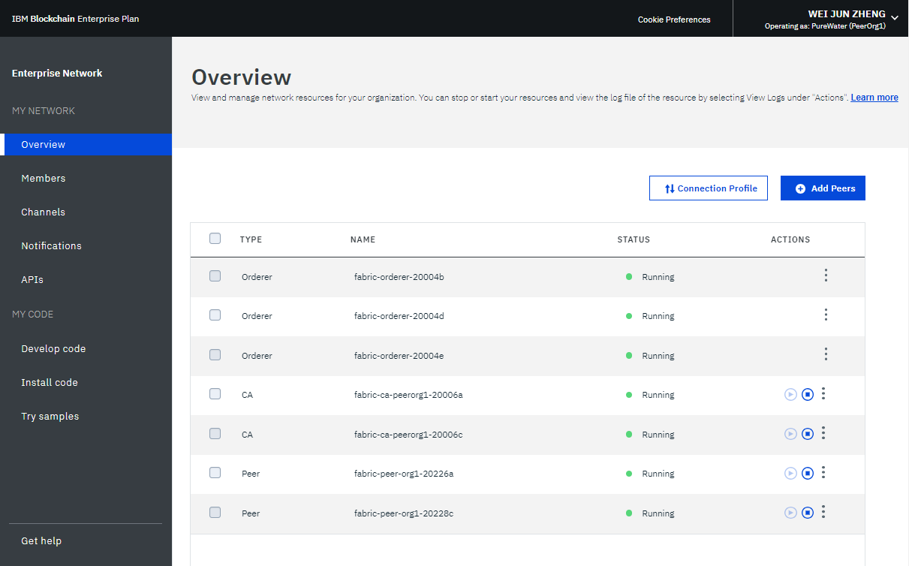
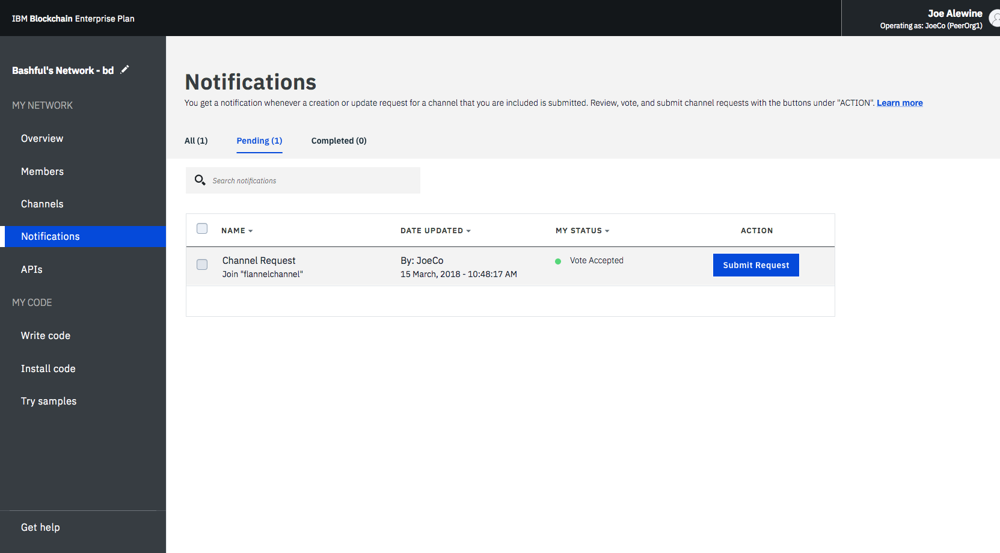
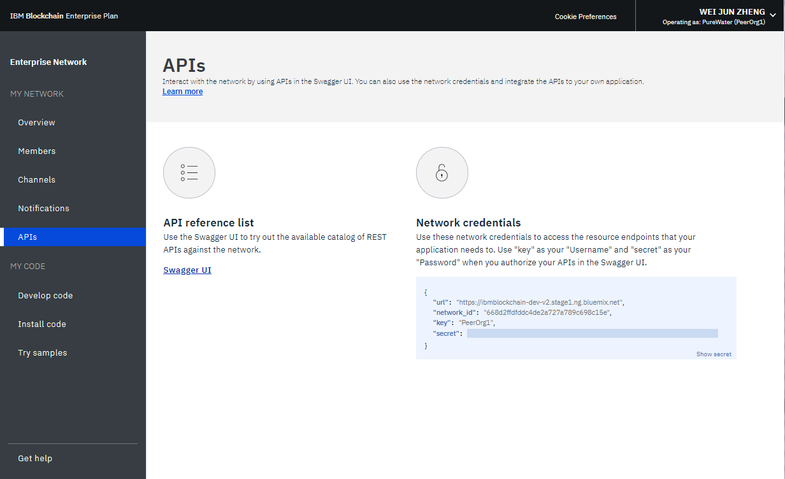
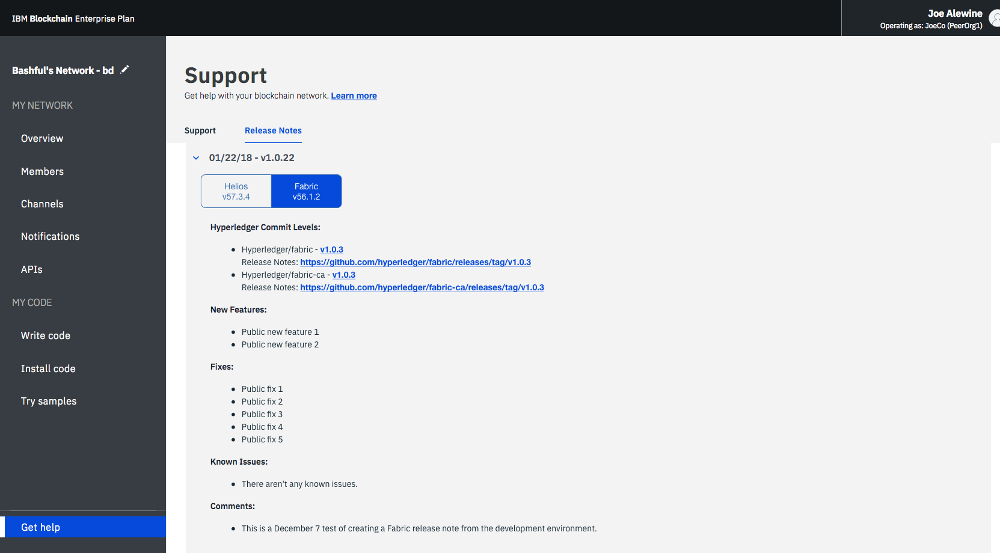

---

copyright:
  years: 2017, 2019
lastupdated: "2019-03-20"

subcollection: blockchain

---

{:new_window: target="_blank"}
{:shortdesc: .shortdesc}
{:codeblock: .codeblock}
{:screen: .screen}
{:pre: .pre}
{:note: .note}
{:important: .important}
{:tip: .tip}

# 네트워크 모니터 사용
{: #ibp-dashboard}

{{site.data.keyword.blockchainfull}} Platform에서는 네트워크 리소스, 구성원, 참여된 채널, 트랜잭션 성능 데이터 및 배치된 체인코드를 포함하는 블록체인 환경의 개요를 제공하기 위해 네트워크 모니터를 제공합니다. 또한 네트워크 모니터는 Swagger API를 실행하고 {{site.data.keyword.blockchainfull_notm}} Platform을 사용하여 네트워크를 개발하며 샘플 애플리케이션을 시도하기 위한 시작점을 제공합니다.
{:shortdesc}

이 튜토리얼을 사용하여 네트워크 모니터를 통해 엔터프라이즈 플랜 또는 스타터 플랜 네트워크를 작동시키는 방법에 대해 학습할 수 있습니다. 튜토리얼에 있는 스크린샷은 대부분 엔터프라이즈 플랜용이지만 스타터 플랜의 경우에도 해당 지시사항이 유효합니다. 하나의 플랜에 대해서만 특정 기능에 액세스할 수 있는 경우 관련 섹션이 **스타터 플랜 네트워크용** 또는 **엔터프라이즈 플랜 네트워크용**으로 레이블 지정됩니다.

## 왼쪽 탐색 분할창
{: #ibp-dashboard-left-navigation}

네트워크 모니터는 다음 화면을 세 개의 섹션으로 표시합니다. 네트워크 모니터의 왼쪽 네비게이터에서 각 화면으로 이동할 수 있습니다.
- **내 네트워크** 섹션에는 "[개요](/docs/services/blockchain/v10_dashboard.html#ibp-dashboard-overview)", "[구성원](/docs/services/blockchain/v10_dashboard.html#ibp-dashboard-members)", "[채널](/docs/services/blockchain/v10_dashboard.html#ibp-dashboard-channels)", "[알림](/docs/services/blockchain/v10_dashboard.html#ibp-dashboard-notifications)", "[인증 기관](/docs/services/blockchain/v10_dashboard.html#ibp-dashboard-ca)" 및 "[API](/docs/services/blockchain/v10_dashboard.html#ibp-dashboard-apis)" 화면이 포함됩니다.
- **내 코드** 섹션에는 "[코드 개발](/docs/services/blockchain/v10_dashboard.html#ibp-dashboard-write_code)", "[코드 설치](/docs/services/blockchain/v10_dashboard.html#ibp-dashboard-chaincode)" 및 "[샘플 시험 사용](/docs/services/blockchain/v10_dashboard.html#ibp-dashboard-samples)" 화면이 포함됩니다.
- "[도움 받기](/docs/services/blockchain/v10_dashboard.html#ibp-dashboard-support)" 화면에는 Helios 및 Hyperledger Fabric({{site.data.keyword.blockchainfull_notm}} Platform이 기반으로 하는 코드 베이스)의 릴리스 정보 뿐만 아니라 지원 정보가 표시됩니다.

블록체인 네트워크의 이름은 왼쪽 탐색 분할창의 맨 위에 있습니다. 네트워크 모니터에서 [네트워크의 이름을 변경](/docs/services/blockchain/v10_dashboard.html#ibp-dashboard-network-name)할 수 있습니다.

네트워크 모니터의 오른쪽 상단에 있는 드롭 다운 메뉴에서 [네트워크 환경 설정을 확인 및 구성](/docs/services/blockchain/v10_dashboard.html#ibp-dashboard-network-preferences)할 수 있습니다.

이 튜토리얼에서는 위의 각 화면 및 기능을 설명합니다.

## 개요
{: #ibp-dashboard-overview}

"개요" 화면에는 순서 지정자, CA 및 피어 노드를 포함한 블록체인 리소스의 실시간 상태 정보가 표시됩니다. 각 리소스는 네 개의 개별 헤더인 **유형**, **이름**, **상태** 및 **조치** 아래에 표시됩니다. 사용자의 블록체인 네트워크 작성 중에 세 개의 순서 지정자 노드 및 두 개의 CA 노드가 자동으로 작성됩니다. CA는 구성원별로 고유한 반면 순서 지정자는 네트워크 전체에서 공유되는 공통 엔드포인트입니다.

**그림 1**은 "개요" 화면을 보여줍니다.

*그림 1. 네트워크 개요*

### 노드 조치
{: #ibp-dashboard-node-actions}

테이블의 **조치** 헤더에 리소스를 시작하거나 중지하는 단추가 제공됩니다. 다중 노드를 선택한 후에 **선택사항 시작** 또는 **선택사항 중지** 단추를 클릭하여 노드 그룹을 시작하거나 중지할 수도 있습니다. 하나 이상의 노드를 선택하면 **선택사항 시작** 또는 **선택사항 중지** 단추가 테이블의 맨 위에 테이블시됩니다.

순서 지정자 노드의 경우 중지 및 시작 조치를 사용할 수 없습니다. 일반적으로 네트워크에서 피어 또는 CA 노드를 중지하고 시작하지 않아도 됩니다. 예를 들어, 클린 상태가 되도록 피어를 다시 시작해야 하는 경우 중지 및 시작 조치가 제공됩니다.

**조치** 헤더 아래의 드롭 다운 목록에서 **로그 보기**를 클릭하여 컴포넌트 로그를 확인할 수도 있습니다. 로그는 다양한 네트워크 리소스 간 호출을 노출하며 디버깅 및 문제점 해결에 유용합니다. 네트워크 로그를 사용하는 방법에 대한 자세한 정보는 [블록체인 네트워크 모니터링](/docs/services/blockchain/howto/monitor_network.html#monitor-blockchain-network)을 참조하십시오.

피어 시작 및 중지의 영향을 이해하기 위해 피어를 중지하고 트랜잭션으로 이를 대상으로 지정하여 실험할 수 있습니다. 그러면 로그에 연결 오류가 표시됩니다. 피어를 다시 시작해서 트랜잭션을 다시 시도하면 연결에 성공합니다. 또한 채널에서 계속 트랜잭션을 수행하므로 연장된 기간 동안 피어를 작동 중지 상태로 남겨둘 수 있습니다. 피어를 다시 가져오면, 피어가 중지되었을 때 커미트된 블록을 수신하므로 원장의 동기화를 알게 됩니다. 원장이 완전히 동기화되면 이 원장에 대해 일반 호출 및 조회를 수행할 수 있습니다.

### 원격 피어 구성
{: #ibp-dashboard-peer-connection-information}

{{site.data.keyword.cloud_notm}} 외부에 피어를 배치하는 경우 구성 중에 네트워크의 API 엔드포인트 정보를 제공해야 합니다. 피어를 구성하려면 **원격 피어 구성** 단추를 클릭하여 네트워크의 API 엔드포인트 정보를 검색하십시오. 팝업 창에서는 네트워크 ID, 조직 MSP, CA 이름, CA URL 및 CA TLS 인증서의 API 엔드포인트 정보를 제공합니다. 각 필드의 끝에 있는 복사 아이콘을 클릭하여 해당 필드의 값을 복사하거나 **다운로드** 단추를 클릭하여 모든 필드의 값을 JSON 파일에 저장할 수 있습니다. 자세한 정보는 [{{site.data.keyword.blockchainfull_notm}} Platform for Amazon Web Services에 대한 정보](/docs/services/blockchain/howto/remote_peer.html#remote-peer-aws-about) 및 [{{site.data.keyword.blockchainfull_notm}} Platform for {{site.data.keyword.cloud_notm}} Private에 대한 정보](/docs/services/blockchain/ibp-for-icp-about.html#ibp-icp-about)를 참조하십시오.

### 연결 프로파일
{: #ibp-dashboard-connection-profile}

**연결 프로파일** 단추를 클릭하여 각 리소스의 하위 레벨 네트워크 정보에 대한 JSON 파일을 볼 수 있습니다. 연결 프로파일에는 애플리케이션에 필요한 모든 구성 정보가 포함됩니다. 하지만 이 파일에는 특정 컴포넌트 및 순서 지정자의 주소만 있으므로, 추가 피어를 대상으로 지정해야 하는 경우 해당 엔드포인트를 확보해야 합니다. "url"이 포함된 헤더에는 각 컴포넌트의 API 엔드포인트가 표시됩니다. 클라이언트 측 애플리케이션에서 특정 네트워크 컴포넌트를 대상으로 지정하기 위해 이러한 엔드포인트가 필요하며 그 정의는 일반적으로 앱을 동반하는 JSON 모델 구성 파일에 존재하게 됩니다. 조직에 속해 있지 않은 피어의 보증이 필요한 애플리케이션을 사용자 정의하는 경우 대역 외 오퍼레이션에서 관련 운영자로부터 해당 피어의 IP 주소를 검색해야 합니다. 클라이언트는 응답이 필요한 피어로 연결할 수 있어야 합니다.

### 피어 추가
{: #ibp-dashboard-peers}

네트워크 구성원은 네트워크 원장 사본을 저장하고 체인코드를 실행하여 해당 원장을 조회 또는 업데이트하기 위해 [피어](/docs/services/blockchain/blockchain_component_overview.html#blockchain-component-overview-peer)를 배치합니다. 보증 정책이 피어를 보증 피어로 정의하면 피어가 보증 결과를 애플리케이션으로 리턴합니다.

오른쪽 상단에 있는 **피어 추가** 단추를 클릭하여 네트워크에 피어 노드를 추가하십시오.   팝업 "피어 추가" 패널에서 추가하려는 노드의 수와 크기를 선택하십시오. 고유 요구사항에 따라 조직의 피어를 추가할 수 있습니다. 추가 피어가 필요한 경우 여러 시나리오가 있습니다. 예를 들어, 다중 피어가 중복성을 위해 동일한 채널에 가입하게 할 수 있습니다. 각 피어는 채널의 트랜잭션을 처리하고 원장의 각 사본에 기록합니다. 피어 중 하나가 실패하면 다른 하나의 피어(또는 나머지 여러 개의 피어)가 트랜잭션 및 애플리케이션 요청 처리를 계속할 수 있습니다. 또한 피어에서 모든 애플리케이션 요청을 균형 있게 로드 밸런싱하거나 여러 기능에 대해 서로 다른 피어를 대상으로 지정할 수 있습니다. 예를 들어, 하나의 피어를 사용하여 원장을 조회하고 다른 피어를 사용하여 원장 업데이트에 대한 보증을 처리할 수 있습니다.

**스타터 플랜**은 기본적으로 네트워크가 시작될 때 구성된 두 개의 조직에 대해 각각 하나씩 피어를 작성합니다.

### 스토리지(스타터 플랜 네트워크용)
{: #ibp-dashboard-storage}

**그림 2**는 네트워크의 스토리지 이용을 표시하는 "스토리지" 탭을 보여줍니다.

*그림 2. 스토리지*

"리소스" 다이어그램에는 피어 및 인증 기관에서 사용하는 스토리지 공간이 표시됩니다. 사용자가 작성하거나 사용자 네트워크에 초대하는 모든 조직이 이 풀에 포함됩니다. 리소스를 이용하는 조직은 두 번째 글머리의 화면에 나열됩니다.

순서 지정 서비스는 별도의 리소스 풀에 있는 스토리지를 이용합니다. 네트워크의 구성원이 새 채널을 작성하고 새 트랜잭션 블록을 생성하는 경우 순서 지정 서비스에서 더 많은 리소스를 이용할 수도 있습니다.

## 구성원
{: #ibp-dashboard-members}

"구성원" 화면에는 "구성원" 탭에서 네트워크 구성원 정보, "인증서" 탭에서 인증서 정보를 표시하는 두 개의 탭이 포함되어 있습니다.

### 엔터프라이즈 네트워크에 구성원 추가
{: #ibp-dashboard-members-tab}

**그림 3**은 "구성원" 탭에 네트워크 구성원을 표시하는 초기 "구성원" 화면을 보여줍니다.

*그림 3. 네트워크 구성원*

네트워크를 작성할 때 초기에 초대한 구성원에 추가하기 위해 "구성원" 탭에서 다른 구성원을 초대할 수 있습니다. 구성원을 사용자의 네트워크에 초대하려면 기관 이름 및 운영자의 이메일 주소를 입력하고 **구성원 추가**를 클릭하십시오. 네트워크에는 총 15개의 구성원이 있을 수 있습니다(네트워크 개시자 포함). 사용자의 네트워크에서 구성원을 제거하려면 구성원 행의 끝에 있는 "제거" 기호를 클릭하십시오.

### 스타터 플랜 네트워크에 구성원 추가

**그림 4**는 "구성원 추가" 창을 보여줍니다.

*그림 4. 구성원 추가*

**구성원 추가**를 클릭하면 다음과 같은 두 가지 옵션이 표시됩니다.
- **구성원 초대**. 네트워크의 구성원이 되도록 다른 조직을 초대할 수 있습니다. 그러면 초대된 조직이 네트워크에 참여하고 사용자와 협업할 수 있습니다.
- **구성원 작성**. 또한 고유 이메일 주소를 사용하여 구성원을 작성할 수 있습니다. 기본적으로 스타터 플랜에서 받은 두 개의 조직의 경우와 같이 이 구성원을 제어할 수 있습니다.

### 인증서
{: #ibp-dashboard-certificates}

**그림 5**는 "인증서" 탭에 구성원 인증서가 표시되는 초기 "구성원" 화면을 보여줍니다.

*그림 5. 인증서*

운영자는 "인증서" 탭에서 같은 기관의 구성원에 대한 인증서를 관리할 수 있습니다. **인증서 추가**를 클릭하여 "인증서 추가" 패널을 여십시오. 인증서에 이름을 지정하고, PEM 형식의 클라이언트 측 인증서를 "키" 필드에 붙여넣고 **제출**을 클릭하십시오. 클라이언트 측 인증서가 적용되려면 먼저 피어를 다시 시작해야 합니다.

인증서 키를 생성하는 방법에 대한 자세한 정보는 [애플리케이션 등록](/docs/services/blockchain/v10_application.html#dev-app-enroll)을 참조하십시오.

## 채널
{: #ibp-dashboard-channels}

개인적으로 거래하려는 네트워크 구성원의 서브세트를 구성하면 채널은 채널 구성원이 채널 구성원만 액세스할 수 있는 특정 규칙 및 개별 원장을 설정할 수 있게 하여 데이터 격리 및 기밀성을 제공합니다. 모든 네트워크에는 적어도 한 개의 채널이 있어야 트랜잭션이 발생할 수 있습니다. 각 채널에는 고유 원장이 있으며 이 원장에 대해 읽기/쓰기 오퍼레이션을 수행하려면 사용자가 올바르게 인증되어야 합니다. 사용자가 채널에 없는 경우에는 데이터를 볼 수 없습니다.

**그림 6**은 네트워크에 있는 모든 채널의 개요가 표시되는 초기 대시보드 화면을 보여줍니다.

*그림 6. 채널*

채널을 작성하면 채널 특정 원장이 생성됩니다. 자세한 정보는 [채널 작성](/docs/services/blockchain/howto/create_channel.html#ibp-create-channel)을 참조하십시오.

또한 기존 채널을 선택하여 채널, 멤버십 및 활성 체인코드에 대한 더 정확한 세부사항을 볼 수 있습니다. 자세한 정보는 [네트워크 모니터링](/docs/services/blockchain/howto/monitor_network.html#monitor-blockchain-network)을 참조하십시오.

"구성원" 화면의 ["인증서" 탭](/docs/services/blockchain/v10_dashboard.html#ibp-dashboard-certificates)을 사용하여 새 인증서를 플랫폼에 업로드한 경우 이 패널을 사용하여 인증서를 채널에 추가할 수 있습니다. 관련 채널 옆에 있는 **조치** 헤더 아래의 드롭 다운 목록에서 **인증서 동기화**를 클릭하십시오. 이 경우 채널의 체인코드를 인스턴스화할 수 있음은 물론 원격 클라이언트에서 채널을 작동할 수 있게 됩니다. 자세한 정보는 [인증서 관리](/docs/services/blockchain/certificates.html#managing-certificates) 튜토리얼의 [{{site.data.keyword.blockchainfull_notm}} Platform에 서명 인증서 업로드](/docs/services/blockchain/certificates.html#managing-certificates-upload-certs)를 참조하십시오.

## 알림
{: #ibp-dashboard-notifications}

채널을 작성하거나 새 채널에 초대되면 네트워크 모니터에 알림이 표시됩니다. "알림" 화면에서 이러한 요청을 확인하고 응답할 수 있습니다.

**그림 7**은 "알림" 화면을 보여줍니다.

*그림 7. 알림*

요청은 "모두", "보류 중" 및 "완료됨" 하위 탭으로 그룹화됩니다. 하위 탭 헤더 다음의 수는 각 탭의 요청 수를 나타냅니다.
   * "모두" 하위 탭에서 모든 요청을 찾을 수 있습니다.
   * 승인 또는 거부하지 않았거나 보지 않은 요청은 "보류 중" 하위 탭에 있습니다. **요청 검토** 단추를 클릭하여 채널 정책, 구성원 및 투표 상태가 포함된 요청을 보십시오. 채널 운영자이면 요청을 **승인** 또는 **거부**하거나 **나중에**를 클릭하여 다른 시간에 처리할 수 있습니다. 요청이 충분한 채널 운영자들에 의해 승인되면 **요청 제출**을 클릭하여 채널 업데이트를 활성화할 수 있습니다.
   * 제출된 요청이 "완료됨" 하위 탭에 표시됩니다. **요청 검토**를 클릭하여 그 세부사항을 볼 수 있습니다.

요청의 목록이 긴 경우, 맨 위의 검색 필드에서 요청을 검색할 수 있습니다.

보류 중인 요청은 요청의 앞에 있는 상자를 선택하고 **요청 삭제**를 클릭하여 삭제할 수 있습니다. 완료된 요청은 삭제할 수 없음에 유의하십시오.

## 인증 기관(Certificate Authority)
{: #ibp-dashboard-ca}

"인증 기관(CA)" 화면의 테이블에는 조직에 등록된 모든 ID(예:관리자, 피어 및 클라이언트 애플리케이션)가 표시됩니다. 이 화면을 사용하여 새 ID도 등록할 수 있습니다.

**그림 8**은 "인증 기관" 화면을 보여줍니다.

*그림 8. 인증 기관*

CA에서 새 공용 인증서 및 개인 키를 가져오려면 관리자 ID 옆에 있는 **인증서 생성** 단추를 클릭하십시오. **인증서** 필드의 **개인 키** 바로 위에는 공용 인증서(signCert 또는 등록 인증서라고도 함)가 포함되어 있습니다. 각 필드의 끝에 있는 복사 아이콘을 클릭하여 값을 복사하십시오. 이 패널은 Fabric SDK를 사용하는 클라이언트 애플리케이션에 대한 공용 및 개인 키 쌍을 생성하기 위한 대체 방법으로 사용할 수 있습니다. 자세한 정보를 확인하려면 [애플리케이션 개발 튜토리얼](/docs/services/blockchain/v10_application.html#dev-app)을 방문하십시오. {{site.data.keyword.blockchainfull_notm}} Platform에서는 이 인증서를 저장하지 않는다는 점에 **유의**하십시오. 인증서를 안정하게 저장하고 보관해야 합니다.

**사용자 추가** 단추를 클릭하여 조직에 새 ID를 등록하십시오. **사용자 추가** 팝업 창에서 다음 필드를 완성한 후 **제출**을 클릭하십시오.
  - **등록 ID:** 이 ID는 `enroll ID`로도 참조되는 새 ID의 이름이 됩니다. **이 값을 저장**하는 경우 원격 피어를 구성하거나 새 애플리케이션을 등록할 때 해당 값을 사용해야 합니다.
  - **등록 시크릿:** 이 시크릿은 `enroll Secret`으로도 참조되는 ID에 대한 비밀번호가 됩니다. **이 값을 저장**하는 경우 원격 피어를 구성하거나 새 애플리케이션을 등록할 때 해당 값을 사용해야 합니다.
  - **유형:** 등록할 ID의 유형(피어 또는 클라이언트 애플리케이션)을 선택하십시오.
  - **소속:** ID가 속할 조직 내 소속(예: `org1`)을 나타냅니다.
  - **최대 등록 수:** 이 필드를 사용하여 이 ID로 인증서를 등록하거나 생성하는 횟수를 제한할 수 있습니다. 필드를 공백으로 두면 기본적으로 무제한 등록 수로 값이 지정됩니다.

[{{site.data.keyword.blockchainfull_notm}} Platform에서 인증서 관리](/docs/services/blockchain/certificates.html#managing-certificates) 튜토리얼을 방문하여 CA에 관해 자세히 알아볼 수 있습니다.

## API
{: #ibp-dashboard-apis}

{{site.data.keyword.blockchainfull_notm}} Platform은 네트워크의 노드, 채널, 피어 및 구성원을 관리하는 데 사용할 수 있는 Swagger의 여러 REST API를 노출합니다. 애플리케이션은 이러한 API를 사용하여 네트워크 모니터를 사용하지 않고 중요한 네트워크 리소스를 제어할 수 있습니다.

**그림 9**는 "API" 화면을 보여줍니다.

*그림 9. API*

**Swagger UI** 링크를 클릭하여 Swagger UI를 여십시오. API를 실행하려면 네트워크 인증 정보(이 API 페이지에 있음)를 사용하여 Swagger UI에 권한을 부여해야 합니다. 자세한 정보는 [Swagger API를 사용하여 네트워크와 상호작용](/docs/services/blockchain/howto/swagger_apis.html#ibp-swagger)을 참조하십시오.

## 코드 개발
{: #ibp-dashboard-write-code}

{{site.data.keyword.IBM_notm}}은 Composer CLI, JavaScript API, REST 서버 및 웹 플레이그라운드를 포함하여 프로덕션에서 Hyperledger Composer를 사용하는 네트워크를 지원하지 않습니다.{:note}

스타터 플랜 및 엔터프라이즈 플랜은 개발 환경에 산업 표준 도구 및 기술을 제공합니다. 네트워크를 개발한 후 이를 네트워크에 배치할 수 있습니다.

**그림 10**은 "코드 개발" 화면을 보여줍니다.

*그림 10. 코드 개발*

비즈니스 네트워크를 개발하고 배치하는 데 대한 자세한 정보는 [스타터 및 엔터프라이즈 플랜에서 비즈니스 네트워크 배치](/docs/services/blockchain/develop_starter_enterprise.html#deploying-a-business-network)를 참조하십시오.

## 코드 설치
{: #ibp-dashboard-chaincode}

"스마트 계약"이라고도 하는 체인코드는 원장을 조회하고 업데이트하는 기능 세트가 포함된 소프트웨어의 부분입니다. 이 체인코드는 피어에 설치되고 채널에서 인스턴스화됩니다.

**그림 11**은 "코드 설치" 화면을 보여줍니다.

*그림 11. 코드 설치*

체인코드는 먼저 피어의 파일 시스템에 설치되고 그 다음에 채널에서 인스턴스화됩니다. 자세한 정보는 [체인코드 설치, 인스턴스화 및 업데이트](/docs/services/blockchain/howto/install_instantiate_chaincode.html#install-instantiate-chaincode)를 참조하십시오.

## 샘플 시험 사용
{: #ibp-dashboard-samples}

샘플 애플리케이션을 사용하면 블록체인 네트워크 및 애플리케이션 개발에 대해 이해하는 데 도움이 됩니다. **GitHub에서 보기** 링크를 따라 샘플을 사용하여 {{site.data.keyword.blockchainfull_notm}} Platform에 배치하는 방법을 학습하십시오. 샘플 개발 및 배치 방법에 대한 자세한 정보는 [샘플 애플리케이션 배치](/docs/services/blockchain/howto/prebuilt_samples.html#deploying-sample-applications)를 참조하십시오.

**그림 12**는 "샘플 시험 사용" 화면을 보여줍니다.

*그림 12. 샘플*

## 도움 받기
{: #ibp-dashboard-support}

"도움 받기" 화면에는 개발자를 위한 리소스 목록을 제공하는 "지원" 탭 및 {{site.data.keyword.blockchainfull_notm}} Platform의 새로운 기능에 대해 설명하는 "릴리스 정보" 탭이 포함되어 있습니다.

**그림 13**은 초기 "지원" 탭을 보여줍니다.

*그림 13. Blockchain 지원*

### Blockchain 리소스 및 지원 포럼
{: #ibp-dashboard-support-forums}

문제점을 해결하고 {{site.data.keyword.IBM_notm}} 및 Fabric 커뮤니티에서 도움을 받으려면 "지원" 탭의 리소스를 사용하십시오. "지원" 탭에 있는 링크에 대한 자세한 정보는 [지원 받기](/docs/services/blockchain/ibmblockchain_support.html#blockchain-support)의 [리소스 및 지원 포럼](/docs/services/blockchain/ibmblockchain_support.html#blockchain-support-resources)을 참조하십시오.

[IBM dWAnswers ](https://developer.ibm.com/answers/smartspace/blockchain/index.html)는 {{site.data.keyword.blockchainfull_notm}} Platform 및 Hyperledger Fabric 사용자를 위한 커뮤니티 포럼이며 IBM 전문가가 모니터합니다. 이전 질문에 대한 답변을 검색하거나 새 질문을 제출할 수 있습니다. 문제를 디버깅하거나 질문에 대한 답변을 확인할 수 없는 경우 {{site.data.keyword.cloud_notm}} 서비스 포털에 지원 케이스를 제출하십시오. 자세한 정보는 [지원 케이스 제출](/docs/services/blockchain/ibmblockchain_support.html#blockchain-support-cases)을 참조하십시오.

### Fabric 릴리스 정보
{: #ibp-dashboard-release-notes}

"릴리스 정보" 탭에는 네트워크의 최신 기능이 표시됩니다. "네트워크 모니터 UI" 단추를 사용하는 경우 {{site.data.keyword.blockchainfull_notm}} Platform 사용자 경험을 위한 새로운 기능 및 버그 수정이 나열됩니다. "Hyperledger Fabric" 단추를 사용하는 경우 사용자 네트워크 버전의 Hyperledger Fabric 및 Fabric 인증 기관에 대한 릴리스 정보로 경로 지정됩니다.

**그림 14**는 네트워크 모니터 UI에 대한 릴리스 정보를 보여줍니다.

*그림 14. 네트워크 모니터 UI의 릴리스 정보*

**그림 15**는 사용자 네트워크 버전의 Hyperledger Fabric 및 Fabric 인증 기관에 대한 릴리스 정보를 보여줍니다.

*그림 15. Fabric의 릴리스 정보*

## 네트워크 환경 설정
{: #ibp-dashboard-network-preferences}

오른쪽 상단 모서리를 클릭하고 드롭 다운 메뉴가 열리면 **네트워크 환경 설정**을 클릭하십시오. 네트워크 환경 설정 창이 열립니다. 네트워크 환경 설정 창에는 네트워크 이름, Fabric 버전, {{site.data.keyword.cloud_notm}}의 네트워크 위치 및 상태 데이터베이스 유형과 같은 네트워크의 기본 정보가 표시됩니다.

2018년 5월 15일 이후에 작성된 **엔터프라이즈 플랜 네트워크**는 Hyperledger Fabric v1.1.1에서 실행됩니다. 업그레이드 후 네트워크를 작성하는 경우 네트워크 환경 설정 창에서 네트워크에 대한 웹 비활성 제한시간 및 상호 TLS를 관리할 수도 있습니다. 네트워크 개시자만 이러한 설정을 변경할 수 있습니다.

### 웹 비활성 제한시간
{: #ibp-dashboard-web-inactivity-timeout}

**참고**: **네트워크 개시자**만 웹 비활성 제한시간 설정을 변경할 수 있습니다. 이는 네트워크 레벨 설정이며 모든 네트워크 구성원에 영향을 미칩니다.

기본적으로 웹 비활성 제한시간은 **해제**로 설정됩니다. 웹 비활성 제한시간을 **설정**으로 변환하면 네트워크가 10분 동안 비활성 상태로 있은 후에 자동으로 로그아웃됩니다. 웹 비활성 타이머가 10분에 도달하면 웹 비활성 제한시간 기능이 비활성 웹 세션을 종료하여 네트워크 구성원 계정의 보안을 보장합니다. 링크를 클릭하거나 네트워크 모니터를 새로 고치면 웹 비활성 타이머가 재설정됩니다. 10분에 도달하기 전에 브라우저 창 또는 탭을 닫아도 웹 세션이 종료됩니다.

**그림 16**은 "네트워크 환경 설정" 창을 보여줍니다.

*그림 16. 네트워크 환경 설정*

### 상호 TLS(엔터프라이즈 플랜 네트워크용)
{: #ibp-dashboard-mutual-tls}

**엔터프라이즈 플랜 네트워크**는 상호 TLS를 사용하여 애플리케이션과 블록체인 컴포넌트 간의 통신에 보안을 적용할 수 있도록 해주는 기능을 제공합니다.

**참고**: **네트워크 개시자**만 상호 TLS를 사용 또는 사용 안함으로 설정할 수 있습니다. 이는 네트워크 레벨 설정이며 모든 네트워크 구성원에 영향을 미칩니다.

기본적으로 상호 TLS 단추는 **해제**로 설정됩니다. 상호 TLS를 사용으로 설정하는 경우 이 기능을 지원하도록 애플리케이션을 업데이트해야 합니다. 그렇지 않으면 애플리케이션이 사용자 네트워크와 통신할 수 없습니다.

Fabric 1.1 엔터프라이즈 플랜 네트워크의 경우 각 조직에는 자체 상호 TLS 인증 기관(CA)이 있습니다. **연결 프로파일** 단추를 클릭하여 네트워크 모니터의 **개요** 화면에서 액세스할 수 있는 [연결 프로파일](/docs/services/blockchain/v10_dashboard.html#ibp-dashboard-connection-profile)에서 상호 TLS CA에 연결하는 데 필요한 정보를 볼 수 있습니다. 연결 프로파일에는 CA에 연결하고 네트워크 연결에 필요한 인증서를 가져오는 데 필요한 정보가 포함되어 있습니다.

연결 프로파일에서 `certificateAuthorities` 섹션을 찾으십시오. 이 섹션에는 상호 TLS를 사용하여 사용자 네트워크와 통신하기 위해 인증서를 등록접수하고 가져오는 데 필요한 다음 속성이 있습니다.

- `url`: 상호 TLS 인증서를 제공할 수 있는 CA에 연결하기 위한 URL
- `enrollId`: 인증서를 가져오는 데 사용할 등록접수 ID
- `enrollSecret`: 인증서를 가져오는 데 사용할 등록접수 시크릿
- `x-tlsCAName`: 애플리케이션이 상호 TLS를 사용하여 통신할 수 있도록 하는 인증서를 가져오는 데 사용할 CA 이름

상호 TLS를 지원하도록 애플리케이션을 업데이트하는 데 대한 자세한 정보는 [상호 TLS를 구성하는 방법 ](https://fabric-sdk-node.github.io/tutorial-mutual-tls.html)을 참조하십시오.

<!--

### CouchDB state database
{: #couchdb}

**Note**: Only the **network initiator** can switch the state database from LevelDB to CouchDB. This is a network level setting and will affect all network members. Switching to CouchDB is permanent. You cannot revert back to LevelDB.

Before Enterprise Plan upgrades to Fabric v1.1, all network peers store data in the pure key-value LevelDB. With Fabric v1.1, you can choose to use CouchDB as your state database. CouchDB is a document datastore that permits indexing the contents of your data and allows you to issue rich queries against the data on your peer. Note that Hyperledger Fabric does not support peers running different databases. If CouchDB is used, it must be used by all of the peers.

To use CouchDB, your data must be stored in a data format that can be modeled in chaincode, such as JSON. If the decision is made to migrate from LevelDB to CouchDB, the {{site.data.keyword.blockchainfull_notm}} Platform will migrate your data from key-value format to the CouchDB format automatically.

If you switch to CouchDB, you need to update your chaincode to take advantage of indexes and rich queries. For more information about CouchDB and how to set up indexes, see [Best practices when using CouchDB](/docs/services/blockchain/best_practices.html#best-practices-app-couchdb-indices) in the Developing applications tutorial. For more information about updating chaincode in {{site.data.keyword.blockchainfull_notm}} Platform, see [Updating a chaincode](/docs/services/blockchain/howto/install_instantiate_chaincode.html#install-instantiate-chaincode-update-cc).

-->

**그림 17**은 "네트워크 환경 설정" 창을 보여줍니다.

*그림 17. 네트워크 환경 설정*

## 네트워크 이름 업데이트
{: #ibp-dashboard-network-name}

스타터 플랜 또는 엔터프라이즈 플랜의 인스턴스를 작성하는 경우 {{site.data.keyword.blockchainfull_notm}} Platform에서 네트워크에 이름을 지정합니다. 그러나 언제든지 네트워크 모니터에서 이 네트워크 이름을 업데이트할 수 있습니다.

네트워크 모니터의 왼쪽 네비게이터 맨 위에서 네트워크 이름을 클릭하면 해당 필드가 편집 가능하게 됩니다. 사용할 네트워크 이름을 입력하고 **Enter** 키를 누르십시오. 몇 초 후에 네트워크 이름이 업데이트됩니다.

**그림 18**은 스타터 플랜 네트워크 이름을 지정된 이름에서 "Starter Plan Network"로 업데이트하는 단계를 보여줍니다.

*그림 18. 네트워크 이름 업데이트*

## 네트워크 사이에서 전환(스타터 플랜 네트워크용)
{: #ibp-dashboard-switch-network}

스타터 플랜으로 둘 이상의 네트워크를 작성하는 경우 네트워크 모니터에서 네트워크 간을 전환할 수 있습니다.

네트워크 모니터에서 왼쪽 네비게이터의 맨 위에 있는 네트워크 이름 옆의 화살표 아이콘을 클릭하십시오. 드롭 다운 목록에서 전환하려는 네트워크 이름을 선택하여 클릭하십시오. 웹 브라우저가 새로 고쳐지고 전환하는 네트워크의 네트워크 모니터가 열립니다.

**그림 19**는 다른 스타터 플랜 네트워크로 전환하는 단계를 보여줍니다.

*그림 19. 네트워크 전환*

## 네트워크 재설정(스타터 플랜 네트워크용)
{: #ibp-dashboard-reset-network}

스타터 플랜 네트워크는 네트워크를 삭제 후 다시 작성하지 않고 네트워크 구성을 편집하는 기능을 제공합니다. 네트워크는 초기 네트워크 구성으로 재설정되며, 이 구성에는 두 개의 조직, 각 조직당 하나의 피어, 기본 채널이 포함됩니다. 이 구성은 예를 들어 블록체인 네트워크에서 여러 차례 테스트를 실행하며 정리된 네트워크에서 시작해야 하는 경우에 유용합니다.

**주의**: 네트워크를 재설정하면 피어, 순서 지정자 및 CA의 API 엔드포인트가 변경됩니다. 애플리케이션에서 API 엔드포인트 정보를 조정해야 합니다.

오른쪽 상단 구석을 클릭하면 드롭 다운 메뉴가 열립니다. 메뉴에서 **네트워크 재설정** 단추를 클릭하십시오. 네트워크를 재설정할 준비가 되면 **확인**을 클릭하여 계속하십시오. 새 설정을 반영하도록 네트워크 모니터가 새로 고쳐집니다.

**그림 20**에서는 "네트워크 재설정" 기능을 보여줍니다.

*그림 20. 네트워크 재설정*
