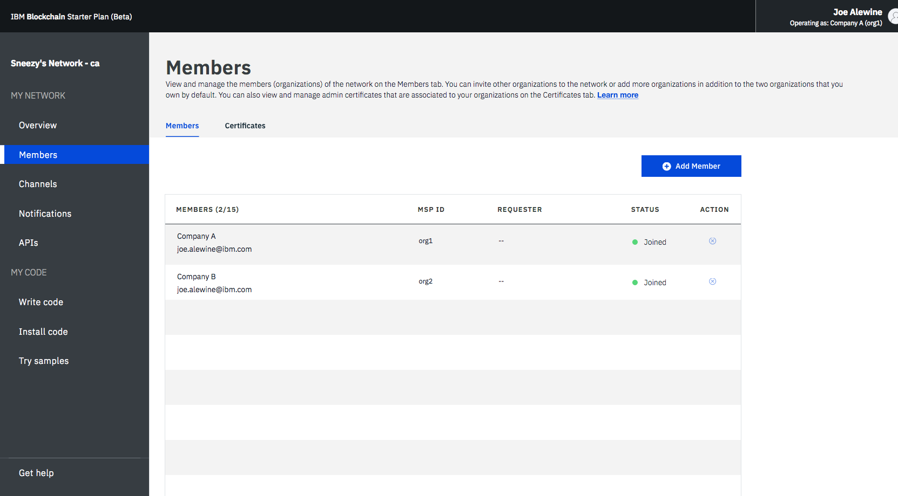
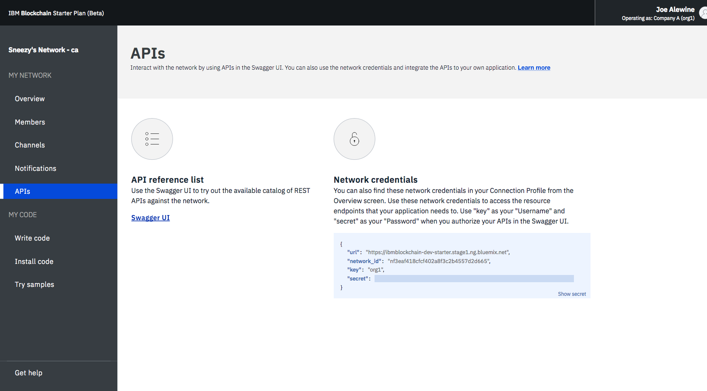
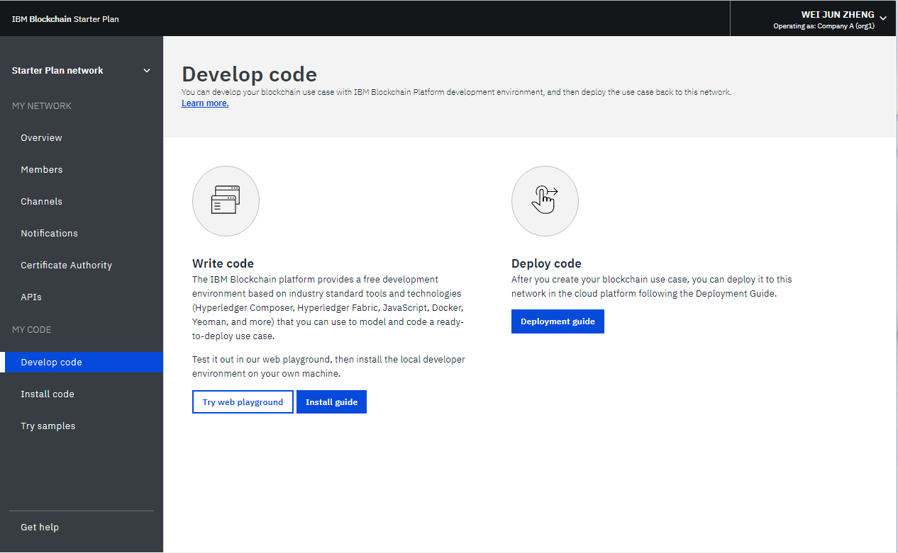
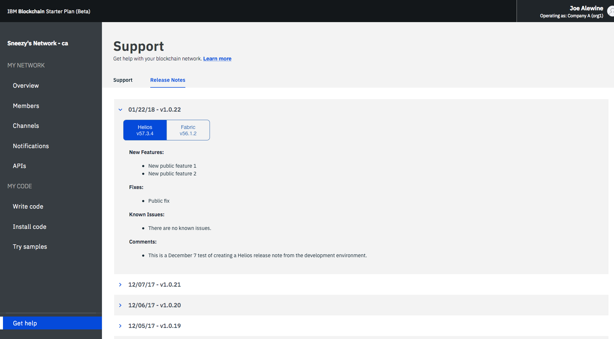

---

copyright:
  years: 2017, 2018
lastupdated: "2018-05-15"

---

{:new_window: target="_blank"}
{:shortdesc: .shortdesc}
{:codeblock: .codeblock}
{:screen: .screen}
{:pre: .pre}

# Opere a rede do Starter Plan
{: #operate-starter-plan-network}

O {{site.data.keyword.blockchainfull}} Platform traz um Monitor de rede para fornecer uma visão geral de seu ambiente de blockchain, incluindo recursos de rede, membros, canais associados, dados de desempenho da transação e chaincode implementado. O Monitor de rede também oferece a você o ponto de entrada para executar APIs do Swagger, desenvolver uma rede com o {{site.data.keyword.blockchainfull_notm}} Platform: Develop e experimentar os aplicativos de amostras.
{:shortdesc}

É possível [mudar o nome de sua rede do Starter Plan](#sp-network-name) ou [alternar entre diferentes redes do Starter Plan que você cria](#switch-sp-network) no Monitor de rede.

O Monitor de rede expõe as telas a seguir em três seções. É possível navegar para cada tela do navegador esquerdo no Monitor de rede.
- A seção **Minha rede** contém as telas "[Visão geral](#overview)", "[Membros](#members)", "[Canais](#channels)", "[Notificações](#notifications)" e "[APIs](#apis)".
- A seção **Meu código** contém as telas "[Desenvolver código](#write-code)", "[Instalar código](#chaincode)" e "[Tentar amostras](#samples)".
- A tela "[Obter ajuda](#support)".

É possível [alternar entre as organizações](#switch-organizations) que você possui, [verificar as preferências de rede](#network-preferences) e [reconfigurar a sua rede](#reset-network) no menu suspenso no canto superior direito do Monitor de rede.

Este tutorial descreve cada uma das telas e funções acima.

## Atualizar o nome da rede
{: #sp-network-name}

Quando você criar uma rede do Starter Plan, o {{site.data.keyword.blockchainfull_notm}} Platform designará um nome para a sua rede. No entanto, é possível atualizar esse nome da rede a qualquer momento em seu Monitor de rede.

Na parte superior do navegador esquerdo no Monitor de rede, clique no nome da rede e o campo se tornará editável. Digite o novo nome de rede que você deseja usar e pressione **Enter**. Seu nome da rede será atualizado em alguns segundos.

A **Figura 1** mostra as etapas para atualizar o nome da rede Starter Plan do nome designado para "Starter Plan Network".

*Figura 1. Atualize o nome de rede*

## Alternar entre rede do Starter Plan
{: #switch-sp-network}

Se você criar mais de uma rede com o Starter Plan, será possível alternar entre as suas redes no Monitor de rede.

Na parte superior do navegador esquerdo no Monitor de rede, clique no ícone de seta ao lado do nome da sua rede. Selecione e clique no nome da rede para o qual você deseja alternar na lista suspensa. O seu navegador da web será atualizado e abrirá o Monitor de rede da rede para a qual você alternará.

A **Figura 2** mostra as etapas para alternar para outra rede do Starter Plan.

*Figura 2. Comutador de rede*

## Visão geral
{: #overview}

A tela "Visão geral" exibe informações de status em tempo real sobre os seus recursos de blockchain, incluindo o solicitante, a autoridade de certificação e o peer. Cada recurso é exibido sob quatro cabeçalhos distintos: **Tipo**, **Nome**, **Status** e **Ações**. Quando a sua rede for iniciada, um solicitante, uma autoridade de certificação e um peer estarão em execução. A autoridade de certificação é específica para a organização, enquanto o solicitante é um terminal comum que é compartilhado na rede.

**Figura 3** mostra a tela "Visão Geral":

*Figura 3. Visão Geral da Rede*

### Ações do nó
  O cabeçalho **Ações** da tabela fornece botões para iniciar ou parar seus componentes. Também é possível iniciar ou parar um grupo de nós selecionando vários nós e, em seguida, clicando no botão **Iniciar selecionado** ou **Parar selecionado**. O botão **Iniciar selecionado** ou **Parar selecionado** aparece na parte superior da tabela ao selecionar um ou mais nós.

  Também é possível verificar os logs de componente clicando em **Visualizar logs** na lista suspensa sob o cabeçalho **Ações**. Os logs expõem as chamadas entre os vários recursos de rede e são úteis para depuração e resolução de problemas.

  **Nota**: {{site.data.keyword.blockchainfull_notm}} Na IU de rede do Iniciador, quando você clicar na ação Visualizar logs nos nós listados no painel Visão geral, a interface de kibana do IBM Cloud Log será aberta. Por padrão, o kibana é pré-configurado para mostrar logs dos últimos 15 minutos de atividade. Se não houver nenhuma atividade nos últimos 15 minutos, você verá uma mensagem que diz 'Nenhum resultado localizado'. Para visualizar todos os logs, é possível simplesmente clicar no ícone de cronômetro no canto superior direito sob o seu nome do usuário e configurar um intervalo de tempo mais amplo, como ‘Esta semana’ ou ‘Este mês’.

  Para entender os efeitos de iniciar e parar um peer, é possível fazer um experimento parando um peer e tentando atingi-lo com uma transação, e você verá erros de conectividade nos logs. Ao reiniciar o peer e tentar a transação novamente, você verá uma conexão bem-sucedida. Também será possível deixar um peer inativo por um período de tempo estendido conforme os seus canais continuarem a transacionar. Quando o peer for trazido de volta, você perceberá uma sincronização do livro-razão, pois ele receberá os blocos que foram confirmados quando ele estava inativo. Após o livro-razão estar completamente sincronizado, será possível executar chamadas e consultas normais com relação a ele.

### Perfil de conexão
  É possível visualizar o arquivo JSON com informações de rede de nível baixo de cada recurso clicando no botão **Perfil de conexão**. O perfil de conexão contém todas as informações de configuração necessárias para um aplicativo. No entanto, como esse arquivo contém apenas os endereços para os seus componentes específicos e o solicitante, se você precisar direcionar adicionais, precisará obter os seus terminais. O cabeçalho que contém "url" exibe o terminal de API de cada componente. Esses terminais são necessários para atingir componentes de rede específicos de um aplicativo do lado do cliente e suas definições geralmente existirão em um arquivo de configuração modelado pelo JSON que acompanha o aplicativo. Se você estiver customizando um aplicativo que requeira endosso de peers que não façam parte de sua organização, será necessário recuperar os endereços IP desses peers por meio dos operadores relevantes em uma operação fora da banda. Os clientes devem ser capazes de se conectar
a quaisquer peers dos quais eles precisam de uma resposta.

### Incluir peers
{: #peers}
  Os membros da rede precisam ter peers para armazenar as suas cópias do livro-razão de rede e para executar o chaincode para consultar ou atualizar o livro-razão. Se a política de aprovação definir um peer como um peer de endosso, o peer também retornará resultados de aprovação para aplicativos.

  O Starter Plan cria um peer para cada uma das duas organizações por padrão. É possível incluir mais peers para as suas organizações com base em seus próprios requisitos. Você poderá estar em diferentes cenários quando precisar de mais peers. Por exemplo, talvez você deseje múltiplos peers para se associar ao mesmo canal para redundância. Cada peer processa as transações do canal e grava em suas respectivas cópias do livro-razão. Se um dos peers falhar, o outro peer (ou múltiplos outros peers) poderá continuar a processar transações e solicitações de aplicativos. Também é possível balancear simetricamente todas as solicitações de aplicativo ao longo de peers ou é possível direcionar peers diferentes para funções diferentes. Por exemplo, é possível usar um peer para consultar o livro-razão e usar outro peer para processar endossos para atualizações de livro-razão.

  Clique no botão **Incluir peers** na parte superior direita para incluir nós de peer em sua rede. No painel pop-up "Incluir Peers", selecione o número e o tamanho dos nós peer que você deseja incluir.

## Membros
{: #members}

A tela "Membros" contém duas guias para exibir informações do membro de rede na guia "Membros" e informações de certificado na guia "Certificados".

### Membros
{: #members_tab}
A **Figura 4** mostra a tela inicial "Membros", que exibe os seus membros de rede na guia "Membros":

*Figura 4. Membros da Rede*

Clique em **Incluir membro** para convidar mais membros para a sua rede. No Starter Plan, você tem duas opções:
- **Convidar um membro**. É possível convidar outras organizações para se tornarem membros de sua rede. As organizações convidadas podem então se associar e colaborar com você na rede.
- **Criar membro**. Também é possível criar um membro usando o seu próprio endereço de e-mail. Você teria controle sobre isso como tem das duas organizações que você recebe com o Starter Plan por padrão.

A **Figura 5** mostra a janela "Incluir membro".

*Figura 5. Incluir membro*

### Certificados
A **Figura 6** mostra a tela inicial "Membros", que exibe certificados de membro na guia "Certificados":

*Figura 6. Certificados*

Os operadores podem gerenciar os certificados para os membros na mesma instituição na guia "Certificados". Clique em **Incluir certificado** para abrir o painel "Incluir certificado". Dê um nome ao seu certificado, cole seus certificados do lado do cliente no formato PEM no campo "Chave" e clique em **Enviar**. Você precisa reiniciar seus peers antes de os certificados do lado do cliente poderem entrar em vigor.

Para obter mais informações sobre como gerar a sua chave do certificado, veja [Gerando os certificados do lado do cliente](v10_application.html#generating-the-client-side-certificates).

## Canais
{: #channels}

Consiste de um subconjunto de membros de rede que querem transacionar em particular; os canais fornecem isolamento de dados e confidencialidade permitindo que os membros de um canal estabeleçam regras específicas e um livro-razão separado, que somente membros do canal podem acessar. Cada rede deve ter pelo menos um canal para que as transações ocorram. Cada canal possui um livro-razão exclusivo e os usuários devem ser autenticados adequadamente para executar operações de leitura/gravação nesse livro-razão. Se você não estiver em um canal, não poderá ver nenhum dado.

A **Figura 7** mostra a tela do painel inicial, que exibe uma visão geral de todos os canais em sua rede:

*Figura 7. Canais*

Criar um canal resulta na geração de um livro-razão específico do canal. Para obter mais informações, consulte [Criando um canal](howto/create_channel.html).

Também é possível selecionar um canal existente para visualizar detalhes mais precisos sobre o canal, a associação e o chaincode ativo. Para obter mais informações, consulte [Monitorando uma rede](howto/monitor_network.html).

## Notificações
{: #notifications}

É possível manipular solicitações pendentes e visualizar solicitações concluídas na tela "Notificações".

**Figura 8** mostra a tela "Notificações":

*Figura 8. Notificações*

Quando você criar um canal ou for convidado para um novo canal, uma notificação aparecerá no Monitor de rede.

As solicitações são agrupadas nas subguias "Todos", "Pendentes" e "Concluídos". Números após o cabeçalho indicam o número de solicitações em cada subguia.
   * É possível localizar todas as suas solicitações na subguia "Todos".
   * As solicitações que você não aceitou nem recusou ou mesmo que não visualizou estão na subguia "Pendente". Clique no botão **Revisar solicitação** para visualizar a solicitação, que inclui a política do canal e os membros, além do status da votação. Se você for um operador de canal, será possível **Aceitar** ou **Recusar** a solicitação ou manipulá-la em outro momento clicando em **Depois**. Se a solicitação for aceita por operadores do canal suficientes, será possível clicar em **Enviar solicitação** para ativar a atualização do canal.
   * Uma solicitação enviada aparecerá na subguia "Concluído".  É possível clicar em **Revisar solicitação** para visualizar seus detalhes.

Se você tem uma longa lista de solicitações, é possível procurar por uma solicitação no campo de procura na parte superior.

Solicitações pendentes podem ser excluídas selecionando as caixas na frente delas e clicando em **Excluir solicitação**.

## APIs
{: #apis}

Para facilitar o desenvolvimento de aplicativos, o {{site.data.keyword.blockchainfull_notm}} Platform expõe APIs que você pode testar com relação à sua rede em uma UI do Swagger.

A **Figura 9** mostra a tela "APIs":

*Figura 9. APIs*

Clique no link **UI do Swagger** para abrir a UI do Swagger. Observe que você precisa autorizar a UI do Swagger com as suas credenciais de rede (que podem ser localizadas nessa página de APIs) antes que você possa executar as APIs. Para obter mais informações, veja [Usando APIs do Swagger](howto/swagger_apis.html).

## Desenvolva o código
{: #write-code}

O Starter Plan integra o {{site.data.keyword.blockchainfull_notm}} Platform: Develop e fornece um ambiente de desenvolvimento com as ferramentas e tecnologias padrão do segmento de mercado. É possível desenvolver a sua rede de negócios no ambiente on-line ou localmente. Após você desenvolver uma rede de negócios, será possível implementá-la de volta em sua rede do Starter Plan.

A **Figura 10** mostra a tela "Desenvolver código":

*Figura 10. Desenvolver código*

Para obter mais informações sobre como desenvolver redes de negócios e implementá-las de volta na rede do Starter Plan, veja [Desenvolvendo redes de negócios com o Starter Plan](develop_starter.html).

## O código de instalação
{: #chaincode}

O chaincode, que também é conhecido como "contrato inteligente", são as partes de software que contêm um conjunto de funções para consultar e atualizar o livro-razão. Eles são instalados em peers e instanciados em um canal.

A **Figura 11** mostra a tela "Instalar código":

*Figura 11. Chaincode*

Um chaincode é o primeiro instalado em um sistema de arquivos de um peer e, em seguida, instanciado em um canal. Para obter mais informações, veja [Instalando, instanciando e atualizando um chaincode](howto/install_instantiate_chaincode.html).

## Tentar amostras
{: #samples}

Os aplicativos de amostra ajudam você a entender melhor uma rede de blockchain e desenvolvimento de aplicativo. O Starter Plan permite implementar e ativar aplicativos de amostra no Monitor de rede.

A **Figura 12** mostra a tela "Tentar amostras":

*Figura 12. Amostras*

A implementação de amostra usa o [Serviço de Cadeia de ferramentas do DevOps ](https://console.bluemix.net/devops/toolchains) para automatizar o seu processo de controle de origem, delivery pipeline e ativação de chaincode. Escolha um aplicativo de amostra e clique em **Implementar por meio da cadeia de ferramentas**. Para obter mais informações, veja [Implementando aplicativos de amostra](howto/prebuilt_samples.html).

## Obtenha ajuda
{: #support}

A tela "Obter ajuda" contém duas guias para fornecer informações de suporte na guia "Suporte" e para descrever funções novas e mudadas de cada liberação na guia "Notas sobre a liberação".

A **Figura 13** mostra a tela inicial "Suporte", que exibe informações de suporte na guia "Suporte":

*Figura 13. Suporte do blockchain*

Use os links e recursos nessa tela para acessar fóruns de resolução de problemas e suporte.

* [Docs de serviço do {{site.data.keyword.blockchainfull_notm}}](index.html) em **Introdução**, que é este site de doc, fornece orientação sobre a introdução ao {{site.data.keyword.blockchainfull}} Platform no {{site.data.keyword.Bluemix_notm}}. É possível localizar tópicos correspondentes no navegador esquerdo ou procurar qualquer termo com a função de procura na parte superior.
* [IBM Developer Works ](https://developer.ibm.com/blockchain/) em **Ajuda da Comunidade** contém recursos e informações para desenvolvedores.
* [IBM dWAnswers ](https://developer.ibm.com/answers/smartspace/blockchain/) em **Chamado de Suporte** serve como uma plataforma para perguntas e respostas. É possível procurar respostas de perguntas feitas anteriormente ou enviar uma nova pergunta. Certifique-se de incluir a palavra-chave **blockchain** em sua pergunta.
  Também é possível enviar um chamado para a equipe de suporte do {{site.data.keyword.blockchainfull_notm}} com a opção **Abrir um chamado de suporte do {{site.data.keyword.Bluemix_notm}}**.  Compartilhe detalhes e fragmentos de código de sua instância específica do {{site.data.keyword.Bluemix_notm}}.
* [Aplicativos de amostra ](https://github.com/ibm-blockchain) sob **Aplicativos de amostra do blockchain** fornecem fragmentos de código de orientação e de amostra para ajudar no desenvolvimento de aplicativos.
* [Hyperledger Fabric ](http://hyperledger-fabric.readthedocs.io/) e [Comunidade do Hyperledger Fabric ](http://jira.hyperledger.org/secure/Dashboard.jspa) em **Hyperledger Fabric** fornecem mais detalhes sobre a pilha do Hyperledger Fabric.
  Fale com um [Especialista do Hyperledger ](https://chat.hyperledger.org/channel/general) com perguntas sobre o código do Hyperledger Fabric.

Se não for possível depurar o seu problema ou determinar uma resposta para a sua pergunta, envie um caso de suporte no Portal de serviço do IBM Cloud. Para obter mais informações, veja [Obtendo suporte](ibmblockchain_support.html).

A **Figura 14** e a **Figura 15** mostram a tela inicial "Suporte", que exibe funções novas e mudadas de cada liberação na guia "Notas sobre a liberação":

*Figura 14. Notas sobre a Liberação do Helios

*Figura 15. Notas sobre a Liberação do Fabric*

## Alternar organizações
{: #switch-organizations}

Se você simular uma rede de blockchain de múltiplas organizações por conta própria, poderá alternar para qualquer uma das organizações que você possui, por exemplo, para a Organização A. Em seguida, será possível visualizar e gerenciar os recursos de rede da Organização A, como peers, canais e chaincode no Monitor de rede. Esse recurso permite criar um canal seguindo as políticas do canal e incluir peers de múltiplas organizações no canal.

Clique no canto superior direito da UI, no qual você deve ver o seu nome. No menu suspenso em **ALTERNAR ORGANIZAÇÃO**, escolha o nome da organização para a qual você deseja alternar. A Organização A é selecionada por padrão. Após escolher uma organização para a qual alternar, o seu Monitor de rede será automaticamente atualizado e você poderá visualizar a rede como essa organização.

A **Figura 16** mostra a função "Alternar organizações":

   
*Figura 16. Alternar organizações*

## Preferências de rede
{: #network-preferences}

Clique no canto superior direito e abra o menu suspenso e, em seguida, o botão **Preferências de rede** no menu. A janela Preferências de Rede é aberta. A janela Preferências de rede mostra informações básicas sobre sua rede, como nome da rede, versão do Fabric, local de rede no {{site.data.keyword.cloud_notm}} e tipo de banco de dados do livro-razão. Se você for o inicializador de rede, também poderá gerenciar o tempo limite de inatividade da web na janela Preferências de rede.

### Tempo limite de inatividade da web
{: #web-inactivity-timeout}

**Nota**: somente o **inicializador de rede** pode mudar a configuração de tempo limite de inatividade da web. Esta é uma configuração de nível de rede e afetará todos os membros da rede.

O tempo limite de inatividade da web é configurado para **Desligado** por padrão. Se você transformar o tempo limite de inatividade da web em **Ligado**, qualquer membro da rede terá o logon efetuado automaticamente após 10 minutos de inatividade. Quando o cronômetro de inatividade da web atinge 10 minutos, a função de tempo limite de inatividade da web termina as sessões inativas da web para garantir a segurança da conta do membro da rede. Clicar em um link ou atualizar o Monitor de rede reconfigura o cronômetro de inatividade. Antes de atingir 10 minutos, fechar a guia ou janela do navegador também termina a sessão da web.

A **Figura 17** mostra a janela "Preferências de rede":

*Figura 17. Preferências de Rede*

## Reconfigurar rede
{: #reset-network}

O Starter Plan oferece a capacidade de editar a sua configuração de rede sem excluir e recriar uma rede. A sua rede é reconfigurada de volta para a configuração de rede inicial, que inclui duas organizações, um peer por cada organização e um canal padrão. Isso será útil, por exemplo, quando você estiver executando rodadas de testes na rede de blockchain, que permitirão iniciar novamente por meio de uma rede relativamente limpa.

**Cuidado**: depois de reconfigurar a rede, os terminais de API de seus peers, o solicitante e a autoridade de certificação mudarão. Você precisa ajustar informações do terminal de API em seus aplicativos.

Clique no canto superior direito e abra o menu suspenso. Clique no botão **Reconfigurar rede** no menu. Se você estiver pronto para reconfigurar a sua rede, clique em **OK** para continuar. O seu Monitor de rede será atualizado para refletir as suas novas configurações.

A **Figura 18** mostra a função "Reconfigurar rede":

*Figura 18. Reconfigurar rede*
