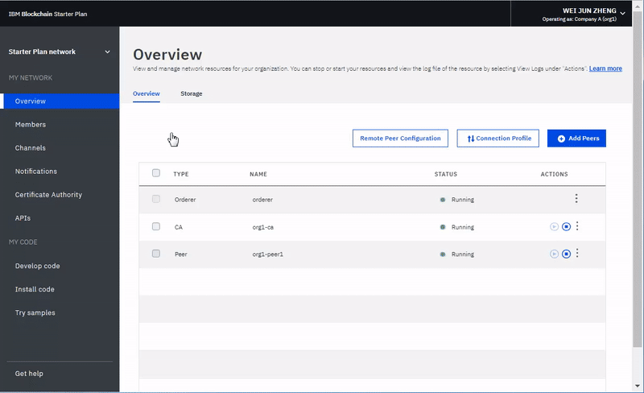
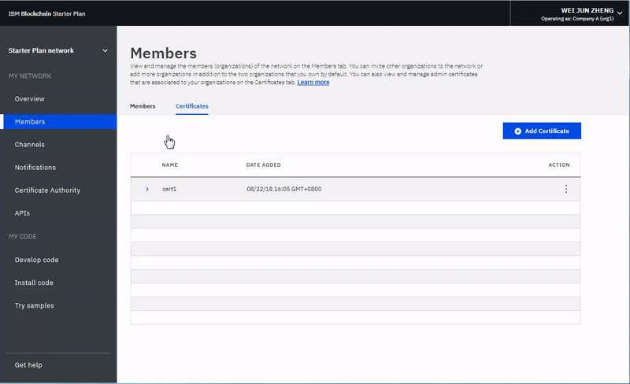

---

copyright:
  years: 2017, 2018
lastupdated: "2018-12-07"

---

{:new_window: target="_blank"}
{:shortdesc: .shortdesc}
{:screen: .screen}
{:codeblock: .codeblock}
{:pre: .pre}
{:tip: .tip}

# Implementando uma rede de negócios no Starter Plan
{: #deploying-a-business-network}


*[Esta página é útil? Diga-nos.](https://www.surveygizmo.com/s3/4501493/IBM-Blockchain-Documentation)*


As redes de negócios podem ser desenvolvidas e implementadas em um ambiente do Starter Plan usando o ambiente do desenvolvedor do {{site.data.keyword.blockchainfull}} Platform e o conjunto de ferramentas do desenvolvedor do Hyperledger Composer.
{:shortdesc}

Usando o ambiente de desenvolvedor, é possível rapidamente modelar e testar redes de negócios do {{site.data.keyword.blockchain}} e implementá-las em uma instância do {{site.data.keyword.blockchainfull_notm}} Platform.

## Antes de iniciar

Leia [Sobre o Starter Plan](/docs/services/blockchain/starter_plan.html) e [Introdução ao Starter Plan](/docs/services/blockchain/get_start_starter_plan.html). Também assegure-se de que tenha instalado o ambiente do desenvolvedor do [{{site.data.keyword.blockchainfull_notm}} Platform](/docs/services/blockchain/develop_install.html) e tenha criado uma instância do {{site.data.keyword.blockchainfull_notm}} Platform Starter Plan seguindo as instruções em [Governar a rede do Starter Plan](/docs/services/blockchain/get_start_starter_plan.html).

Assegure-se de ter o Node v8.9 ou superior, o npm v5.x e o Hyperledger Composer:

- Se sua rede estiver no Fabric versão 1.2, use o Hyperledger Composer v0.20.x.
- Se sua rede estiver no Fabric versão 1.1, use o Hyperledger Composer v0.19.x.  

É possível localizar a versão do Fabric abrindo a [janela Preferências de rede](/docs/services/blockchain/v10_dashboard.html#network-preferences) em seu Network Monitor.


## Etapa um: Recuperar o segredo do administrador

1. Na tela de visão geral do Starter Plan, clique em **Perfil de conexão** e, em seguida, faça download. Renomeie esse arquivo para 'connection-profile.json'.

2. Mova esse arquivo para estar no mesmo diretório que o seu arquivo `.bna`.

3. Dentro do perfil de conexão, vá até o fim até você ver 'registrar'. Dentro de 'registrar', sob 'enrollId' há uma propriedade **enrollSecret**. Recupere o segredo e salve uma cópia dele.

    


## Etapa dois: Criando um cartão de autoridade de certificação

O segredo recuperado na etapa anterior será usado para criar uma placa de rede de negócios para a autoridade de certificação (CA). O cartão de autoridade de certificação será, então, importado e usado para trocar o **enrollSecret** por certificados válidos da autoridade de certificação do Starter Plan.

1. Usando o **enrollSecret** observado da etapa um, execute o comando a seguir para criar o cartão de rede de negócios de autoridade de certificação:

   ```
   composer card create -f ca.card -p connection-profile.json -u admin -s enrollSecret
   ```
   {:pre}

Substitua `enrollSecret` no comando anterior pelo segredo do administrador recuperado do perfil de conexão.

2. Importe o cartão usando o comando a seguir:

   ```
   composer card import -f ca.card -c ca
   ```
   {:codeblock}

3. Agora que o cartão foi importado, ele poderá ser usado para trocar o **enrollSecret** por certificados válidos da autoridade de certificação. Execute o comando a seguir para solicitar certificados da autoridade de certificação:

   ```
   composer identity request --card ca --path ./credentials -u admin -s enrollSecret
   ```
   {:codeblock}

Substitua `enrollSecret` no comando anterior pelo segredo do administrador recuperado do perfil de conexão. O comando `composer identity request` cria um diretório `credentials` que contém arquivos de certificado `.pem`.

## Etapa três: Incluindo os certificados na instância do Starter Plan

Os certificados devem ser incluídos na instância do Starter Plan. Por conveniência, eles podem ser incluídos usando a IU do {{site.data.keyword.blockchainfull_notm}} Platform. Os certificados devem ser incluídos e, em seguida, os peers devem ser reiniciados e, então, os certificados devem ser sincronizados no canal. O certificado necessário é o arquivo `admin-pub.pem` que foi gerado por meio do comando prévio, que está no diretório `credentials`.

1. Na IU do Starter Plan, clique na guia **Membros**, em seguida, em **Certificados**, em seguida, em **Incluir certificado**. Acesse o seu diretório `credentials` e copie e cole o conteúdo do arquivo `admin-pub.pem` na caixa de certificado. Envie o certificado e reinicie os peers. Nota: reiniciar os peers leva um minuto.

    

2. Em seguida, os certificados devem ser sincronizados no canal. Clique na guia **Canais**, em seguida, no botão **Ações** e, em seguida, em **Sincronizar certificado** e **Enviar**.

    

## Etapa quatro: Criando uma placa de rede de negócios do administrador

Agora que os certificados corretos foram sincronizados com os peers, é possível criar placas de rede de negócios que tenham as permissões para instalar o tempo de execução do Hyperledger Composer e iniciar o chaincode.

1. Crie um cartão do administrador com o administrador do canal e funções administrativas de peer usando o comando a seguir:

   ```
   composer card create -f adminCard.card -p connection-profile.json -u admin -c ./credentials/admin-pub.pem -k ./credentials/admin-priv.pem --role PeerAdmin --role ChannelAdmin
   ```
   {:codeblock}

   Este cartão será usado para implementar uma rede de negócios para o Starter Plan.

2. Importe o cartão criado na etapa anterior usando o comando a seguir:

   ```
   composer card import -f adminCard.card -c adminCard
   ```
   {:codeblock}

## Etapa cinco: Instalando e iniciando a rede de negócios

Em seguida, o cartão criado na etapa anterior pode ser usado para instalar e iniciar uma rede de negócios. Para este guia, nós instalaremos a amostra de rede de manufatura de veículo; use a amostra de manufatura de veículo ou instale a sua própria rede de negócios, mas certifique-se de mudar os nomes da rede de negócios especificados nos comandos. O comando para iniciar uma rede de negócios também criará um cartão. Para o Starter Plan, esse cartão deve ser excluído, o comando de exemplo fornecido nomeia esse cartão `delete_me.card` para que possa ser facilmente distinguido.

1. Instale o tempo de execução do Hyperledger Composer com o comando a seguir:

   ```
   composer network install -c adminCard -a vehicle-manufacture-network.bna
   ```
   {:codeblock}

   Observe o número da versão de rede de negócios que é retornado quando você executa esse comando. Ele será necessário na próxima etapa.

2. Inicie a rede de negócios com o comando abaixo. Se você receber um erro, espere um minuto e tente novamente. Use o número da versão da última etapa depois da opção `-V`.

    ```
    composer network start -c adminCard -n vehicle-manufacture-network -V 0.0.1 -A admin -C ./credentials/admin-pub.pem -f delete_me.card
    ```
    {:codeblock}

3. Exclua a placa de rede de negócios chamada `delete_me.card`.

4. Crie uma nova placa de rede de negócios e referencie os certificados que foram recuperados anteriormente com o comando a seguir:

   ```
   composer card create -n vehicle-manufacture-network -p connection-profile.json -u admin -c ./credentials/admin-pub.pem -k ./credentials/admin-priv.pem
   ```
   {:codeblock}

5. Importe a placa de rede de negócios com o comando a seguir:

    ```
    composer card import -f ./admin@vehicle-manufacture-network.card
    ```
    {:codeblock}

A rede de negócios agora está implementada na instância do Starter Plan.

## Etapa seis: execute ping na rede de negócios para assegurar que ela esteja sendo executada corretamente

Execute o comando a seguir para executar ping na rede de negócios:

   ```
   Composer network ping -c admin@vehicle-manufacture-rede
   ```
   {:codeblock}

Para visualizar os logs de chaincode, clique em **Canais** e, em seguida, selecione seu canal. <!-- Click the dropdown arrow to view the logs, or the Actions symbol to view in more detail. --> Clique na guia  ** Chaincode ** . Expenda a linha do chaincode e, em seguida, clique no botão **JSON** ou **Logs**.

<!-- [fN-Yuj](https://i.makeagif.com/media/4-13-2018/fN-Yuj.gif) -->
