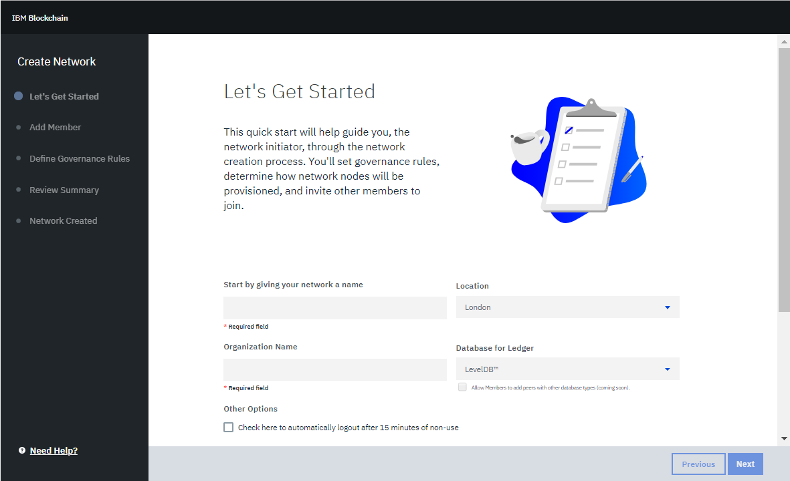
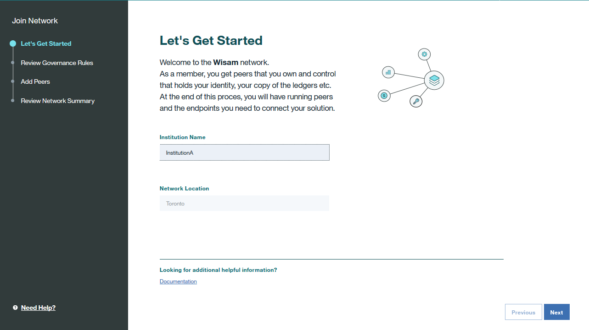

---

copyright:
  years: 2017, 2018
lastupdated: "2018-06-14"

---

{:new_window: target="_blank"}
{:shortdesc: .shortdesc}
{:screen: .screen}
{:codeblock: .codeblock}
{:pre: .pre}
{:tip: .tip}

# Governe a rede do Enterprise Plan
{: #getting-started-with-blockchain}

O {{site.data.keyword.blockchainfull}} Platform Enterprise Plan fornece uma rede de blockchain com alta segurança, integridade, escalabilidade e desempenho. É possível provisionar rapidamente uma rede totalmente funcional e usar o Monitor de rede, que é um painel da GUI, para executar imediatamente o [chaincode](glossary.html#chaincode) e aplicativos sem a necessidade de projetar e configurar uma rede do zero.
{:shortdesc}

**Nota**: o {{site.data.keyword.blockchainfull_notm}} Platform Enterprise Plan fornece um ambiente de produção. Se você precisar de um ambiente de desenvolvimento e teste, veja [Sobre o Starter Plan](starter_plan.html).

Este tutorial apresenta os pré-requisitos e as etapas que você precisa seguir para obter uma rede de Enterprise Plan que seja hospedada no ambiente altamente disponível e seguro da IBM.  

As etapas a seguir indicam o fluxo básico para ativar uma rede de Enterprise Plan com múltiplos [membros](glossary.html#member) de rede:
1. Um **inicializador de rede**, como um tipo especial de membro de rede, cria a rede e define políticas de controle. O inicializador de rede pode, então, convidar outras [organizações](glossary.html#organization) para se associarem a essa rede como membros de rede.  Para obter mais informações, veja [Criando uma rede](#creating-a-network).
2. Os **membros de rede** convidados recebem uma notificação por e-mail que fornece instruções para que eles se associem a uma rede do {{site.data.keyword.blockchain}}. Além das instruções na notificação por e-mail, também é possível seguir as etapas em [Participando de uma rede](#joining-a-network).
3. Todos os **membros de rede**, após criarem ou se associarem a uma rede, poderão entrar no Monitor de rede para configurar e gerenciar os seus recursos de rede. É possível configurar [canais](glossary.html#channel) com um grupo de membros de rede para executar transações privadas em um livro-razão específico do canal, que somente membros do canal podem acessar. No Monitor de rede, também é possível associar os seus próprios peers ao canal e, em seguida, instalar e instanciar chaincode neles. Para obter mais informações, veja [Configurando recursos de rede e ambiente](#configuring-network-resources-and-environment).
4. **Desenvolvedores de aplicativos**, após desenvolverem aplicativos, ativam a interação entre os seus aplicativos e a rede. Para obter mais informações, consulte [Ativando aplicativos para interagir com a rede](#enabling-applications-to-interact-with-the-network).
5. **Operadores de rede** monitoram transações em seus canais no Monitor de rede. Para obter mais informações, veja [Monitorando recursos de rede](#monitoring-network-resources).

## Criando uma rede
Antes de iniciar, é necessário criar uma instância de serviço do [{{site.data.keyword.blockchain}} Platform ](https://console.bluemix.net/catalog/services/blockchain) no {{site.data.keyword.Bluemix_notm}}. É necessário efetuar login com o seu ID do {{site.data.keyword.Bluemix_notm}}. Se você não tiver um ID, clique no botão **Inscreva-se para criar**.  Renomeie o serviço e os nomes de credenciais para sua instância para que você possa reconhecê-lo facilmente no futuro. Selecione a região, a organização e o espaço do {{site.data.keyword.Bluemix_notm}}, na qual é possível implementar sua rede do {{site.data.keyword.blockchain}}. Em seguida, selecione **Plano de associação corporativa** na tabela de planos de precificação e clique no botão **Criar**.  

É possível localizar a instância de serviço do {{site.data.keyword.blockchain}} Platform em seu painel de serviços do [{{site.data.keyword.Bluemix_notm}} painel de serviços ](https://console.bluemix.net/dashboard/services "{{site.data.keyword.Bluemix_notm}} ").  

Se você for um inicializador de rede, clique no botão **Criar rede** para iniciar uma rede do {{site.data.keyword.blockchain}}.  Siga o assistente para concluir a configuração básica de sua rede e seus recursos.  
  

1. Na tela "Vamos começar", forneça um nome para sua rede, escolha o local de sua organização do {{site.data.keyword.Bluemix_notm}} e inclua o nome de sua instituição. Quando você convidar outros membros de rede, eles procurarão por este nome de rede para participar. Clique em **Avançar**.
2. (Opcional) Na tela "Convidar membros", insira o nome da instituição e o endereço de e-mail do membro que você deseja convidar para a sua rede. O nome da instituição que você designa não é um título oficial. Ele simplesmente permite que a instituição seja reconhecida facilmente e pode ser mudado quando eles se juntam à rede. Observe que uma rede pode ter até 15 membros, incluindo você. Esta etapa é opcional e você pode convidar membros para sua rede posteriormente no Monitor de Rede.  Clique em **Avançar**.
	Os membros que você convidar receberão uma notificação por e-mail sobre seu convite após você concluir todas as etapas para criar a rede.
3. Na tela "Definir Regras de Controle", estabeleça as políticas para associação, criação de canal e chaincode. Por padrão, todos os membros de rede podem convidar outros membros para participarem da rede, criar canais e instanciar chaincode. Atualmente, a sua rede usa as políticas de controle padrão.  Clique em **Avançar**.
4. Na tela "Resumo da Revisão", verifique sua configuração de rede. Se você desejar fazer modificações, clique em **Editar** ao lado do cabeçalho da seção ou clique no botão **Anterior** para voltar para as telas anteriores. Ao concluir a configuração de rede, clique em **Pronto**.  
5. Na tela "Rede Criada", você será notificado de que sua rede foi criada com êxito. É possível clicar em **Incluir [Peers](glossary.html#peer)** para configurar os recursos de sua rede ou clicar em **Entrar no monitor** diretamente para abrir o Monitor de rede. Também é possível incluir peers posteriormente no Monitor de rede.  Para obter mais informações sobre peers, veja [Incluir peers](v10_dashboard.md#add_peers).

Agora você implementar com êxito uma rede do {{site.data.keyword.blockchain}} que possa suportar os recursos de rede a seguir:  
* Uma autoridade de certificação (CA) específica do membro
* Políticas de controle padrão
* Até 15 membros de rede  
* Três solicitadores e dois nós de CA intermediários
* Até três pequenos peers para cada membro  
* Um serviço de ordenação tolerante a falhas e travamento
* Até 150 canais
* Até 10 instanciações de chaincode por membro no Monitor de rede

## Participando de uma rede
Semelhante à criação de uma rede, é necessário criar uma instância de serviço do [{{site.data.keyword.blockchain}} Platform ](https://console.bluemix.net/catalog/services/blockchain) no {{site.data.keyword.Bluemix_notm}}. É necessário efetuar login com o seu ID do {{site.data.keyword.Bluemix_notm}}. Se você não tiver um ID, clique no botão **Inscreva-se para criar**.  Renomeie o serviço e os nomes de credenciais para sua instância para que você possa reconhecê-lo facilmente no futuro. Selecione a região, a organização e o espaço do {{site.data.keyword.Bluemix_notm}}, na qual é possível implementar sua rede do {{site.data.keyword.blockchain}}. Em seguida, selecione **Plano de associação corporativa** na tabela de planos de precificação e clique no botão **Criar**.

É possível localizar a sua instância de serviço do {{site.data.keyword.blockchain}} Platform no [ painel de serviço do {{site.data.keyword.Bluemix_notm}} ](https://console.bluemix.net/dashboard/services "{{site.data.keyword.Bluemix_notm}} painel de serviço").

Se você for um membro de rede convidado, clique no botão **Convite pendente ->**, selecione a rede à qual você deseja se associar na lista suspensa e clique no botão **Associar-se à rede!** . Siga o assistente para visualizar a configuração básica de sua rede e configure os seus próprios recursos de rede.  
  

1. Na tela "Introdução", insira o nome de sua organização e clique em **Avançar**.
2. Na tela "Revisar regras de controle", revise as políticas de controle de associação da rede, a criação de canal e o chaincode. Clique em **Avançar**.
3. (Opcional) Na tela "Incluir peers", escolha a quantidade de peers que você deseja incluir. Clique em **Avançar**. Cada membro em uma rede pode incluir até três peers. Esta etapa é opcional e você pode incluir seus peers posteriormente no Monitor de Rede. Para obter mais informações sobre peers, veja [Incluir peers](v10_dashboard.html#peers).
4. Na tela "Revisar Resumo de Rede", verifique a configuração de rede. Se desejar fazer modificações, clique no botão **Anterior** para voltar para as telas anteriores. Depois de concluir a configuração de recursos, clique em **Pronto**. Você será notificado de que se associou com êxito à rede. É possível, então, clicar em **Entrar no monitor** para abrir o Monitor de rede.

<!-- or click **Create a Channel** to initiate a channel creation request. You can create channels later in the Network Monitor. For more information, see [Channels](v10_dashboard.html#channels).  -->

## Configurando recursos de rede e ambiente

1. Entre em seu Monitor de Rede após criar ou participar de uma rede do {{site.data.keyword.blockchain}}. O Monitor de rede é um painel da GUI no qual é possível gerenciar e controlar informações de status da rede. Para obter mais informações, consulte [Monitor de Rede](v10_dashboard.html).
2. Inclua seus próprios peers na rede. Se você já incluiu peers suficientes, ignore esta etapa. Os peers executam chaincode e eles são o terminal para interagir com seus aplicativos. Clique em **Incluir peers** na tela "Visão Geral" e selecione a quantidade e o tamanho de seus peers. Para obter mais informações, consulte [Visão Geral](v10_dashboard.html#resources).
3. Configure um canal. Todos os membros no mesmo canal recebem um livro-razão específico do canal, o que fornece isolamento e confidencialidade dos dados. Para obter mais informações sobre como criar um canal, veja [Criando um canal](howto/create_channel.html#creating-a-channel).  
    Se você for um membro do canal convidado a se associar a um canal, receberá uma notificação por e-mail com um link para o assistente que permite que se associe ao canal.
4. Associe peers ao canal.  Apenas peers que estão associados ao canal podem acessar seu livro-razão. Para obter mais informações, consulte [Canais](v10_dashboard.html#channels).
5. Instale e instancie o chaincode. Todos os membros do canal precisam instalar o mesmo chaincode com o mesmo nome e versão em cada peer que executará o chaincode. Após você instalar o chaincode, precisará instanciá-lo no canal antes de poder usá-lo. Para obter mais informações, veja [Instalando, instanciando e atualizando um chaincode](howto/install_instantiate_chaincode.html).  

**Nota**: para atingir alta disponibilidade, cada organização deverá comprar pelo menos dois peers e, dentro de um canal, cada membro participante deverá se associar a pelo menos dois peers.

## Recuperando credenciais de rede e perfil de conexão
Após você criar uma rede de Enterprise Plan no {{site.data.keyword.cloud_notm}}, será possível recuperar as credenciais de rede e o perfil de conexão por meio da página da instância de serviço ou no Monitor de rede.

### Recuperando por meio da página da instância de serviço
Você estará na página da instância de serviço logo após criar uma instância de serviço. Também é possível clicar em seu serviço no [painel do serviço do {{site.data.keyword.cloud_notm}}](https://console.bluemix.net/dashboard/services "{{site.data.keyword.cloud_notm}} painel do serviço") para abrir a página da instância de serviço.

Recupere as suas credenciais de serviço com as etapas a seguir:
1. Na página da instância de serviço, clique em **Credenciais de serviço** no navegador esquerdo para mostrar a tela "Credenciais de serviço".
2. Clique em **Nova credencial** na tela "Credenciais de serviço".
3. Na tela "Incluir nova credencial", dê à credencial um nome e insira **{"type": "service_instance_token"}** no campo "Incluir parâmetro de configuração sequencial". Clique em **Incluir** e a nova credencial será incluída na tabela. É possível clicar em **Visualizar credenciais** sob a coluna "AÇÕES" para visualizar os detalhes da credencial. Essa credencial contém a chave API e o segredo, que você pode usar para autorizar APIs.

### Recuperando no Monitor de rede
É possível localizar as credenciais de rede na tela "APIs" em seu Monitor de rede. Para obter mais informações sobre como usar as APIs, veja [Experimentando as APIs com o Swagger](apis.html).

É possível recuperar o perfil de conexão na tela "Visão geral" em seu Monitor de rede. Clique no botão **Perfil de conexão** na tela "Visão geral" e o perfil de conexão será mostrado em uma nova página.

## Desenvolvendo e Implementando redes de negócios customizadas
É possível desenvolver redes de negócios com base em suas necessidades de negócios com o ambiente de desenvolverdor do IBM Blockchain Platform: Develop e as ferramentas do desenvolvedor do Hyperledger Composer. Após você desenvolver uma rede para os seus negócios, será possível implementar a sua rede de negócios para a rede de Enterprise Plan.

Para obter mais informações, veja [Desenvolver a rede](develop.html) e [Implementando uma rede de negócios no Enterprise Plan](develop_enterprise.html).

## Ativando aplicativos para interagirem com a rede
Os aplicativos alavancam as APIs do SDK para interagirem com os seus recursos de rede do {{site.data.keyword.blockchain}}. É necessário incluir as informações do terminal de API de seus recursos de rede em seu aplicativo para que o aplicativo possa finalmente direcionar os seus peers com solicitações de transação. É possível, então, incluir as informações do terminal de API no Monitor de Rede. Os aplicativos podem ser hospedados em seu sistema de arquivos local ou em {{site.data.keyword.Bluemix_notm}}. Para obter mais informações, consulte [Desenvolvendo aplicativos](v10_application.html).

## Monitorando recursos de rede  
Após uma transação ser acionada por meio de seu aplicativo, será possível visualizar informações de status da transação no Monitor de rede. Para obter mais informações sobre o monitoramento de rede, consulte [Monitorando uma rede](howto/monitor_network.html).

## Sair de uma rede
Se você desejar sair de uma rede, exclua a instância de serviço de blockchain do painel do {{site.data.keyword.Bluemix_notm}}.  

**Nota**: antes de sair de uma rede, assegure-se de não ser membro de nenhum canal da rede. Caso contrário, você receberá mensagens de erro quando sair da rede. Uma remoção de membros do canal é necessária para concluir o processo de atualização do canal. Para obter mais informações sobre o processo de atualização do canal, consulte [Atualizando um canal](howto/create_channel.html#updating-a-channel).

<!--
## References
* For more information about {{site.data.keyword.blockchainfull_notm}} offerings, see [Blockchain offerings](index.html).
* For more information about Hyperledger Fabric, see [Hyperledger Fabric documentation ](http://hyperledger-fabric.readthedocs.io/en/latest/){:new_window}.
-->
