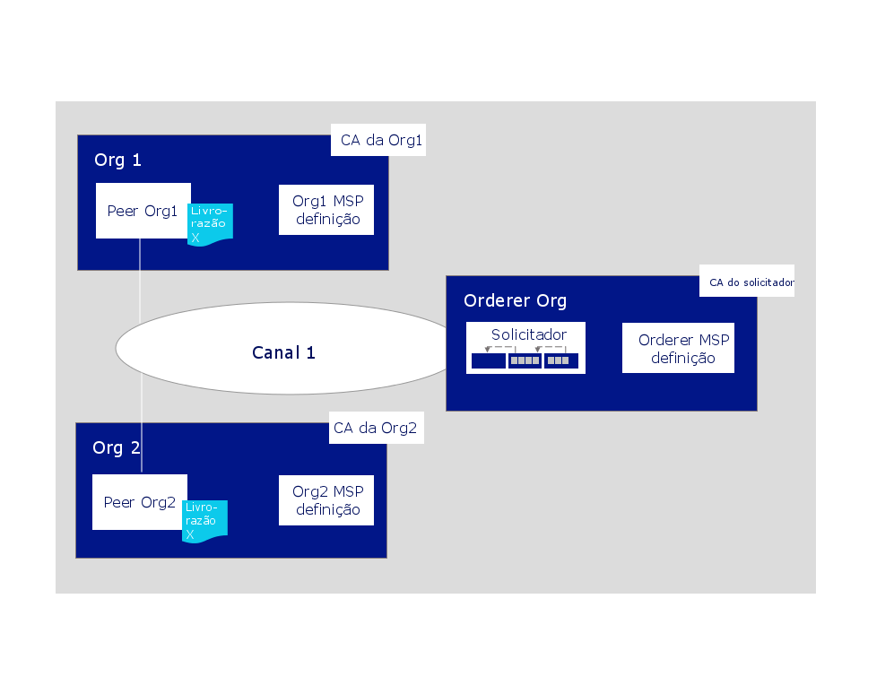
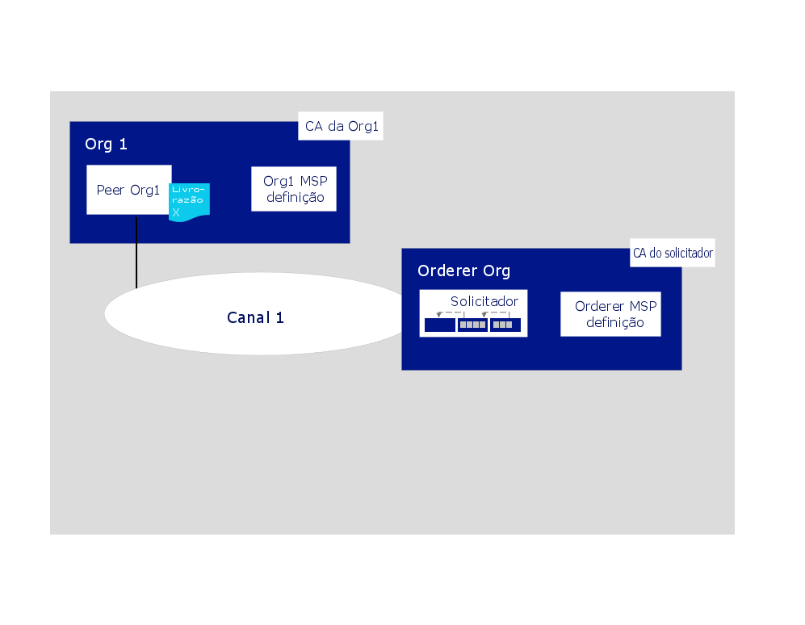

---

copyright:
  years: 2019

lastupdated: "2019-04-23"

subcollection: blockchain

---

{:new_window: target="_blank"}
{:shortdesc: .shortdesc}
{:screen: .screen}
{:codeblock: .codeblock}
{:note: .note}
{:important: .important}
{:tip: .tip}
{:pre: .pre}

# Construir um tutorial de rede
{: #ibp-console-build-network}

O {{site.data.keyword.blockchainfull}} Platform é uma oferta de blockchain-as-a-service que permite que você desenvolva, implemente e opere aplicativos e redes de blockchain. É possível obter mais informações sobre os componentes de blockchain e como eles trabalham juntos visitando a [Visão geral do componente Blockchain](/docs/services/blockchain/blockchain_component_overview.html#blockchain-component-overview). Este tutorial é a primeira parte da [série de tutoriais de rede de amostra](/docs/services/blockchain/howto/ibp-console-build-network.html#ibp-console-build-network-sample-tutorial) e descreve como usar o console do {{site.data.keyword.blockchainfull_notm}} Platform para construir uma rede totalmente funcional em um único serviço do {{site.data.keyword.cloud_notm}} Kubernetes.
{:shortdesc}

**Público-alvo:** este tópico é projetado para operadores de rede que são responsáveis por criar, monitorar e gerenciar a rede de blockchain.   

Se você ainda não tiver implementado o console em um cluster Kubernetes usando o {{site.data.keyword.cloud_notm}} Kubernetes Service, consulte [Introdução ao {{site.data.keyword.blockchainfull_notm}} Platform 2.0](/docs/services/blockchain/howto/ibp-v2-deploy-iks.html#ibp-v2-deploy-iks). É possível criar um novo cluster Kubernetes para a implementação do console ou usar um existente em sua conta do {{site.data.keyword.cloud_notm}}.  Depois de implementar o {{site.data.keyword.blockchainfull}} Platform no cluster Kubernetes, é possível ativar o console para criar e gerenciar os componentes de blockchain.

Independentemente de você implementar em um cluster Kubernetes pago ou gratuito, use o painel do Kubernetes para prestar muita atenção nos recursos à sua disposição ao escolher implementar nós e criar canais. É sua responsabilidade gerenciar seu cluster Kubernetes e implementar recursos adicionais, se necessário. Embora os componentes sejam implementados com êxito em um cluster gratuito, quanto mais componentes forem incluídos, mais lenta será sua execução.
{: note}

## Amostra de séries do tutorial de rede
{: #ibp-console-build-network-sample-tutorial}

Esta série de tutorial de três partes orienta você durante o processo de criação e interconexão de uma rede relativamente simples e de múltiplos nós do Hyperledger Fabric usando o console do {{site.data.keyword.blockchainfull_notm}} Platform 2.0 para implementar uma rede em seu cluster do Kubernetes e instalar e instanciar um contrato inteligente.

* **Tutorial de construção de rede** Este tutorial atual orienta você durante o processo de hospedagem de uma rede ao criar um solicitador e um peer.
* [Associar-se a um tutorial de rede](/docs/services/blockchain/howto/ibp-console-join-network.html#ibp-console-join-network) fornece orientação durante o processo de junção de uma rede existente ao criar um peer e associá-lo a um canal.
* [Implementar um contrato inteligente na rede](/docs/services/blockchain/howto/ibp-console-smart-contracts.html#ibp-console-smart-contracts) fornece informações sobre como gravar um contrato inteligente e implementá-lo em sua rede.

É possível usar as etapas nestes tutoriais para construir uma rede com várias organizações em um cluster para propósitos de desenvolvimento e teste. Use o tutorial **Construir uma rede** se você desejar formar um consórcio de blockchain criando um nó do solicitador e incluindo organizações. Use o tutorial **Associar-se a uma rede** para conectar um peer à rede. Seguir os tutoriais com membros de consórcio diferentes permite criar uma rede de blockchain realmente **distribuída**.  

### A estrutura desta rede
{: #ibp-console-build-network-structure}

Se você concluir todas as etapas nos tutoriais **Construir uma rede** e **Associar-se a uma rede**, sua rede será semelhante àquela na ilustração abaixo:
  
*Figura 1. Estrutura de rede básica de amostra*  

Esta configuração é suficiente para testar aplicativos e contratos inteligentes. A rede contém os componentes a seguir:

* ** Duas organizações de peer **:  ` Org1 `  e  ` Org2 `  
  A série do tutorial descreve como criar duas organizações de peer e dois peers associados. Considere as organizações em uma rede de blockchain como dois bancos diferentes que precisam transacionar entre si. Criamos a definição do Membership Services Provider (MSP) Org1 e do Org2 que define as organizações `Org1` e `Org2`.
* ** Uma organização do orderer **:  ` Orderer Org `  
  Como estamos construindo um livro-razão distribuído, os peers e solicitadores devem ser parte de diferentes organizações. Portanto, uma organização separada é criada para o solicitador.  Entre outras coisas, um nó de solicitador ordena os blocos de transações que são enviados para os peers para serem gravados em seus livros-razão e se tornarem o blockchain. Nós criamos a definição de Membership Services Provider (MSP) do solicitador que define a organização `Orderer Org`.
* **Três Autoridades de Certificação (CAs)**: `Org1 CA, Org2 CA, Orderer CA`   
  Uma CA é o nó que emite certificados para todos os membros da organização. Como a melhor prática é implementar uma CA por organização, nós implementaremos três CAs no total: uma para cada organização de peer e uma para a organização de solicitador. Também usaremos as CAs para criar todos os nós, identidades e definição de organização para cada organização.
* **Um solicitador:** `Orderer`  
  Atualmente, somente um serviço de pedido SOLO pode ser implementado usando o console. É possível implementar mais de um desses nós, supondo que você tenha espaço em seu cluster, mas cada solicitador terá seu próprio "consórcio", que é a lista de organizações de peer que podem criar e associar-se a canais. Não é possível conectar múltiplos solicitadores ao mesmo canal. Como administrador desse solicitador, você incluirá a organização de peer usada para criar o consórcio, o que permite que sua organização de peer crie um canal. Se você desejar criar um canal que tenha organizações implementadas em clusters diferentes, que é como a maioria das redes de produção será estruturada, também será necessário importar uma organização de peer que tenha sido implementada em outro console para o seu console. Isso permite que a organização de peer se associe ao canal que é hospedado pelo serviço de pedido.
* **Dois peers:** `Peer Org1` e `Peer Org2`  
  O livro-razão do blockchain, `Ledger x` na ilustração acima, é mantido pelos peers distribuídos. Esses peers são implementados com o [Couch DB ](https://hyperledger-fabric.readthedocs.io/en/release-1.4/couchdb_as_state_database.html) como o banco de dados.
* ** Um canal **:  ` channel1 `  
  Canais fornecem privacidade de dados. Eles permitem que os conjuntos de organizações transacionem sem expor seus dados para organizações que não são membros do canal. Cada canal tem seu próprio livro-razão de blockchain, compartilhado entre os peers associados a esse canal. O tutorial cria um canal associado por ambas as organizações e instancia o contrato inteligente no canal que as organizações possam usar para transacionar.

Essa configuração não é obrigatória. O  {{site.data.keyword.blockchainfull_notm}}  Platform 2.0 é altamente customizável. Se você tiver recursos disponíveis em seu cluster Kubernetes, será possível usar o console para implementar um nó do solicitador e incluir organizações nele, também conhecido como formar um consórcio. Além disso, é possível criar uma organização de peer que se conecte a múltiplos serviços de pedido. Este tutorial fornece as etapas necessárias para construir sua própria rede, com referências a tópicos que fornecem um detalhamento para o {{site.data.keyword.blockchainfull_notm}} Platform e o console.

Neste tutorial **Construir uma rede**, construímos somente uma parte da rede acima, uma rede simples que pode ser usada para hospedar um solicitador e uma única organização de peer e um peer em um único canal. A ilustração a seguir mostra a parte da rede acima que será construída:
  
*Figura 2. Estrutura de rede simples*  

Essa configuração é útil para a introdução e o teste rápidos de um contrato inteligente, mas não é muito significativa até que você inclua outras organizações com as quais transacionar, criando um livro-razão verdadeiramente distribuído.  Portanto, no tutorial subsequente [Associar-se a uma rede](/docs/services/blockchain/howto/ibp-console-join-network.html#ibp-console-join-network), nós mostramos a você como criar peer e organizações de peer adicionais e como incluir uma nova organização no canal.  

Em todo este tutorial, fornecemos **valores recomendados** para alguns dos campos no console. Isso permite que os nomes e as identidades sejam mais fáceis de reconhecer nas guias e nas listas suspensas. Esses valores não são obrigatórios, mas você os achará úteis. Fornecemos uma tabela dos valores recomendados após cada tarefa.
{:tip}

## Etapa um: criar sua organização e seu ponto de entrada para seu blockchain
{: #ibp-console-build-network-create-peer-org1}

Para cada organização que você deseja criar com o console, é necessário implementar pelo menos uma CA. Uma CA é o nó que emite certificados para todos os participantes da rede (peers, solicitadores, clientes e assim por diante). Esses certificados, que incluem um par de chaves públicas e privadas, permitem que os participantes da rede se comuniquem, se autentiquem e, finalmente, transacionem. Essas CAs criarão todas as identidades e certificados pertencentes à sua organização, além de definir a própria organização. É possível, então, usar essas identidades para implementar nós, operar sua rede e enviar transações para o blockchain. Para obter mais informações sobre sua CA e as identidades que você precisará criar, consulte [Gerenciando identidades](/docs/services/blockchain/howto/ibp-console-identities.html#ibp-console-identities).

Neste tutorial, criamos duas organizações, uma que possuirá um peer e outra que possuirá um solicitador. Cada organização precisa de uma CA para emitir seus certificados, portanto, precisamos criar **duas CAs**. Para o propósito deste tutorial, **criaremos somente uma CA de cada vez**.

Assista ao vídeo a seguir para aprender sobre o processo de criar a organização do peer e o peer.

<iframe class="embed-responsive-item" id="youtubeplayer" title="Vídeo do IBM Blockchain Platform free 2.0 beta: tutorial de implementação" type="text/html" width="640" height="390" src="https://www.youtube.com/embed/JZj43n_JKIY" frameborder="0" webkitallowfullscreen mozallowfullscreen allowfullscreen> </iframe>  
*Vídeo 1. Criar a organização do peer e o peer*

### Criando sua CA da organização do peer
{: #ibp-console-build-network-create-CA-org1CA}

Como parte deste tutorial, sua CA emite as chaves públicas e privadas para seus usuários e nós. Essas identidades não são gerenciadas pela {{site.data.keyword.IBM_notm}} e as chaves não são armazenadas no cluster Kubernetes ou no console. Eles são armazenados somente no armazenamento local de seu navegador. Portanto, certifique-se de exportar suas identidades e o MSP da organização. Se você tentar acessar o console de uma máquina diferente ou de um navegador diferente, será necessário importar essas identidades e definições de organização.  
{:important}

Execute as etapas a seguir em seu console:

1. Navegue para a guia **Nós** à esquerda e clique em **Incluir Autoridade de certificação**. Os painéis laterais permitirão que você customize a CA que deseja criar e a organização para a qual ela emitirá chaves.
2. Clique em **{{site.data.keyword.cloud_notm}}** em **Criar autoridade de certificação** e **Avançar**.
3. Use o segundo painel lateral para fornecer à sua CA um **nome de exibição**. Nosso valor recomendado para essa CA é `Org1 CA`.
4. No próximo painel, forneça suas credenciais de administrador de CA especificando um **ID de administrador** de `admin` e fornecendo qualquer segredo que você desejar. Recomendamos `adminpw` para ajudá-lo a seguir adiante neste tutorial.
5. Se estiver usando um cluster pago, você terá a oportunidade de configurar a alocação de recurso para o nó. Para os propósitos desse tutorial, é possível aceitar todos os padrões e clicar em **Avançar**. Se desejar saber mais sobre como alocar recursos para seu nó, consulte este tópico em [Alocando recursos](/docs/services/blockchain?topic=blockchain-ibp-console-govern#ibp-console-govern-allocate-resources). Se estiver usando um cluster gratuito, a página **Resumo** já estará visível.
6. Revise a página Resumo e, em seguida, clique em **Incluir autoridade de certificação**.

**Tarefa: criando a CA da organização de peer**

  | **Campo** | **Nome de exibição** | **ID de inscrição** | **Segredo** |
  | ------------------------- |-----------|-----------|-----------|
  | **Criar CA** | Org1 CA  | admin | adminpw |

  *Figura 3. Criando a CA da organização de peer*

Depois de implementar a CA, você a usará quando criar o MSP de sua organização, registrar usuários e criar seu ponto de entrada para uma rede, o **peer**.  

Os usuários avançados podem já ter sua própria CA e não desejar criar uma nova no console. Se a sua CA existente externa puder emitir certificados no formato `X.509`, será possível usá-la em vez de criar uma nova aqui. Consulte este tópico em [Usando certificados de uma CA externa com seu peer ou solicitador](/docs/services/blockchain/howto/ibp-console-build-network.html#ibp-console-build-network-third-party-ca) para obter mais informações.

### Usando sua CA para registrar identidades
{: #ibp-console-build-network-use-CA-org1}

Cada nó ou aplicativo que você deseja criar precisa de chaves públicas e privadas para participar na rede de blockchain. Também é necessário criar chaves de administrador para esses nós e aplicativos para que você possa gerenciá-los por meio do console. Vamos passar por esse processo duas vezes, uma vez para cada CA que criarmos. E para cada CA, você criará duas identidades:

* **Um administrador da organização** Essa identidade permite que você opere os nós usando o console da plataforma.
* **Uma identidade de peer** Essa identidade permite que você implemente um peer.

Dependendo de seu tipo de cluster, a implementação da CA poderá levar até dez minutos. O quadrado verde no quadro da CA indicará que ela está "Em execução" e poderá ser usada para registrar identidades. Antes de continuar com as etapas abaixo para registrar identidades, deve-se aguardar até que o status da CA seja "Em execução".
{:important}

Para gerar esses certificados, precisaremos concluir as etapas a seguir:

1. No console, clique na guia **Nós**. Quando o indicador de status no canto superior direito da `Org1 CA` estiver verde e `Running`, clique no quadro para abri-lo.
2. Depois de selecionar sua CA, certifique-se de que a identidade `admin` criada para ela esteja visível na tabela antes de continuar. É necessário registrar outra identidade do administrador para nossa primeira organização, `org1`, além de uma identidade para o próprio peer.  Para registrar nossos novos usuários, clique no botão **Registrar usuário**.
3. Para o administrador da organização, forneça um ID de inscrição de `org1admin`. É possível usar qualquer segredo, mas sugerimos `org1adminpw` para ajudá-lo a seguir adiante. Clique em **Avançar**.
4. Na próxima etapa, configure o Tipo dessa identidade como `client` e deve-se selecionar qualquer uma das organizações afiliadas na lista suspensa. O campo de afiliação é para usuários avançados e não é usado pelo tutorial, mas é um campo necessário para o painel. Os itens na lista são afiliações padrão do Fabric CA. Se desejar obter mais informações sobre como as afiliações são usadas pelo Fabric CA, consulte este tópico em [Registrando uma nova identidade ](https://hyperledger-fabric-ca.readthedocs.io/en/release-1.4/users-guide.html#registering-a-new-identity). Por enquanto, selecione qualquer afiliação na lista, por exemplo, `org1` e clique em **Avançar**.
5. Sinta-se à vontade para deixar os campos **Inscrições máximas** e **Incluir atributos** em branco. Eles não são usados por este tutorial, mas é possível obter mais informações sobre o que eles são neste tópico em [Registrando identidades](/docs/services/blockchain/howto/ibp-console-identities.html#ibp-console-identities-register).
6. Depois que o administrador da organização tiver sido registrado, repita esse mesmo processo, usando o mesmo `Org1 CA`, para a identidade do peer, fornecendo um ID de inscrição de `peer1` e qualquer segredo que você desejar. Como antes, recomendamos um segredo de `peer1pw`. Essa é uma identidade do nó, portanto, selecione `peer` como o **Tipo** na próxima etapa. Selecione qualquer  ** Afiliação **. Em seguida, ignore  ** Inscrições máximas **  e  ** Atributos **.

**Tarefa: registrar usuários**

  |  **Campo** | **Descrição** | **ID de inscrição** | **Segredo** |
  | ------------------------- |-----------|-----------|-----------|-----------|
  | **Registrar usuários** |  Org1 admin | org1admin | org1adminpw |
  | | Identidade do peer |  peer1 | peer1pw |

  *Figura 4. Usando sua CA para registrar usuários*

### Criando a definição do MSP da organização de peer
{: #ibp-console-build-network-create-peers-org1}

Agora que criamos a CA do peer e a usamos para **registrar** nossas identidades de organização, precisamos criar uma definição formal da organização de peer, que é conhecida como Membership Services Provider (MSP). Muitos peers podem pertencer a uma organização. **Você não precisa criar uma nova organização toda vez que criar um peer.** Como essa é a primeira vez que passamos pelo tutorial, criaremos o ID do MSP para essa organização. Durante o processo de criação do MSP, nós vamos gerar certificados para a identidade `org1admin` e incluí-los em nossa carteira eletrônica do console.

1. Navegue para a guia **Organizações** na navegação esquerda e clique em **Criar definição do MSP**.
2. Forneça ao seu MSP o nome de exibição `Org1 MSP` e um ID do MSP de `org1msp`. Se desejar especificar seu próprio ID do MSP nesse campo, certifique-se de seguir as especificações sobre as limitações para esse nome na dica de ferramenta.
3. Em ** Detalhes da autoridade de certificação raiz**, especifique a CA do peer que criamos como sua CA raiz para sua organização. Se essa for sua primeira vez neste tutorial, você deverá ver somente uma: `Org1 CA`.
4. Os campos **ID de inscrição** e **Segredo de inscrição** abaixo disso serão preenchidos automaticamente com o ID de inscrição e o segredo do primeiro usuário criado com sua CA. É possível usar esses valores, mas não recomendamos que você use a sua identidade do administrador de CA como o seu administrador de organização.  Em vez disso, por motivos de segurança, recomendamos inserir o ID de inscrição e o segredo que você criou separados do administrador da organização, `org1admin` e `org1adminpw`. Em seguida, forneça a essa identidade um nome de exibição, `Org1 Admin`.
5. Clique no botão **Gerar** para inscrever essa identidade como o administrador de sua organização e exportar a identidade para a carteira eletrônica, na qual ela será usada quando você criar o peer e criar um canal.
6. Clique em **Exportar** para exportar os certificados de administrador para o seu sistema de arquivos para que seja possível gerenciar o arquivo. Como dissemos acima, essa identidade não é armazenada no cluster ou gerenciada pelo {{site.data.keyword.IBM_notm}}. Ela é armazenada somente em seu navegador. Se você mudar os navegadores, será necessário importar essa identidade para a sua carteira eletrônica do console para ser capaz de administrar o peer.
7. Clique em **Criar definição do MSP**.

**Tarefa: Criar o MSP da organização de peer**

  |  | **Nome de exibição** | **ID do MSP** | **ID de inscrição**  | **Segredo** |
  | ------------------------- |-----------|-----------|-----------|-----------|
  | **Criar organização** | Org1 MSP | org1msp |||
  | **CA raiz** | Org1 CA ||||
  | **Certificado do administrador da organização** | |  | org1admin | org1adminpw |
  | **Identidade** | Administrador da Org1 |||||

  *Figura 5. Criar a definição do MSP da organização de peer*

Depois de criar o MSP, você conseguirá ver o administrador da organização de peer em sua carteira eletrônica do console.

**Tarefa: verificar sua carteira eletrônica do console**

  | **Campo** |  **Nome de exibição** | **Descrição** |
  | ------------------------- |-----------|----------|
  | **Identidade** | Administrador da Org1 | Identidade do administrador da Org1 |

  *Figura 6. Verifique sua carteira eletrônica do console*

Para obter mais informações sobre os MSPs, consulte [Gerenciando organizações](/docs/services/blockchain/howto/ibp-console-organizations.html#ibp-console-organizations).

A exportação de sua identidade do administrador da organização é importante porque você é responsável por gerenciar e proteger esses certificados.
{:important}

<!--
You are free to repeat this process as many times as times as you want. To create a network that is similar to [Starter Plan](/docs/services/blockchain/starter_plan.html#starter-plan-about), for example, you will create two organizations and one peer per organization, and this tutorial will take you through those steps. This process involves repeating the steps above, to create the CA and the relevant identities, and below, to create another peer. Remember that the best practice is to have **one CA for each organization**. This CA can, however, be used to register and enroll multiple organization admins as well as multiple peer identities **for that organization**. Make sure to keep track of the resources you are using in your Kubernetes cluster, especially if using the free cluster.
{: note}
-->

### Criando um peer
{: #ibp-console-build-network-peer-create}

Depois de [criar uma CA](/docs/services/blockchain/howto/ibp-console-build-network.html#ibp-console-build-network-create-CA-org1CA), usá-la para registrar identidades e criar o [MSP da organização de peer](/docs/services/blockchain/howto/ibp-console-build-network.html#ibp-console-build-network-create-peers-org1), você estará pronto para criar um peer.

#### Qual função os peers executam?
{: #ibp-console-build-network-peer-role}

É importante lembrar-se de que as próprias organizações não mantêm livros-razão. Os peers executam. As organizações também usam peers para assinar propostas de transação e aprovar atualizações de configuração do canal. Como ter pelo menos dois peers em um canal os torna altamente disponíveis, ter pelo menos dois peers associados a um canal é considerado uma melhor prática para implementações de nível de produção. Neste tutorial, mostraremos apenas o processo para criar um único peer.

De uma perspectiva de alocação de recurso, é possível associar os mesmos peers a múltiplos canais. O design do peer assegura que os dados de um canal não possam passar para outro por meio do peer. No entanto, como o peer armazenará um livro-razão separado para cada canal, será necessário assegurar-se de que o peer tenha energia de processamento e armazenamento suficientes para manipular a transação e o carregamento de dados.

#### Implementando seu peer
{: #ibp-console-build-network-deploy-peer-role}

Use seu console para executar as etapas a seguir:

1. Na página **Nós**, clique em **Incluir peer**.
2. Clique no {{site.data.keyword.cloud_notm}} em **Criar um novo peer** e em **Avançar**.
3. Forneça a seu peer um **Nome de exibição** de `Peer Org1`.
4. Na próxima tela, selecione `Org1 CA` como sua CA. Em seguida, forneça o ID de inscrição e o segredo para a identidade do peer que você criou para o seu peer, `peer1` e `peer1pw`. Em seguida, selecione seu MSP, `Org1 MSP`, na lista suspensa e clique em **Avançar**.
5. O próximo painel lateral solicita informações de CA do TLS. Embora seja possível criar administradores separados para a CA TLS que é implementada com sua CA, isso não é necessário.
  - Forneça o **ID de inscrição do TLS**, `admin` e o segredo `adminpw`, os mesmos valores são o ID de inscrição e o segredo de inscrição fornecidos ao criar a CA.
  - O **Nome do host de CSR TLS** destina-se a usuários avançados para especificar um nome de domínio customizado que pode ser usado para direcionar o terminal de peer. Deixe o **Nome do host de TLS CSR** em branco por enquanto, ele não é usado neste tutorial.
6. O próximo painel lateral solicita **Associar uma identidade** e torná-la o administrador de seu peer. Selecione a sua identidade do administrador de peer `Org1 Admin`.
7. Se estiver usando um cluster pago, no próximo painel, você terá a oportunidade de configurar a alocação de recurso para o nó. Para os propósitos desse tutorial, é possível aceitar todos os padrões e clicar em **Avançar**. Se desejar saber mais sobre como alocar recursos para seu nó, consulte este tópico em [Alocando recursos](/docs/services/blockchain?topic=blockchain-ibp-console-govern#ibp-console-govern-allocate-resources). Se estiver usando um cluster gratuito, a página **Resumo** estará visível.
8. Revise o resumo e clique em **Incluir peer**.

**Tarefa: implementando um peer**

  |  | **Nome de exibição** | **ID do MSP** | **ID de inscrição** | **Segredo** |
  | ------------------------- |-----------|-----------|-----------|-----------|
  | **Criar peer** | Peer Org1 | org1msp |||
  | **CA** | Org1 CA ||||
  | **Identidade do peer** | |  | peer1 | peer1pw |
  | **Certificado de administrador** | org1msp ||||
  | **CA TLS** | Org1 CA ||||
  | **ID de CA TLS** | || admin | adminpw |
  | **Associar identidade** | Administrador da Org1 |||||

  *Figura 7. Implementando um Período*

## Etapa dois: criar o nó que pede transações
{: #ibp-console-build-network-create-orderer}

Em outros blockchains distribuídos, como o Ethereum e o Bitcoin, não há autoridade central que peça transações e as envie para os peers. O Hyperledger Fabric, blockchain no qual o {{site.data.keyword.blockchainfull_notm}} Platform é baseado, funciona de forma diferente. Ele apresenta um nó chamado **solicitador**.

Solicitadores são os componentes principais em uma rede porque executam algumas funções essenciais:

- Eles literalmente **pedem** os blocos de transações que são enviados para os peers para serem gravados em seus livros-razão. Esse processo é chamado de "pedido", que é o motivo pelo qual o solicitador também é conhecido como "serviço de pedido".
- Eles mantêm o **canal do sistema do solicitador**, o local em que o **consórcio**, a lista de organizações peer que tem permissão para criar canais, reside. Um consórcio é essencialmente um veículo de ocupação variada e um único serviço de pedido por design pode hospedar múltiplos consórcios.
- Eles **cumprem as políticas** decididas pelo consórcio ou pelos administradores do canal. Essas políticas ditam tudo, desde quem lê ou grava em um canal até quem pode criar ou modificar um canal. Por exemplo, quando um participante de rede pede para modificar uma política de canal ou de consórcio, o serviço de pedido processa a solicitação para ver se o participante tem os direitos administrativos adequados para essa atualização de configuração, valida-a com relação à configuração existente, gera uma nova configuração e retransmite-a para os peers.

Assim como com o peer, antes de poder criar um solicitador, precisamos criar uma CA para fornecer as identidades e o MSP de nossa organização do solicitador.

Assista ao vídeo a seguir para aprender sobre o processo de criar a organização do solicitador e o solicitador.

<iframe class="embed-responsive-item" id="youtubeplayer" title="Vídeo do IBM Blockchain Platform free 2.0 beta: tutorial de implementação" type="text/html" width="640" height="390" src="https://www.youtube.com/embed/Gomkn-JtNe8" frameborder="0" webkitallowfullscreen mozallowfullscreen allowfullscreen> </iframe>  
*Vídeo 2. Criar a organização do solicitador e o solicitador*

### Pedindo no console
{: #ibp-console-build-network-ordering-console}

Embora existam diferentes implementações do solicitador, atualmente, o único serviço de pedido suportado é o SOLO, que apresenta um único nó de solicitador. Como ter um nó único representa um ponto único de falha, o SOLO não é recomendado para redes de produção.

Será possível criar quantos solicitadores você desejar usando o console. No entanto, cada um desses solicitadores tem necessariamente o seu próprio canal de sistema de solicitador distinto e, portanto, seus próprios consórcios. Somente um solicitador do SOLO pode ser conectado a um canal.

Neste tutorial, nós criaremos somente um solicitador único.

### Criando sua CA da organização do orderer
{: #ibp-console-build-network-create-orderer-ca}

O processo para criar uma CA para um solicitador é idêntico para criá-lo para um peer.
1. Navegue para a guia **Nós** e clique em **Incluir autoridade de certificação**.
2. Clique em **{{site.data.keyword.cloud_notm}}** em **Criar uma nova autoridade de certificação** e **Avançar**
3. Forneça a essa CA um nome de exibição exclusivo, `Orderer CA`.
4. Você é livre para reutilizar o **ID de inscrição** fornecido para a outra CA, `admin` e, em seguida, especificar qualquer segredo que desejar, mas recomendamos `adminpw`.
5. Se estiver usando um cluster pago, no próximo painel, você terá a oportunidade de configurar a alocação de recurso para o nó. Para os propósitos desse tutorial, é possível aceitar todos os padrões e clicar em **Avançar**. Se desejar saber mais sobre como alocar recursos para seu nó, consulte este tópico em [Alocando recursos](/docs/services/blockchain?topic=blockchain-ibp-console-govern#ibp-console-govern-allocate-resources). Se estiver usando um cluster gratuito, a página **Resumo** já estará visível.
6. Revise a página Resumo e, em seguida, clique em **Incluir autoridade de certificação**.

Novamente, os usuários avançados podem já ter sua própria CA e não querem criar uma nova no console. Se a sua CA existente externa puder emitir certificados no formato `X.509`, será possível usá-la em vez de criar uma nova aqui. Consulte este tópico em [Usando certificados de uma CA externa com seu peer ou solicitador](/docs/services/blockchain/howto/ibp-console-build-network.html#ibp-console-build-network-third-party-ca) para obter mais informações.

### Usando sua CA para registrar as identidades do solicitador e do administrador do solicitador
{: #ibp-console-build-network-use-CA-orderer}

Como fizemos com o peer, precisamos registrar duas identidades com a nossa CA do solicitador.  Depois de selecionar sua CA, será necessário registrar um administrador para nossa organização do solicitador, além de uma identidade para o próprio solicitador. Como antes, você deve ver uma identidade na guia `Orderer CA`; ela é o administrador que foi criado para a CA.

Dependendo de seu tipo de cluster, a implementação da CA poderá levar até dez minutos. O quadrado verde no quadro da CA indicará que ela está "Em execução" e poderá ser usada para registrar identidades. Antes de continuar com as etapas abaixo para registrar identidades, deve-se aguardar até que o status da CA seja "Em execução".
{:important}

1. No console, clique na guia **Nós**. Quando o indicador de status no canto superior direito da `Orderer CA` estiver verde e `Running`, clique no quadro para abri-lo.
2. Aguarde até que a identidade `admin` que você acabou de criar esteja visível na tabela e, em seguida, clique no botão **Registrar usuário** para registrar nossos novos usuários.
3. Para o administrador da organização, forneça um ID de inscrição de `ordereradmin`. Recomendamos um segredo de  ` ordereradminpw `.
4. Na próxima etapa, configure o Tipo dessa identidade como `client` e deve-se selecionar qualquer uma das organizações afiliadas na lista suspensa. O campo de afiliação é para usuários avançados e não é usado pelo tutorial, mas é um campo necessário para o painel. Os itens na lista são afiliações padrão do Fabric CA. Se desejar obter mais informações sobre como as afiliações são usadas pelo Fabric CA, consulte este tópico em [Registrando uma nova identidade ](https://hyperledger-fabric-ca.readthedocs.io/en/release-1.4/users-guide.html#registering-a-new-identity). Por enquanto, selecione qualquer afiliação na lista e clique em **Avançar**.
5. Sinta-se à vontade para deixar os campos **Inscrições máximas** e **Incluir atributos** em branco. Eles não são usados por este tutorial, mas é possível saber mais sobre o que se tratam neste tópico [Registrando identidades](/docs/services/blockchain/howto/ibp-console-identities.html#ibp-console-identities-register) no console.
6. Depois que o administrador da organização tiver sido registrado, repita esse mesmo processo usando o mesmo `Orderer CA` para a identidade de solicitador, fornecendo um ID de inscrição de `orderer1`. Será possível inserir qualquer segredo que você desejar, mas recomendamos `orderer1pw` para ajudá-lo a seguir adiante no tutorial. Essa é uma identidade do nó, portanto, selecione `peer` como o **Tipo** na próxima etapa. Em seguida, ignore **Inscrições máximas** e **Atributos** como antes.

**Tarefa: criar uma CA e registrar usuários**

  | **Campo** | **Descrição** | **ID de inscrição** | **Segredo** |
  | ------------------------- |-----------|-----------|-----------|-----------|
  | **Criar CA** | CA Orderer | admin | adminpw |
  | **Registrar usuários** | Administrador do Orderer | ordereradmin | ordereradminpw |
  |  | Identidade do solicitador |  orderer1 | orderer1pw |

*Figura 8. criar uma CA e registrar usuários*

### Criando a definição do MSP da organização orderer
{: #ibp-console-build-network-create-orderer-org-msp}

Crie sua definição do MSP da organização do solicitador e especifique a identidade do administrador para a organização. Depois de ter registrado o administrador do solicitador e os usuários do solicitador, precisaremos criar o ID do MSP e inscrever o usuário `ordereradmin` que nós registramos como administrador de nossa organização.

1. Navegue para a guia **Organizações** na navegação esquerda e clique em **Criar definição do MSP**.
2. Forneça à sua definição do MSP um nome de exibição, como `Orderer MSP` e um ID, como `orderermsp`, certificando-se de seguir as especificações sobre as limitações para esse nome na dica de ferramenta.
3. Em **Detalhes da autoridade de certificação raiz**, selecione o `Orderer CA` que criamos.
4. O **ID de inscrição** e o **Segredo de inscrição** abaixo disso serão preenchidos automaticamente com o ID de inscrição e o segredo para o primeiro usuário que você criou com sua CA. É possível usar esses valores, mas não recomendamos que você use a sua identidade do administrador de CA como o seu administrador de organização.  Em vez disso, por motivos de segurança, recomendamos inserir o ID de inscrição e o segredo separados do que você criou para o administrador da organização, `ordereradmin` e `ordereradminpw`. Em seguida, forneça a essa identidade um nome de exibição, tal como `Orderer Admin`.
5. Clique no botão **Gerar** para inscrever essa identidade como o administrador de sua organização e inclui a identidade na carteira eletrônica do console, na qual ela será usada ao criar o solicitador.
6. Clique em **Exportar** para exportar a identidade do administrador da organização do solicitador para seu sistema de arquivos. Como dissemos acima, essa identidade não é armazenada no cluster ou gerenciada pelo {{site.data.keyword.IBM_notm}}. Ela é armazenada somente no armazenamento local de seu navegador.  Se você mudar os navegadores, será necessário importar essa identidade para sua carteira eletrônica do console para ser capaz de administrar o solicitador.
7. Clique em **Criar definição do MSP**.

**Tarefa: criar a definição do MSP da organização do solicitador**

  |  | **Nome de exibição** | **ID do MSP** | **ID de inscrição**  | **Segredo** |
  | ------------------------- |-----------|-----------|-----------|-----------|
  | **Criar organização** | Orderer MSP | orderermsp |||
  | **CA raiz** | CA Orderer ||||
  | **Certificado do administrador da organização** | |  | ordereradmin | ordereradminpw |
  | **Identidade** | Administrador do solicitador |||||

  *Figura 9. criar a definição do MSP da organização do solicitador*

Após ter criado o MSP, o administrador da organização do solicitador será exibido em sua carteira eletrônica do console.

**Tarefa: verificar sua carteira eletrônica do console**

  | **Campo** |  **Nome de exibição** | **Descrição** |
  | ------------------------- |-----------|----------|
  | **Identidade** | Administrador da Org1 | Identidade do administrador da Org1 |
  | **Identidade** | Administrador do solicitador | Identidade do administrador do ordenador |

  *Figura 10. Criar a definição do MSP da organização orderer *

A exportação de sua identidade do administrador da organização é importante porque você é responsável por gerenciar e proteger esses certificados. Se você exportar o nó do solicitador e a definição do MSP do solicitador, eles poderão ser importados para outro console no qual outro operador possa criar novos canais no solicitador ou associar peers ao canal.
{:tip}

### Criando um orderer
{: #ibp-console-build-network-create-an-orderer}

Execute as etapas a seguir em seu console:

1. Na página **Nós**, clique em **Incluir solicitador**.
2. Clique no botão {{site.data.keyword.cloud_notm}} em **Criar um novo solicitador** e clique em **Avançar**.
3. Forneça a seu solicitador um **Nome de exibição** de `Orderer`.
4. Na próxima etapa, selecione `Orderer CA` como sua CA. Em seguida, forneça o ID de inscrição e o segredo para a identidade de solicitador que você criou para o seu solicitador, `orderer1` e `orderer1pw`. Em seguida, selecione seu MSP, `Orderer MSP`, na lista suspensa e clique em **Avançar**.
5. O próximo painel lateral solicita informações de CA do TLS. Embora seja possível criar usuários separados para a CA TLS que foi implementada com sua CA, isso não é necessário.
   - Forneça o **ID de inscrição do TLS** `admin` e o segredo `adminpw`. Esses valores são o ID de inscrição e o Segredo de inscrição que você forneceu ao criar a CA.
   - O **Nome do host de CSR TLS** destina-se a usuários avançados para especificar um nome de domínio customizado que pode ser usado para endereçar o terminal do solicitador. Deixe o **Nome do host de TLS CSR** em branco por enquanto, ele não é usado neste tutorial.
6. A etapa **Associar identidade ** permite que você escolha um administrador para seu solicitador. Selecione `Orderer Admin` como antes e clique em **Avançar**.
7. Se estiver usando um cluster pago, no próximo painel, você terá a oportunidade de configurar a alocação de recurso para o nó. Para os propósitos desse tutorial, é possível aceitar todos os padrões e clicar em **Avançar**. Se desejar saber mais sobre como alocar recursos para seu nó, consulte este tópico em [Alocando recursos](/docs/services/blockchain?topic=blockchain-ibp-console-govern#ibp-console-govern-allocate-resources). Se estiver usando um cluster gratuito, a página **Resumo** já estará visível.
7. Revise a página Resumo e clique em **Incluir solicitador**.

** Tarefa: criar um orderer **

  |  | **Nome de exibição** | **ID do MSP** | **ID de inscrição** | **Segredo** |
  | ------------------------- |-----------|-----------|-----------|-----------|
  | **Criar solicitador** | Solicitador | orderermsp |||
  | **CA** | CA Orderer ||||
  | **Identidade do solicitador** | |  | orderer1 | orderer1pw |
  | **Certificado de administrador** | Orderer MSP ||||
  | **CA TLS** | CA Orderer ||||
  | **ID de CA TLS** | || admin | adminpw |
  | **Associar identidade** | Administrador do solicitador |||||

  *Figura 11. Criar um orderer *

Depois que o solicitador tiver sido criado, você será capaz de vê-lo no painel **Nós**.

## Etapa três: incluir a sua organização na lista de organizações que podem transacionar
{: #ibp-console-build-network-add-org}

Conforme observamos anteriormente, uma organização peer deve ser um membro de um consórcio do solicitador antes que possa criar ou se associar a um canal. Isso é porque os canais são, em um nível técnico, **caminhos de sistema de mensagens** entre peers por meio do solicitador. Assim como um peer pode ser associado a vários canais sem informações passando de um canal para outro, um solicitador também pode ter vários canais em execução por meio dele sem expor dados às organizações em outros canais.

Como somente administradores de solicitadores podem incluir organizações peer no consórcio, você precisará **ser** o administrador do solicitador ou **enviar** informações do MSP para o administrador do solicitador.

Assista ao vídeo a seguir para aprender sobre o processo de incluir a organização no consórcio, criar o canal e associar seu peer ao canal.

<iframe class="embed-responsive-item" id="youtubeplayer" title="Vídeo do IBM Blockchain Platform free 2.0 beta: tutorial de implementação" type="text/html" width="640" height="390" src="https://www.youtube.com/embed/jO3V4K9DYpY" frameborder="0" webkitallowfullscreen mozallowfullscreen allowfullscreen> </iframe>  
*Vídeo 3. Incluir a organização no consórcio, criar o canal e associar seu peer ao canal*               

Como você é o administrador do solicitador, este processo é relativamente simples:
1. Navegue para a guia **Nós**.
2. Role para baixo para o solicitador que você criou e clique nele para abri-lo.
3. Em **Membros do consórcio**, clique em **Incluir organização**.
4. Na lista suspensa, selecione `Org1 MSP`, pois esse é o MSP que representa a organização de peer `org1`.
5. Clique em  ** Incluir organização **.

Quando esse processo estiver concluído, será possível que `org1` crie ou se associe a um canal hospedado em seu `Orderer`.

Neste tutorial, podemos acessar facilmente o `Org1 MSP` porque a organização de peer e a organização de solicitador foram criadas no mesmo console. Em um cenário de vida real, outras definições do MSP da organização seriam criadas por operadores de rede diferentes em seu próprio cluster usando seu próprio console do {{site.data.keyword.blockchainfull_notm}}. Quando a organização, como uma organização de peer, posteriormente quiser se associar ao seu consórcio, o operador de rede precisará enviar a sua definição do MSP da organização em uma operação fora da banda. Além disso, será necessário exportar o seu nó do solicitador para que eles importem em seu console e possam associar um peer a um canal ou criar um novo canal. Esse processo é descrito no tutorial Associar-se a uma rede, em [Exportando suas informações da organização](/docs/services/blockchain/howto/ibp-console-join-network.html#ibp-console-join-network-add-org2-remote).

## Etapa quatro: Criar um Canal
{: #ibp-console-build-network-create-channel}

Embora os membros de uma rede sejam geralmente entidades de negócios relacionadas que desejam transacionar entre si, pode haver instâncias em que os subconjuntos dos membros desejam transacionar sem o conhecimento dos outros. Isso é possível criando um **canal** no qual essas transações ocorrerão. Os canais replicam a estrutura de uma rede de blockchain em que eles contêm membros, peers, um serviço de pedido, um livro-razão, políticas e contratos inteligentes. Mas restringindo a associação, e até mesmo o conhecimento do canal, para subconjuntos específicos da associação de rede, os canais asseguram que os membros de rede possam alavancar a estrutura geral da rede enquanto mantêm a privacidade, onde necessário.

Conforme observado acima, para associar um peer de `org1` a um canal, `org1` deve primeiro ser incluído no consórcio. Se a organização não for um membro do consórcio no horário de criação do canal, será possível criar o canal e incluir a organização posteriormente clicando no botão **Configurações** na página do canal relevante e passando pelo fluxo **Atualizar canal**.

Para obter mais informações sobre os canais e como usá-los, veja a [Documentação do Hyperledger Fabric ](https://hyperledger-fabric.readthedocs.io/en/release-1.4/channels.html).

Assista ao vídeo 3 para aprender sobre o processo de criar o canal e associar seu peer ao canal.

<!--
Note that even though the {{site.data.keyword.blockchainfull_notm}} Platform 2.0 uses Hyperledger Fabric v1.4 binaries, because the [gossip protocol ](https://hyperledger-fabric.readthedocs.io/en/release-1.4/gossip.html) is not being used with the console, Fabric functionalities that leverage gossip, such as [Private Data ](https://hyperledger-fabric.readthedocs.io/en/release-1.4/private-data/private-data.html)] and [Service Discovery ](https://hyperledger-fabric.readthedocs.io/en/release-1.4/discovery-overview.html)], are not available.
-->

### Criando um canal: `channel1`
{: #ibp-console-build-network-create-channel1}

Como o console usa peers para reunir informações sobre os canais aos quais os peers pertencem, **a menos que uma organização tenha se associado a um canal para um canal, ela não pode ver ou interagir com o canal usando o console**.

Como você operará dentro do escopo de somente nós que são criados usando o console, é necessário aguardar até que você crie seu CA, o nó do solicitador e o peer antes de criar um canal. Também é necessário incluir sua organização de peer no consórcio.

Quando você estiver pronto, navegue para a guia **Canais** na navegação esquerda. Este é o local onde a criação e o gerenciamento de canal são manipulados.

Quando você navegar pela primeira vez para essa guia, ela estará vazia, com exceção dos botões **Criar canal** e **Associar ao canal**. Isso ocorre porque você ainda não criou um canal e associou um peer a ele.

#### Criando o canal
{: #ibp-console-build-network-channels-create}

Execute as etapas a seguir em seu console:

1. Clique em  ** Criar canal **. Um painel lateral será aberto.
2. Forneça ao canal um  ** nome **,  ` channel1 `. Anote esse valor, pois ele não está armazenado no console e você precisará compartilhá-lo com qualquer pessoa que desejar se associar a esse canal.
3. Selecione o **orderer** que você criou, `Orderer`, na lista suspensa de solicitadores.
4. Selecione o **MSP** identificando a organização do criador de canal na lista suspensa. Este deve ser  ` Org1 MSP (org1msp) `.
5. Especifique a identidade do criador do canal. Em que a etapa MSP acima anota a organização que criou o canal, essa etapa anota **sua** identidade do administrador, `Org1 Admin`.
6. Selecione as organizações que você deseja associar ao canal e as permissões que deseja que elas tenham. Embora você tenha inserido `Org1 MSP (org1msp)` como o criador do canal, também é necessário selecioná-lo aqui. Clique em **Incluir** e, em seguida, forneça à sua organização um nível de permissões. Em cenários do mundo real, como um criador de canal você desejará escolher cuidadosamente as permissões, correspondendo às necessidades de organizações que se associam a um canal. Como você está criando um canal com um único membro, e cada canal deve ter pelo menos um operador, torne sua organização um **Operador**.

Quando você estiver pronto, clique em  ** Criar canal **. Você será levado de volta à guia Canais e poderá ver um bloco pendente do canal que acabou de criar.

** Tarefa: criar um canal **

  |  **Campo** | **Nome** |
  | ------------------------- |-----------|
  | **Nome de canal** | channel1 |
  | **Solicitador** | Solicitador |
  | **MSP do criador do canal** | Org1 MSP |
  | **Associar a identidade disponível** | Administrador da Org1|
  | **Membro do canal** | Org1 MSP|

*Figura 12. Criar um canal *

A próxima etapa é associar um peer a esse canal.

## Etapa cinco: associar seu peer ao canal
{: #ibp-console-build-network-join-peer}

Estamos quase acabando. A associação do peer ao canal é a última etapa na configuração da infraestrutura básica para sua rede. Se você ainda não estiver lá, navegue para a guia **Canais** na navegação esquerda.

Execute as etapas a seguir em seu console:

1. Clique no bloco pendente para `channel1` para ativar os painéis laterais.
2. Selecione quais peers deseja associar ao canal. Para propósitos deste tutorial, clique em `Peer Org1`.
3. Clique em  ** Associar canal **.

## Próximas etapas
{: #ibp-console-build-network-next-steps}

Depois de ter criado e associado seu peer a um canal, você tem uma rede de blockchain básica totalmente funcional que pode ser usada para desenvolvimento e teste. Use as etapas a seguir para implementar um contrato inteligente e começar a enviar transações para o blockchain:

- [Implemente um contrato inteligente em sua rede](/docs/services/blockchain/howto/ibp-console-smart-contracts.html#ibp-console-smart-contracts) usando o console.
- Depois de ter instalado e instanciado seu contrato inteligente, será possível [enviar transações usando o aplicativo cliente](/docs/services/blockchain/howto/ibp-console-smart-contracts.html#ibp-console-smart-contracts-connect-to-SDK).
- Use [a amostra de papel comercial](/docs/services/blockchain/howto/ibp-console-create-app.html#ibp-console-app-commercial-paper) para implementar um contrato inteligente de exemplo e enviar transações usando o código do aplicativo de amostra.

Também é possível criar outra organização de peer usando o [tutorial Associar-se a uma rede](/docs/services/blockchain/howto/ibp-console-join-network.html#ibp-console-join-network-structure). É possível incluir a segunda organização em seu canal para simular uma rede distribuída, com dois peers que compartilham um único livro-razão do canal.

## Usando certificados de uma CA externa com seu peer ou solicitador
{: #ibp-console-build-network-third-party-ca}

Em vez de usar uma Autoridade de Certificação do {{site.data.keyword.blockchainfull_notm}} Platform como sua CA de solicitador ou peer, é possível usar certificados de uma CA externa não hospedada pela {{site.data.keyword.IBM_notm}}, desde que ela emita certificados no formato [X.509 ](https://hyperledger-fabric.readthedocs.io/en/release-1.4/identity/identity.html#digital-certificates "Certificados digitais").

### Antes de iniciar
{: #ibp-console-build-network-third-party-ca-prereq}

1. É necessário reunir as informações de certificado a seguir e salvá-las em arquivos individuais que possam ser transferidos por upload para o console.   
**Nota:** os certificados dentro dos arquivos podem estar no formato `PEM` ou `base64 encoded`.
 * **Certificado de identidade do solicitador ou peer**: esse é o certificado de assinatura pública de sua CA externa que o peer ou solicitador usará.
 * **Chave privada de identidade do solicitador ou peer**: essa é a sua chave privada que corresponde ao certificado assinado de sua CA de terceiro que esse peer ou solicitador usará.
 * **Definição do MSP da organização do solicitador ou peer**: deve-se gerar manualmente esse arquivo usando as instruções fornecidas em [Construindo manualmente um arquivo JSON do MSP](/docs/services/blockchain/howto/ibp-console-organizations.html#console-organizations-build-msp).
 * **Certificado da CA do TLS**: esse é o certificado de assinatura pública criado por sua CA externa do TLS que esse peer ou solicitador usará.
  * **Chave privada da CA do TLS**: essa é a chave privada que corresponde ao certificado assinado de sua CA do TLS que esse peer ou solicitador usará para as comunicações seguras com outros membros na rede.
 * **Certificado raiz da CA do TLS** (opcional): esse é o certificado raiz de sua CA externa do TLS. Deve-se fornecer um certificado raiz ou intermediário da CA do TLS, sendo possível fornecer ambos.
 * **Certificado intermediário do TLS** (opcional): esse é o certificado do TLS se emitido por uma CA intermediária do TLS. Faça upload do certificado intermediário da CA do TLS. Deve-se fornecer um certificado raiz ou intermediário da CA do TLS, sendo possível fornecer ambos.
 * **Certificado de identidade do administrador do solicitador ou peer**: esse é o certificado de assinatura pública de sua CA externa que a identidade do administrador desse peer ou solicitador usará. Esse certificado também é conhecido como a chave pública de identidade do administrador de seu peer ou solicitador.
 * **Chave privada de identidade do administrador do solicitador ou peer**: essa é a chave privada que corresponde ao certificado assinado de sua CA externa que a identidade do administrador desse peer ou solicitador usará.

2. Importe o arquivo de definição do MSP da organização do peer gerado para o console clicando na guia **Organizações** e, em seguida, em **Importar definição do MSP**.

### Criar um novo peer ou solicitador usando certificados de uma CA externa
{: #ibp-console-build-network-create-peer-orderer-third-party-ca-}

Agora que você reuniu todos os certificados necessários, está pronto para criar um peer ou solicitador que os usará. Siga essas instruções para criar o nó do peer ou solicitador:

1. Na guia **Nós**, clique em **Incluir peer** ou **Incluir solicitador**.
2. Depois de inserir um nome de exibição para o nó, selecione a opção para usar uma CA externa.
3. Passe pelos painéis e faça upload dos arquivos correspondentes às informações de certificado reunidas.
4. Certifique-se de selecionar a definição do MSP da organização do peer ou solicitador importada para o console na lista suspensa.
5. Na última etapa, quando for solicitado que você associe uma identidade a seu peer ou solicitador, será necessário clicar em **Nova identidade**.
6. Especifique qualquer valor como o **Nome de exibição** para essa identidade. O nome de exibição será visível na carteira eletrônica do console depois da criação do nó.
7. No campo **Certificado**, faça upload do arquivo que contém o **Certificado de identidade do administrador do peer ou solicitador**.
8. No campo **Chave privada**, faça upload do arquivo que contém a **Chave privada de identidade do administrador do peer ou solicitador**.
9. Revise as informações na página Resumo e clique em **Incluir peer** ou **Incluir solicitador**.

### O que Vem Depois
{: #ibp-console-build-network-third-party-ca-next}

Você reuniu todos os certificados de peer ou solicitador de sua CA de terceiro, criou sua definição do MSP de organização correspondente e criou o nó. Se estiver seguindo adiante nos tutoriais, será possível retornar para a próxima etapa.
- Se você tiver criado o nó de peer, a próxima etapa será [Criar o nó que solicita transações](/docs/services/blockchain/howto/ibp-console-build-network.html#ibp-console-build-network-create-orderer).
- Se você tiver criado o nó para se associar a uma rede existente, a próxima etapa será [Incluir sua organização na lista de organizações que podem realizar transações](/docs/services/blockchain/howto/ibp-console-join-network.html#ibp-console-join-network-add-org2).
- Se você tiver criado um nó do solicitador, a próxima etapa será [Criar um canal](/docs/services/blockchain/howto/ibp-console-build-network.html#ibp-console-build-network-create-channel).
