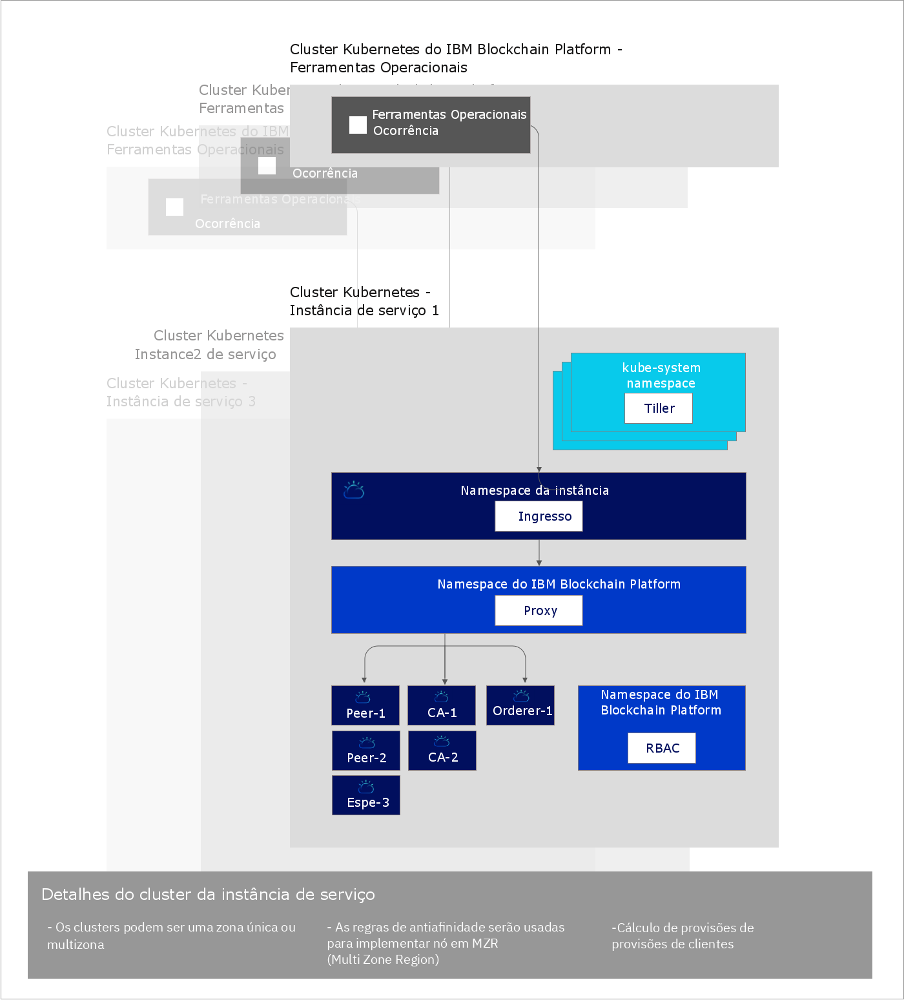

---

copyright:
  years: 2019
lastupdated: "2019-04-18"

subcollection: blockchain

---

{:new_window: target="_blank"}
{:shortdesc: .shortdesc}
{:screen: .screen}
{:codeblock: .codeblock}
{:note: .note}
{:important: .important}
{:tip: .tip}
{:pre: .pre}

# Sobre o  {{site.data.keyword.blockchainfull_notm}}  Platform free 2.0 beta
{: #ibp-console-overview}

O {{site.data.keyword.blockchainfull}} Platform free 2.0 beta é a próxima geração de ofertas do {{site.data.keyword.blockchainfull_notm}} Platform, que fornece controle total sobre suas implementações e chaves públicas e privadas. Esse beta grátis inclui o novo console do {{site.data.keyword.blockchainfull_notm}} Platform, uma interface com o usuário que pode simplificar e acelerar o processo de implementação de componentes em um {{site.data.keyword.cloud_notm}} Kubernetes Service gerenciado e controlado por você. Para obter mais informações sobre o Kubernetes e o {{site.data.keyword.cloud_notm}} Kubernetes Service, consulte [Kubernetes](/docs/services/blockchain/reference/k8s.html "Kubernetes").
{:shortdesc}

É possível fazer upgrade do {{site.data.keyword.blockchainfull_notm}} Platform free 2.0 beta para o código base do Hyperledger Fabric 1.4.0. Para obter mais informações sobre os novos recursos do Hyperledger Fabric 1.4.0, consulte [O que há de novo na 1.4 ](https://hyperledger-fabric.readthedocs.io/en/release-1.4/whatsnew.html "O que há de novo no Fabric 1.4"){:new_window}.

## O que o novo beta oferece
{: #ibp-console-overview-capabilities}

Essa liberação mais recente é customizada para usuários experientes do {{site.data.keyword.blockchainfull_notm}} e do Hyperledger Fabric e permite que eles hospedam redes ou criem novas organizações que possam se associar a outras redes do {{site.data.keyword.blockchainfull_notm}} 2.0. Se você for um cliente do Starter ou Enterprise Plan existente, em vez de o {{site.data.keyword.IBM_notm}} gerenciar sua rede, você terá agora o controle total com a capacidade de provisionar, monitorar e gerenciar seus componentes dentro de seu próprio cluster Kubernetes.

A liberação beta 2.0 grátis do {{site.data.keyword.blockchainfull_notm}} Platform inclui os recursos-chaves a seguir:

** Experiência do desenvolvedor integrado **
- **Codifique facilmente** os seus contratos inteligentes no Node.js, Golang ou Java, grave aplicativos clientes usando a nova extensão do {{site.data.keyword.blockchainfull_notm}} VSCode, alavanque a **Integração do SDK ** com o console e aprenda com os nossos ricos tutoriais e amostras.
- **DevOps simplificado** permite mover de desenvolvimento para testar para produção em um único ambiente, escalando para cima seus recursos do Kubernetes para incluir mais componentes.
- **Recursos-chave do Fabric atuais.** Alavanque os recursos mais recentes do Hyperledger Fabric v1.4:
  - [Coleções de **Dados privados**](/docs/services/blockchain/howto/ibp-console-smart-contracts.html#ibp-console-smart-contracts-private-data) que fornecem maior privacidade de dados, assegurando que os dados do livro-razão sejam compartilhados somente com o peers autorizados por meio do protocolo gossip.
  - [Descoberta de serviço ](https://hyperledger-fabric.readthedocs.io/en/release-1.4/discovery-overview.html "Descoberta de serviço"), permitindo que você descubra e atualize dinamicamente como seu aplicativo interage com sua rede.
  - [Listas de controle de acesso do canal ](https://hyperledger-fabric.readthedocs.io/en/release-1.4/access_control.html "Listas de controle de acesso") que permitem o controle adicional da governança de seu canais e contratos inteligentes.
- **Integração de serviço do {{site.data.keyword.cloud_notm}}.** Utilize os serviços integrados do {{site.data.keyword.cloud_notm}}, como o painel do serviço {{site.data.keyword.cloud_notm}} Kubernetes, o {{site.data.keyword.IBM_notm}} Log Analysis with LogDNA e o {{site.data.keyword.cloud_notm}} Identity and Access Management (IAM).

** Controle total de suas implementações **
- ** Implemente somente os componentes necessários **. Conectar um peer a múltiplos canais e redes ou hospede um serviço de solicitação ao qual os parceiros de negócios podem se conectar.
- ** Manter o controle completo de suas identidades **. Armazene e gerencie as chaves que são usadas para administrar seus nós sem armazenar suas chaves privadas no {{site.data.keyword.cloud_notm}}.
- **Operação centralizada**. O console do {{site.data.keyword.blockchainfull_notm}} Platform permite implementar e gerenciar todas as suas organizações e nós em **um console central** sem ter que depender da {{site.data.keyword.IBM_notm}} ou de outros fornecedores para gerenciar seus solicitadores ou Autoridades de certificação. Também é possível incluir ou remover membros de um consórcio de blockchain, criar e associar canais e instalar e instanciar contratos inteligentes por meio de seu console.
- **Hospedar ou se associar a uma rede**. Implemente peers hospedados em seu cluster para múltiplos canais em múltiplas nuvens ou convide outras organizações para associar seu consórcio ou canais enquanto as organizações gerenciam seus nós de forma independente entre as infraestruturas.
- **Gerencie o acesso** dos usuários que podem administrar ou monitorar seus nós.
- **Acesso direto aos logs** de seus nós por meio do serviço {{site.data.keyword.IBM_notm}} Kubernetes. Use o serviço {{site.data.keyword.cloud_notm}} Log Analysis ou um serviço de terceiro para extrair e analisar seus logs.
- **Interaja diretamente com seus pods do nó** usando o Painel do Kubernetes. Use o executável em seus pods e contêineres para executar comandos e atualizar certificados por meio da linha de comandos.

** Escalabilidade e flexibilidade **
- **Escolha seu cálculo.** Você tem a flexibilidade de decidir a quantia de CPU, de memória e de armazenamento que você deseja provisionar em seu cluster Kubernetes.
- **Escale** para cima e para baixo os recursos em seu cluster Kubernetes, pagando somente pelo que você precisa.
- **Recuperação de desastre e alta disponibilidade de multizona.** Essa opção duplica a sua implementação do Kubernetes entre zonas, ativando a alta disponibilidade (HA) de seus componentes e a recuperação de desastre (DR).  

Consulte este blog [ ](https://www.ibm.com/blogs/blockchain/2019/02/taking-the-next-step-towards-deploying-blockchain-anywhere "Taking the next step towards deploying blockchain for business anywhere") ao avançar para a próxima etapa para implementar o blockchain para negócios em qualquer lugar.  

Essa oferta é para usuários experientes do Fabric que desejam construir e gerenciar suas próprias redes. A capacidade de implementar uma rede inteira com um clique único está chegando em breve. Enquanto isso, para implementar uma rede com um clique que use uma configuração padrão, veja a nossa documentação sobre o [Starter Plan](/docs/services/blockchain/get_start_starter_plan.html#getting-started-with-starter-plan).

## Considerações
{: #ibp-console-overview-considerations}

Antes de implementar o console, assegure-se de que entenda as considerações a seguir:

- O {{site.data.keyword.blockchainfull_notm}} Platform free 2.0 beta é construído com o Hyperledger Fabric v1.4.0.
- Todos os peers implementados com o free 2.0 beta usam CouchDB como seu banco de dados de estado.
- Você tem a opção de usar um cluster Kubernetes gratuito para avaliação da oferta beta, no entanto, a capacidade e o desempenho são limitados, nenhum de seus dados pode ser migrado e o cluster é excluído depois de 30 dias.
- Você é responsável pelo gerenciamento do monitoramento de funcionamento, da segurança e da criação de log do cluster Kubernetes. Consulte essas [informações ](https://cloud.ibm.com/docs/containers/cs_responsibilities.html#your-responsibilities-by-using-ibm-cloud-kubernetes-service "Responsabilidades de gerenciamento de cluster") para obter detalhes sobre o que o {{site.data.keyword.cloud_notm}} gerencia e sobre o que é de sua responsabilidade.
- Você também é responsável por monitorar o uso de recursos de seu cluster Kubernetes usando o painel do Kubernetes. Se você precisar aumentar a capacidade de armazenamento ou o desempenho de seu cluster, consulte estas informações sobre como [modificar seu volume existente ](https://cloud.ibm.com/docs/containers/cs_storage_file.html#change_storage_configuration "Mudando o tamanho e o IOPS de seu dispositivo de armazenamento existente").
- Você é responsável por gerenciar e proteger seus certificados, suas chaves públicas e privadas. O {{site.data.keyword.IBM_notm}} não armazena seus certificados no cluster Kubernetes ou no console. Eles são mantidos somente no armazenamento local de seu navegador. Se você alternar navegadores, será necessário importar suas identidades criadas para esse navegador.
- A oferta beta grátis 2.0 está disponível apenas na região de **Dallas** do serviço do {{site.data.keyword.cloud_notm}} Kubernetes. Essa região inclui data centers em Dallas, São José, Houston e Brasil. Portanto, todos os componentes de blockchain podem residir em qualquer um desses quatro data centers. Eles não são implementados em outro lugar.
- Embora a oferta beta do {{site.data.keyword.blockchainfull_notm}} Platform 2.0 seja grátis, se você escolher um cluster Kubernetes pago em vez do cluster grátis limitado, isso incorrerá em encargos para a sua conta do {{site.data.keyword.cloud_notm}}.
- O Kubernetes deve ser a versão 1.11 ou mais recente no cluster Kubernetes do {{site.data.keyword.cloud_notm}}. Use estas instruções para [fazer upgrade de seus clusters novos e existentes](/docs/services/blockchain/howto/ibp-v2-deploy-iks.html#ibp-v2-deploy-iks-updating-kubernetes) para esta versão.

## Migração
{: #ibp-console-overview-migration}

Não é possível migrar de nenhuma oferta do {{site.data.keyword.blockchainfull_notm}} Platform para o {{site.data.keyword.blockchainfull_notm}} Platform free 2.0 **beta**.  

As instâncias de serviço do {{site.data.keyword.blockchainfull_notm}} Platform free 2.0 beta não serão migradas para a versão GA, nem as instâncias Starter ou Enterprise Plan serão migradas para a versão GA 2.0.

## Licença e precificação
{: #ibp-console-overview-license-and-pricing}

{{site.data.keyword.blockchainfull_notm}}  O beta free 2.0 da plataforma 2.0 está livre. Uma instância do console é incluída com cada implementação da plataforma em um cluster do {{site.data.keyword.cloud_notm}} Kubernetes Service. Será necessário pagar pelo cluster Kubernetes se você escolher implementar o console em um cluster padrão do {{site.data.keyword.cloud_notm}} Kubernetes Service.

## Iniciar
{: #ibp-console-overview-deploy}

Uma instância do console é implementada em um cluster do {{site.data.keyword.IBM_notm}} Kubernetes Service como parte da implementação de cada instância do beta 2.0 grátis do {{site.data.keyword.blockchainfull_notm}} Platform.

Para obter mais informações sobre como implementar o console e a plataforma, veja [Introdução ao beta 2.0 grátis do {{site.data.keyword.blockchainfull_notm}} Platform](/docs/services/blockchain/howto/ibp-v2-deploy-iks.html#ibp-v2-deploy-iks).

Para obter mais informações sobre como usar o console para começar a implementar nós e construir o consórcio, veja o tutorial [Construindo sua rede](/docs/services/blockchain/howto/ibp-console-build-network.html#ibp-console-build-network). Este tutorial guiará você pelo processo de uso do console para criar uma rede de amostra com três organizações, uma organização de pedido, duas organizações de peer e um canal com dois peers associados a ele. É possível usar a rede de amostra para implementar demos ou provas de conceito ou ajustar e expandir as etapas no tutorial para criar sua própria configuração.

## Referência de arquitetura
{: #ibp-console-overview-architecture}

A ilustração a seguir mostra os componentes de sua rede de blockchain e como eles interagem.

*Figura 1. Referência de arquitetura*

Observe como uma única instância do console, conhecido como Conjunto de ferramentas operacionais, é criada para cada Instância de serviço do {{site.data.keyword.blockchainfull_notm}} Plataform. Quando um nó de peer, solicitador ou CA é implementado usando o console, ele é implementado na **Instância de serviço de cluster Kubernetes**.

| **Cluster Kubernetes do IBM Blockchain Platform** | **Descrição** |
| ------------------------- |-----------|
| Ferramentas Operacionais | Conhecida como `console`, essa é a interface com o usuário central para operar todos os componentes de blockchain. Com esse console, agora é possível criar nós de CA, peer e solicitador, criar canais e instalar e instanciar contratos inteligentes desenvolvidos com a extensão do Hyperledger Fabric v1.4 VSCode. O console é implementado em um cluster pertencente à {{site.data.keyword.IBM_notm}}.|


| **Instância de serviço de cluster Kubernetes** | **Descrição** |
| ------------------------- |-----------|-----------|-----------|
| **Tiller** | Parte do [Conjunto de ferramentas do Helm ](https://docs.helm.sh/glossary/#tiller "Tiller"), o Tiller é executado dentro do cluster Kubernetes para gerenciar as instalações de seus gráficos do Helm de peer, CA e solicitador. |
| **Ingresso** | Um [Objeto do Kubernetes ](https://kubernetes.io/docs/concepts/services-networking/ingress/ "Ingresso") que permite acesso aos recursos de cluster de fora do cluster. |
| **Proxy** | O proxy do {{site.data.keyword.blockchainfull_notm}} Platform é responsável por rotear o tráfego para os nós de peer, CA e solicitador corretos usando o roteamento de cabeçalho do host. |
| **Peers, CAs, solicitadores** | Esses são os nós que são criados implementando os gráficos do Helm subjacentes. Nota: esses nós também poderiam ser importados de outras Instâncias de serviço de cluster Kubernetes. Como as chaves nunca são armazenadas pelo {{site.data.keyword.IBM_notm}}, cada nó de peer e solicitador inclui um proxy da web gRPC que permite que o console se comunique com cada nó usando as chaves na carteira eletrônica do console. |
| **RBAC** | Controle de acesso baseado na função.  O {{site.data.keyword.blockchainfull_notm}} Platform configura o [RBAC do Kubernetes ](https://kubernetes.io/docs/reference/access-authn-authz/rbac/ "Usando a autorização RBAC") no cluster que é necessário para gerenciar componentes de blockchain no cluster.  |

## Alta Disponibilidade (HA) e Recuperação de Desastre (DR)
{: #ibp-console-overview-hadr}

O armazenamento de multizona deverá ser ativado em seu cluster do IBM Cloud Kubernetes pago se você requerer o HA e o DR. Há uma variedade de [Opções de armazenamento do Kubernetes](https://cloud.ibm.com/docs/containers/cs_storage_planning.html#persistent_storage_overview) disponíveis. Em breve, o IBM Cloud suportará a solução de armazenamento Portworx, que é a solução recomendada. Até lá, se o HA e o DR forem necessários para sua implementação, você precisará trazer sua própria solução de armazenamento.  

Para incluir sua própria solução de armazenamento, será necessário criar uma classe de armazenamento customizada. Leia sobre como
[incluir uma classe de armazenamento](https://cloud.ibm.com/docs/containers/cs_storage_basics.html#storageclasses) para sua solução. O {{site.data.keyword.blockchainfull_notm}} Platform usa o [provisionamento de volume dinâmico](https://cloud.ibm.com/docs/containers/cs_storage_basics.html#dynamic_provisioning) com a classe de armazenamento `default`. Portanto, para mudar a classe de armazenamento padrão, execute o comando a seguir:
```
kubectl patch storageclass <storageclass> -p '{"metadata": {"annotations":{"storageclass.kubernetes.io/is-default-class":"true"}}}'
```
{:codeblock}

Substitua ``<storageclass>`` pelo nome de sua classe de armazenamento.  

Por fim, certifique-se de ativar as regiões de multizona quando você criar seu cluster pago.

## Obtendo Suporte
{: #ibp-console-overview-support}

Para obter mais informações sobre como obter suporte no {{site.data.keyword.blockchainfull_notm}} Platform 2.0, bem como recursos grátis de desenvolvedor de blockchain e fóruns de suporte que podem ser usados para solucionar problemas, veja [Obtendo suporte](/docs/services/blockchain/ibmblockchain_support.html#blockchain-support).

O suporte para o {{site.data.keyword.blockchainfull_notm}} Platform 2.0 será limitado durante o período beta.
{: important}
