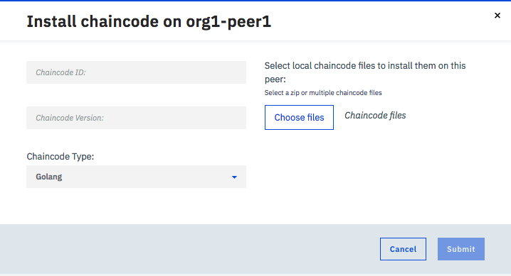

---

copyright:
  years: 2017
lastupdated: "2017-08-14"
---

{:new_window: target="_blank"}
{:shortdesc: .shortdesc}
{:codeblock: .codeblock}
{:screen: .screen}
{:pre: .pre}

# Instalando e instanciando um chaincode

O chaincode é um software, gravado em Go ou Java, que encapsula a lógica de negócios e as instruções transacionais
para criar e modificar ativos no livro razão. Um chaincode é executado em um contêiner do docker que está associado a qualquer peer que precise interagir com ele. Para obter mais informações sobre como desenvolver chaincodes, consulte [Tutoriais de Chaincode ](http://hyperledger-fabric.readthedocs.io/en/latest/chaincode.html).
{:shortdesc}

O Chaincode primeiro é instalado no sistema de arquivos de um peer e, em seguida, instanciado em um canal. Todos os membros do canal precisam instalar o chaincode em cada peer que executará esse chaincode. Para usar o mesmo chaincode, os membros do canal devem dar ao chaincode o mesmo nome e a mesma versão durante a instalação do chaincode. A etapa de instanciação envolve a inicialização de pares de valores de chave e a implementação do contêiner de chaincode. Qualquer peer, por meio do qual os aplicativos interagirão com um chaincode, deve ter o chaincode instalado no sistema de arquivos do peer e ter um contêiner de chaincode em execução. No entanto, se um peer usa o mesmo chaincode em múltiplos canais, ele precisa apenas de uma única instância do contêiner de chaincode.  

A combinação de instalação e instanciação é um recurso poderoso, pois permite que um peer interaja com o mesmo contêiner de chaincode em múltiplos canais. O único pré-requisito é para que os arquivos de origem de chaincode reais sejam instalados no sistema de arquivos do peer. Dessa forma, se um pedaço de chaincode comum estivesse sendo usado em vários canais, um peer precisaria apenas de um único contêiner de chaincode para executar leituras/gravações em todos os livros razão do canal. Essa abordagem leve se mostra benéfica para o desempenho e o rendimento computacionais à medida que as redes são escaladas e o chaincode se torna mais elaborado.  

## Instalando um chaincode
Deve-se instalar o chaincode em cada peer que executará esse chaincode. Conclua as etapas a seguir para instalar um chaincode:
1. Na tela "Chaincode" de seu Monitor de Rede, selecione um peer na lista suspensa no qual instalar o chaincode. Clique no botão **Instalar chaincode**.
  
  
2. No painel pop-up **Instalar chaincode**, insira o nome e a versão de seu chaincode. **Observe** que as cadeias de nome e versão serão usadas em aplicativos para interagir com os chaincodes instalados. Clique no botão **Procurar** e navegue por seu sistema de arquivos local até onde seus campos de origem de chaincode estão armazenados. Selecione um ou mais arquivos de origem de chaincode para instalar no peer. Este exemplo mostra um arquivo de origem de chaincode `fabcar.go` com um nome `Chaincode1` e uma versão `v001`, que deve ser instalado no peer `fabric-peer-org2-17439a`.

## Instancie um chaincode
Após um chaincode ser instalado no sistema de arquivos de cada peer se que associa a um canal, o chaincode deverá, então, ser instanciado no canal para que os peers possam interagir com o livro razão por meio do contêiner de chaincode. A instanciação executa qualquer inicialização necessária do chaincode. Muitas vezes isso envolve a configuração dos pares de valores de chave que constituem o estado geral inicial do chaincode.  

Você precisa ter a autoridade de **Operador** ou **Escritor** no canal para instanciar o chaincode. O chaincode que tem o mesmo nome e versão em peers diferentes precisa ser instanciado apenas uma vez para implementar o contêiner de chaincode. Conclua as etapas a seguir para instanciar um chaincode:
1. Na tela "Chaincode" de seu Monitor de Rede, selecione o peer no qual você instalou o chaincode e localize o chaincode que você deseja instanciar na tabela. Em seguida, clique no botão **Instanciar** sob o cabeçalho **Ação**.  
    
  
2. No painel pop-up **Instanciar chaincode**, configure os pares chave-valor como argumentos para a inicialização do chaincode e selecione o canal no qual instanciar. Clique em **Enviar**.
   
