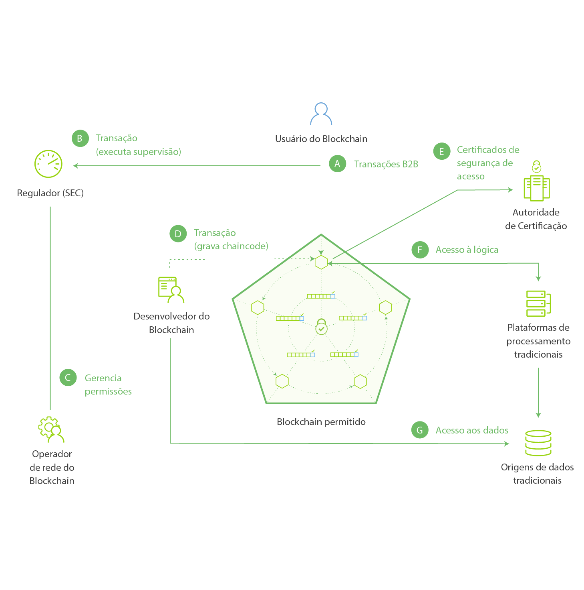

---

copyright:
  years: 2016, 2017
lastupdated: "2017-07-28"
---

{:new_window: target="_blank"}
{:shortdesc: .shortdesc}
{:codeblock: .codeblock}
{:screen: .screen}
{:pre: .pre}

# Configurações básicas do blockchain
{: #ibmblockchain_overview}

O blockchain é uma tecnologia de livro razão distribuída (DLT) que aperfeiçoa os processos de negócios estabelecendo novos níveis de confiança, de prestação de contas e de transparência para uma nova geração de aplicativos transacionais. A rede de blockchain foi primeiramente apresentada ao mercado para trocas de bitcoins, mas seus usos práticos se estendem muito além das transações de criptomoedas. Em conjunto com o Hyperledger Project da Linux Foundation, o {{site.data.keyword.blockchainfull}} está reinventando as trocas de negócios mais fundamentais, abrindo a porta para um novo mundo de interações digitais.

O {{site.data.keyword.blockchain}} reduz o custo e a complexidade de transações entre empresas por meio da criação de redes eficientes e altamente seguras na qual praticamente qualquer coisa de valor pode ser controlada e negociada, sem a dependência de um ponto de controle centralizado. No mundo das finanças, as redes de blockchain podem permitir que comércios de valores mobiliários sejam liquidados em minutos em vez de dias. No mundo do comércio, essas redes podem facilitar o gerenciamento da cadeia de suprimentos e permitir que o fluxo de mercadorias e pagamentos seja rastreado e registrado em tempo real. 

## Visão geral da rede de blockchain

Em uma rede de {{site.data.keyword.blockchain}}, os registros de transações de rede são mantidos em um livro razão compartilhado que é replicado entre todos ou um subconjunto de membros de rede (livros razão existem no escopo de um canal, portanto, se o peer de um membro não estiver inscrito em um canal, ele não terá as transações desse canal). Os registros de todas as transações, válidos e inválidos, são registrados em blocos e anexados à cadeia hash (ou seja, blockchain) para cada canal.  As transações válidas atualizarão o banco de dados de estado do mundo, enquanto uma transação inválida não atualizará. Chaincodes (também conhecidos como "contratos inteligentes") são as partes de software que contêm um conjunto de funções que permitem que sejam feitas leituras e gravações no livro razão.  Os aplicativos do lado do cliente alavancam um SDK para criar interface com um peer ou peers e, por fim, chamar funções em um chaincode específico.  Há duas APIs do Fabric principais que permitem que um chaincode realize leitura ou gravação - `getState` e `putState`.

**Figura 1** descreve um exemplo de rede de blockchain com permissão, que apresenta uma arquitetura de ponto a ponto distribuída e descentralizada e uma Autoridade de Certificação que gerencia funções de usuário e permissões:

*Figura 1. Uma rede de blockchain com permissão: o fluxo de dados e o acesso de rede são governados por funções de membro*

As descrições a seguir correspondem à arquitetura e ao fluxo mostrados na Figura 1 (nota: elas não representam um processo sequencial):

**A:** um Usuário do Blockchain envia uma transação à rede de Blockchain. A transação pode ser uma implementação, chamada ou consulta e é emitida por meio de um
aplicativo do lado do cliente que alavanca um SDK ou diretamente por meio de uma API REST.  

**B:** redes de negócio confiáveis fornecem acesso a reguladores e auditores (a SEC em um mercado de ações dos EUA, por exemplo).  

**C:** um Operador de Rede de Blockchain gerencia permissões de membro, como a inscrição do Regulador (B) como um "auditor" e do Usuário do Blockchain (A) como um "cliente". Um auditor poderia ser restringido a apenas consultar o livro razão, enquanto um cliente poderia ser autorizado a implementar, chamar e consultar determinados tipos de chaincode. 

**D:** um Desenvolvedor do Blockchain grava chaincode e aplicativos do lado do cliente. O Desenvolvedor do Blockchain pode implementar o chaincode diretamente na rede por meio de uma interface REST. Para incluir credenciais de uma origem de dados tradicional no chaincode, o desenvolvedor poderia usar uma conexão fora da banda para acessar os dados (G). 

**E:** um usuário do Blockchain se conecta à rede por meio de um nó peer (A). Antes de continuar com quaisquer transações, o nó recupera a inscrição do usuário e certificados de
transação da Autoridade de certificação. Os usuários devem possuir esses certificados digitais para transacionar em uma rede com permissão.

**F:** pode ser solicitado que um usuário que tenta direcionar o chaincode verifique suas credenciais em uma origem de dados tradicional (G). Para confirmar a autorização do usuário, o chaincode pode usar uma conexão fora da banda para esses dados por meio de uma plataforma de processamento tradicional.
