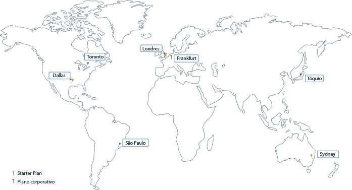

---

copyright:
  years: 2017, 2018
lastupdated: "2019-04-03"

subcollection: blockchain

---

{:new_window: target="_blank"}
{:shortdesc: .shortdesc}
{:screen: .screen}
{:pre: .pre}
{:table: .aria-labeledby="caption"}
{:codeblock: .codeblock}
{:tip: .tip}
{:download: .download}

# {{site.data.keyword.blockchainfull_notm}}  Locais da plataforma
{: #ibp-regions-locations}

O {{site.data.keyword.cloud}}  é hospedado em todo o mundo em vários locais. Locais são data centers em uma área geográfica que é acessada por um terminal. O {{site.data.keyword.blockchainfull_notm}} Platform oferece planos de associação dentro do {{site.data.keyword.cloud_notm}} globalmente em locais diferentes. Quando você cria a instância de serviço do {{site.data.keyword.blockchainfull_notm}} Platform no {{site.data.keyword.cloud_notm}}, sua rede de blockchain e os recursos de rede são criados e armazenados no local do {{site.data.keyword.cloud_notm}} no qual você cria a instância de serviço.
{:shortdesc}

Diferentes ofertas do {{site.data.keyword.blockchainfull_notm}} Platform estão disponíveis em diferentes locais do {{site.data.keyword.cloud_notm}}. É possível criar redes de blockchain somente em locais do {{site.data.keyword.cloud_notm}} em que os planos do {{site.data.keyword.blockchainfull_notm}} Platform estão disponíveis.

A Tabela 1 e a Figura 1 mostram as regiões e os locais do {{site.data.keyword.cloud_notm}} suportados pelo {{site.data.keyword.blockchainfull_notm}} Platform.

| Localização | Starter Plan | Plano corporativo |
|--------|----------|----------|
| Dallas | S | S |
| Londres | S | S |
| Tóquio |  | S |
| Frankfurt |  | S |
| Sydney | S |  |
| Melbourne |  | S |
| São Paulo |  | S |
| Toronto |  | S |

_Tabela 1. {{site.data.keyword.blockchainfull_notm}} Locais da plataforma_

  
_Figura 1. {{site.data.keyword.blockchainfull_notm}} Locais da plataforma_
