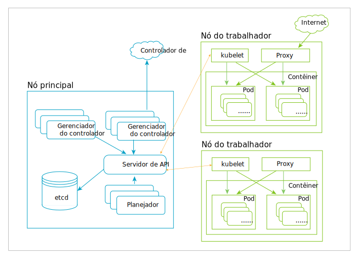

---

copyright:
  years: 2019
lastupdated: "2019-03-20"

subcollection: blockchain

---

{:new_window: target="_blank"}
{:shortdesc: .shortdesc}
{:screen: .screen}
{:codeblock: .codeblock}
{:note: .note}
{:important: .important}
{:tip: .tip}
{:pre: .pre}

# Kubernetes
{: #k8s-overview}

O console do {{site.data.keyword.blockchainfull_notm}} Platform free 2.0 beta é implementado em um cluster Kubernetes por meio do {{site.data.keyword.cloud_notm}} Kubernetes Service. Kubernetes é um sistema de software livre para automatizar a implementação, ajuste de escala e gerenciamento de aplicativos
conteinerizados.
{:shortdesc}

O Kubernetes fornece um ambiente de gerenciamento centralizado em contêiner. Ele orquestra a computação, a rede e a infraestrutura de armazenamento em nome de cargas de trabalho do usuário. Isso fornece muito da simplicidade da Plataforma como serviço (PaaS) com a flexibilidade da Infraestrutura como serviço (IaaS) e possibilita a portabilidade entre provedores de infraestrutura.

O diagrama a seguir explica a arquitetura do Kubernetes. Para obter mais explicações sobre nós, contêineres e pod, consulte a seção [Objetos principais do Kubernetes](#k8s-overview-key-obj) abaixo.

*Figura 1. Diagrama de arquitetura do Kubernetes*

## {{site.data.keyword.cloud_notm}} Kubernetes Service
{: #k8s-overview-iks}

O {{site.data.keyword.cloud_notm}} Kubernetes Service entrega ferramentas poderosas combinando contêineres do Docker, a tecnologia do Kubernetes, uma experiência do usuário interativa e segurança e isolamento integrados para automatizar a implementação, a operação, o ajuste de escala e o monitoramento de apps conteinerizados em um cluster de hosts de cálculo.

Para obter mais informações sobre o {{site.data.keyword.cloud_notm}} Kubernetes Service, consulte os tópicos a seguir na documentação do {{site.data.keyword.cloud_notm}} Kubernetes Service:
- [Tecnologia do {{site.data.keyword.cloud_notm}} Kubernetes Service ](https://cloud.ibm.com/docs/containers/cs_tech.html#ibm-cloud-kubernetes-service-technology "Documentação da tecnologia do {{site.data.keyword.cloud_notm}} Kubernetes Service")
- [Por que o {{site.data.keyword.cloud_notm}} Kubernetes Service ](https://cloud.ibm.com/docs/containers?topic=containers-cs_ov#cs_ov "Documentação Por que o {{site.data.keyword.cloud_notm}} Kubernetes Service")

## Objetos principais do Kubernetes
{: #k8s-overview-key-obj}

- **Cluster**

  Um conjunto de máquinas, nós chamados, que executam aplicativos conteinerizados gerenciados pelo Kubernetes. Um cluster tem vários nós do trabalhador e pelo menos um nó principal.

- **Nó**

  Um nó é uma máquina do trabalhador no Kubernetes. Um nó pode ser uma VM ou máquina física, dependendo do cluster. Cada nó contém os serviços necessários para executar pods e é gerenciado pelos componentes principais. Os serviços em um nó incluem o tempo de execução do contêiner, `kubelet` e `kube-proxy`. Para obter mais informações, consulte a [seção Nó do Kubernetes ](https://kubernetes.io/docs/concepts/architecture/nodes/ "seção Nó do Kubernetes") na documentação do Kubernetes.

- **Contêiner**

  Uma imagem executável leve e móvel que contém o software e todas as suas dependências. Os contêineres desacoplam aplicativos da infraestrutura de host subjacente para tornar a implementação mais fácil em ambientes de nuvem ou S.O. diferentes e para um ajuste de escala mais fácil.

- **Pod**

  O menor e mais simples objeto do Kubernetes. Um Pod representa um conjunto de contêineres em execução em seu cluster. Um Pod geralmente é configurado para executar um único contêiner primário. Ele também pode executar contêineres sidecar opcionais que incluem recursos complementares, como criação de log. Os pods são comumente gerenciados por uma Implementação. Para obter mais informações, consulte a [seção Pod do Kubernetes ](https://kubernetes.io/docs/concepts/workloads/pods/pod/) na documentação do Kubernetes.
