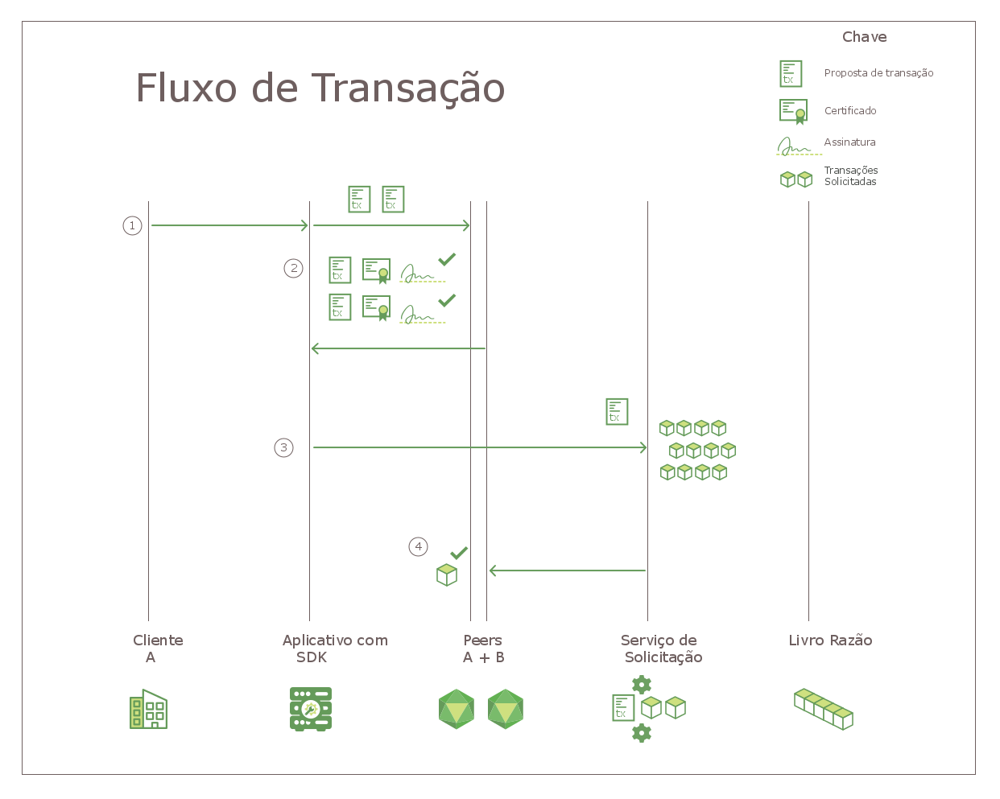

---

copyright:
  years: 2017, 2018
lastupdated: "2018-06-14"
---

{:new_window: target="_blank"}
{:shortdesc: .shortdesc}
{:codeblock: .codeblock}
{:screen: .screen}
{:pre: .pre}

# Hyperledger Fabric
A rede do {{site.data.keyword.blockchainfull}} é construída na pilha do Hyperledger Fabric, um dos projetos de blockchain dentro do Hyperledger Project da Linux Foundation.  Ela é uma rede "com permissão" na qual todos os usuários e componentes têm identidades conhecidas.  A lógica de assinatura/verificação é implementada em cada ponto de contato de comunicação e as transações são consentidas por meio de uma série de verificações de endosso e validação.  Nesse sentido, isso difere grandemente das implementações de blockchain tradicionais que promovem o anonimato e são forçadas a depender de criptomoedas e obrigações de cálculo intenso para validar transações.  
{:shortdesc}

O Hyperledger Fabric oferece uma arquitetura modular para estender a escalabilidade e o desempenho.  Este tópico apresenta alguns componentes chave no Hyperledger Fabric.  Para obter uma introdução completa sobre o Hyperledger Fabric, veja [Documentação do Hyperledger Fabric ](http://hyperledger-fabric.readthedocs.io/en/latest/){:new_window}.  

## Autoridade de Certificação  
Como uma plataforma para redes de blockchain **com permissão**, o Hyperledger Fabric inclui um componente de **Autoridade de Certificação (CA)** modular para gerenciar as identidades de rede de todas as organizações de membros e seus usuários. O requisito para uma identidade com permissão para cada usuário permite o controle baseado em ACL na atividade de rede e garante que cada transação seja basicamente rastreável para um usuário registrado.  
* A CA (CA do Fabric, por padrão) emite um certificado raiz (**rootCert**) para cada **membro** (organização ou indivíduo) que está autorizado a se associar à rede.
* A autoridade de certificação também emite um certificado de inscrição (**eCert**) para cada componente de membro, aplicativo do lado do servidor e ocasionalmente usuário.
* Cada usuário inscrito também recebe uma alocação de certificados de transação (**tCerts**).  Cada **tCert** autoriza uma transação de rede.

Este controle baseado em certificado sobre a associação de rede e ações permite que os membros restrinjam o acesso a canais, aplicativos e dados privados e confidenciais, por identidades do usuário específicas.

Para obter mais informações sobre o componente Hyperledger Fabric Certificate Authority, consulte [Guia do Usuário do Fabric CA ](http://hyperledger-fabric-ca.readthedocs.io/en/latest/){:new_window}.

## Membership Service Provider  
O Hyperledger Fabric inclui um componente **Membership Service Provider (MSP)** para oferecer uma abstração de todos os mecanismos de criptografia e protocolos atrás da emissão e validação de certificados, e autenticação do usuário.  O MSP é instalado em cada peer de canal para assegurar que as solicitações de transação que são emitidas para o peer se originem de uma identidade do usuário autenticada e autorizada.

Para obter mais informações sobre o componente do Hyperledger Fabric Membership Services Provider, veja *[Membership Service Providers (MSP) ](http://hyperledger-fabric.readthedocs.io/en/latest/msp.html){:new_window}* na [Documentação do Hyperledger Fabric](http://hyperledger-fabric.readthedocs.io/en/latest/){:new_window}.

## Fluxo de Transação  
Para assegurar a consistência e a integridade de dados, o Hyperledger Fabric implementa múltiplos pontos de verificação em todo o fluxo de transação, incluindo autenticação de cliente, endosso, solicitação e confirmação no livro-razão.

**Figura 1** descreve o fluxo de transação em uma rede de blockchain do Hyperledger Fabric:

*Figura 1. Fluxo de transação em uma rede do Hyperledger Fabric*

Em uma rede do Hyperledger Fabric, o fluxo de dados para consultas e transações é iniciado por um aplicativo do lado do cliente enviando uma solicitação de transação a um peer em um canal. O fluxo inicial de dados na rede é comum para as consultas e transações:

1. Usando a API `channel.SendTransactionProposal` disponível no SDK, um aplicativo cliente assina e envia uma proposta de transação aos peers de aprovação apropriados no canal especificado.  Esta proposta de transação inicial é uma **solicitação** para endosso.  
2. Cada peer no canal verifica a identidade e a autoridade do cliente de envio e (se válido) executa o chaincode especificado nas entradas fornecidas (chave/vals).  Com base nos resultados da transação e na Política de Endosso para o chaincode chamado, cada peer retorna uma resposta SIM ou NÃO assinada ao aplicativo.  Cada resposta SIM assinada é um **endosso** da transação.

	Neste ponto, no fluxo de transação, o processo diverge para consultas e transações.  Se a proposta chamou uma função de consulta no chaincode, o aplicativo retorna os dados ao cliente.  Se a proposta chamou uma função no chaincode para atualizar o livro-razão, o aplicativo continua com as etapas a seguir:  
3. O aplicativo encaminha a transação (conjunto de leitura/gravação e endossos) para **serviço de solicitação** de rede.  
4. A transação é, então, retransmitida para o tópico de partição do canal no cluster do Kafka para solicitação.  Todos os peers de canal validam cada transação no bloco aplicando a Política de Validação específica do chaincode e executando uma Verificação de Versão de Controle de Simultaneidade.  
	* Quaisquer transações que falham no processo de validação são marcadas como inválidas no bloco e o bloco é anexado à hashchain do canal.  
	* Todas as transações válidas atualizam o banco de dados do estado de acordo com os pares chave/valor modificados.  

O **protocolo de disseminação de dados por boatos** transmite continuamente os dados de livro-razão no canal para garantir livros-razão sincronizados entre os peers.  Para obter mais informações, consulte *[Gossip data dissemination protocol ](http://hyperledger-fabric.readthedocs.io/en/latest/gossip.html){:new_window}* na [Documentação do Hyperledger Fabric ](http://hyperledger-fabric.readthedocs.io/en/latest/){:new_window}.

Para obter uma introdução passo a passo sobre o fluxo de transação, consulte *[Fluxo de Transação ](http://hyperledger-fabric.readthedocs.io/en/latest/txflow.html){:new_window}* na [Documentação do Hyperledger Fabric ](http://hyperledger-fabric.readthedocs.io/en/latest/){:new_window}.  

## Serviço de Solicitação
O Hyperledger Fabric inclui um serviço baseado em Kafka para solicitar e transmitir transações de rede. O Kafka também fornece tolerância a falhas e travamento à sua rede; o que significa que, se um número aceitável de nós de serviço de solicitação estiver indisponível, o serviço continuará solicitando e distribuindo blocos de transações para peers do canal.

Os aplicativos do lado do cliente chamam a API 'channel.sendTransaction' para encaminhar transações endossadas ao serviço de solicitação. Os nós de serviço de solicitação, então, usam o serviço do Kafka e o seu servidor ZooKeeper associado, para pedir as transações em um bloco. O bloco ordenado de transações é, eventualmente, "entregue" aos peers de canal, para validação e confirmação no livro-razão.

Os nós de serviço de solicitação também fornecem os serviços a seguir:
1. Autenticação de clientes
2. Manutenção de uma cadeia do sistema que define as configurações de serviço de solicitação, certificados raiz e IDs do MSP para organizações autenticadas e um agrupamento de perfis contendo os vários consórcios dentro da rede.
3. Filtragem e validação das transações de configuração que reconfiguram ou criam um canal.  

Para obter mais informações sobre o serviço de solicitação do Hyperledger Fabric, veja *[Apresentando um serviço de solicitação baseado em Kafka ](http://hyperledger-fabric.readthedocs.io/en/latest/kafka.html){:new_window}* na [Documentação do Hyperledger Fabric ](http://hyperledger-fabric.readthedocs.io/en/latest/){:new_window}.

## SDKs do HFC
Os SDKs do Hyperledger Fabric Client (HFC) permitem que desenvolvedores de aplicativos construam aplicativos que interajam com uma rede de blockchain. O SDK do HFC ajuda a facilitar aplicativos para gerenciar o ciclo de vida de canais e chaincode.

O Hyperledger Fabric entrega O SDK do Node.js e o SDK do Java e fornece as funções a seguir para interagir com a rede de blockchain:
* Registre e inscreva usuários
* Crie canais
* Associe peers a um canal
* Atualize a configuração do canal do sistema ou do canal do aplicativo
* Instalar chaincode em peers
* Instanciar chaincode em um canal
* Faça upgrade em um canal
* Chame as funções de chaincode para atualizar o livro-razão
* Consulte o livro-razão para transações, blocos ou chaves específicos
* Monitore eventos em um canal (por exemplo, confirmação bem-sucedida de uma transação)

Para obter mais informações sobre os SDKs do HFC, consulte *[SDKs do Hyperledger Fabric ](http://hyperledger-fabric.readthedocs.io/en/latest/fabric-sdks.html){:new_window}* na [Documentação do Hyperledger Fabric ](http://hyperledger-fabric.readthedocs.io/en/latest/){:new_window}.
