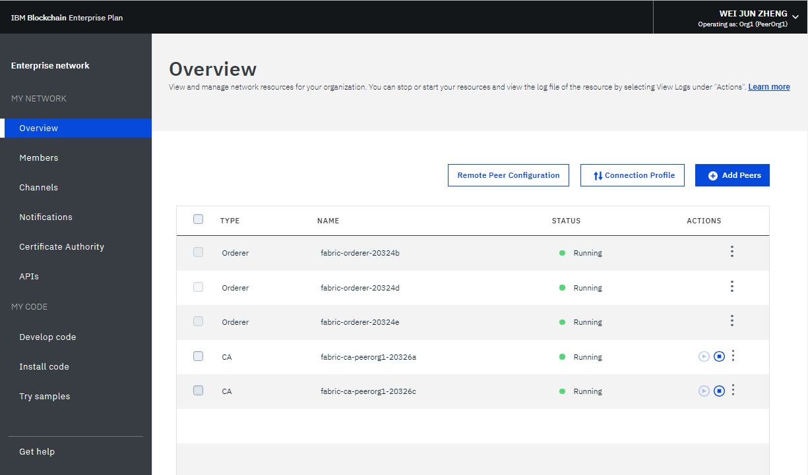
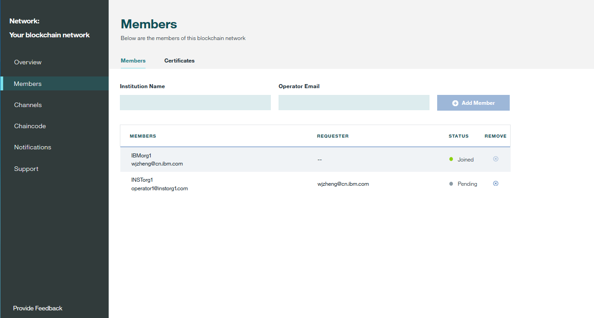
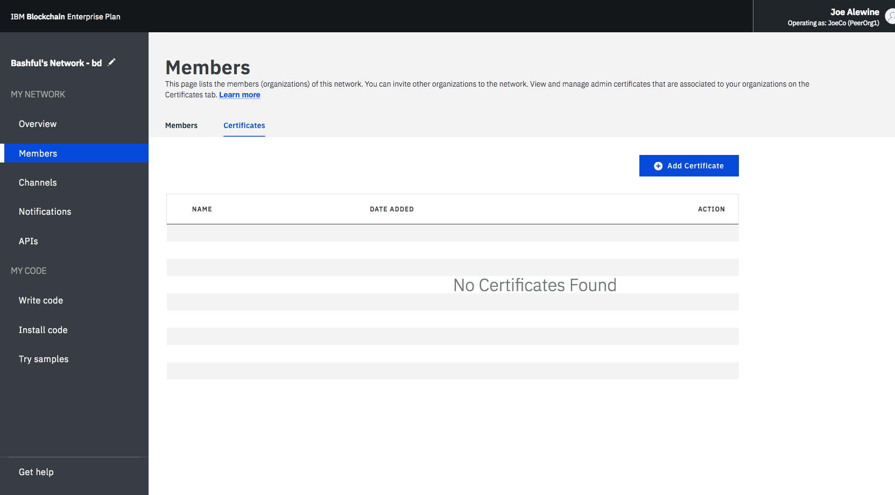
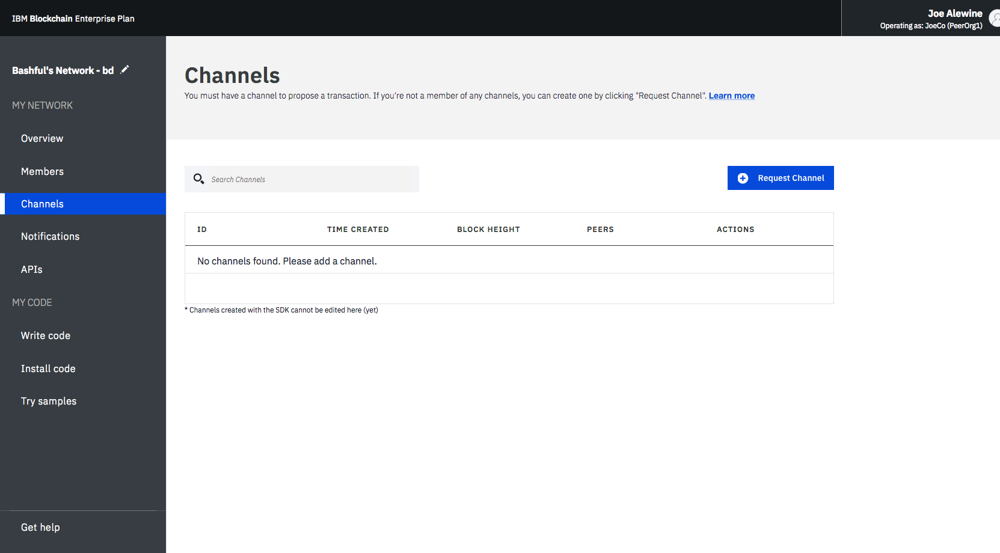
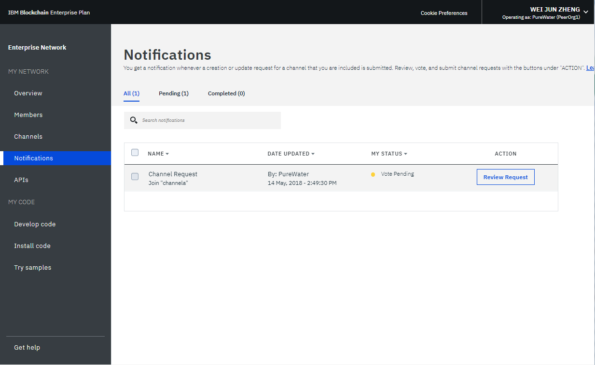
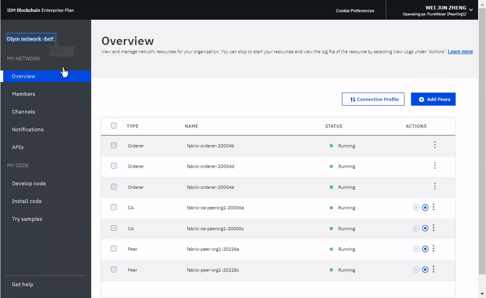
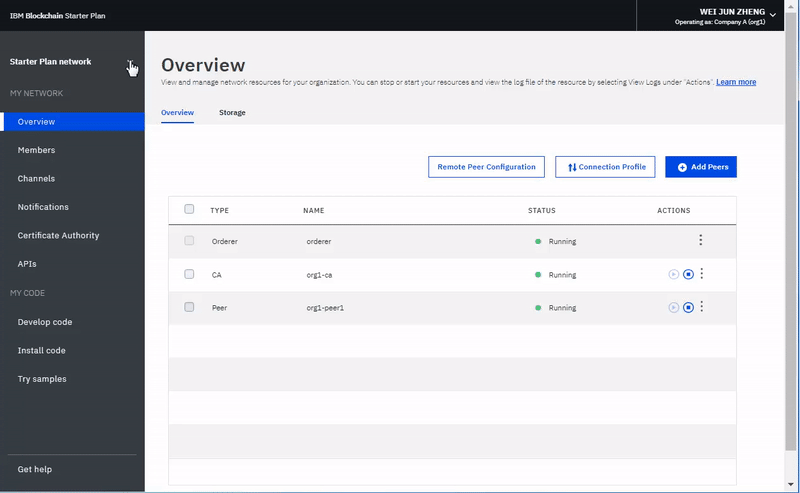

---

copyright:
  years: 2017, 2019
lastupdated: "2019-02-08"

---

{:new_window: target="_blank"}
{:shortdesc: .shortdesc}
{:codeblock: .codeblock}
{:screen: .screen}
{:pre: .pre}
{:note: .note}
{:important: .important}
{:tip: .tip}

# Usando o monitor de rede
{: #ibp-dashboard}

***[Esta página é útil? Diga-nos.](https://www.surveygizmo.com/s3/4501493/IBM-Blockchain-Documentation)***

O {{site.data.keyword.blockchainfull}} Platform traz um Monitor de rede para fornecer uma visão geral de seu ambiente de blockchain, incluindo recursos de rede, membros, canais associados, dados de desempenho da transação e chaincode implementado. O Monitor de rede também oferece a você o ponto de entrada para executar APIs do Swagger, desenvolver uma rede com o {{site.data.keyword.blockchainfull_notm}} Platform e tentar aplicativos de amostra.
{:shortdesc}

Use este tutorial para aprender como usar o Monitor de Rede para operar uma rede Enterprise Plan ou Starter Plan. Embora a maioria das capturas de tela no tutorial sejam para o Enterprise Plan, as instruções também são válidas para o Starter Plan. Quando determinados recursos estão acessíveis apenas para um plano, a seção relevante é rotulada com **para redes do Starter Plan** ou **para redes do Enterprise Plan**.

## Área de janela de navegação esquerda
{: #ibp-dashboard-left-navigation}

O Monitor de rede expõe as telas a seguir em três seções. É possível navegar para cada tela do navegador esquerdo no Monitor de rede.
- A seção **Minha rede** contém as telas "[Visão geral](/docs/services/blockchain/v10_dashboard.html#ibp-dashboard-overview)", "[Membros](/docs/services/blockchain/v10_dashboard.html#ibp-dashboard-members)", "[Canais](/docs/services/blockchain/v10_dashboard.html#ibp-dashboard-channels)", "[Notificações](/docs/services/blockchain/v10_dashboard.html#ibp-dashboard-notifications)", "[Autoridade de certificação](/docs/services/blockchain/v10_dashboard.html#ibp-dashboard-ca)" e "[APIs](/docs/services/blockchain/v10_dashboard.html#ibp-dashboard-apis)".
- A seção **Meu código** contém as telas "[Desenvolver código](/docs/services/blockchain/v10_dashboard.html#ibp-dashboard-write_code)", "[Instalar código](/docs/services/blockchain/v10_dashboard.html#ibp-dashboard-chaincode)" e "[Tentar amostras](/docs/services/blockchain/v10_dashboard.html#ibp-dashboard-samples)".
- A tela "[Obter ajuda](/docs/services/blockchain/v10_dashboard.html#ibp-dashboard-support)" mostra informações de suporte, assim como as notas sobre a liberação para helios e Hyperledger Fabric (a base de código na qual o {{site.data.keyword.blockchainfull_notm}} Platform é baseado).

O nome de sua rede de blockchain está na parte superior da área de janela de navegação esquerda. É possível [mudar o nome de sua rede](/docs/services/blockchain/v10_dashboard.html#ibp-dashboard-network-name) no Monitor de Rede.

É possível [verificar e configurar preferências de rede](/docs/services/blockchain/v10_dashboard.html#ibp-dashboard-network-preferences) no menu suspenso no canto superior direito do Monitor de rede.

Este tutorial descreve cada uma das telas e funções acima.

## Visão geral
{: #ibp-dashboard-overview}

A tela "Visão geral" exibe informações de status em tempo real sobre os seus recursos de blockchain, incluindo o solicitante, a autoridade de certificação e nós de peer. Cada recurso é exibido sob quatro cabeçalhos distintos: **Tipo**, **Nome**, **Status** e **Ações**. Durante a criação de sua rede de blockchain, três nós de solicitante e dois nós de CA são criados automaticamente. As autoridades de certificação são específicas de membros, enquanto que os solicitadores são terminais comuns que são compartilhados na rede.

A **Figura 1** mostra a tela "Visão Geral":

*Figura 1. Visão Geral da Rede*

### Ações do nó
{: #ibp-dashboard-node-actions}

O cabeçalho **Ações** da tabela fornece botões para iniciar ou parar os seus recursos. Também é possível iniciar ou parar um grupo de nós selecionando vários nós e, em seguida, clicando no botão **Iniciar selecionado** ou **Parar selecionado**. O botão **Iniciar selecionado** ou **Parar selecionado** aparece na parte superior da tabela ao selecionar um ou mais nós.

As ações Parar e Iniciar não estão disponíveis para um nó do Solicitador. Em geral, não há necessidade de parar e iniciar os nós do Peer ou da autoridade de certificação em uma rede. As ações Parar e Iniciar são fornecidas no caso de você precisar reiniciar um peer, por exemplo, para deixá-lo ativo em um estado limpo.

Também é possível verificar os logs de componente clicando em **Visualizar logs** na lista suspensa sob o cabeçalho **Ações**. Os logs expõem as chamadas entre os vários recursos de rede e são úteis para depuração e resolução de problemas. Para obter mais informações sobre como usar os logs de rede, consulte [Monitorando uma rede de blockchain](/docs/services/blockchain/howto/monitor_network.html#monitor-blockchain-network)

Para entender os efeitos de iniciar e parar um peer, é possível fazer um experimento parando um peer e tentando atingi-lo com uma transação, e você verá erros de conectividade nos logs. Ao reiniciar o peer e tentar a transação novamente, você verá uma conexão bem-sucedida. Também será possível deixar um peer inativo por um período de tempo estendido conforme os seus canais continuarem a transacionar. Quando o peer for trazido de volta, você perceberá uma sincronização do livro-razão, pois ele receberá os blocos que foram confirmados quando ele estava inativo. Após o livro-razão estar completamente sincronizado, será possível executar chamadas e consultas normais com relação a ele.

### Configuração do Peer Remoto
{: #ibp-dashboard-peer-connection-information}

Se você implementar um peer fora do {{site.data.keyword.cloud_notm}}, será necessário fornecer as informações de terminal da API de sua rede durante a configuração. Clique no botão **Configuração de peer remoto** para recuperar as informações de terminal da API da rede para configurar seu peer. A janela pop-up fornece as informações de terminal da API do ID da rede, do MSP da organização, do nome da autoridade de certificação, da URL da autoridade de certificação e do certificado do TLS da autoridade de certificação. É possível clicar no ícone de cópia no final de cada campo para copiar o valor desse campo ou clicar no botão **Download** para salvar valores de todos os campos em um arquivo JSON. Para obter mais informações, consulte [Sobre o {{site.data.keyword.blockchainfull_notm}} Platform for Amazon Web Services](/docs/services/blockchain/howto/remote_peer.html#remote-peer-aws-about) e [Sobre o {{site.data.keyword.blockchainfull_notm}} Platform for {{site.data.keyword.cloud_notm}} Private](/docs/services/blockchain/ibp-for-icp-about.html#ibp-icp-about).

### Perfil de conexão
{: #ibp-dashboard-connection-profile}

É possível visualizar o arquivo JSON com informações de rede de nível baixo de cada recurso clicando no botão **Perfil de conexão**. O perfil de conexão contém todas as informações de configuração necessárias para um aplicativo. No entanto, como esse arquivo contém apenas os endereços para os seus componentes específicos e o solicitante, se você precisar direcionar adicionais, precisará obter os seus terminais. O cabeçalho que contém "url" exibe o terminal de API de cada componente. Esses terminais são necessários para atingir componentes de rede específicos de um aplicativo do lado do cliente e suas definições geralmente existirão em um arquivo de configuração modelado pelo JSON que acompanha o aplicativo. Se você estiver customizando um aplicativo que requeira endosso de peers que não façam parte de sua organização, será necessário recuperar os endereços IP desses peers por meio dos operadores relevantes em uma operação fora da banda. Os clientes devem ser capazes de se conectar
a quaisquer peers dos quais eles precisam de uma resposta.

### Incluir peers
{: #ibp-dashboard-peers}

Os membros da rede implementam os [peers](/docs/services/blockchain/blockchain_component_overview.html#blockchain-component-overview-peer) para armazenar suas cópias do livro-razão da rede e para executar o chaincode para consultar ou atualizar o livro-razão. Se a política de aprovação definir um peer como um peer de endosso, o peer também retornará resultados de aprovação para aplicativos.

Clique no botão **Incluir peers** na parte superior direita para incluir nós de peer em sua rede. No painel pop-up "Incluir Peers", selecione o número e o tamanho dos nós peer que você deseja incluir. É possível incluir mais peers para as suas organizações com base em seus próprios requisitos. Você poderá estar em diferentes cenários quando precisar de mais peers. Por exemplo, talvez você deseje múltiplos peers para se associar ao mesmo canal para redundância. Cada peer processa as transações do canal e grava em suas respectivas cópias do livro-razão. Se um dos peers falhar, o outro peer (ou múltiplos outros peers) poderá continuar a processar transações e solicitações de aplicativos. Também é possível balancear simetricamente todas as solicitações de aplicativo ao longo de peers ou é possível direcionar peers diferentes para funções diferentes. Por exemplo, é possível usar um peer para consultar o livro-razão e usar outro peer para processar endossos para atualizações de livro-razão.

O **Starter Plan** cria um peer para cada uma das duas organizações formadas quando a rede é iniciada por padrão.

### Armazenamento (para redes do Starter Plan)
{: #ibp-dashboard-storage}

A **Figura 2** mostra a guia "Armazenamento" que exibe o consumo de armazenamento de sua rede.

*Figura 2. Armazenamento*

O diagrama "Recursos" exibe o espaço de armazenamento que os peers e as autoridades de certificação usam. Todas as organizações que você cria ou convida para sua rede estão incluídas nesse conjunto. As organizações que consomem recursos são listadas na tela no segundo marcador.

O serviço de ordenação consome o armazenamento a partir de um conjunto de recursos separado. Seu serviço de ordenação pode consumir mais recursos quando os membros da rede criam novos canais e geram novos blocos de transações.

## Membros
{: #ibp-dashboard-members}

A tela "Membros" contém duas guias para exibir informações do membro de rede na guia "Membros" e informações de certificado na guia "Certificados".

### Incluir membros nas redes do Enterprise Plan
{: #ibp-dashboard-members-tab}

A **Figura 3** mostra a tela inicial "Membros", que exibe os seus membros de rede na guia "Membros":

*Figura 3. Membros da Rede*

É possível convidar outros membros na guia "Membros" para incluir naqueles que são inicialmente convidados quando você cria a rede. Para convidar um membro para sua rede, insira o nome da instituição e o endereço de e-mail do operador e clique em **Incluir membro**. Uma rede pode ter um total de 15 membros (incluindo o inicializador da rede). Para remover um membro de sua rede, clique no símbolo "remover" no final da linha do membro.

### Incluir membros nas redes do Starter Plan

A **Figura 4** mostra a janela "Incluir membro".

*Figura 4. Incluir membro*

Quando você clicar em **Incluir membro**, serão apresentadas duas opções:
- **Convidar um membro**. É possível convidar outras organizações para se tornarem membros de sua rede. As organizações convidadas podem então se associar e colaborar com você na rede.
- **Criar membro**. Também é possível criar um membro usando o seu próprio endereço de e-mail. Você teria controle sobre isso como tem das duas organizações que você recebe com o Starter Plan por padrão.

### Certificados
{: #ibp-dashboard-certificates}

A **Figura 5** mostra a tela inicial "Membros" que exibe os certificados de membro na guia "Certificados":

*Figura 5. Certificados*

Os operadores podem gerenciar os certificados para os membros na mesma instituição na guia "Certificados". Clique em **Incluir certificado** para abrir o painel "Incluir certificado". Dê um nome ao seu certificado, cole seus certificados do lado do cliente no formato PEM no campo "Chave" e clique em **Enviar**. Você precisa reiniciar seus peers antes de os certificados do lado do cliente poderem entrar em vigor.

Para obter mais informações sobre como gerar a chave de certificado, veja [Inscrevendo seu aplicativo](/docs/services/blockchain/v10_application.html#dev-app-enroll).

## Canais
{: #ibp-dashboard-channels}

Consiste de um subconjunto de membros de rede que querem transacionar em particular; os canais fornecem isolamento de dados e confidencialidade permitindo que os membros de um canal estabeleçam regras específicas e um livro-razão separado, que somente membros do canal podem acessar. Cada rede deve ter pelo menos um canal para que as transações ocorram. Cada canal possui um livro-razão exclusivo e os usuários devem ser autenticados adequadamente para executar operações de leitura/gravação nesse livro-razão. Se você não estiver em um canal, não poderá ver nenhum dado.

A **Figura 6** mostra a tela do painel inicial exibindo uma visão geral de todos os canais em sua rede:

*Figura 6. Canais*

Criar um canal resulta na geração de um livro-razão específico do canal. Para obter mais informações, consulte [Criando um canal](/docs/services/blockchain/howto/create_channel.html#ibp-create-channel).

Também é possível selecionar um canal existente para visualizar detalhes mais precisos sobre o canal, a associação e o chaincode ativo. Para obter mais informações, consulte [Monitorando uma rede](/docs/services/blockchain/howto/monitor_network.html#monitor-blockchain-network).

Se você tiver transferido por upload um novo certificado para a plataforma usando a [guia "Certificados"](/docs/services/blockchain/v10_dashboard.html#ibp-dashboard-certificates) da tela "Membros", poderá usar esse painel para incluir o certificado em um canal. Clique em **Sincronizar certificado** na lista suspensa sob o cabeçalho **Ações** ao lado do canal relevante. Isso permite que você opere o canal a partir de um cliente remoto, incluindo a capacidade de instanciar um chaincode no canal. Para obter mais informações, veja [Fazendo upload de certificados de assinatura para o {{site.data.keyword.blockchainfull_notm}} Platform](/docs/services/blockchain/certificates.html#managing-certificates-upload-certs) no tutorial [Gerenciando certificados](/docs/services/blockchain/certificates.html#managing-certificates).

## Notificações
{: #ibp-dashboard-notifications}

Quando você criar um canal ou for convidado para um novo canal, uma notificação aparecerá no Monitor de rede. É possível visualizar e responder a essas solicitações na tela "Notificações".

A **Figura 7** mostra a tela "Notificações":

*Figura 7. Notificações*

As solicitações são agrupadas nas subguias "Todos", "Pendentes" e "Concluídos". Números após o cabeçalho da subguia indicam o número de solicitações em cada subguia.
   * É possível localizar todas as suas solicitações na subguia "Todos".
   * As solicitações que você não aceitou nem recusou ou mesmo que não visualizou estão na subguia "Pendente". Clique no botão **Revisar solicitação** para visualizar a solicitação, que inclui a política do canal e os membros, além do status da votação. Se você for um operador de canal, será possível **Aceitar** ou **Recusar** a solicitação ou manipulá-la em outro momento clicando em **Depois**. Se a solicitação for aceita por operadores do canal suficientes, será possível clicar em **Enviar solicitação** para ativar a atualização do canal.
   * Uma solicitação enviada aparecerá na subguia "Concluído". É possível clicar em **Revisar solicitação** para visualizar seus detalhes.

Quando você tem uma longa lista de solicitações, é possível procurar por uma solicitação no campo de procura na parte superior.

Solicitações pendentes podem ser excluídas selecionando as caixas na frente delas e clicando em **Excluir solicitação**. Observe que uma solicitação concluída não pode ser excluída.

## Autoridade de certificação
{: #ibp-dashboard-ca}

A tabela na tela "Autoridade de certificação" (CA) exibe todas as identidades que foram registradas com sua organização, incluindo seu administrador, peers e aplicativos clientes. Também é possível usar essa tela para registrar uma nova identidade.

A **Figura 8** mostra a tela "Autoridade de certificação":

*Figura 8. Autoridade de certificação*

Clique no botão **Gerar certificado** ao lado de sua identidade administrativa para obter um novo certificado público e chave privada de sua CA. O campo **Certificado** contém o certificado público, também referido como signCert ou cert de inscrição, logo acima da **Chave privada**. É possível clicar no ícone de cópia no final de cada campo para copiar o valor. Esse painel pode ser usado de uma maneira alternativa para gerar um par de chaves pública e privada para um aplicativo cliente que usa o Fabric SDK. Para saber mais, visite o [tutorial de desenvolvimento de aplicativos](/docs/services/blockchain/v10_application.html#dev-app). **Observe** que o {{site.data.keyword.blockchainfull_notm}} Platform não armazena esses certificados. Você precisará salvar e armazená-los com segurança.

Clique no botão **Incluir usuário** para registrar uma nova identidade em sua organização. Na janela pop-up **Incluir usuário**, preencha os campos a seguir e, em seguida, clique em **Enviar**.
  - **ID de inscrição:** esse será o nome de sua nova identidade que, às vezes, é referida como seu `enroll ID`. **Salve este valor** e você precisará usá-lo ao configurar um peer remoto ou inscrever um novo aplicativo.
  - **Segredo de inscrição:** essa será a senha para sua identidade que, às vezes, é referida como seu `enroll Secret`. **Salve este valor** e você precisará usá-lo ao configurar um peer remoto ou inscrever um novo aplicativo.
  - **Tipo:** selecione o tipo de identidade que você deseja registrar, peer ou aplicativo cliente.
  - **Afiliação:** essa será a afiliação dentro de sua organização, tal como `org1`, por exemplo, à qual a identidade pertencerá.
  - **Número máximo de inscrições:** é possível usar esse campo para limitar o número de vezes que você pode se inscrever ou gerar certificados com essa identidade. Se você deixar o campo em branco, o valor padrão será um número ilimitado de inscrições.

É possível saber mais sobre sua autoridade de certificação visitando o tutorial [Gerenciando certificados no {{site.data.keyword.blockchainfull_notm}} Platform](/docs/services/blockchain/certificates.html#managing-certificates).

## APIs
{: #ibp-dashboard-apis}

O {{site.data.keyword.blockchainfull_notm}} Platform expõe uma série de APIs de REST no Swagger que podem ser usadas para gerenciar os nós, os canais, os peers e os membros de sua rede. Seus aplicativos podem usar essas APIs para controlar recursos de rede importantes sem usar o monitor de rede.

A **Figura 9** mostra a tela "APIs":

*Figura 9. APIs*

Clique no link **UI do Swagger** para abrir a UI do Swagger. Observe que você precisa autorizar a UI do Swagger com as suas credenciais de rede (que podem ser localizadas nessa página de APIs) antes que você possa executar as APIs. Para obter mais informações, veja [Interagindo com a rede usando APIs do Swagger](/docs/services/blockchain/howto/swagger_apis.html#ibp-swagger).

## Desenvolver Código
{: #ibp-dashboard-write-code}

O {{site.data.keyword.IBM_notm}} não fornece suporte para redes que usam o Hyperledger Composer na produção, incluindo a CLI do Composer, as APIs JavaScript, o servidor REST e o Web Playground.{:note}

O Starter Plan e o Enterprise Plan fornecem um ambiente de desenvolvimento com ferramentas e tecnologias padrão de mercado. Depois de desenvolver uma rede, é possível implementá-la em sua rede.

A **Figura 10** mostra a tela "Desenvolver código":

*Figura 10. Desenvolver código*

Para obter mais informações sobre como desenvolver e implementar suas redes de negócios, veja [Implementando redes de negócios no Starter e Enterprise Plan](/docs/services/blockchain/develop_starter_enterprise.html#deploying-a-business-network).

## O código de instalação
{: #ibp-dashboard-chaincode}

O chaincode, que também é conhecido como "contrato inteligente", são as partes de software que contêm um conjunto de funções para consultar e atualizar o livro-razão. Eles são instalados em peers e instanciados em um canal.

A **Figura 11** mostra a tela "Instalar código":

*Figura 11. Código de instalação *

Um chaincode é o primeiro instalado em um sistema de arquivos de um peer e, em seguida, instanciado em um canal. Para obter mais informações, veja [Instalando, instanciando e atualizando um chaincode](/docs/services/blockchain/howto/install_instantiate_chaincode.html#install-instantiate-chaincode).

## Tentar amostras
{: #ibp-dashboard-samples}

Os aplicativos de amostra ajudam você a entender melhor uma rede de blockchain e desenvolvimento de aplicativo. Siga os links **Visualizar no GitHub** para aprender como usar as amostras e implementá-las no {{site.data.keyword.blockchainfull_notm}} Platform. Para obter mais informações sobre como desenvolver e implementar as suas amostras, veja [Implementando aplicativos de amostra](/docs/services/blockchain/howto/prebuilt_samples.html#deploying-sample-applications).

A **Figura 12** mostra a tela "Tentar amostras":

*Figura 12. Amostras*

## Obtenha ajuda
{: #ibp-dashboard-support}

A tela "Obter ajuda" contém uma guia "Suporte" que fornece uma lista de recursos para desenvolvedores e uma guia "Notas sobre a liberação" que descreve novas funções no {{site.data.keyword.blockchainfull_notm}} Platform.

A **Figura 13** exibe as informações na guia "Suporte" inicial:

*Figura 13. Suporte do Blockchain*

### Recursos de blockchain e fóruns de suporte
{: #ibp-dashboard-support-forums}

Use os recursos na guia "Suporte" para solucionar problemas e obter ajuda do {{site.data.keyword.IBM_notm}} e da comunidade do Fabric. Para obter mais informações sobre os links na guia "Suporte", consulte [Recursos e fóruns de suporte](/docs/services/blockchain/ibmblockchain_support.html#blockchain-support-resources) em [Obtendo suporte](/docs/services/blockchain/ibmblockchain_support.html#blockchain-support).

O [IBM dWAnswers ](https://developer.ibm.com/answers/smartspace/blockchain/) é um fórum de comunidade para usuários do {{site.data.keyword.blockchainfull_notm}} Platform e do Hyperledger Fabric e é monitorado por especialistas da IBM. É possível procurar respostas para perguntas apresentadas anteriormente ou enviar uma nova pergunta. Se não for possível depurar seu problema ou determinar uma resposta para sua pergunta, envie um caso de suporte no Portal de serviço do {{site.data.keyword.cloud_notm}}. Para obter mais informações, consulte [Enviando casos de suporte](/docs/services/blockchain/ibmblockchain_support.html#blockchain-support-cases).

### Notas sobre a liberação do Fabric
{: #ibp-dashboard-release-notes}

A guia "Notas sobre a liberação" exibe os recursos mais recentes de sua rede. O botão "IU do monitor de rede" lista novas funções e correções de erros para a experiência do usuário do {{site.data.keyword.blockchainfull_notm}} Platform. O botão "Hyperledger Fabric" o direcionará para as notas sobre a liberação para sua versão da rede do Hyperledger Fabric e da Autoridade de Certificação do Fabric.

A **Figura 14** exibe as notas sobre a liberação para a IU do Monitor de Rede.

*Figuras 14. Notas sobre o Release para a UI do Network Monitor*

A **Figura 15** exibe as notas sobre a liberação para sua versão de rede do Hyperledger Fabric e a Autoridade de Certificação do Fabric.

*Figuras 15. Notas sobre a liberação para o Fabric*

## Preferências de rede
{: #ibp-dashboard-network-preferences}

Clique no canto superior direito e abra o menu suspenso e, em seguida, **Preferências de rede**. A janela Preferências de Rede é aberta. A janela Preferências de rede mostra as informações básicas de sua rede, tais como nome da rede, versão do Fabric, local de rede no {{site.data.keyword.cloud_notm}} e tipo de banco de dados de estado.

**Redes do Enterprise Plan** que forem criadas após 15 de maio de 2018 serão executadas no Hyperledger Fabric v1.1.1. Se você criar redes após o upgrade, também poderá gerenciar o tempo limite de inatividade da web e o TLS mútuo para a sua rede na janela Preferências de rede. Essas configurações podem ser mudadas apenas pelo inicializador de rede.

### Tempo limite de inatividade da web
{: #ibp-dashboard-web-inactivity-timeout}

**Nota**: somente o **inicializador de rede** pode mudar a configuração de tempo limite de inatividade da web. Esta é uma configuração de nível de rede e afetará todos os membros da rede.

O tempo limite de inatividade da web é configurado para **Desligado** por padrão. Se você transformar o tempo limite de inatividade da web em **Ligado**, qualquer membro da rede terá o logon efetuado automaticamente após 10 minutos de inatividade. Quando o cronômetro de inatividade da web atinge 10 minutos, a função de tempo limite de inatividade da web termina as sessões inativas da web para garantir a segurança da conta do membro da rede. Clicar em um link ou atualizar o Monitor de rede reconfigura o cronômetro de inatividade. Antes de atingir 10 minutos, fechar a guia ou janela do navegador também termina a sessão da web.

A **Figura 16** mostra a janela "Preferências de rede":

*Figura 16. Preferências de Rede*

### TLS mútuo (para redes Enterprise Plan)
{: #ibp-dashboard-mutual-tls}

**Redes Enterprise Plan** oferecem a capacidade de ativar o TLS Mútuo para proteger a comunicação entre seu aplicativo e seus componentes de blockchain.

**Nota**: apenas um **inicializador de rede** pode ativar ou desativar o TLS mútuo. Esta é uma configuração de nível de rede e afetará todos os membros da rede.

O botão do TLS mútuo é configurado como **Desativado** por padrão. Se você ativar o TLS mútuo, será necessário atualizar os seus aplicativos para suportarem essa função. Caso contrário, os seus aplicativos não poderão se comunicar com a sua rede.

Para uma rede do plano do Fabric 1.1 Enterprise, cada organização tem a sua própria autoridade de certificação (CA) do TLS mútuo. As informações necessárias para se conectar à autoridade de certificação do TLS mútuo estão disponíveis no [Perfil de conexão](/docs/services/blockchain/v10_dashboard.html#ibp-dashboard-connection-profile) acessível por meio de sua tela **Visão geral** no Monitor de Rede clicando no botão **Perfil de conexão**. O perfil de conexão contém as informações necessárias para se conectar à autoridade de certificação e obter os certificados que você precisa para se conectar à sua rede.

No campo Perfil de conexão, localize a seção `certificateAuthorities` na qual você encontrará os atributos a seguir que são necessários para se inscrever e obter os certificados para se comunicar com a sua rede usando o TLS mútuo.

- `url`: URL para conexão com a autoridade de certificação que pode fornecer certificados do TLS mútuo
- `enrollId`: ID de inscrição para usar para obter um certificado
- `enrollSecret`: segredo de inscrição para usar para obter um certificado
- `x-tlsCAName`: nome da autoridade de certificação para usar para obter um certificado que permitirá que o aplicativo se comunique com TLS mútuo.

Para obter mais informações sobre como atualizar os seus aplicativos para suportar o TLS mútuo, veja [Como configurar o TLS mútuo ](https://fabric-sdk-node.github.io/tutorial-mutual-tls.html)

<!--

### CouchDB state database
{: #couchdb}

**Note**: Only the **network initiator** can switch the state database from LevelDB to CouchDB. This is a network level setting and will affect all network members. Switching to CouchDB is permanent. You cannot revert back to LevelDB.

Before Enterprise Plan upgrades to Fabric v1.1, all network peers store data in the pure key-value LevelDB. With Fabric v1.1, you can choose to use CouchDB as your state database. CouchDB is a document datastore that permits indexing the contents of your data and allows you to issue rich queries against the data on your peer. Note that Hyperledger Fabric does not support peers running different databases. If CouchDB is used, it must be used by all of the peers.

To use CouchDB, your data must be stored in a data format that can be modeled in chaincode, such as JSON. If the decision is made to migrate from LevelDB to CouchDB, the {{site.data.keyword.blockchainfull_notm}} Platform will migrate your data from key-value format to the CouchDB format automatically.

If you switch to CouchDB, you need to update your chaincode to take advantage of indexes and rich queries. For more information about CouchDB and how to set up indexes, see [Best practices when using CouchDB](/docs/services/blockchain/v10_application.html#couchdb-indices) in the Developing applications tutorial. For more information about updating chaincode in {{site.data.keyword.blockchainfull_notm}} Platform, see [Updating a chaincode](/docs/services/blockchain/howto/install_instantiate_chaincode.html#install-instantiate-chaincode-update-cc).

-->

A **Figura 17** mostra a janela "Preferências de rede":

*Figura 17. Preferências de Rede*

## Atualizar o nome da rede
{: #ibp-dashboard-network-name}

Quando você cria uma instância do Starter Plan ou do Enterprise Plan, o {{site.data.keyword.blockchainfull_notm}} Platform designa um nome à sua rede. No entanto, é possível atualizar esse nome da rede a qualquer momento em seu Monitor de rede.

Na parte superior do navegador esquerdo no Monitor de Rede, clique no nome da rede e o campo se tornará editável. Digite o novo nome da rede que você deseja usar e pressione a tecla **Enter**. Seu nome da rede será atualizado em alguns segundos.

A **Figura 18** mostra as etapas para atualizar o nome da rede do Starter Plan a partir do nome designado para "Rede do Starter Plan".

*Figura 18. Atualizar nome da rede*

## Alternar entre redes (para redes do Starter Plan)
{: #ibp-dashboard-switch-network}

Se você criar mais de uma rede com o Starter Plan, será possível alternar entre as suas redes no Monitor de rede.

Na parte superior do navegador esquerdo no Monitor de rede, clique no ícone de seta ao lado do nome da sua rede. Selecione e clique no nome da rede para o qual você deseja alternar na lista suspensa. O seu navegador da web será atualizado e abrirá o Monitor de rede da rede para a qual você alternará.

A **Figura 19** mostra as etapas para alternar para outra rede do Starter Plan.

*Figura 19. Alternar rede*

## Reconfigurar rede (para redes do Starter Plan)
{: #ibp-dashboard-reset-network}

As redes do Starter Plan oferecem a capacidade de editar a configuração de rede sem excluir e recriar uma rede. A sua rede é reconfigurada de volta para a configuração de rede inicial, que inclui duas organizações, um peer por cada organização e um canal padrão. Isso será útil, por exemplo, quando você estiver executando rodadas de testes na rede de blockchain e precisar iniciar novamente por meio de uma rede limpa.

**Cuidado**: depois de reconfigurar a rede, os terminais de API de seus peers, o solicitante e a autoridade de certificação mudarão. Você precisa ajustar informações do terminal de API em seus aplicativos.

Clique no canto superior direito e abra o menu suspenso. Clique no botão **Reconfigurar rede** no menu. Se você estiver pronto para reconfigurar a sua rede, clique em **OK** para continuar. O seu Monitor de rede será atualizado para refletir as suas novas configurações.

A **Figura 20** mostra a função "Reconfigurar rede":

*Figura 20. Reconfigurar rede*
