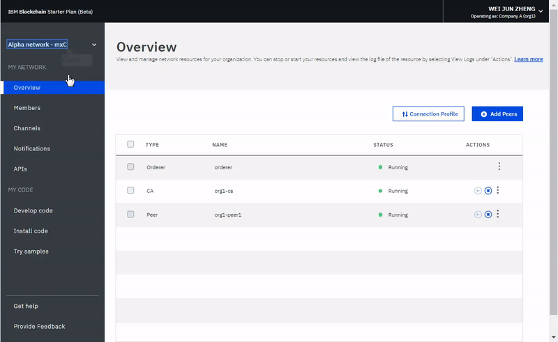
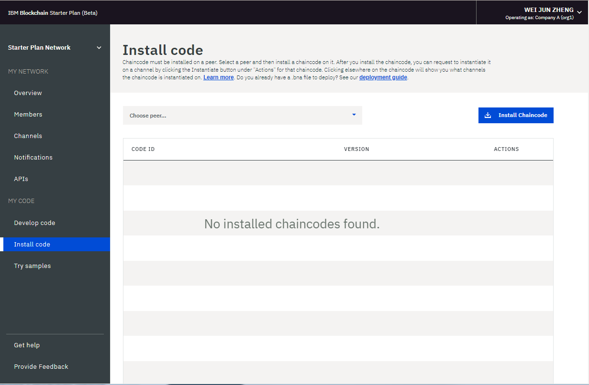
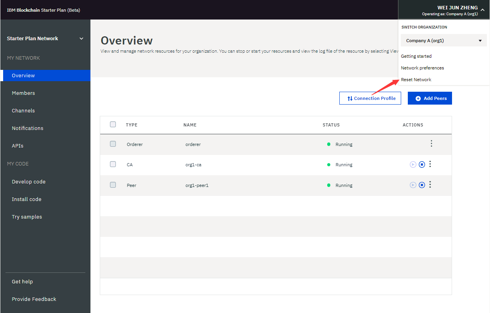

---

copyright:
  years: 2017, 2018
lastupdated: "2018-05-15"

---

{:new_window: target="_blank"}
{:shortdesc: .shortdesc}
{:codeblock: .codeblock}
{:screen: .screen}
{:pre: .pre}

# 运行入门套餐网络
{: #operate-starter-plan-network}

{{site.data.keyword.blockchainfull}} Platform 中的“网络监视器”提供区块链环境的概述，包括网络资源、成员、加入的通道、事务处理性能数据和已部署的链代码。“网络监视器”还提供了入口点来运行 Swagger API，使用 {{site.data.keyword.blockchainfull_notm}} Platform: Develop 来开发网络以及试用样本应用程序。
{:shortdesc}

您可以在“网络监视器”中[更改入门套餐网络的名称](#sp-network-name)或者[在创建的不同入门套餐网络之间进行切换](#switch-sp-network)。

“网络监视器”分三个部分显示以下屏幕。您可以在“网络监视器”左侧导航器中导航至各个屏幕。
- **我的网络**部分包含“[概述](#overview)”、“[成员](#members)”、“[通道](#channels)”、“[通知](#notifications)”和“[API](#apis)”屏幕。
- **我的代码**部分包含“[开发代码](#write-code)”、“[安装代码](#chaincode)”和“[试用样本](#samples)”屏幕。
- “[获取帮助](#support)”屏幕。

可以通过“网络监视器”右上角的下拉菜单，针对您拥有的各组织[切换组织](#switch-organizations)、[检查网络首选项](#network-preferences)以及[重置网络](#reset-network)。

本教程描述了上述每个屏幕和功能。

## 更新网络名称
{: #sp-network-name}

在创建入门套餐网络时，{{site.data.keyword.blockchainfull_notm}} Platform 会为您的网络分配名称。但是，可随时在“网络监视器”中更新此网络名称。

在“网络监视器”左侧导航器的顶部，单击网络名称，此字段将变为可编辑。输入要使用的新网络名称，然后按 **Enter** 键。将在几秒内更新网络名称。

**图 1** 显示将入门套餐网络名称从指定的名称更新为“入门套餐网络”的步骤。

*图 1. 更新网络名称*

## 在入门套餐网络之间进行切换
{: #switch-sp-network}

如果使用入门套餐创建多个网络，那么可在“网络监视器”中切换网络。

在“网络监视器”左侧导航器的顶部，单击网络名称旁边的箭头图标。从下拉列表中选择并单击要切换到的网络名称。Web 浏览器将刷新并打开所切换到的网络的“网络监视器”。

**图 2** 显示切换到另一个入门套餐网络的步骤。

*图 2. 切换网络*

## 概述
{: #overview}

“概述”屏幕显示有关区块链资源（包括排序者、CA 和同级）的实时状态信息。每个资源都显示在四个不同的标头下：**类型**、**名称**、**状态**和**操作**。网络启动时，会有一个排序者、一个 CA 和一个同级在运行。CA 是特定于组织的，而排序者是在整个网络上共享的公共端点。

**图 3** 显示“概述”屏幕：

*图 3. 网络概述*

### 节点操作
  表的**操作**标头提供了用于启动或停止组件的按钮。您还可以通过选择多个节点，然后单击**启动所选项**或**停止所选项**按钮，来启动或停止一组节点。选择一个或多个节点时，**启动所选项**或**停止所选项**按钮将显示在表的顶部。

  您还可以通过单击**操作**标头下的下拉列表中的**查看日志**来检查组件日志。日志会公开在各种网络资源之间的调用，且在进行调试和故障诊断时非常有用。

  **注**：{{site.data.keyword.blockchainfull_notm}}在入门模板网络 UI 中，在单击“概述”面板上列出的节点的“查看日志”操作时，将打开 IBM Cloud 日志记录 Kibana 界面。缺省情况下，Kibana 预先配置为显示最近 15 分钟的活动的日志。如果过去 15 分钟内没有任何活动，那么您将看到一条消息“找不到结果”。要查看所有日志，只需单击右上角中用户名下方的计时器图标，并设置较大的时间范围，例如，“本周”或“本月”。

  要了解启动和停止同级的效果，可通过停止同级并尝试将其设定为某个事务处理的目标来进行试验，您将在日志中看到连接错误。重新启动该同级并重试该事务处理时，您将看到连接成功。您还可以在通道继续进行事务处理时，使某个同级停止运行较长的一段时间。该同级再次启动后，您将注意到分类帐同步，因为该同级会收到在它停止运行期间提交的块。在分类帐完全同步后，您可以对其执行正常的调用和查询。

### 连接概要文件
  您可以通过单击**连接概要文件**按钮来查看有关每个资源的低级别网络信息的 JSON 文件。连接概要文件包含应用程序所需的所有配置信息。但是，由于此文件仅包含特定组件和排序者的地址，因此如果需要将更多同级设定为目标，您需要获取这些同级的端点。包含“url”的标头显示每个组件的 API 端点。需要这些端点才能以客户端应用程序的特定网络组件为目标，而其定义通常存在于应用程序随附的 JSON 模型化配置文件中。如果您要定制的应用程序需要不属于您组织的同级支持，那么您需要在带外操作中从相关操作员处检索这些同级的 IP 地址。客户端必须能够连接到它们需要从中获取响应的任何同级。

### 添加同级
{: #peers}
  网络成员需要有同级来存储其网络分类帐副本并运行用于查询或更新分类帐的链代码。如果支持策略将某个同级定义为支持同级，那么该同级还会将支持结果返回给应用程序。

  缺省情况下，入门套餐会为这两个组织分别创建一个同级。您可以根据自己的需求为组织添加更多同级。如果需要更多同级，您可能处于不同的场景中。例如，您可能希望多个同级加入同一个通道以实现冗余。每个同级都会处理该通道的事务，并写入其各自的分类帐副本。如果其中一个同级发生故障，另一个同级（或其他多个同级）可以继续处理事务和应用程序请求。您还可以在各同级之间对所有应用程序请求进行对称负载均衡，或者可以针对不同的功能将不同的同级设定为目标。例如，可以使用一个同级来查询分类账，而使用另一个同级来处理对分类帐更新的支持。

  单击右上角的**添加同级**按钮，以将同级节点添加到网络。在弹出的“添加同级”面板中，选择要添加的同级节点的数目和大小。

## 成员
{: #members}

“成员”屏幕包含两个选项卡，用于在“成员”选项卡中显示网络成员信息，在“证书”选项卡中显示证书信息。

### 成员
{: #members_tab}
**图 4** 显示初始“成员”屏幕，其中在“成员”选项卡中显示网络成员：

*图 4. 网络成员*

单击**添加成员**以邀请更多成员加入网络。在入门套餐中，您有两个选项：
- **邀请成员**。您可以邀请其他组织成为您网络的成员。随后，受邀组织可以加入网络并与您协作。
- **创建成员**。您还可以使用自己的电子邮件地址来创建成员。您可以对成员进行控制，就像对使用入门套餐时缺省情况下收到的两个组织那样。

**图 5** 显示“添加成员”窗口。

*图 5. 添加成员*

### 证书
**图 6** 显示初始“成员”屏幕，其中在“证书”选项卡中显示成员证书：

*图 6. 证书*

操作员可以在“证书”选项卡中管理同一机构的成员的证书。单击**添加证书**以打开“添加证书”面板。向证书提供名称、将 PEM 格式的客户机端证书粘贴到“密钥”字段，然后单击**提交**。您需要在客户机端证书生效之前重新启动同级。

有关生成证书密钥的更多信息，请参阅[生成客户机端证书](v10_application.html#generating-the-client-side-certificates)。

## 通道
{: #channels}

通道由希望以专用方式处理事务的网络成员子集构成，用于通过允许通道成员建立特定规则和单独的分类帐（只有通道成员可以访问）来提供数据隔离和机密性。每个网络都必须至少有一个通道，以便进行事务处理。每个通道具有唯一的分类帐，用户必须经过正确的认证才能对此分类帐执行读/写操作。如果您不在通道上，那么看不到任何数据。

**图 7** 显示初始仪表板屏幕，其中显示网络中所有通道的概述：

*图 7. 通道*

创建通道将生成特定于通道的分类帐。有关更多信息，请参阅[创建通道](howto/create_channel.html)。

您还可以选择现有通道以查看有关通道、成员资格和活动链代码的更精确详细信息。有关更多信息，请参阅[监视网络](howto/monitor_network.html)。

## 通知
{: #notifications}

您可以处理暂挂请求，并在“通知”屏幕中查看已完成的请求。

**图 8** 显示“通知”屏幕：

*图 8. 通知*

在您创建通道或您受邀加入新通道时，将在“网络监视器”中出现一个通知。

这些请求分组为“全部”、“暂挂”和“已完成”子选项卡。标头后的数字指示每个子选项卡中的请求数。
   * 您可以在“全部”子选项卡中找到所有请求。
   * 未接受或拒绝的请求或尚未查看的请求在“暂挂”子选项卡中。单击**复查请求**按钮以查看请求，包括通道策略和成员，以及投票状态。如果您是通道操作员，那么您可以**接受**或**拒绝**请求，或者单击**稍后**以在其他时间对其进行处理。如果有足够多的通道操作员接受请求，那么您可以单击**提交请求**以激活通道更新。
   * 提交的请求将显示在“已完成”子选项卡中。您可以单击**复查请求**以查看其详细信息。

如果有一个较长的请求列表，那么可以在顶部的搜索字段中搜索请求。

通过选择暂挂请求前面的框并单击**删除请求**，可以删除暂挂请求。

## API
{: #apis}

为了帮助进行应用程序开发，{{site.data.keyword.blockchainfull_notm}} Platform 公开了 API，您可以在 Swagger UI 中针对自己的网络来测试这些 API。

**图 9** 显示“API”屏幕：

*图 9. API*

单击 **Swagger UI** 链接以打开 Swagger UI。请注意，您需要先使用自己的网络凭证（可以在此 API 页面上找到）来授权 Swagger UI，然后才能运行 API。有关更多信息，请参阅[使用 Swagger API](howto/swagger_apis.html)。

## 开发代码
{: #write-code}

入门套餐集成了 {{site.data.keyword.blockchainfull_notm}} Platform: Develop，并提供了具有业界标准工具和技术的开发环境。您可以在该环境中以联机或本地方式开发业务网络。开发业务网络后，可以将其部署回入门套餐网络。

**图 10** 显示“开发代码”屏幕：

*图 10. 开发代码*

有关开发业务网络并将其部署回入门套餐网络的更多信息，请参阅[使用入门套餐开发业务网络](develop_starter.html)。

## 安装代码
{: #chaincode}

链代码（也称为“智能合同”）是包含一组对分类帐进行查询和更新的函数的软件片段。链代码安装在同级上并在通道上进行实例化。

**图 10** 显示“安装代码”屏幕：

*图 11. 链代码*

链代码首先安装在同级的文件系统上，然后在通道上进行实例化。有关更多信息，请参阅[安装、实例化和更新链代码](howto/install_instantiate_chaincode.html)。

## 试用样本
{: #samples}

样本应用程序可帮助您更好地了解区块链网络和应用程序开发。通过入门套餐，可以在“网络监视器”中部署和启动样本应用程序。

**图 12** 显示“试用样本”屏幕：

*图 12. 样本*

样本部署利用 [DevOps Toolchain 服务 ](https://console.bluemix.net/devops/toolchains) 来自动执行源代码控制、交付管道和链代码启用过程。选择样本应用程序，然后单击**通过 Toolchain 部署**。有关更多信息，请参阅[部署样本应用程序](howto/prebuilt_samples.html)。

## 获取帮助
{: #support}

“获取帮助”屏幕包含两个选项卡，在“支持”选项卡中提供支持信息，在“发行说明”选项卡中描述每个发行版的新增功能和已更改功能。

**图 13** 显示初始“支持”屏幕，其中在“支持”选项卡中显示支持信息：

*图 13. 区块链支持*

使用此屏幕上的链接和资源，可访问故障诊断和支持论坛。

* **入门**下的 [{{site.data.keyword.blockchainfull_notm}} 服务文档](index.html)是此文档的站点，提供有关如何在 {{site.data.keyword.Bluemix_notm}} 上开始使用 {{site.data.keyword.blockchainfull}} Platform 的指导信息。您可以在左侧导航器中查找相应主题，也可以使用顶部的搜索功能搜索任何项。
* **社区帮助** 下的 [IBM DeveloperWorks ](https://developer.ibm.com/blockchain/) 包含适用于开发者的资源和信息。
* **支持凭单**下的 [IBM dWAnswers ](https://developer.ibm.com/answers/smartspace/blockchain/) 充当问题和响应的平台。您可以搜索先前发布的问题的响应，也可以提交新问题。请确保在问题中包含关键字**区块链**。您还可以通过**开具 {{site.data.keyword.Bluemix_notm}} 支持凭单**选项，向 {{site.data.keyword.blockchainfull_notm}} 支持团队提交凭单。从特定 {{site.data.keyword.Bluemix_notm}} 实例共享详细信息和代码片段。
* **区块链样本应用程序**下的[样本应用程序 ](https://github.com/ibm-blockchain) 提供了指导信息和样本代码片段，以帮助开发应用程序。
* **Hyperledger Fabric** 下的 [Hyperledger Fabric ](http://hyperledger-fabric.readthedocs.io/) 和 [Hyperledger Fabric 社区 ](http://jira.hyperledger.org/secure/Dashboard.jspa) 提供有关 Hyperledger Fabric 堆栈的更多详细信息。请与 [Hyperledger 专家 ](https://chat.hyperledger.org/channel/general) 讨论有关 Hyperledger Fabric 代码的问题。

如果您无法调试问题或确定问题的答案，请在 IBM Cloud 服务门户网站中提交支持案例。有关更多信息，请参阅[获取支持](ibmblockchain_support.html)。

**图 14** 和**图 15** 显示初始“支持”屏幕，其中在“发行说明”选项卡中显示每个发行版的新增功能和已更改功能：

*图 14. Helios 发行说明

*图 15. Fabric 发行说明*

## 切换组织
{: #switch-organizations}

如果要独自模拟多组织区块链网络，可以切换到您拥有的任一组织，例如组织 A。然后，可以在“网络监视器”中查看和管理“组织 A”的网络资源，例如同级、通道和链代码。借助此功能，您可以通过遵循通道策略将多个组织中的同级添加到通道来创建通道。

单击 UI 右上角，其中显示了您的姓名。从**切换组织**下的下拉菜单中，选择要切换到的组织名称。缺省情况下会选择“组织 A”。选择要切换到的组织后，“网络监视器”会自动刷新，并且您可以将网络视为该组织。

**图 16** 显示“切换组织”功能：

   
*图 16. 切换组织*

## 网络首选项
{: #network-preferences}

单击右上角并打开下拉菜单，然后选择菜单中的**网络首选项**按钮。这将打开“网络首选项”窗口。“网络首选项”窗口显示网络的基本信息，例如，网络名称、Fabric 版本、{{site.data.keyword.cloud_notm}} 中的网络位置以及分类帐数据库类型。如果您是网络发起方，那么还可以在“网络首选项”窗口中管理 Web 不活动超时。

### Web 不活动超时
{: #web-inactivity-timeout}

**注**：仅**网络发起者**可更改 Web 不活动超时设置。这是网络级别设置，将影响所有网络成员。

缺省情况下，Web 不活动超时设置为**关闭**。如果**开启** Web 不活动超时，那么任何网络成员在处于不活动状态 10 分钟后将自动注销。在 Web 不活动计时器到达 10 分钟时，Web 不活动超时功能结束处于不活动状态的 Web 会话以确保网络成员帐户的安全性。单击链接或刷新“网络监视器”会重置 Web 不活动计时器。在到达 10 分钟之前，关闭浏览器窗口或选项卡也会结束 Web 会话。

**图 17** 显示“网络首选项”窗口：

*图 17. 网络首选项*

## 重置网络
{: #reset-network}

入门套餐提供了在不删除并重新创建网络的情况下编辑网络配置的功能。您的网络会重置为初始网络配置，其中包含两个组织（每个组织对应一个同级）以及一个缺省通道。例如，要在区块链网络上运行多轮测试时，此功能非常有用，它允许您从相对干净的网络重新开始。

**注意**：重置网络后，同级、排序者和 CA 的 API 端点都会更改。您需要在应用程序中调整 API 端点信息。

单击右上角并打开下拉菜单。单击菜单中的**重置网络**按钮。如果已准备好重置网络，请单击**确定**以继续。“网络监视器”将刷新以反映新设置。

**图 18** 显示“重置网络”功能：

*图 18. 重置网络*
