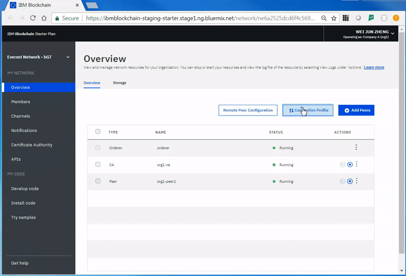

---

copyright:
  years: 2017, 2018
lastupdated: "2018-08-31"

---

{:new_window: target="_blank"}
{:shortdesc: .shortdesc}
{:screen: .screen}
{:codeblock: .codeblock}
{:pre: .pre}
{:tip: .tip}

# 在入门套餐上部署业务网络
{: #deploying-a-business-network}


*[此页面是否有用？请告诉我们。](https://www.surveygizmo.com/s3/4501493/IBM-Blockchain-Documentation)*


可以使用 {{site.data.keyword.blockchainfull}} Platform 开发者环境和 Hyperledger Composer 开发者工具集来开发业务网络，并将其部署到入门套餐环境。
{:shortdesc}

通过使用开发者环境，可以快速对 {{site.data.keyword.blockchain}} 业务网络进行建模和测试，然后将其部署到 {{site.data.keyword.blockchainfull_notm}} Platform 的实例。

## 开始之前

确保您已阅读[关于入门套餐](./starter_plan.html)和[入门套餐入门](./get_start_starter_plan.html)。此外，请确保您已遵循[管理入门套餐网络](./get_start_starter_plan.html)中的指示信息，安装了 [{{site.data.keyword.blockchainfull_notm}} Platform 开发者环境](./develop_install.html)并创建了 {{site.data.keyword.blockchainfull_notm}} Platform 入门套餐实例。确保具有 Node V8.9 或更高版本、npm V5.x 以及 Hyperledger Composer V0.19.x。


## 步骤 1：检索管理私钥

1. 在入门套餐的“概述”屏幕中，单击**连接概要文件**，然后进行下载。将此文件重命名为“connection-profile.json”。

2. 将此文件移至与 `.bna` 文件相同的目录中。

3. 在连接概要文件中，一直向下直至看到“registrar”。在“registrar”中的“enrollId”下方，有一个 **enrollSecret** 属性。检索到该私钥并保存其副本。

    


## 步骤 2：创建证书授权卡

在上一步中检索到的私钥将用于为认证中心 (CA) 创建业务网络卡。这将导入 CA 卡，并且该卡用于将 **enrollSecret** 交换为入门套餐认证中心的有效证书。

1. 使用第一步中记录的 **enrollSecret**，运行以下命令来创建 CA 业务网络卡：

   ```
   composer card create -f ca.card -p connection-profile.json -u admin -s enrollSecret
   ```
   {:pre}

将以上命令中的 `enrollSecret` 替换为从连接概要文件检索到的管理私钥。

2. 使用以下命令来导入该卡：

   ```
   composer card import -f ca.card -c ca
   ```
   {:codeblock}

3. 现在，该卡已导入，可以用于将 **enrollSecret** 交换为 CA 的有效证书。运行以下命令向认证中心请求证书：

   ```
   composer identity request --card ca --path ./credentials -u admin -s enrollSecret
   ```
   {:codeblock}

将以上命令中的 `enrollSecret` 替换为从连接概要文件检索到的管理私钥。`composer identity request` 命令会创建包含证书 `.pem` 文件的 `credentials` 目录。

## 步骤 3：向入门套餐实例添加证书

必须向入门套餐实例添加证书。为方便起见，可以使用 {{site.data.keyword.blockchainfull_notm}} Platform UI 来添加证书。必须添加证书，随后必须重新启动同级，然后必须在通道上同步证书。所需证书是先前命令生成的 `admin-pub.pem` 文件，其位于 `credentials` 目录中。

1. 在入门套餐 UI 中，依次单击**成员**选项卡、**证书**和**添加证书**。转至 `credentials` 目录，复制 `admin-pub.pem` 文件的内容并粘贴到证书框中。提交证书，然后重新启动同级。注：重新启动同级需要 1 分钟。

    

2. 接下来，必须在通道上同步证书。单击**通道**选项卡，随后单击**操作**按钮，然后是**同步证书**和**提交**。

    

## 步骤 4：创建管理业务网络卡

现在，正确的证书已经与同级同步，因此可以创建有权安装 Hyperledger Composer 运行时并启动链代码的业务网络卡。

1. 使用以下命令来创建具有通道管理和同级管理角色的管理卡：

   ```
   composer card create -f adminCard.card -p connection-profile.json -u admin -c ./credentials/admin-pub.pem -k ./credentials/admin-priv.pem --role PeerAdmin --role ChannelAdmin
   ```
   {:codeblock}

   此卡用于将业务网络部署到入门套餐。

2. 使用以下命令导入在上一步中创建的卡：

   ```
   composer card import -f adminCard.card -c adminCard
   ```
   {:codeblock}

## 步骤 5：安装并启动业务网络

接下来，可以使用上一步中创建的卡来安装并启动业务网络。对于本指南，我们将安装车辆制造网络样本，使用车辆制造网络样本，或者安装您自己的业务网络，但是确保更改命令中指定的业务网络名称。用于启动业务网络的命令也会创建一个卡。对于入门套餐，必须删除此卡；给定的示例命令将此卡命名为 `delete_me.card`，因此可以轻松认出该卡。

1. 使用以下命令来安装 Hyperledger Composer 运行时：

   ```
   composer network install -c adminCard -a vehicle-manufacture-network.bna
   ```
   {:codeblock}

   请记录运行此命令时返回的业务网络版本号。在下一步中将需要此项。

2. 使用以下命令启动业务网络。如果发生错误，请等待一分钟，然后重试。在 `-V` 选项后使用来自上一步的版本号。

    ```
composer network start -c adminCard -n vehicle-manufacture-network -V 0.0.1 -A admin -C ./credentials/admin-pub.pem -f delete_me.card
    ```
    {:codeblock}

3. 删除名为 `delete_me.card` 的业务网络卡。

4. 使用以下命令来创建新的业务网络卡，并引用早先时候检索到的证书：

   ```
   composer card create -n vehicle-manufacture-network -p connection-profile.json -u admin -c ./credentials/admin-pub.pem -k ./credentials/admin-priv.pem
   ```
   {:codeblock}

5. 使用以下命令来导入业务网络卡：

    ```
composer card import -f ./admin@vehicle-manufacture-network.card
    ```
    {:codeblock}

现在，业务网络已部署到入门套餐实例。

## 第 6 步：对业务网络执行 ping 操作以确保其正确运行

运行以下命令以对业务网络执行 ping 操作：

   ```
   composer network ping -c admin@vehicle-manufacture-network
   ```
   {:codeblock}

要查看链代码日志，请单击**通道**，然后选择通道。<!-- Click the dropdown arrow to view the logs, or the Actions symbol to view in more detail. -->单击**链代码**选项卡。展开链代码行，然后单击 **JSON** 或**日志**按钮。

<!-- [fN-Yuj](https://i.makeagif.com/media/4-13-2018/fN-Yuj.gif) -->
