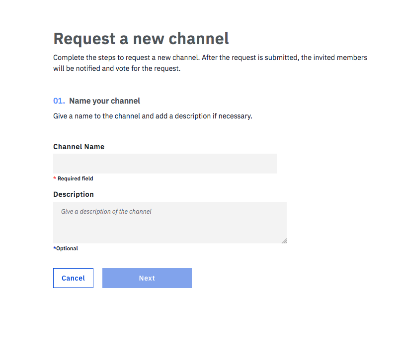
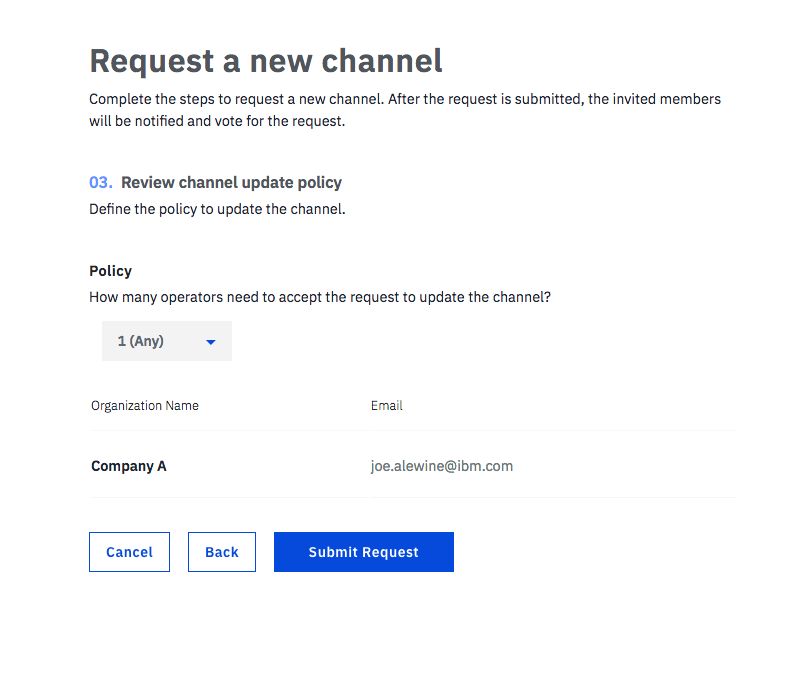

---

copyright:
  years: 2017, 2018
lastupdated: "2018-03-16"

---

{:new_window: target="_blank"}
{:shortdesc: .shortdesc}
{:screen: .screen}
{:codeblock: .codeblock}
{:pre: .pre}

# 创建或更新通道

通道是用于分区和隔离数据的一种极其强大的机制，它们为数据隐私提供主要基础。
只有同一通道的成员才能访问此通道的数据。
{:shortdesc}

为确保通道安全性，将配置通道更新策略以定义在创建或更新通道之前，需要就通道创建或更新请求达成一致的通道操作员数。

## 创建通道
单击“网络监视器”的“通道”屏幕中的**新建通道**按钮，然后完成以下步骤，以提交通道创建请求：
1. 选择代表通道业务目标的名称，添加描述（如果需要），然后单击**下一步**。通道名称在区块链网络中必须唯一。它必须以字母开头，并且只能包含小写字符、数字或短划线。
  

2. 通过选择网络成员并单击**添加成员**按钮来邀请网络成员的任意组合。通过为每个受邀的成员分配角色来定制许可权，然后单击**下一步**。
  

    * 通道操作员可以查询或更新通道分类帐。通道操作员有权**接受**或**拒绝**通道创建请求，以及提交通道更新请求。每个通道必须至少有一个**操作员**。
    * 通道作者可以更新通道分类帐。
    * 通道读者仅可以查询通道分类帐。

3. 通过选择要核准通道更新请求的通道操作员数来配置通道更新策略，然后单击**提交请求**。
  

受邀成员将收到邀请电子邮件。他们还可以在“网络监视器”的**通知**屏幕的“全部”或“暂挂”子选项卡中，找到该请求。

* 受邀作为通道操作员的成员可以单击**复查请求**按钮，以复查通道配置，然后**接受**或**拒绝**请求。“我的状态”列显示操作员对该请求的投票状态：
    * _投票暂挂_：操作员尚未处理请求。
    * _投票已接受_：操作员已接受请求。
    * _投票已拒绝_：操作员已拒绝请求。
    * _投票关闭_：请求获得了足够的**接受**投票，操作员不需要再接受或拒绝。
* 受邀请作为通道作者或读者的成员可以在“我的状态”列下看到*不需要*。在请求从通道操作员那里获得足够的**接受**投票之前，作者或读者可以单击**复查请求**按钮以检查通道配置。

当有足够多的通道操作员就请求达成一致时，任何通道成员都可以单击**提交请求**按钮，此时将会创建新通道。所有通道成员都可以在其“网络监视器”的“通道”屏幕中找到通道。

### 创建受管通道

以高度管制的外汇市场为例，可能需要让可信第三方担任通道上的管理角色，这些通道通常由各种操作员或成员负责处理。

在本例中，可信第三方将使自己成为通道的唯一“操作员”，并将其他成员分配为“作者”。这将授予该第三方编辑该通道的独有权限，同时仍授予两家银行调用事务处理的能力。还可以通过将其他成员设置为“读者”来创建受管“只读”通道。

## 更新通道
如果要修改通道的配置（例如，添加或除去通道成员），或者更改通道更新策略，那么可以提交通道更新请求。在“网络监视器”的“通道”屏幕中，找到要修改的通道，并从**操作**标头下的下拉列表中选择**编辑通道**。在面板中浏览，以更改所需的实体，然后单击**提交请求**，以启动通道更新请求。

所有通道成员都将收到有关通道更新请求的电子邮件通知：
* 新邀请的成员会收到邀请他们加入通道的电子邮件通知。他们还可以在“网络监视器”的**通知**屏幕中找到具有“投票暂挂”状态的请求。

    * 受邀作为通道操作员的成员可以单击**复查请求**按钮，以复查通道配置，然后**接受**或**拒绝**通道更新请求。“我的状态”列显示操作员对该请求的投票状态：
        * _投票暂挂_：操作员尚未处理请求。
        * _投票已接受_：操作员已接受请求。
        * _投票已拒绝_：操作员已拒绝请求。
        * _投票关闭_：请求获得了足够的**接受**投票，操作员不需要再接受或拒绝。
    * 受邀请作为通道作者或读者的成员可以在“我的状态”列下看到*不需要*。在请求从通道操作员那里获得足够的**接受**投票之前，作者或读者可以单击**复查请求**按钮以检查通道配置。
* 除去的成员会收到有关通道更改的电子邮件通知。
* 现有通道操作员会收到有关通道更新的电子邮件通知。他们可以在“网络监视器”的**通知**屏幕中找到具有_投票暂挂_状态的请求，以供他们**接受**或**拒绝**。

* 现有通道作者或读者会收到有关通道更新的电子邮件通知。他们可以在“网络监视器”的**通知**屏幕中找到具有_不需要_状态的请求。

当有足够多的通道操作员就请求达成一致时，任何通道成员都可以单击**提交请求**按钮，此时将会更新通道。所有通道成员都可以在“网络监视器”的“通道”屏幕中找到更新的通道。
