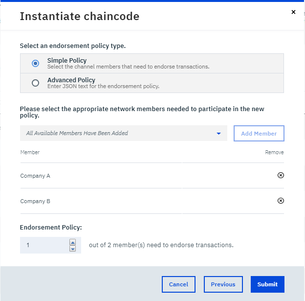
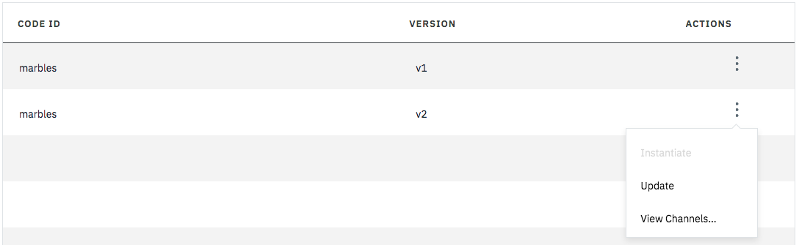

---

copyright:
  years: 2017, 2018
lastupdated: "2018-08-31"
---

{:new_window: target="_blank"}
{:shortdesc: .shortdesc}
{:codeblock: .codeblock}
{:screen: .screen}
{:pre: .pre}

# 安装、实例化和更新链代码

***[此页面是否有用？请告诉我们。](https://www.surveygizmo.com/s3/4501493/IBM-Blockchain-Documentation)***

链代码是一款软件，可封装用于在分类帐中创建和修改资产的业务逻辑和事务处理指示信息。
链代码可使用不同语言编写，并且 {{site.data.keyword.blockchainfull}} Platform 支持 Go 和 Node.js 链代码。链代码在 Docker 容器中运行，该容器与需要与之交互的任何同级相关联。有关开发链代码的更多信息，请参阅[链代码教程 ](http://hyperledger-fabric.readthedocs.io/en/latest/chaincode.html)。
{:shortdesc}

链代码安装在同级上，然后在通道上进行实例化。**想要使用链代码提交事务或读取数据的所有成员都需要在其同级上安装链代码。**链代码通过其名称和版本进行定义。在一个通道中，各个同级上已安装的链代码的名称和版本需要保持一致。

在同级上安装链代码后，单个网络成员实例化通道上的链代码。网络成员需要加入通道才能执行此操作。实例化将输入链代码所用的初始数据，然后在已加入到通道的且安装了链代码的同级上启动链代码容器。然后，同级可使用正在运行的容器以进行交易。**请注意，只需要由一个网络成员来实例化链代码。**如果已安装链代码的同级加入已实例化的通道，那么链代码容器将自动启动。

**安装和实例化**组合是一个强大的功能，因为它让同级可以在多个通道上使用单个链代码。同级可能要加入使用相同链代码但具有不同网络成员组的多个通道以访问数据。同级可安装链代码一次，然后在已实例化的任何通道上使用相同的链代码容器。此轻量级方法节省计算和存储空间，并帮助扩展网络。

## 安装链代码
{: #installchaincode}

您必须在将运行此链代码的每个同级上安装此链代码。要安装链代码，请完成以下步骤：
1. 在“网络监视器”的“安装代码”屏幕中，从下拉列表中选择要安装链代码的同级。单击**安装链代码**按钮。
<!--
  
-->

2. 在**安装链代码**弹出面板中，输入链代码的名称和版本。**注**：将在应用程序中使用名称和版本字符串以与已安装的链代码进行交互。单击**浏览**按钮并在本地文件系统中浏览到存储链代码源文件的任何位置。选择要安装在同级上的一个或多个链代码源文件。然后，从**链代码类型**下拉列表中选择链代码语言。

可以通过上传一个或多个 GO 或 NODE 文件来安装链代码，也可以上传打包在 .zip 文件内的链代码。使用 .zip 文件将使链代码保持完整的目录结构。如果要包含依赖关系的包，或者要将索引用于 CouchDB，那么使用 .zip 文件会非常有用。有关如何在链代码中包含索引的示例，请参阅[通过链代码使用 CouchDB ](http://hyperledger-fabric.readthedocs.io/en/release-1.1/couchdb_as_state_database.html#using-couchdb-from-chaincode){:new_window}，或者遵循 Hypereldger Fabric 文档中的此[教程 ](https://hyperledger-fabric.readthedocs.io/en/release-1.2/couchdb_tutorial.html){:new_window}。您还可以找到有关[管理使用 GO 编写的链代码的外部依赖性 ](https://hyperledger-fabric.readthedocs.io/en/latest/chaincode4ade.html#managing-external-dependencies-for-chaincode-written-in-go){:new_window} 的信息。

  

## 实例化链代码
在将链代码安装到每个加入通道的同级的文件系统上之后，必须接着在通道上对该链代码进行实例化，以便同级可以通过链代码容器与分类帐交互。实例化对链代码执行任何必要的初始化。通常，这会涉及设置组成链代码初始全局状态的键值对。

您需要在通道上具有**操作员**或**作者**权限才能实例化链代码。在不同同级上具有相同名称和版本的链代码仅需要实例化一次即可部署链代码容器。要实例化链代码，请完成以下步骤：
1. 在“网络监视器”的“安装代码”屏幕中，选择安装了链代码的同级并在链代码表中找到要实例化的链代码。然后，单击**操作**标头下的**实例化**按钮。
<!--
  
-->

2. 在**实例化链代码**弹出面板中，将键值对设置为链代码初始化的自变量，然后选择要在其上进行实例化的通道。单击**下一步**。
<!--
  
-->

3. 指定链代码的[支持策略](../glossary.html#endorsement-policy)。您可以在[下一部分](#specifying-chaincode-endorsement-policies)中了解有关如何设置支持策略的更多信息。

## 指定链代码支持策略

可以使用支持策略来指定哪组同级需要验证新交易。例如，支持策略可以指定仅当通道上的大部分成员支持交易时，才会将该交易添加到分类帐。

在通道上对链代码进行实例化时，会设置支持策略。对链代码进行实例化的组织可以从已安装链代码的通道成员中选择成员，使其成为验证者，并设置用于所有通道成员的支持策略。通过遵循[更新链代码](#updating-a-chaincode)的步骤，然后在第二步中对链代码进行重新实例化时指定新策略，可以更新支持策略。

使用“网络监视器”来设置支持策略时，可以使用 UI 来指定**简单策略**，也可以使用 JSON 来指定**高级策略**。

* **使用 UI 指定简单策略**：首先，单击**添加成员**按钮，以选择可以验证交易的一组成员。然后，在**支持策略**部分中，确定列表中需要有多少成员验证交易后，才可核准该交易。可以使用此方法来指定用于所有通道成员的支持策略、用于大部分通道成员的支持策略，或指定简单的 +1 支持策略，用于防止成员自签名（例如，五个成员中的两个成员）。如果未进行任何更改，那么缺省策略允许通道的任何成员支持交易。

  

* **使用 JSON 指定高级策略**：使用高级策略可要求来自重要成员或管理员的支持，或者对某些成员的支持给予更多权重。

  指定高级策略最简单的方法是先使用 UI 屏幕来构建简单策略。然后，单击**高级策略**按钮，这将使用您在简单策略中设置的相同成员和规则自动填充策略的 JSON 版本。接下来，您就可以编辑该 JSON 以编写更高级的版本。有关使用 JSON 编写支持策略的更多信息，请参阅 [Hyperledger Fabric Node SDK 文档 ](https://fabric-sdk-node.github.io/global.html#ChaincodeInstantiateUpgradeRequest)。<!--You can also find examples of advanced endorsement policies in the main [Hyperledger Fabric documentation](https://hyperledger-fabric.readthedocs.io/en/latest/arch-deep-dive.html#example-endorsement-policies)-->

  

## 更新链代码

您可以更新链代码以更改链代码的编程，同时维护其与分类帐上资产的关系。由于安装和实例化组合，需要使用此链代码更新通道上所有同级的链代码。请完成以下步骤以更新链代码。

1. 安装与旧链代码同名但版本不同的链代码。您可以执行与[安装链代码](#installchaincode)相同的步骤。确保选择与原始链代码相同的通道。

  

2. 在表中找到新的链代码，然后单击**操作**标题下的**更新**按钮。此操作将重新实例化链代码并将链代码容器替换为新容器。请注意，无需输入任何新的自变量作为更新函数的一部分。此升级操作在通道上发生，并且只需由一个组织执行。

  
