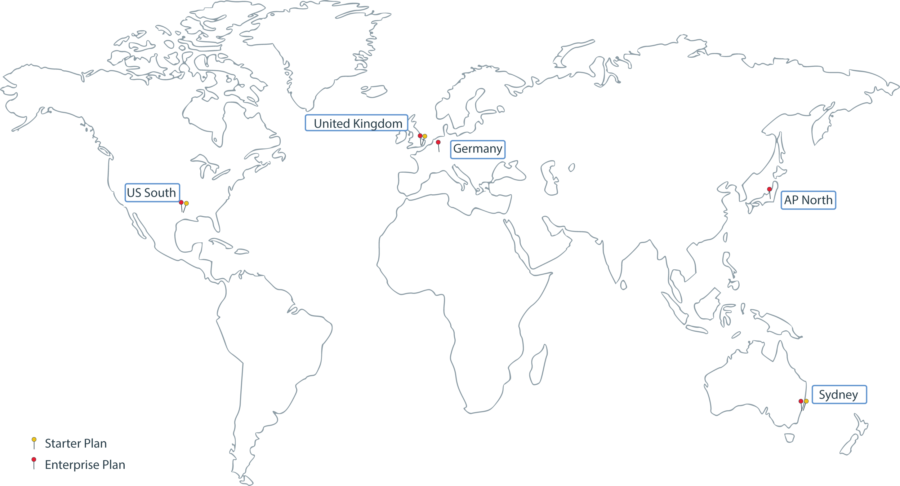

---

copyright:
  years: 2017, 2018
lastupdated: "2018-08-31"

---

{:new_window: target="_blank"}
{:shortdesc: .shortdesc}
{:screen: .screen}
{:pre: .pre}
{:table: .aria-labeledby="caption"}
{:codeblock: .codeblock}
{:tip: .tip}
{:download: .download}

# {{site.data.keyword.blockchainfull_notm}} Platform 区域和位置
{: #ibp-regions-locations}

***[此页面是否有用？请告诉我们。](https://www.surveygizmo.com/s3/4501493/IBM-Blockchain-Documentation)***

{{site.data.keyword.cloud}} 在全球范围内托管。区域是由端点访问的地理区域，而位置是该区域内的数据中心。{{site.data.keyword.blockchainfull_notm}} Platform 在全球范围内不同区域中的 {{site.data.keyword.cloud_notm}} 中提供成员资格套餐。在 {{site.data.keyword.cloud_notm}} 中创建 {{site.data.keyword.blockchainfull_notm}} Platform 服务实例时，会在创建服务实例的 {{site.data.keyword.cloud_notm}} 区域中创建并存储区块链网络和网络资源。
{:shortdesc}

不同的 {{site.data.keyword.blockchainfull_notm}} Platform 产品在不同的 {{site.data.keyword.cloud_notm}} 区域中可用。您只能在 {{site.data.keyword.blockchainfull_notm}} Platform 套餐可用的 {{site.data.keyword.cloud_notm}} 区域中创建区块链网络。

表 1 和图 1 显示了 {{site.data.keyword.blockchainfull_notm}} Platform 支持的 {{site.data.keyword.cloud_notm}} 区域和位置。

|区域/位置|入门套餐|企业套餐|
|--------|----------|----------|
|美国南部/达拉斯|是|是|
|英国/伦敦|是|是|
|亚太地区北部/东京|  |是|
|德国/法兰克福|  |是|
|悉尼|是|  |
|圣保罗|  |是|
|多伦多|  |是|

_表 1. {{site.data.keyword.blockchainfull_notm}} Platform 区域和位置_

  
_图 1. {{site.data.keyword.blockchainfull_notm}} Platform 区域和位置_
