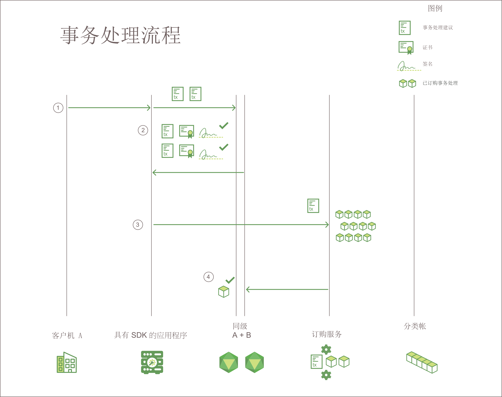

---

copyright:
  years: 2017, 2018
lastupdated: "2018-08-31"
---

{:new_window: target="_blank"}
{:shortdesc: .shortdesc}
{:codeblock: .codeblock}
{:screen: .screen}
{:pre: .pre}

# Hyperledger Fabric

***[此页面是否有用？请告诉我们。](https://www.surveygizmo.com/s3/4501493/IBM-Blockchain-Documentation)***

{{site.data.keyword.blockchainfull}} 网络以 Hyperledger Fabric 堆栈为基础构建，后者是 Linux Foundation Hyperledger 项目中的区块链项目之一。它是一个“许可”网络，其中所有用户和组件都具有已知标识。在每个通信接触点实施签名/验证逻辑，并通过一系列支持和验证检查来同意事务处理。在此意义上，它与传统的区块链实现有很大差异，因为传统区块链实现可提升匿名性，并强制依赖于加密货币和大量计算责任来验证事务处理。  
{:shortdesc}

Hyperledger Fabric 提供模块化体系结构来提高可扩展性和性能。本主题介绍了 Hyperledger Fabric 中的一些关键组件。有关 Hyperledger Fabric 的完整介绍，请参阅 [Hyperledger Fabric 文档 ](http://hyperledger-fabric.readthedocs.io/en/release-1.1/){:new_window}。  

## 认证中心
  
作为**许可**区块链网络的平台，Hyperledger Fabric 包含模块化**认证中心 (CA)** 组件，用于管理所有成员组织及其用户的网络标识。每个用户的许可标识要求对网络活动启用基于 ACL 的控制，并保证每个事务处理最终都可跟踪到注册用户。  
* CA（缺省情况下为 Fabric CA）向授权加入网络的每个**成员**（组织或个人）发放根证书 (**rootCert**)。
* CA 还向每个成员组件、服务器端应用程序和（偶尔）用户发出注册证书 (**eCert**)。
* 每个已注册的用户还会被授予事务处理证书 (**tCert**) 的分配。每个 **tCert** 授权一个网络事务处理。

此基于证书的网络成员资格和操作控制使成员能够通过特定用户身份，限制对专用和保密通道、应用程序和数据的访问。

有关 Hyperledger Fabric 认证中心组件的更多信息，请参阅 [Fabric CA 用户指南 ](https://hyperledger-fabric-ca.readthedocs.io/en/release-1.1/){:new_window}。

## 成员资格服务提供者  
Hyperledger Fabric 包含**成员资格服务提供者 (MSP)** 组件，以提供对发出和验证证书背后的所有加密机制和协议的抽象，以及用户认证。MSP 会安装在每个通道同级上，以确保向同级发出的事务处理请求源自已认证和已授权的用户身份。

有关 Hyperledger Fabric 成员资格服务提供者组件的更多信息，请参阅 [Hyperledger Fabric 文档 ](http://hyperledger-fabric.readthedocs.io/en/release-1.1/){:new_window} 中的*[成员资格服务提供者 (MSP) ](http://hyperledger-fabric.readthedocs.io/en/release-1.1/msp.html){:new_window}*。

## 事务处理流程  
为了确保数据的一致性和完整性，Hyperledger Fabric 在整个事务处理流程中实现多个检查点，包括客户机认证、支持、排序和提交到分类帐。

**图 1** 描述 Hyperledger Fabric 区块链网络上的事务处理流程：*图 1. Hyperledger Fabric 网络上的事务处理流程*

在 Hyperledger Fabric 网络上，用于查询和事务处理的数据流由客户机端应用程序通过向通道上的同级提交事务处理请求来启动。跨网络的初始数据流对于查询和事务处理来说是通用的：

1. 使用 SDK 中提供的 `channel.SendTransactionProposal` API，客户机应用程序会签署事务处理建议并将该建议提交给指定通道上的相应支持同级。此初始事务处理建议是用于支持的**请求**。  
2. 通道上的每个同级会验证提交客户机的身份和权限，并（如果有效）针对提供的输入（键/值）运行指定的链代码。根据所调用链代码的事务处理结果和端点策略，每个同级会向应用程序返回已签署的“是”或“否”响应。每个已签署的“是”响应都是事务处理的**支持**。

	此时在事务处理流程中，查询和事务处理的流程开始不同。如果建议调用链代码中的查询函数，那么应用程序会将数据返回给客户机。如果建议调用链代码中的某个函数来更新分类帐，那么应用程序将继续执行以下步骤：  
3. 应用程序将事务处理（读/写集和支持）转发到网络**排序服务**。  
4. 然后，事务处理会中继到 Kafka 集群中的通道分区主题以进行排序。所有通道同级通过应用“链代码特定验证策略”并运行“并行控制版本检查”来验证该区块中的每个事务处理。  
	* 未通过验证过程的任何事务处理都会在该区块中标记为无效，并且该区块将附加到通道的散列链中。  
	* 所有有效的事务处理都将根据修改后的键/值对相应地更新状态数据库。  

**Gossip 数据传播协议**将连续在通道上广播分类帐数据，以确保同级之间的分类帐同步。有关更多信息，请参阅 [Hyperledger Fabric 文档 ](http://hyperledger-fabric.readthedocs.io/en/release-1.1/){:new_window} 中的 *[Gossip 数据传播协议 ](http://hyperledger-fabric.readthedocs.io/en/release-1.1/gossip.html){:new_window}*。

有关事务处理流程的逐步介绍，请参阅 [Hyperledger Fabric 文档 ](http://hyperledger-fabric.readthedocs.io/en/release-1.1/){:new_window} 中的*[事务处理流程 ](http://hyperledger-fabric.readthedocs.io/en/release-1.1/txflow.html){:new_window}*。  

## 订购服务
Hyperledger Fabric 包含一个基于 Kafka 的服务，用于对网络事务处理进行订购和广播。Kafka 还会向您的网络提供崩溃故障容错；这意味着，如果接受的订购服务节点数不可用，那么该服务将继续订购事务处理块并将其分布到通道同级。

客户机端应用程序调用“channel.sendTransaction”API 以将支持的事务处理转发到订购服务。然后，排序服务节点会使用 Kafka 服务及其关联的 ZooKeeper 服务器，对区块中的事务处理进行排序。已订购的事务处理区块最终将“交付”到通道同级，以验证并提交到分类帐。

订购服务节点还提供以下服务：
1. 客户机的认证
2. 维护系统链，该链为已认证的组织和一组包含网络中各种联盟的概要文件，定义排序服务配置、根证书和 MSP 标识。
3. 对用于重新配置或创建通道的配置事务处理进行过滤和验证。  

有关 Hyperledger Fabric 排序服务的更多信息，请参阅 [Hyperledger Fabric 文档 ](http://hyperledger-fabric.readthedocs.io/en/release-1.1/){:new_window} 中的*[启动基于 Kafka 的排序服务 ](http://hyperledger-fabric.readthedocs.io/en/release-1.1/kafka.html){:new_window}*。

## HFC SDK
Hyperledger Fabric Client (HFC) SDK 支持应用程序开发者构建与区块链网络进行交互的应用程序。HFC SDK 帮助简化应用程序对通道和链代码生命周期的管理。

Hyperledger Fabric 提供 Node.js SDK 和 Java SDK，并提供以下功能来与区块链网络进行交互：
* 注册和登记用户
* 创建通道
* 将同级加入通道
* 更新系统通道或应用程序通道配置
* 在同级上安装链代码
* 在通道上实例化链代码
* 在通道上升级链代码
* 调用链代码函数以更新分类帐
* 查询分类帐以获取特定事务处理、块或密钥
* 在通道上监视事件（例如，成功提交事务处理）

有关 HFC SDK 的更多信息，请参阅 [Hyperledger Fabric 文档 ](http://hyperledger-fabric.readthedocs.io/en/release-1.1/){:new_window} 中的 *[Hyperledger Fabric SDK ](http://hyperledger-fabric.readthedocs.io/en/release-1.1/fabric-sdks.html){:new_window}*。
