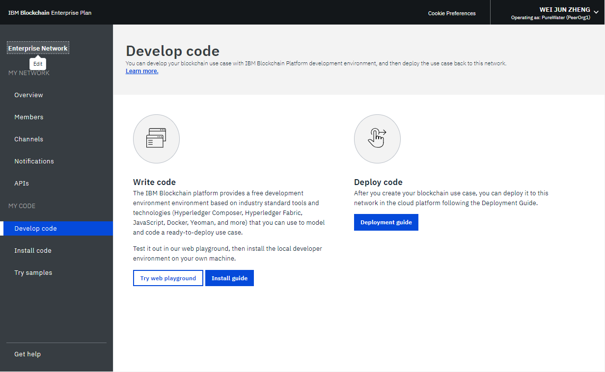
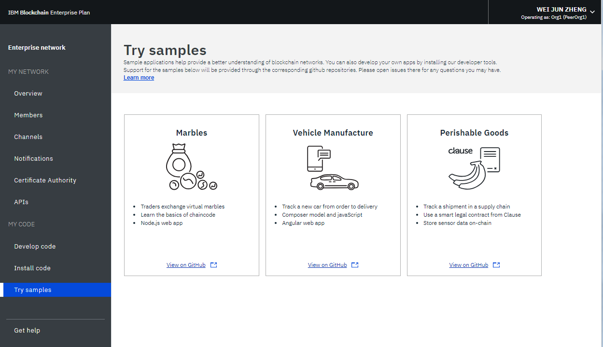
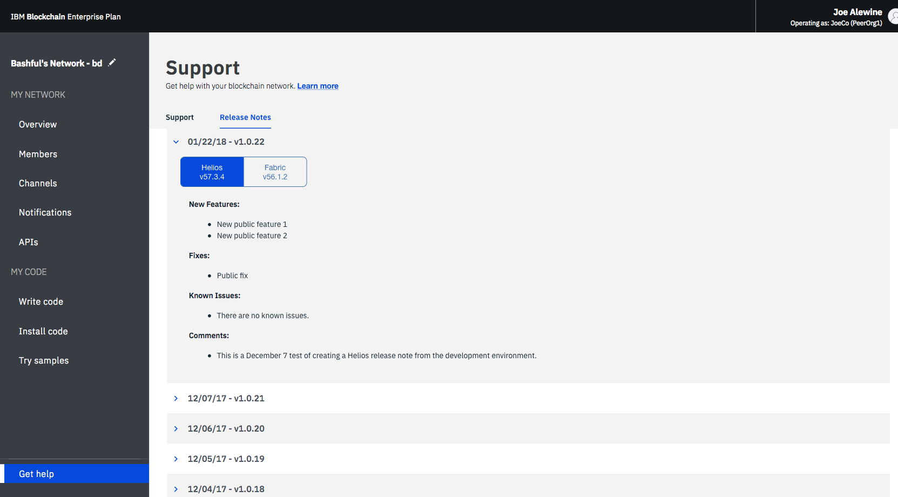

---

copyright:
  years: 2017, 2018
lastupdated: "2018-12-07"

---

{:new_window: target="_blank"}
{:shortdesc: .shortdesc}
{:codeblock: .codeblock}
{:screen: .screen}
{:pre: .pre}

# 使用网络监视器
{: #v10_dashboard}

***[此页面是否有用？请告诉我们。](https://www.surveygizmo.com/s3/4501493/IBM-Blockchain-Documentation)***

{{site.data.keyword.blockchainfull}} Platform 中的“网络监视器”提供区块链环境的概述，包括网络资源、成员、加入的通道、事务处理性能数据和已部署的链代码。“网络监视器”还提供了入口点来运行 Swagger API，使用 {{site.data.keyword.blockchainfull_notm}} Platform: Develop 来开发网络以及试用样本应用程序。
{:shortdesc}

使用本教程了解如何使用“网络监视器”操作企业套餐或入门套餐网络。虽然教程中的大多数屏幕快照适用于企业套餐，但指示信息对于入门套餐也是有效的。当特定功能仅可供某个套餐访问时，相关部分将标记为**适用于入门套餐网络**或**适用于企业套餐网络**。

## 左侧导航窗格

“网络监视器”分三个部分显示以下屏幕。您可以在“网络监视器”左侧导航器中导航至各个屏幕。
- **我的网络**部分包含“[概述](#overview)”、“[成员](#members)”、“[通道](#channels)”、“[通知](#notifications)”、“[认证中心](#ca)”和“[API](#apis)”屏幕。
- **我的代码**部分包含“[开发代码](#write_code)”、“[安装代码](#chaincode)”和“[试用样本](#samples)”屏幕。
- “[获取帮助](#support)”屏幕显示支持信息以及 Helios 和 Hyperledger Fabric（{{site.data.keyword.blockchainfull_notm}} Platform 基于的代码库）的发行说明。

区块链网络的名称位于左侧导航窗格的顶部。您可以在“网络监视器”中[更改网络的名称](#network-name)。

可以通过“网络监视器”右上角的下拉菜单，[检查和配置网络首选项](#network-preferences)。

本教程描述了上述每个屏幕和功能。

## 概述
{: #overview}

“概述”屏幕显示有关区块链资源（包括排序者、CA 和同级节点）的实时状态信息。每个资源都显示在四个不同的标头下：**类型**、**名称**、**状态**和**操作**。在创建区块链网络期间，会自动创建三个订货人节点和两个 CA 节点。CA 特定于成员，而排序节点是整个网络中共享的公共端点。

**图 1** 显示“概述”屏幕：

*图 1. 网络概述*

### 节点操作
表的**操作**标头提供了用于启动或停止资源的按钮。您还可以通过选择多个节点，然后单击**启动所选项**或**停止所选项**按钮，来启动或停止一组节点。选择一个或多个节点时，**启动所选项**或**停止所选项**按钮将显示在表的顶部。

“停止”和“启动”操作不可用于“排序”节点。通常，不需要在网络上停止和启动同级或 CA 节点。提供的“停止”和“启动”操作是为了满足重新启动同级的需要，例如要以全新方式启动同级时。

您还可以通过单击**操作**标头下的下拉列表中的**查看日志**来检查组件日志。日志会公开在各种网络资源之间的调用，且在进行调试和故障诊断时非常有用。有关使用网络日志的更多信息，请参阅[监视区块链网络](howto/monitor_network.html)

要了解启动和停止同级的效果，可通过停止同级并尝试将其设定为某个事务处理的目标来进行试验，您将在日志中看到连接错误。重新启动该同级并重试该事务处理时，您将看到连接成功。您还可以在通道继续进行事务处理时，使某个同级停止运行较长的一段时间。该同级再次启动后，您将注意到分类帐同步，因为该同级会收到在它停止运行期间提交的块。在分类帐完全同步后，您可以对其执行正常的调用和查询。

### 远程同级配置  

如果在 {{site.data.keyword.cloud_notm}} 之外部署同级，那么需要在配置期间提供网络的 API 端点信息。单击**远程同级配置**按钮以检索网络的 API 端点信息来配置同级。弹出窗口提供网络标识、组织 MSP、CA 名称、CA URL 和 CA TLS 证书的 API 端点信息。您可以单击每个字段末尾的复制图标以复制此字段的值，或者单击**下载**按钮以在 JSON 文件中保存所有字段的值。有关更多信息，请参阅[关于适用于 Amazon Web Services 的 {{site.data.keyword.blockchainfull_notm}} Platform](howto/remote_peer.html) 和[适用于 {{site.data.keyword.cloud_notm}} Private 的 {{site.data.keyword.blockchainfull_notm}} Platform](ibp-for-icp-about.html)。

### 连接概要文件
{: #connection-profile}

您可以通过单击**连接概要文件**按钮来查看有关每个资源的低级别网络信息的 JSON 文件。连接概要文件包含应用程序所需的所有配置信息。但是，由于此文件仅包含特定组件和排序者的地址，因此如果需要将更多同级设定为目标，您需要获取这些同级的端点。包含“url”的标头显示每个组件的 API 端点。需要这些端点才能以客户端应用程序的特定网络组件为目标，而其定义通常存在于应用程序随附的 JSON 模型化配置文件中。如果您要定制的应用程序需要不属于您组织的同级支持，那么您需要在带外操作中从相关操作员处检索这些同级的 IP 地址。客户端必须能够连接到它们需要从中获取响应的任何同级。

### 添加同级
{: #peers}

网络成员部署[同级](blockchain_component_overview.html#peer)来存储其网络分类帐副本并运行用于查询或更新分类帐的链代码。如果支持策略将某个同级定义为支持同级，那么该同级还会将支持结果返回给应用程序。

单击右上角的**添加同级**按钮，以将同级节点添加到网络。在弹出的“添加同级”面板中，选择要添加的同级节点的数目和大小。您可以根据自己的需求为组织添加更多同级。如果需要更多同级，您可能处于不同的场景中。例如，您可能希望多个同级加入同一个通道以实现冗余。每个同级都会处理该通道的事务，并写入其各自的分类帐副本。如果其中一个同级发生故障，另一个同级（或其他多个同级）可以继续处理事务和应用程序请求。您还可以在各同级之间对所有应用程序请求进行对称负载均衡，或者可以针对不同的功能将不同的同级设定为目标。例如，可以使用一个同级来查询分类账，而使用另一个同级来处理对分类帐更新的支持。

**入门套餐**为在缺省情况下启动网络时形成的两个组织分别创建一个同级。

### 存储（适用于入门套餐网络）
{: #storage}

**图 2** 显示“存储”选项卡，其中显示网络的存储使用情况。

*图 2. 存储*

“资源”图显示了同级和认证中心使用的存储空间。您创建或邀请到网络的所有组织都包含在此池中。在屏幕的第二个项目符号上列示了使用资源的组织。

排序服务使用来自不同资源池的存储空间。当网络成员创建新的通道并生成新的事务块时，排序服务可能会使用更多资源。

## 成员
{: #members}
“成员”屏幕包含两个选项卡，用于在“成员”选项卡中显示网络成员信息，在“证书”选项卡中显示证书信息。

### 向企业套餐网络添加成员
{: #members_tab}

**图 3** 显示初始“成员”屏幕，其中在“成员”选项卡中显示网络成员：

*图 3. 网络成员*

您可以邀请“成员”选项卡中的其他成员，以添加到创建网络时最初邀请的那些成员。要邀请成员加入您的网络，请输入机构名称和操作员的电子邮件地址，然后单击**添加成员**。网络总计可以有 15 个成员（包括网络发起者）。要从网络中除去成员，请单击成员行末尾的“除去”符号。

### 向入门套餐网络添加成员

**图 4** 显示“添加成员”窗口。

*图 4. 添加成员*

单击**添加成员**时，将显示以下两个选项：
- **邀请成员**。您可以邀请其他组织成为您网络的成员。随后，受邀组织可以加入网络并与您协作。
- **创建成员**。您还可以使用自己的电子邮件地址来创建成员。您可以对成员进行控制，就像对使用入门套餐时缺省情况下收到的两个组织那样。

### 证书
{: #certificates_tab}

**图 5** 显示初始“成员”屏幕，其中在“证书”选项卡中显示成员证书：

*图 5. 证书*

操作员可以在“证书”选项卡中管理同一机构的成员的证书。单击**添加证书**以打开“添加证书”面板。向证书提供名称、将 PEM 格式的客户机端证书粘贴到“密钥”字段，然后单击**提交**。您需要在客户机端证书生效之前重新启动同级。

有关生成证书密钥的更多信息，请参阅[注册应用程序](v10_application.html#enroll-app)。

## 通道
{: #channels}

通道由希望以专用方式处理事务的网络成员子集构成，用于通过允许通道成员建立特定规则和单独的分类帐（只有通道成员可以访问）来提供数据隔离和机密性。每个网络都必须至少有一个通道，以便进行事务处理。每个通道具有唯一的分类帐，用户必须经过正确的认证才能对此分类帐执行读/写操作。如果您不在通道上，那么看不到任何数据。

**图 6** 显示初始仪表板屏幕，其中显示网络中所有通道的概述：

*图 6. 通道*

创建通道将生成特定于通道的分类帐。有关更多信息，请参阅[创建通道](howto/create_channel.html)。

您还可以选择现有通道以查看有关通道、成员资格和活动链代码的更精确详细信息。有关更多信息，请参阅[监视网络](howto/monitor_network.html)。

如果已使用“成员”屏幕的[“证书”选项卡](#certificates_tab)将新证书上传到平台，那么可以使用此面板将证书添加到通道。从相关通道旁的**操作**标头下的下拉列表中单击**同步证书**。这将允许您从远程客户机操作通道，包括能够在通道上实例化链代码。有关更多信息，请参阅[管理证书](certificates.html)教程中的[将签名证书上传到 {{site.data.keyword.blockchainfull_notm}} Platform](certificates.html#upload-certs)。

## 通知
{: #notifications}

在您创建通道或您受邀加入新通道时，将在“网络监视器”中出现一个通知。您可以在“通知”屏幕中查看并响应这些请求。

**图 7** 显示“通知”屏幕：

*图 7. 通知*

这些请求分组为“全部”、“暂挂”和“已完成”子选项卡。子选项卡标题后的数字指示每个子选项卡中的请求数。
   * 您可以在“全部”子选项卡中找到所有请求。
   * 未接受或拒绝的请求或尚未查看的请求在“暂挂”子选项卡中。单击**复查请求**按钮以查看请求，包括通道策略和成员，以及投票状态。如果您是通道操作员，那么您可以**接受**或**拒绝**请求，或者单击**稍后**以在其他时间对其进行处理。如果有足够多的通道操作员接受请求，那么您可以单击**提交请求**以激活通道更新。
   * 提交的请求将显示在“已完成”子选项卡中。您可以单击**复查请求**以查看其详细信息。

如果有一个较长的请求列表，那么可以在顶部的搜索字段中搜索请求。

通过选择暂挂请求前面的框并单击**删除请求**，可以删除暂挂请求。请注意，无法删除已完成的请求。

## 认证中心

{: #ca}

“认证中心”(CA) 屏幕上的表显示向组织注册的所有标识，包括管理员、同级和客户机应用程序。您还可以使用此屏幕来注册新身份。

**图 8** 显示“认证中心”屏幕：

*图 8. 认证中心*

单击您的管理员身份旁边的**生成证书**按钮，以从您的 CA 获取新的公用证书和专用密钥。**证书**字段包含公用证书，也称为 signCert 或注册证书，位于**专用密钥**正上方。您可以单击每个字段末尾的复制图标以复制值。此面板也可用作替代方法来针对使用 Fabric SDK 的客户机应用程序生成公用和专用密钥对。要了解更多信息，请参阅[开发应用程序教程](v10_application.html#enroll-panel)。**请注意**，{{site.data.keyword.blockchainfull_notm}} Platform 不存储这些证书。您需要安全地保存并存储它们。

单击**添加用户**按钮以向组织注册新身份。在**添加用户**弹出窗口中，填写以下字段，然后单击**提交**。
  - **注册标识：**这将是新身份的名称，有时也称为 `enroll ID`。**保存此值**，配置远程同级或注册新应用程序时需要使用此值。
  - **注册密钥：**这将是您的身份的密码，有时也称为 `enroll Secret`。**保存此值**，配置远程同级或注册新应用程序时需要使用此值。  
  - **类型：**选择想要注册的身份的类型：同级或客户机应用程序。
  - **亲缘关系：**这将是身份所属的组织（如 `org1`）内的亲缘关系。
  - **最大注册数：**您可以使用此字段来限制可使用此身份注册或生成证书的次数。如果保留此字段为空，那么值缺省为不限制注册数。

您可以通过访问[管理 {{site.data.keyword.blockchainfull_notm}} Platform 上的证书](certificates.html)教程来了解有关 CA 的更多信息。

## API
{: #apis}

{{site.data.keyword.blockchainfull_notm}} Platform 公开了使用 Swagger 生成的若干 REST API，可用于管理网络中的节点、通道、同级和成员。应用程序可以使用这些 API 来控制重要的网络资源，而无需使用“网络监视器”。

**图 9** 显示“API”屏幕：

*图 9. API*

单击 **Swagger UI** 链接以打开 Swagger UI。请注意，您需要先使用自己的网络凭证（可以在此 API 页面上找到）来授权 Swagger UI，然后才能运行 API。有关更多信息，请参阅[使用 Swagger API 与网络进行交互](howto/swagger_apis.html)。

## 开发代码
{: #write-code}

入门套餐和企业套餐集成了 {{site.data.keyword.blockchainfull_notm}} Platform: Develop，并提供了具有业界标准工具和技术的开发环境。您可以在该环境中以联机或本地方式开发网络。开发网络后，可以将其部署回企业套餐网络。

**图 10** 显示“开发代码”屏幕：

*图 10. 开发代码*

有关使用企业套餐来开发和部署代码的更多信息，请参阅[使用企业套餐开发业务网络](develop_enterprise.html)。

## 安装代码
{: #chaincode}

链代码（也称为“智能合同”）是包含一组对分类帐进行查询和更新的函数的软件片段。链代码安装在同级上并在通道上进行实例化。

**图 10** 显示“安装代码”屏幕：

*图 11. 安装代码*

链代码首先安装在同级的文件系统上，然后在通道上进行实例化。有关更多信息，请参阅[安装、实例化和更新链代码](howto/install_instantiate_chaincode.html)。

## 试用样本
{: #samples}

样本应用程序可帮助您更好地了解区块链网络和应用程序开发。请访问**在 GitHub 上查看**链接，以了解如何使用样本并将其部署到 {{site.data.keyword.blockchainfull_notm}} Platform。有关如何开发和部署样本的更多信息，请参阅[部署样本应用程序](howto/prebuilt_samples.html)。

**图 12** 显示“试用样本”屏幕：

*图 12. 样本*

## 获取帮助
{: #support}

“获取帮助”屏幕包含“支持”选项卡（为开发人员提供资源列表）和“发行说明”（描述 {{site.data.keyword.blockchainfull}} Platform 上的新功能）。

**图 13** 显示初始“支持”选择卡中的信息：

*图 13. 区块链支持*

### 区块链资源和支持论坛
{: #support-forums}

使用“支持”选项卡中的资源对问题进行故障诊断，并从 {{site.data.keyword.IBM_notm}} 和 Fabric 社区获取帮助。有关“支持”选项卡上的链接的更多信息，请参阅[获取支持](ibmblockchain_support.html)中的[资源和支持论坛](ibmblockchain_support.html#resources)。

[IBM dWAnswers ](https://developer.ibm.com/answers/smartspace/blockchain/) 是
{{site.data.keyword.blockchainfull_notm}} Platform 和 Hyperledger Fabric 用户的社区论坛，由 IBM 专家监视。您可以搜索先前发布的问题的解答，也可以提交新问题。如果您无法调试问题或确定问题的答案，请在 {{site.data.keyword.cloud_notm}} 服务门户网站中提交支持案例。有关更多信息，请参阅[提交支持案例](ibmblockchain_support.html#support-cases)。

### Fabric 发行说明
{: #release-notes}

“发行说明”选项卡显示网络的最新功能。“网络监视器 UI”按钮列出了 {{site.data.keyword.blockchainfull}} Platform 用户体验的新功能和错误修订。“Hyperledger Fabric”按钮将引导您获取网络版本的 Hyperledger Fabric 和 Fabric 认证中心的发行说明。

**图 14** 显示“网络监视器 UI”的发行说明。

*图 14.“网络监视器 UI”的发行说明*

**图 15** 显示网络版本的 Hyperledger Fabric 和 Fabric 认证中心的发行说明。

*图 15. Fabric 发行说明*

## 网络首选项
{: #network-preferences}

单击右上角并打开下拉菜单，然后选择**网络首选项**。这将打开“网络首选项”窗口。“网络首选项”窗口显示网络的基本信息，例如，网络名称、Fabric 版本、{{site.data.keyword.cloud_notm}} 中的网络位置以及状态数据库类型。

2018 年 5 月 15 日后创建的**企业套餐网络**将在 Hyperledger Fabric V1.1.1 上运行。如果在升级后创建网络，那么还可以在“网络首选项”窗口中管理网络的 Web 不活动超时和双向 TLS。只有网络发起方可更改这些设置。

### Web 不活动超时
{: #web-inactivity-timeout}

**注**：仅**网络发起者**可更改 Web 不活动超时设置。这是网络级别设置，将影响所有网络成员。

缺省情况下，Web 不活动超时设置为**关闭**。如果**开启** Web 不活动超时，那么任何网络成员在处于不活动状态 10 分钟后将自动注销。在 Web 不活动计时器到达 10 分钟时，Web 不活动超时功能结束处于不活动状态的 Web 会话以确保网络成员帐户的安全性。单击链接或刷新“网络监视器”会重置 Web 不活动计时器。在到达 10 分钟之前，关闭浏览器窗口或选项卡也会结束 Web 会话。

**图 16** 显示“网络首选项”窗口：

*图 16. 网络首选项*

### 双向 TLS（用于企业套餐网络）
{: #mutual-tls}

**企业套餐网络**使您能够启用双向 TLS 来保护应用程序和区块链组件之间的通信。

**注**：仅**网络发起方**可启用或禁用双向 TLS。这是网络级别设置，将影响所有网络成员。

缺省情况下，双向 TLS 按钮设置为**关闭**。如果启用双向 TLS，那么需要更新应用程序以支持此功能。否则，应用程序将无法与网络进行通信。

对于 Fabric 1.1 企业套餐网络，每个组织都具有其自己的双向 TLS 认证中心 (CA)。[连接概要文件](#connection-profile)中提供连接到双向 TLS CA 所需的信息，可通过从“网络监视器”的**概述**屏幕单击**连接概要文件**按钮访问连接概要文件。连接概要文件包含连接至 CA 并获取连接到网络所需的证书的必需信息。

在“连接概要文件”中，找到 `certificateAuthorities` 部分，您将在其中找到注册以及获取证书以使用“双向 TLS”与网络进行通信所需的以下属性。

- `url`：用于连接到可提供双向 TLS 证书的 CA 的 URL
- `enrollId`：用于获取证书的注册标识
- `enrollSecret`：用于获取证书的注册密钥
- `x-tlsCAName`：用于获取将允许应用程序使用“双向 TLS”进行通信的证书的 CA 名称。

有关更新应用程序以支持双向 TLS 的更多信息，请参阅[如何配置双向 TLS ](https://fabric-sdk-node.github.io/tutorial-mutual-tls.html)

<!--

### CouchDB state database
{: #couchdb}

**Note**: Only the **network initiator** can switch the state database from LevelDB to CouchDB. This is a network level setting and will affect all network members. Switching to CouchDB is permanent. You cannot revert back to LevelDB.

Before Enterprise Plan upgrades to Fabric v1.1, all network peers store data in the pure key-value LevelDB. With Fabric v1.1, you can choose to use CouchDB as your state database. CouchDB is a document datastore that permits indexing the contents of your data and allows you to issue rich queries against the data on your peer. Note that Hyperledger Fabric does not support peers running different databases. If CouchDB is used, it must be used by all of the peers.

To use CouchDB, your data must be stored in a data format that can be modeled in chaincode, such as JSON. If the decision is made to migrate from LevelDB to CouchDB, the {{site.data.keyword.blockchainfull_notm}} Platform will migrate your data from key-value format to the CouchDB format automatically.

If you switch to CouchDB, you need to update your chaincode to take advantage of indexes and rich queries. For more information about CouchDB and how to set up indexes, see [Best practices when using CouchDB](../v10_application.html#couchdb-indices) in the Developing applications tutorial. For more information about updating chaincode in {{site.data.keyword.blockchainfull_notm}} Platform, see [Updating a chaincode](howto/install_instantiate_chaincode.html#updating-a-chaincode).

-->

**图 17** 显示“网络首选项”窗口：

*图 17. 网络首选项*

## 更新网络名称
{: #network-name}

创建入门套餐或企业套餐实例时，{{site.data.keyword.blockchainfull_notm}} Platform 会为您的网络分配名称。但是，可随时在“网络监视器”中更新此网络名称。

在“网络监视器”左侧导航器的顶部，单击网络名称，此字段将变为可编辑。输入要使用的新网络名称，然后按 **Enter** 键。将在几秒内更新网络名称。

**图 18** 显示将入门套餐网络名称从指定的名称更新为“入门套餐网络”的步骤。

*图 18. 更新网络名称*

## 在网络间切换（适用于入门套餐网络）
{: #switch-network}

如果使用入门套餐创建多个网络，那么可在“网络监视器”中切换网络。

在“网络监视器”左侧导航器的顶部，单击网络名称旁边的箭头图标。从下拉列表中选择并单击要切换到的网络名称。Web 浏览器将刷新并打开所切换到的网络的“网络监视器”。

**图 19** 显示切换到另一个入门套餐网络的步骤。

*图 19. 切换网络*

## 重置网络（适用于入门套餐网络）
{: #reset-network}

入门套餐网络提供了在不删除并重新创建网络的情况下编辑网络配置的功能。您的网络会重置为初始网络配置，其中包含两个组织（每个组织对应一个同级）以及一个缺省通道。例如，要在区块链网络上运行多轮测试时，此功能非常有用，它允许您从干净的网络重新开始。

**注意**：重置网络后，同级、排序者和 CA 的 API 端点都会更改。您需要在应用程序中调整 API 端点信息。

单击右上角并打开下拉菜单。单击菜单中的**重置网络**按钮。如果已准备好重置网络，请单击**确定**以继续。“网络监视器”将刷新以反映新设置。

**图 20** 显示“重置网络”功能：

*图 20. 重置网络*
