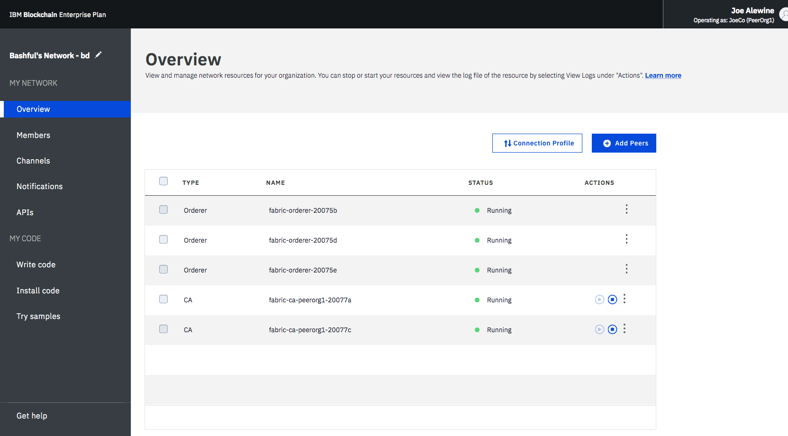

---

copyright:
  years: 2017
lastupdated: "2017-12-05"
---

{:new_window: target="_blank"}
{:shortdesc: .shortdesc}
{:codeblock: .codeblock}
{:screen: .screen}
{:pre: .pre}

# 操作网络
{: #v10_dashboard}

“网络监视器”提供区块链环境的概述，包括网络组件、成员、加入的通道、性能数据和已部署的链代码。
{:shortdesc}

“网络监视器”显示以下屏幕：
* 在“概述”屏幕中，可以查看网络服务凭证、组件状态信息并添加同级。
* 在“成员”屏幕中，可以管理网络成员和证书。
* 在“通道”屏幕中，可以创建新的通道并查看现有通道的信息。
* 在“链代码”屏幕中，可以在同级上安装和实例化链代码。
* 在“通知”屏幕中，可以处理暂挂的核准，并查看已完成的核准。
* 在“支持”屏幕中，可以查找参考资源的链接，并在每个发行版中查看新的和已更改的功能。

## 概述

“概述”屏幕显示有关区块链组件（包括订货人、CA 和同级节点）的实时状态信息。每个组件都显示在四个不同的标头下：**类型**、**名称**、**状态**和**操作**。在创建区块链网络期间，会自动创建三个订货人节点和两个 CA 节点。CA 是成员特定的，而订购节点是在整个网络中共享的公共端点。

**图 1** 显示“概述”屏幕：

*图 1. 网络概述*

- 节点操作

  表的**操作**标头提供了用于启动或停止组件的按钮。您还可以通过选择多个节点，然后单击**启动所选项**或**停止所选项**按钮，来启动或停止一组节点。选择一个或多个节点时，**启动所选项**或**停止所选项**按钮将显示在表的顶部。

  您还可以通过单击**操作**标头下的下拉列表中的**查看日志**，来检查组件日志。日志会公开在各种网络组件之间发生的远程过程调用，且在进行调试和故障诊断时非常有用。
例如，通过停止同级并尝试通过事务处理将其设定为目标来进行试验；您将看到 gRPC 连接错误。当您重新启动同级并尝试再次进行事务处理时，您将看到连接成功。您还可以在通道继续进行事务处理时，暂缓对同级的处理。
当再次恢复处理同级时，您将注意到分类帐通过 Gossip 协议而同步。
当同级与分类帐完全同步时，您可以执行正常的调用和查询。
  
- 服务凭证  
您可以通过单击“资源”选项卡右上角的**服务凭证**按钮来查看有关每个组件的低级网络信息的 JSON 文件。这是应用程序所需的所有配置信息。
但是，请注意，此文件仅包含特定组件和共享订购节点的地址。如果您需要将其他同级设为目标，那么您需要获取其端点。
包含“url”的头显示每个组件的 API 端点。需要这些端点才能以客户端应用程序的特定网络组件为目标，而其定义通常存在于应用程序随附的 JSON 模型化配置文件中。如果您定制需要组织外同级保证的应用程序，那么您需要在带外操作中从相关操作员处检索那些同级的 IP 地址。
客户端必须能够连接到它们需要从中获取响应的任何同级。
  
- 添加同级  
单击右上角的**添加同级**按钮，以将同级节点添加到网络。每个成员在一个网络中最多可添加三个同级。您可以在创建或加入网络时首次添加同级节点，或者稍后在“网络监视器”中进行添加。   
在弹出的“添加同级”面板中，选择要添加的同级节点的数目和大小。目前只有“小”同级可购买，但最终将有“中”和“大”，以适应更大的工作负载和更高的事务处理吞吐量。同级大小调整和性能指标的详细信息即将发布...
  
## 成员

“成员”屏幕包含两个选项卡，用于在“成员”选项卡中显示网络成员信息，在“证书”选项卡中显示证书信息。

**图 2** 显示初始“成员”屏幕，其中在“成员”选项卡中显示网络成员：

*图 2. 网络成员*

除了在创建网络时邀请的成员以外，您还可以在“成员”选项卡中邀请其他成员。要邀请成员加入您的网络，请输入机构名称和操作员的电子邮件地址，然后单击**添加成员**。网络总计可以有 15 个成员（包括网络发起者）。要从网络中除去成员，请单击成员行末尾的“除去”符号。

**图 3** 显示初始“成员”屏幕，其中在“证书”选项卡中显示成员证书：

*图 3. 证书*

操作员可以在“证书”选项卡中管理同一机构的成员的证书。单击**添加证书**以打开“添加证书”面板。向证书提供名称、将 PEM 格式的客户机端证书粘贴到“密钥”字段，然后单击**提交**。您需要在客户机端证书生效之前重新启动同级。

有关生成证书密钥的信息，请参阅[生成客户机端证书](v10_application.html#generating-the-client-side-certificates)。

## 通道

您可以将网络划分为多个通道，其中每个通道都表示有权查看该通道上已实例化的链代码数据的一部分成员。每个网络都必须至少有一个通道，以便进行事务处理。每个通道具有唯一的分类帐，用户必须经过正确的认证才能对此分类帐执行读/写操作。如果您不在通道上，那么看不到任何数据。

**图 4** 显示初始仪表板屏幕，其中显示网络中所有通道的概述：

*图 4. 通道*

创建通道将生成通道特定的分类帐。有关更多信息，请参阅[创建通道](howto/create_channel.html)。

您还可以选择现有通道以查看有关通道、成员资格和活动链代码的更精确详细信息。有关更多信息，请参阅[监视网络](howto/monitor_network.html)。  

## 链代码

链代码会定义用于创建和修改资产的业务逻辑和事务处理指示。

**图 5** 显示链代码的初始仪表板屏幕：

*图 5. 链代码*

链代码首先安装在同级文件系统上，然后在通道上进行实例化。有关更多信息，请参阅[安装和实例化链代码](howto/install_instantiate_chaincode.html)。

## 通知

您可以处理暂挂请求，并在“通知”屏幕中查看已完成的请求。 

**图 6** 显示“通知”屏幕：

*图 6. 通知*

在您创建通道或您受邀加入新通道时，将在“网络监视器”中出现一个通知。 

这些请求分组为“全部”、“暂挂”和“已完成”子选项卡。子选项卡标题后的数字指示每个子选项卡中的请求数。
   * 您可以在“全部”子选项卡中找到所有请求。
   * 未接受或拒绝的请求或尚未查看的请求在“暂挂”子选项卡中。单击**复查请求**按钮以查看请求，包括通道策略和成员，以及投票状态。如果您是通道操作员，那么您可以**接受**或**拒绝**请求，或者单击**稍后**以在其他时间对其进行处理。如果有足够多的通道操作员接受请求，那么您可以单击**提交请求**以激活通道更新。
   * 提交的请求将显示在“已完成”子选项卡中。您可以单击**复查请求**以查看其详细信息。
  
如果有一个较长的请求列表，那么可以在顶部的搜索字段中搜索请求。 

通过选择暂挂请求前面的框并单击**删除请求**，可以删除暂挂请求。请注意，无法删除已完成的请求。

## 支持

“支持”屏幕包含两个选项卡，在“支持”选项卡中提供支持信息，在“发行说明”选项卡中描述每个发行版的新增功能和已更改功能。

使用此页面上的链接和资源，可访问故障诊断和支持论坛。如果您无法调试问题或确定问题的答案，请单击**开具 {{site.data.keyword.Bluemix_notm}} 支持凭单**链接，并按照指南提交凭单。

**图 7** 显示初始“支持”屏幕，其中在“支持”选项卡中显示支持信息：

*图 7. 区块链支持*

* [{{site.data.keyword.blockchainfull_notm}} 服务文档](index.html)，其为此文档的站点，提供有关如何在 {{site.data.keyword.Bluemix_notm}} 上开始使用 {{site.data.keyword.blockchainfull}} Platform 的指导信息。您可以从导航器查找相应主题，也可以使用顶部的搜索功能搜索任何项。  
* **社区帮助** 下的 [IBM DeveloperWorks ](https://developer.ibm.com/blockchain/) 包含适用于开发者的资源和信息。  
* **支持凭单**下的 [IBM dWAnswers ](https://developer.ibm.com/answers/smartspace/blockchain/) 充当问题和响应的平台。您可以搜索先前发布的问题的响应，也可以提交新问题。请确保在问题中包含关键字**区块链**。   
您也可以通过[开具 {{site.data.keyword.Bluemix_notm}} 支持凭单 ]() 选项，向 {{site.data.keyword.blockchainfull_notm}} 支持团队提交问题。从特定 {{site.data.keyword.Bluemix_notm}} 实例共享详细信息和代码片段。  
* **{{site.data.keyword.blockchain}} 样本应用程序**下的[样本应用程序 ]() 提供了指导和样本代码片段，以帮助开发应用程序。  
* **Hyperledger Fabric** 下的 [Hyperledger Fabric ](http://hyperledger-fabric.readthedocs.io/) 和 [Hyperledger Fabric 社区 ]() 提供有关 Hyperledger Fabric 堆栈的更多详细信息。  
请与 [Hyperledger 专家 ](https://chat.hyperledger.org/channel/general) 讨论有关 Hyperledger Fabric 代码的问题。   
  
  
**图 8** 显示初始“成员”屏幕，其中在“发行说明”选项卡中显示每个发行版的新增功能和已更改功能：

*图 8. 发行说明*

