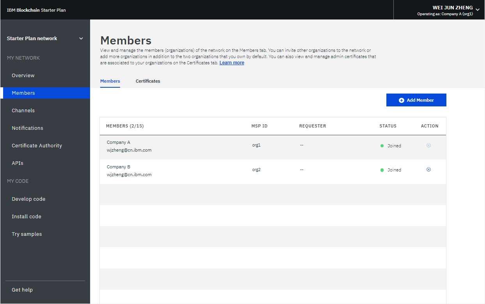
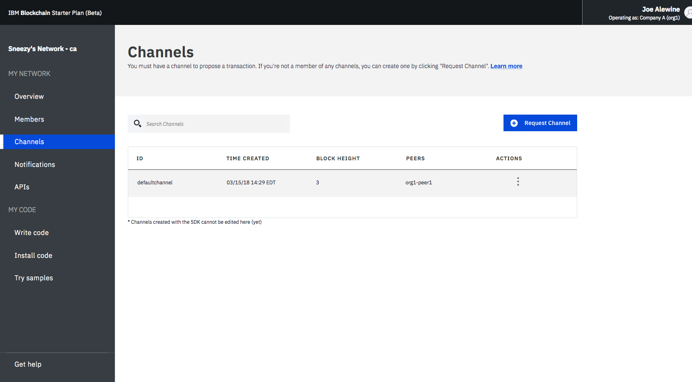
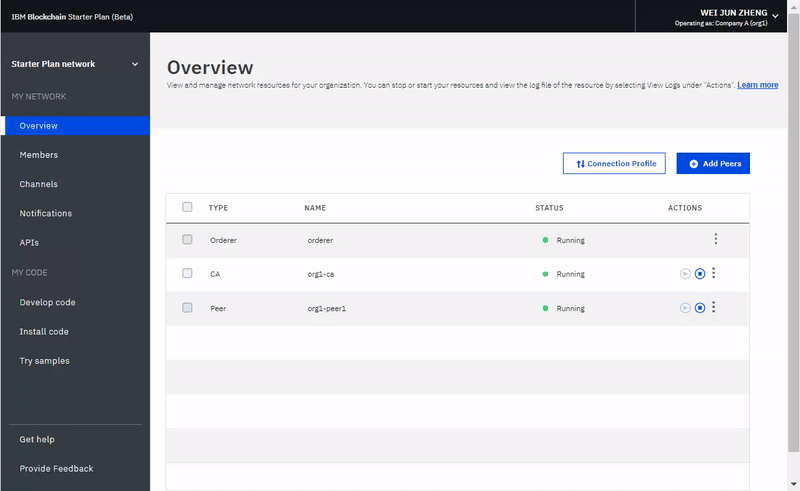

---

copyright:
  years: 2017, 2018
lastupdated: "2018-06-14"

---

{:new_window: target="_blank"}
{:shortdesc: .shortdesc}
{:codeblock: .codeblock}
{:screen: .screen}
{:pre: .pre}

# 操作入門範本方案網路
{: #operate-starter-plan-network}

「{{site.data.keyword.blockchainfull}} 平台」附有「網路監視器」，可提供區塊鏈環境的概觀，包括網路資源、成員、加入的頻道、交易效能資料及已部署的鏈碼。「網路監視器」亦提供一個進入點，可讓您執行 Swagger API、使用「{{site.data.keyword.blockchainfull_notm}} 平台：開發」來開發網路，以及試用範例應用程式。
{:shortdesc}

您可以在「網路監視器」中[變更入門範本方案網路的名稱](#sp-network-name)或[切換您建立的不同入門範本方案網路](#switch-sp-network)。

「網路監視器」分為三個區段來顯示下列畫面。您可以從「網路監視器」中的左導覽器來導覽至每個畫面。
- **我的網路**區段包含「[概觀](#overview)」、「[成員](#members)」、「[頻道](#channels)」、「[通知](#notifications)」及「[API](#apis)」畫面。
- **我的程式碼**區段包含「[開發程式碼](#write-code)」、「[安裝程式碼](#chaincode)」及「[嘗試範例](#samples)」畫面。
- 「[取得協助](#support)」畫面。

您可以從「網路監視器」右上角的下拉功能表，在您擁有的[組織之間切換](#switch-organizations)、[檢查網路喜好設定](#network-preferences)，以及[重設網路](#reset-network)。

此指導教學會說明上述每個畫面和功能。

## 更新網路名稱
{: #sp-network-name}

當您建立「入門範本方案」網路時，「{{site.data.keyword.blockchainfull_notm}} 平台」會為您的網路指派一個名稱。不過，您隨時都可在「網路監視器」中更新此網路名稱。

在「網路監視器」的左導覽器頂端，按一下網路名稱，欄位就會變成可編輯。鍵入您要使用的新網路名稱，然後按 **Enter** 鍵。您的網路名稱將在幾秒後更新。

**圖 1** 顯示將「入門範本方案」網路名稱從指派的名稱更新為「入門範本方案網路」的步驟。

*圖 1. 更新網路名稱*

## 切換入門範本方案網路
{: #switch-sp-network}

如果您使用「入門範本方案」建立多個網路，則可以在「網路監視器」中切換網路。

在「網路監視器」的左導覽器頂端，按一下網路名稱旁邊的箭頭圖示。從下拉清單中選取並按一下您要切換至的網路名稱。您的 Web 瀏覽器將會重新整理，並開啟您切換至之網路的「網路監視器」。

**圖 2** 顯示切換至另一個「入門範本方案」網路的步驟。

*圖 2. 切換網路*

## 概觀
{: #overview}

「概觀」畫面會顯示區塊鏈資源（包括排序節點、CA 及對等節點）的即時狀態資訊。每項資源都會顯示在四個不同的標頭之下：**類型**、**名稱**、**狀態**及**動作**。當您的網路啟動時，會有一個排序節點、一個 CA 及一個對等節點在執行中。CA 專屬於組織，而排序節點為整個網路共用的一般端點。

**圖 3** 顯示「概觀」畫面：

*圖 3. 網路概觀*

### 節點動作
  表格的**動作**標頭提供用來啟動或停止元件的按鈕。您也可以選取多個節點，然後按一下**啟動選取項目**或**停止選取項目**按鈕，以啟動或停止節點群組。當您選取一個以上的節點時，**啟動選取項目**或**停止選取項目**按鈕就會出現在表格頂端。

  您也可以從**動作**標頭下的下拉清單中，按一下**檢視日誌**，以查看元件日誌。這些日誌會顯示各種網路資源之間的呼叫，有助於進行除錯及疑難排解。

  **附註**：{{site.data.keyword.blockchainfull_notm}}在「入門範本網路使用者介面」中，當您在「概觀」畫面上列出的節點上按一下「檢視日誌」動作時，即會開啟「IBM Cloud 記載 Kibana」介面。依預設，會預先配置 Kibana，以顯示最後 15 分鐘活動的日誌。如果在最後 15 分鐘沒有任何活動，則您會看到一則訊息指出「找不到任何結果」。若要檢視所有日誌，您只要按一下使用者名稱右上角的計時器圖示，並設定更廣泛的時間範圍，例如「本週」或「本月」。

  若要瞭解啟動及停止對等節點的影響，您可以實驗停止對等節點，並嘗試將其設為交易的目標，您將會在日誌中看到連線錯誤。當您重新啟動對等節點，並嘗試再次進行交易時，就會看到連線成功。您也可以將對等節點關閉一段延伸時間，因為頻道會繼續交易。對等節點再度恢復時，您會注意到，隨著它接收在關閉時確定的區塊，分類帳會進行同步化。分類帳完全同步化之後，您就可以對其執行一般呼叫及查詢。

### 連線設定檔
  按一下**連線設定檔**按鈕，即可檢視 JSON 檔案，以查看每項資源的低層次網路資訊。連線設定檔包含您需要用於應用程式的所有配置資訊。然而，因為此檔案只包含您的特定元件和排序節點的位址，所以如果您需要將目標設為其他對等節點，則需要取得其端點。包含 "url" 的標頭會顯示每個元件的 API 端點。必須要有這些端點，才能將目標設為用戶端應用程式中的特定網路元件，且其定義通常會存放在隨附於此應用程式的 JSON 模型化配置檔中。如果您要自訂的應用程式需要組織外的對等節點背書，則您需要從頻外作業中的相關操作員擷取這些對等節點的 IP 位址。用戶端必須可以連接至任何需要其回應的對等節點。

### 新增對等節點
{: #peers}
網路成員需要有對等節點來儲存其網路分類帳副本，以及執行鏈碼來查詢或更新分類帳。如果背書原則將對等節點定義為背書對等節點，該對等節點也會將背書結果傳回至應用程式。

  依預設，「入門範本方案」會為這兩個組織各建立一個對等節點。您可以根據自己的需求，為您的組織新增更多對等節點。您可能會在不同情境下，需要更多對等節點。例如，您可能會想要將多個對等節點加入相同的頻道，以供備援。每個對等節點都會處理頻道的交易，並寫入其各自的分類帳副本。如果其中一個對等節點故障，另一個對等節點（或多個其他對等節點）可以繼續處理交易和應用程式要求。您也可以將所有應用程式要求在對等節點之間進行對稱負載平衡，或者您可以將不同對等節點設為不同功能的目標。例如，您可以使用一個對等節點來查詢分類帳，並使用另一個對等節點來處理分類帳更新項目的背書。

  按一下右上角的**新增對等節點**按鈕，以將對等節點新增至您的網路。在「新增對等節點」蹦現畫面中，選取您要新增的對等節點數目和大小。

## 成員
{: #members}

「成員」畫面包含兩個標籤，其中「成員」標籤會顯示網路成員資訊，而「憑證」標籤會顯示憑證資訊。

### 成員
{: #members_tab}
**圖 4** 顯示起始「成員」畫面，其中的「成員」標籤顯示您的網路成員：

*圖 4. 網路成員*

按一下**新增成員**，以邀請更多成員加入您的網路。在「入門範本方案」中，您有兩個選項：
- **邀請成員**。您可以邀請其他組織成為您的網路成員。然後受邀的組織可以加入網路，並在網路中與您分工合作。
- **建立成員**。您也可以使用自己的電子郵件位址來建立成員。您對該成員的控制權，就如同對「入門範本方案」預設提供的那兩個組織一樣。

**圖 5** 顯示「新增成員」視窗。

*圖 5. 新增成員*

### 憑證
**圖 6** 顯示起始「成員」畫面，其中的「憑證」標籤顯示成員憑證：

*圖 6. 憑證*

操作員可以在「憑證」標籤中為同一機構的成員管理憑證。按一下**新增憑證**，以開啟「新增憑證」畫面。為憑證命名，將 PEM 格式的用戶端憑證貼在「金鑰」欄位中，然後按一下**提交**。您需要重新啟動對等節點，用戶端憑證才會生效。

如需產生憑證金鑰的相關資訊，請參閱[產生用戶端憑證](v10_application.html#generating-the-client-side-certificates)。

## 頻道
{: #channels}

頻道是由想要進行私密交易的網路成員子集組成，提供資料隔離和機密性，可讓頻道成員建立特定規則和個別的分類帳，僅供頻道成員存取。每個網路都必須至少要有一個頻道，才能進行交易。每個頻道都有唯一的分類帳，使用者必須經過適當鑑別，才能對此分類帳執行讀寫作業。如果您不在頻道上，就看不到任何資料。

**圖 7** 顯示起始儀表板畫面，其中顯示網路中所有頻道的概觀：

*圖 7. 頻道*

建立頻道會導致產生頻道特定的分類帳。如需相關資訊，請參閱[建立頻道](howto/create_channel.html)。

您也可以選取現有頻道，以檢視更精確的頻道、成員資格和作用中鏈碼的詳細資料。如需相關資訊，請參閱[監視網路](howto/monitor_network.html)。

## 通知
{: #notifications}

您可以在「通知」畫面中處理擱置中的要求，以及檢視已完成的要求。

**圖 8** 顯示「通知」畫面：

*圖 8. 通知*

當您建立頻道或受邀加入新的頻道時，「網路監視器」中會出現通知。

這些要求會分組成「全部」、「擱置中」和「已完成」子標籤。標頭後面的數字代表各個子標籤中的要求數。
   * 您可以在「全部」子標籤中找到您的所有要求。
   * 您尚未接受或拒絕或是尚未檢視的要求都是在「擱置中」子標籤中。按一下**檢閱要求**按鈕，以檢視要求（其中包括頻道原則及成員）及投票狀態。如果您是頻道操作員，則可以**接受**或**拒絕**要求，或按一下**稍後**，以在另一個時間處理它。如果有足夠的頻道操作員接受該要求，您可以按一下**提交要求**，以啟動頻道更新。
   * 已提交的要求會出現在「已完成」子標籤中。您可以按一下**檢閱要求**來檢視其詳細資料。

如果您的要求清單很長，則可以在頂端的搜尋欄位中搜尋要求。

若要刪除擱置中要求，請選取要求前面的方框，然後按一下**刪除要求**。

## API
{: #apis}

「{{site.data.keyword.blockchainfull_notm}} 平台」會公開 Swagger 中的多種 REST API，可讓您用來管理網路的節點、頻道、對等節點及成員。您的應用程式可以使用這些 API 來控制重要網路資源，而不需要使用「網路監視器」。

**圖 9** 顯示「API」畫面：

*圖 9. API*

按一下 **Swagger 使用者介面**鏈結，以開啟 Swagger 使用者介面。請注意，您必須先將網路認證（可以在此 API 頁面中找到）授權給 Swagger 使用者介面，才能執行 API。如需相關資訊，請參閱[使用 Swagger API](howto/swagger_apis.html)。

## 開發程式碼
{: #write-code}

「入門範本方案」整合了「{{site.data.keyword.blockchainfull_notm}} 平台：開發」，並提供具備業界標準工具和技術的開發環境。您可以在線上環境或在本端環境中開發您的商業網路。開發商業網路之後，可以再將其部署回您的「入門範本方案」網路。

**圖 10** 顯示「開發程式碼」畫面：

*圖 10. 開發程式碼*

如需開發商業網路並將它部署回「入門範本方案」網路的相關資訊，請參閱[使用入門範本方案來開發商業網路](develop_starter.html)。

## 安裝程式碼
{: #chaincode}

鏈碼又稱為「智慧型合約」，是構成軟體的組件，其中包含用來查詢及更新分類帳的一組函數。鏈碼安裝在對等節點上，並在頻道上實例化。

**圖 11** 顯示「安裝程式碼」畫面：

*圖 11. 鏈碼*

鏈碼是先安裝在對等節點的檔案系統上，然後在頻道上實例化。如需相關資訊，請參閱[安裝、實例化及更新鏈碼](howto/install_instantiate_chaincode.html)。

## 嘗試範例
{: #samples}

範例應用程式可協助您進一步瞭解區塊鏈網路和應用程式開發。<!--Starter Plan enables you to deploy and launch sample applications in the Network Monitor. -->請遵循**在 GitHub 上檢視**鏈結來瞭解如何使用範例，並且將它們部署至「{{site.data.keyword.blockchainfull_notm}} 平台」。如需如何開發及部署範例的相關資訊，請參閱[部署範例應用程式](howto/prebuilt_samples.html)。

**圖 12** 顯示「嘗試範例」畫面：

*圖 12. 範例*

<!--
The sample deployment leverages the [DevOps Toolchain service ](https://console.bluemix.net/devops/toolchains) to automate your process of source control, delivery pipeline, and chaincode enablement. Choose a sample application, and click the **Deploy via Toolchain**. For more information, see [Deploying sample applications](howto/prebuilt_samples.html).
-->

## 取得協助
{: #support}

「取得協助」畫面包含兩個標籤，其中「支援」標籤會提供支援資訊，而「版本注意事項」標籤會說明各版本的新功能和已變更的功能。

**圖 13** 顯示起始「支援」畫面，其中的「支援」標籤顯示支援資訊：

*圖 13. 區塊鏈支援*

請使用此畫面上的鏈結和資源，來存取疑難排解和支援討論區。

* **開始使用**之下的 [{{site.data.keyword.blockchainfull_notm}} 服務文件](index.html)（就是這個文件網站），提供如何在 {{site.data.keyword.Bluemix_notm}} 上開始使用「{{site.data.keyword.blockchainfull}} 平台」的指引。您可以從左導覽器中尋找對應的主題，或是使用頂端的搜尋功能來搜尋任何術語。
* **社群協助**之下的 [IBM DeveloperWorks ](https://developer.ibm.com/blockchain/) 包含開發人員適用的資源和資訊。
* **支援問題單**之下的 [IBM dWAnswers ](https://developer.ibm.com/answers/smartspace/blockchain/) 提供問題和回應的平台。您可以從先前張貼的問題搜尋回應，或是提交新的問題。請務必要將 **blockchain** 關鍵字併入問題中。您也可以使用**開立 {{site.data.keyword.Bluemix_notm}} 支援問題單**選項，將問題單提交給 {{site.data.keyword.blockchainfull_notm}} 支援團隊。請從特定的 {{site.data.keyword.Bluemix_notm}} 實例中共用詳細資料及程式碼 Snippet。
* **區塊鏈範例應用程式**之下的[範例應用程式 ](https://github.com/ibm-blockchain) 提供指引和範例程式碼 Snippet，以協助開發應用程式。
* **Hyperledger Fabric** 之下的 [Hyperledger Fabric ](http://hyperledger-fabric.readthedocs.io/) 和 [Hyperledger Fabric 社群 ](http://jira.hyperledger.org/secure/Dashboard.jspa) 提供更多有關 Hyperledger Fabric 堆疊的詳細資料。您可以就 Hyperledger Fabric 程式碼的相關問題，與 [Hyperledger 專家 ](https://chat.hyperledger.org/channel/general) 討論。

如果您無法將問題除錯或查明問題的解答，請在「IBM Cloud 服務入口網站」中提交支援案例。如需相關資訊，請參閱[取得支援](ibmblockchain_support.html)。

**圖 14** 及**圖 15** 顯示起始「支援」畫面，其中的「版本注意事項」標籤顯示各版本的新功能和已變更的功能：

*圖 14. Helios 版本注意事項

*圖 15. Fabric 版本注意事項*

## 切換組織
{: #switch-organizations}

如果您自行模擬多組織區塊鏈網路，則可以切換至您擁有的任何組織，例如「組織 A」。然後，您可以在「網路監視器」中檢視及管理「組織 A」的網路資源，例如對等節點、頻道及鏈碼。此特性可讓您遵循頻道原則來建立頻道，以及將多個組織的對等節點新增至頻道。

按一下使用者介面的右上角，您應該會在這裡看到您的名稱。從**切換組織**下的下拉功能表中，選擇您要切換到哪個組織名稱。預設會選取「組織 A」。選擇您要切換到哪個組織之後，「網路監視器」會自動重新整理，您就能夠以該組織的身分檢視網路。

**圖 16** 顯示「切換組織」功能：

  
*圖 16. 切換組織*

## 網路喜好設定
{: #network-preferences}

按一下右上角，並開啟下拉功能表，然後開啟功能表中的**網路喜好設定**按鈕。即會開啟「網路喜好設定」視窗。「網路喜好設定」視窗會顯示網路的基本資訊，例如網路名稱、Fabric 版本、{{site.data.keyword.cloud_notm}} 中的網路位置，以及分類帳資料庫類型。如果您是網路起始者，則也可以在「網路喜好設定」視窗中管理 Web 閒置逾時。

### Web 閒置逾時
{: #web-inactivity-timeout}

**附註**：只有**網路起始者**才能變更 Web 閒置逾時設定。這是網路層次設定，將會影響所有網路成員。

依預設，Web 閒置逾時會設為**關閉**。如果您將 Web 閒置逾時轉換為**開啟**，則網路的任何成員都會在閒置 10 分鐘之後自動登出。當 Web 閒置計時器到達 10 分鐘時，Web 閒置逾時功能即會結束非作用中 Web 階段作業，以確保網路成員帳戶的安全。按一下鏈結或重新整理「網路監視器」，即會重設 Web 閒置計時器。到達 10 分鐘之前，關閉瀏覽器視窗或標籤也會結束 Web 階段作業。

**圖 17** 顯示「網路喜好設定」視窗：

*圖 17. 網路喜好設定*

## 重設網路
{: #reset-network}

「入門範本方案」可讓您編輯網路配置，而不需要刪除及重建網路。您的網路會重設回起始網路配置，其中包含兩個組織（每個組織各一個對等節點）和一個預設頻道。此功能很有用，例如，當您在區塊鏈網路上執行好幾輪測試時，這可讓您從相對乾淨的網路重新開始。

**警告**：重設網路之後，對等節點、排序節點及 CA 的 API 端點會變更。您需要在應用程式中調整 API 端點資訊。

按一下右上角，並開啟下拉功能表。按一下功能表中的**重設網路**按鈕。如果您已準備好重設網路，請按一下**確定**以繼續。「網路監視器」將會重新整理，以反映新的設定。

**圖 18** 顯示「重設網路」功能：

*圖 18. 重設網路*
