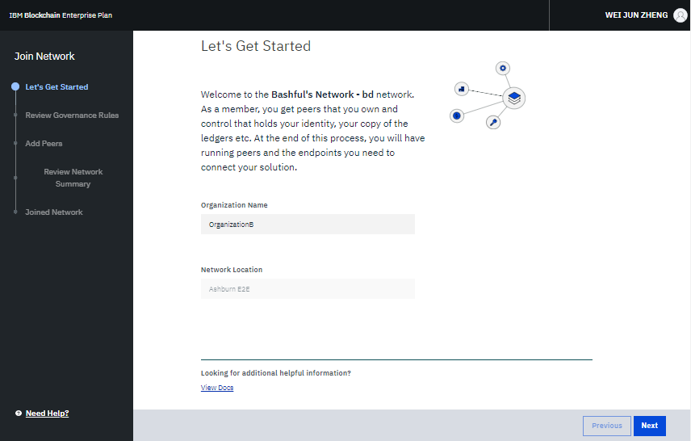

---

copyright:
  years: 2017, 2018
lastupdated: "2018-03-16"

---

{:new_window: target="_blank"}
{:shortdesc: .shortdesc}
{:screen: .screen}
{:codeblock: .codeblock}
{:pre: .pre}
{:tip: .tip}

# 控管企業方案網路
{: #getting-started-with-blockchain}

「{{site.data.keyword.blockchainfull}} 平台企業方案」提供具有高度安全性、完整性、可調整性及效能的區塊鏈網路。您可以快速佈建全功能的網路，並使用「網路監視器」（這是一個 GUI 儀表板）來立即執行[鏈碼](glossary.html#chaincode)和應用程式，而不需要重頭開始設計及配置網路。
{:shortdesc}

**附註**：「{{site.data.keyword.blockchainfull_notm}} 平台企業方案」提供正式作業環境。如果您需要開發及測試環境，請參閱[關於入門範本方案](starter_plan.html)。

此指導教學介紹所需遵循的必要條件和步驟，以在 IBM 的高可用性安全環境中管理「企業方案」網路。  

下列步驟指出啟動具有多個網路[成員](glossary.html#member)之「企業方案」網路的基本流程：
1. **網路起始者**（一種特殊類型的網路成員）建立網路，並定義控管原則。接著，網路起始者可以邀請其他[組織](glossary.html#organization)加入此網路，成為網路成員。如需相關資訊，請參閱[建立網路](#creating-a-network)。
2. 受邀的**網路成員**收到一封電子郵件通知，提供他們加入 {{site.data.keyword.blockchain}} 網路的指示。除了電子郵件通知中的指示，您也可以遵循[加入網路](#joining-a-network)中的步驟操作。
3. 所有**網路成員**在建立或加入網路之後，可以進入「網路監視器」來配置及管理其網路資源。您可以設定含有一組網路成員的[頻道](glossary.html#channel)，以在頻道特定的分類帳（僅限頻道成員存取）上執行私人交易。在「網路監視器」中，您也可以將自己的對等節點加入頻道，然後在那些對等節點上安裝及實例化鏈碼。如需相關資訊，請參閱[配置網路資源和環境](#configuring-network-resources-and-environment)。
4. **應用程式開發人員**在開發應用程式之後，使其應用程式與網路之間能夠互動。如需相關資訊，請參閱[使應用程式可與網路互動](#enabling-applications-to-interact-with-the-network)。
5. **網路操作員**在「網路監視器」中監視其頻道上的交易。如需相關資訊，請參閱[監視網路資源](#monitoring-network-resources)。

## 建立網路
開始之前，您需要在 {{site.data.keyword.Bluemix_notm}} 上建立「[{{site.data.keyword.blockchain}} 平台」服務實例 ](https://console.bluemix.net/catalog/services/blockchain)。您需要使用您的 {{site.data.keyword.Bluemix_notm}} ID 登入。如果您沒有 ID，請按一下**註冊以建立**按鈕。將實例的服務和認證名稱重新命名，以便您未來能夠輕易辨識。選取您可以在其中部署 {{site.data.keyword.blockchain}} 網路的 {{site.data.keyword.Bluemix_notm}} 地區、組織和空間。然後從定價方案表格中選取**企業成員資格方案**，並按一下**建立**按鈕。  

您可以在 [{{site.data.keyword.Bluemix_notm}} 服務儀表板 ](https://console.bluemix.net/dashboard/services "{{site.data.keyword.Bluemix_notm}} 服務儀表板") 中找到您的「{{site.data.keyword.blockchain}} 平台」服務實例。  

如果您是網路起始者，請按一下**建立網路**按鈕，以起始 {{site.data.keyword.blockchain}} 網路。遵循精靈指示，完成網路和資源的基本配置。  
  

1. 在「讓我們開始使用吧！」畫面中，為您的網路命名，選擇 {{site.data.keyword.Bluemix_notm}} 組織的位置，並新增您的機構名稱。當您邀請其他網路成員時，他們將會尋找此網路名稱來加入。按**下一步**。
2. （選用）在「邀請成員」畫面中，輸入您想要邀請加入網路之成員的機構名稱和電子郵件位址。您指定的機構名稱並不是正式稱號。它只是用來讓您輕易地辨識該機構，在成員加入網路之後，可再加以變更。請注意，一個網路最多可以有 15 個成員（包括您自己）。此為選用步驟，您之後可以在「網路監視器」中，邀請成員加入您的網路。按**下一步**。在您完成建立網路的所有步驟之後，您邀請的成員將會收到關於邀請的電子郵件通知。
3. 在「定義控管規則」畫面中，建立成員資格、頻道建立和鏈碼的原則。依預設，所有網路成員都可以邀請其他成員加入網路、建立頻道及實例化鏈碼。您的網路目前是使用預設控管原則。按**下一步**。
4. 在「檢閱摘要」畫面中，驗證您的網路配置。如果您要進行修改，請按一下區段標頭旁邊的**編輯**，或按**上一步**按鈕，回到前一個畫面。完成網路配置後，請按一下**完成**。  
5. 您會在「已建立網路」畫面上收到通知，指出已順利建立您的網路。您可以按一下**新增[對等節點](glossary.html#peer)**，以配置網路資源，或直接按一下**進入監視器**，以開啟「網路監視器」。您也可以之後再於「網路監視器」中新增對等節點。如需對等節點的相關資訊，請參閱[新增對等節點](v10_dashboard.md#add_peers)。

現在您已成功部署能夠支援下列網路資源的 {{site.data.keyword.blockchain}} 網路：  
* 成員特定的憑證管理中心 (CA)
* 預設控管原則
* 最多 15 個網路成員  
* 三個排序節點和兩個中繼 CA 節點
* 每個成員最多 3 個小型對等節點  
* 損毀容錯排序服務
* 最多 150 個頻道
* 「網路監視器」中每個成員最多 10 個鏈碼實例化作業

## 加入網路
與建立網路類似，您需要在 {{site.data.keyword.Bluemix_notm}} 上建立「[{{site.data.keyword.blockchain}} 平台」服務實例 ](https://console.bluemix.net/catalog/services/blockchain)。您需要使用您的 {{site.data.keyword.Bluemix_notm}} ID 登入。如果您沒有 ID，請按一下**註冊以建立**按鈕。將實例的服務和認證名稱重新命名，以便您未來能夠輕易辨識。選取您可以在其中部署 {{site.data.keyword.blockchain}} 網路的 {{site.data.keyword.Bluemix_notm}} 地區、組織和空間。然後從定價方案表格中選取**企業成員資格方案**，並按一下**建立**按鈕。

您可以在 [{{site.data.keyword.Bluemix_notm}} 服務儀表板 ](https://console.bluemix.net/dashboard/services "{{site.data.keyword.Bluemix_notm}} 服務儀表板") 中找到您的「{{site.data.keyword.blockchain}} 平台」服務實例。

如果您是受邀的網路成員，請按一下**擱置邀請 ->** 按鈕，從下拉清單中選取您要加入的網路，然後按一下**加入網路！**按鈕。遵循精靈指示，檢視網路的網路基本配置，並配置您自己的網路資源。  
  

1. 在「讓我們開始使用吧！」畫面中，輸入您的組織名稱，並按**下一步**。
2. 在「檢閱控管規則」畫面中，檢閱成員資格、頻道建立和鏈碼的網路控管原則。按**下一步**。
3. （選用）在「新增對等節點」畫面中，選擇您要新增的對等節點數量。按**下一步**。網路中的每個成員最多可以新增 3 個對等節點。此為選用步驟，您之後可以在「網路監視器」中新增對等節點。如需對等節點的相關資訊，請參閱[新增對等節點](v10_dashboard.html#peers)。
4. 在「檢閱網路摘要」畫面中，驗證網路配置。如果您要進行修改，請按**上一步**按鈕，以回到前一個畫面。完成資源配置之後，請按一下**完成**。您將會收到已順利加入網路的通知。然後，您就可以按一下**進入監視器**，以開啟「網路監視器」。

<!-- or click **Create a Channel** to initiate a channel creation request. You can create channels later in the Network Monitor. For more information, see [Channels](v10_dashboard.html#channels).  -->

## 配置網路資源和環境

1. 在建立或加入 {{site.data.keyword.blockchain}} 網路之後，進入您的「網路監視器」。「網路監視器」是一種 GUI 儀表板，您可以在其中管理及追蹤網路狀態資訊。如需相關資訊，請參閱[網路監視器](v10_dashboard.html)。
2. 將您自己的對等節點新增至網路。如果您已新增足夠的對等節點，請跳過此步驟。對等節點會執行鏈碼，且其為與應用程式互動的端點。在「概觀」畫面中按一下**新增對等節點**，然後選取對等節點的數量和大小。如需相關資訊，請參閱[概觀](v10_dashboard.html#resources)。
3. 設定頻道。相同頻道中的所有成員都會佈建頻道特定的分類帳，其可提供資料隔離和機密性。如需如何建立頻道的相關資訊，請參閱[建立頻道](howto/create_channel.html#creating-a-channel)。  
如果您是受邀加入頻道的頻道成員，您會收到電子郵件通知，其中的鏈結會連接至可讓您加入頻道的精靈。
4. 將對等節點加入頻道。唯有與頻道相關聯的對等節點可以存取其分類帳。如需相關資訊，請參閱[頻道](v10_dashboard.html#channels)。
5. 安裝及實例化鏈碼。所有頻道成員都需要在將執行鏈碼的每一個對等節點上，安裝具有相同名稱和版本的相同鏈碼。安裝鏈碼之後，必須先在頻道上將它實例化，才能開始使用。如需相關資訊，請參閱[安裝、實例化及更新鏈碼](howto/install_instantiate_chaincode.html)。  

**附註**：若要達到高可用性，每個組織必須購買至少 2 個對等節點，而在頻道中，每個參與的成員必須加入至少 2 個對等節點。

## 擷取網路認證和連線設定檔
在 {{site.data.keyword.cloud_notm}} 中建立「企業方案」網路之後，您可以從服務實例頁面或在「網路監視器」中擷取網路認證和連線設定檔。

### 從服務實例頁面擷取
建立服務實例之後，您就會在服務實例頁面上。您也可以在 [{{site.data.keyword.cloud_notm}} 服務儀表板 ](https://console.bluemix.net/dashboard/services "{{site.data.keyword.cloud_notm}} 服務儀表板") 中按一下您的服務，以開啟服務實例頁面。

使用下列步驟來擷取您的服務認證：
1. 在服務實例頁面上，按一下左導覽器中的**服務認證**，以顯示「服務認證」畫面。
2. 在「服務認證」畫面中，按一下**新建認證**。
3. 在「新增認證」畫面中，為認證命名，然後按一下**新增**。新建的認證會新增在表格中。您可以按一下「動作」直欄下的**檢視認證**，以檢視認證詳細資料。此認證包含 API 金鑰和密碼，可用來授權 API。如果您想要查看網路的連線設定檔，請在建立新的認證時，將 **{"legacy": true}** 輸入為線型配置參數。連線設定檔包含網路資源的 API 端點，您可以將其用在 API 和應用程式中。

### 在網路監視器中擷取
您可以在「網路監視器」的「API」畫面中找到網路認證。如需使用 API 的相關資訊，請參閱[以 Swagger 來試用 API](apis.html)。

您可以在「網路監視器」的「概觀」畫面中擷取連線設定檔。按一下「概觀」畫面上的**連線設定檔**按鈕，連線設定檔就會顯示在新頁面中。

## 開發及部署自訂商業網路
您可以使用「IBM Blockchain 平台：開發」開發人員環境和 Hyperledger Composer 開發人員工具集，根據您的商業需求來開發商業網路。針對您的業務來開發網路之後，可以將您的商業網路部署至「企業方案」網路。

如需相關資訊，請參閱[開發網路](develop.html)和[在企業方案上部署商業網路](develop_enterprise.html)。

## 使應用程式可與網路互動
應用程式會利用 SDK API 來與您的 {{site.data.keyword.blockchain}} 網路資源互動。您必須在應用程式中新增網路資源的 API 端點資訊，這樣應用程式最終才能以您的對等節點作為交易要求的目標。然後，您可以從「網路監視器」新增 API 端點資訊。應用程式可以在您的本端檔案系統或 {{site.data.keyword.Bluemix_notm}} 上進行管理。如需相關資訊，請參閱[開發應用程式](v10_application.html)。

## 監視網路資源  
從您的應用程式觸發交易之後，您可以在「網路監視器」中檢視交易狀態資訊。如需網路監視的相關資訊，請參閱[監視網路](howto/monitor_network.html)。

## 離開網路
如果您要離開網路，請從 {{site.data.keyword.Bluemix_notm}} 儀表板中刪除區塊鏈服務實例。  

**附註**：在您離開網路之前，請確定您不是網路任何頻道中的成員。否則，您會在離開網路時收到錯誤。頻道成員移除需要完成頻道更新處理程序。如需頻道更新處理程序的相關資訊，請參閱[更新頻道](howto/create_channel.html#updating-a-channel)。

<!--
## References
* For more information about {{site.data.keyword.blockchainfull_notm}} offerings, see [Blockchain offerings](index.html).
* For more information about Hyperledger Fabric, see [Hyperledger Fabric documentation ](http://hyperledger-fabric.readthedocs.io/en/latest/){:new_window}.
-->
