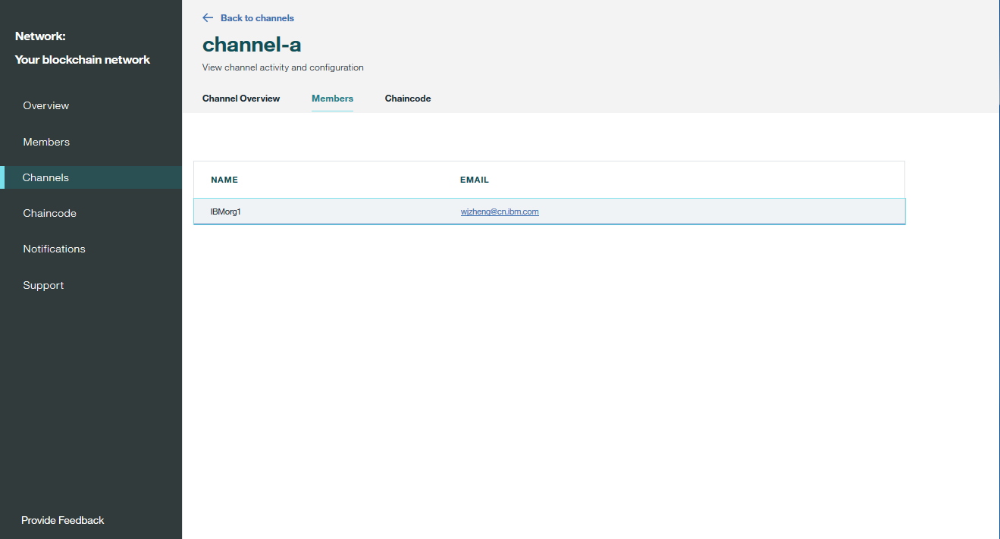

---

copyright:
  years: 2017, 2018
lastupdated: "2018-10-04"

---

{:new_window: target="_blank"}
{:shortdesc: .shortdesc}
{:screen: .screen}
{:codeblock: .codeblock}
{:pre: .pre}

# 監視區塊鏈網路


***[此頁面有幫助嗎？請告訴我們。](https://www.surveygizmo.com/s3/4501493/IBM-Blockchain-Documentation)***


本指導教學顯示如何在 {{site.data.keyword.cloud_notm}} 上檢視及監視 {{site.data.keyword.blockchain}} 網路的狀態資訊。
{:shortdesc}


## 監視對等節點、排序節點及 CA
{: #monitor-nodes}

您可以對其中一個網路節點發出 HTTP **HEAD** 要求，以檢查節點狀態。網路節點可以是區塊鏈網路中的對等節點、排序節點或 CA。**HEAD** 要求類似於 GET 要求，而且只會傳送不含內文的標頭。如果節點正常運作，則您會取得 200 回應。

1. 在「網路監視器」的「概觀」畫面中，按一下**連線設定檔**。然後，您可以按一下**原始 JSON** 以在 Web 瀏覽器中檢視連線設定檔，或按一下**下載**以在本端儲存連線設定檔。
2. 在連線設定檔中，尋找您要檢查之網路節點的 URL 資訊。例如，`fabric-orderer-20190b` 排序節點的 URL 是 `grpcs://fft-zbc02b.4.secure.blockchain.ibm.com:20190`。
    
3. 將 URL 中的 **grpcs** 取代為 **https**。在上述範例中，URL 會變成 `https://fft-zbc02b.4.secure.blockchain.ibm.com:20190`。
4. 使用工具（例如 curl 或 Chrome Postman 應用程式），對 URL 發出 **HEAD** 要求。
    - 如果您取得 200 狀態回應，表示您的網路節點正常運作。
    - 如果 **HEAD** 要求因連線錯誤而失敗，則您的網路節點可能未執行、節點 URL 錯誤，或防火牆封鎖您對節點的存取。您必須解決此錯誤；否則，您的應用程式會無法連接節點。

下列範例顯示 curl 中具有 200 回應的 **HEAD** 要求。請注意，您可以忽略 grpc 錯誤，因為 HTTP **HEAD** 要求會檢查是否可存取節點。如果是，則對節點的 grpc 要求也會作用於您的應用程式。

```
C:\>curl -i --head https://fft-zbc02b.4.secure.blockchain.ibm.com:20190
HTTP/2 200
contnent-type: application/grpc
grpc-status: 8
grpc-message: malformed method name: "/"
```
{:codeblock}

下列範例顯示 curl 中具有連線錯誤的 **HEAD** 要求。

```
C:\>curl -i --head https://fft-zbc02b.4.secure.blockchain.ibm.com:20190
curl: (7) Failed to connect to fft-zbc02b.4.secure.blockchain.ibm.com:20190: Connection refused
```
{:codeblock}

下圖顯示 Chrome Postman 應用程式中具有 200 回應的 **HEAD** 要求。

  

## 使用網路日誌
「網路監視器」的「概觀」畫面顯示「排序服務」、「憑證管理中心」及對等節點的狀態。按一下**動作**標頭下之下拉清單中的**檢視日誌**，以檢視特定網路元件的日誌。如果您使用「企業方案」網路，則可以使用文字檔格式檢視元件日誌。如果您使用「入門範本方案」網路，則 [{{site.data.keyword.cloud_notm}} Log Analysis 服務 ](https://console.bluemix.net/catalog/services/log-analysis) 會收集元件日誌，而且您可以在 [Kibana](#viewing-logs-in-kibana-in-starter-plan) 中檢視日誌。

每一個元件都會從不同的活動產生日誌。這是因為每一個元件在 Hyperledger Fabric [網路架構 ](https://hyperledger-fabric.readthedocs.io/en/release-1.2/network/network.html) 及[交易流程 ](https://hyperledger-fabric.readthedocs.io/en/release-1.1/txflow.html) 中扮演不同的角色。

- **排序服務日誌**
  「排序服務」是區塊鏈網路的一般連結元件。來自對等節點、頻道更新項目或網路成員資格更新項目的所有背書的交易提案都會傳送至「排序服務」，以進行驗證。因此，「排序服務」包含網路啟動時的日誌。它還包含已遭拒絕之交易的日誌，因為正確的組織未適當地對其背書。您也可以找到建立或更新頻道時或頻道更新失敗時的日誌。

- **憑證管理中心日誌**
  「憑證管理中心」會管理網路內的參與者身分。在「憑證管理中心」日誌中，您可以找到參與者產生公開和私密金鑰與網路進行通訊（登記）時，或新成員、對等節點或應用程式向憑證管理中心進行登錄時的日誌。如果憑證驗證有任何問題，您也可以使用 CA 日誌來進行除錯。

- **對等節點日誌**  
對等節點日誌包含安裝、實例化及呼叫鏈碼的結果。您可以搜尋鏈碼名稱及版本，以尋找特定鏈碼的日誌。您也可以從[頻道監視器的鏈碼區段](#monitor-channel-cc)中查看來自特定鏈碼的日誌。在您的對等節點日誌中，可以找到您的交易提案所產生的訊息，或與您的提案要求有關的任何逾時問題。對等節點日誌也會包含因不符合[鏈碼的背書原則](install_instantiate_chaincode.html#endorsement-policy)而遭拒絕之交易中的錯誤。您也可以找到頻道加入要求的結果。

Hyperledger Fabric 會根據訊息的嚴重性提供不同的[記載層次 ](https://hyperledger-fabric.readthedocs.io/en/release-1.1/logging-control.html "記載控制")。{{site.data.keyword.blockchainfull_notm}} Platform 上的預設記載層次是 `INFO`。若要檢視其他日誌，您可以開立[支援問題單](../ibmblockchain_support.html#submitting-support-cases)，將記載層次設為更詳細的 `DEBUG`。請注意，`DEBUG` 層次日誌會顯示您可能需要過濾的大量聊天訊息。在訊息中搜尋 `warning` 或 `error`，以偵測來自 Hyperledger Fabric 元件的問題。若要偵測元件容器是否失敗或已遭刪除，請搜尋 {{site.data.keyword.cloud_notm}} 已傳送的 `panic` 或 `killed` 訊息。

## 在入門範本方案中於 Kibana 中檢視日誌
[{{site.data.keyword.cloud_notm}} Log Analysis 服務 ](https://console.bluemix.net/catalog/services/log-analysis "Log Analysis 服務") 會收集「入門範本方案」網路的日誌。依預設，Log Analysis 服務的「精簡方案」會收集您的日誌。這是免費方案，而且會先**將您的日誌儲存三天**，然後再予以捨棄。它也容許您**只搜尋每天前 500 MB 的日誌**。如果您的網路日誌超出 500 MB，則無法在 Kibana 中檢視新的日誌。如果您的網路產生超過 500 MB 的日誌，或您要將日誌保留超過三天，則可以升級至「Log Analysis 服務」的付費版本。

在「網路監視器」的「概觀」畫面中，按一下**動作**標頭下之下拉清單中的**檢視日誌**，以在 Kibana 介面中開啟每一個網路元件日誌。Kibana 開啟時，它會顯示在頂端搜尋列過濾的日誌。例如，當您按一下以檢視對等節點日誌時，搜尋會依您的網路 ID 及對等節點 ID 進行過濾：`NETWORK_ID_str:"nf8389d520c243004bb21ff5d70fc8939" && NODE_NAME_str:"org1-peer1"`。如果要檢視更特定的日誌，您可以在搜尋列中輸入其他欄位。例如，您可以新增 `&& "marbles"`，以顯示來自 `"marbles"` 鏈碼的日誌。刪除特定元件術語，並僅使用網路 ID 進行搜尋，例如，`NETWORK_ID_str:"nf8389d520c243004bb21ff5d70fc8939"` 會顯示來自所有網路元件的日誌。

您可以使用右上角的時間範圍按鈕，來變更日誌的顯示時段。您也可以使用畫面左側的標籤，在搜尋中新增及移除欄位。要顯示的最重要的欄位就是訊息欄位。搜尋沒有時間戳記的訊息可能有助於尋找該訊息日誌的所有實例。按一下**儲存**按鈕，以儲存現行搜尋並回到特定視圖。如需在 Kibana 中顯示資料的相關資訊，請參閱 [Kibana 使用手冊 ](https://www.elastic.co/guide/en/kibana/6.2/index.html "Kibana 使用手冊")。您也可以使用 Log Analysis CLI，將[日誌下載](https://console.bluemix.net/docs/services/CloudLogAnalysis/how-to/manage-logs/downloading_logs_cloud.html#downloading_logs)至本端檔案系統。

**附註：**依預設，Kibana 會預先配置為顯示來自 30 天活動的日誌。如果在最後 30 天沒有任何活動，您會看到一則訊息指出*找不到任何結果*。若要檢視其他日誌，您可以按一下使用者名稱右上角的計時器圖示，並設定更廣泛的時間範圍，例如*年初迄今*。

## 監視頻道
{: #monitor-channnels}

進入「網路監視器」，並且在「頻道」畫面中找出您要檢視及監視的頻道。在特定頻道畫面中，您可以在三個標籤中檢視此頻道的資料狀態資訊、成員和實例化的鏈碼：

### 頻道概觀
{: #monitor-channel-overview}

「頻道概觀」標籤顯示此頻道的區塊資訊：
  * 一系列資料點，其中包括已建立的區塊總數、自前次交易以來的時間間隔、鏈碼實例化數目，以及鏈碼呼叫數目。
  * 一份表格，列出此頻道上的所有區塊。展開區塊，即可檢視該區塊的詳細資訊。

  

### 成員
{: #monitor-channel-members}

「成員」標籤顯示此頻道之成員的資訊，包括組織操作員的電子郵件位址。

  

### 鏈碼 (Chaincode)
{: #monitor-channel-cc}

 「鏈碼」標籤列出此頻道上已實例化的所有鏈碼，以及鏈碼 ID、版本和正在執行該鏈碼的對等節點數目。

展開鏈碼列，以取得鏈碼的詳細資訊：
  * 您可以按一下 **JSON**，以檢視鏈碼的 JSON 檔案。
  * 您可以按一下**日誌**，以檢視鏈碼的日誌。此視圖顯示來自已安裝鏈碼之對等節點的日誌，並會使用鏈碼名稱及版本進行過濾。

建議在每一個鏈碼函數之後新增唯一的成功或錯誤訊息，以協助您監視及除錯鏈碼。如果您有一個複雜的程式碼，使用許多不同的檔案，則可以在鏈碼日誌中新增唯一的關鍵字，其可協助您尋找來自不同交易階段的訊息。
   * 您可以按一下**刪除**，以移除執行中的鏈碼容器。請注意，刪除執行中鏈碼容器，實際上並不會刪除鏈碼。無法刪除區塊鏈網路上的實例化鏈碼。

  


## 監視鏈碼
{: #monitor-chaincode}

進入「網路監視器」，並開啟「安裝程式碼」畫面。如果您有執行中的鏈碼，則可以在表格中看到鏈碼，以及鏈碼 ID 及版本。從下拉清單中選擇對等節點，就可以在表格中看到此對等節點的所有鏈碼。您可以在特定「頻道」畫面的[「鏈碼」標籤](#monitor-channel-cc)上，檢視鏈碼的日誌。

  

<!----
## Monitoring sample applications
{: #monitor-apps}

In a Starter Plan network, you can view and access sample applications in the "Try Samples" screen of the Network Monitor.  After you deploy a sample application, you can click the **Launch** button to enter your application interface, or the **View on GitHub** link to visit the code repository.  For more information, see [Deploying sample applications](prebuilt_samples.html).

  
--->
