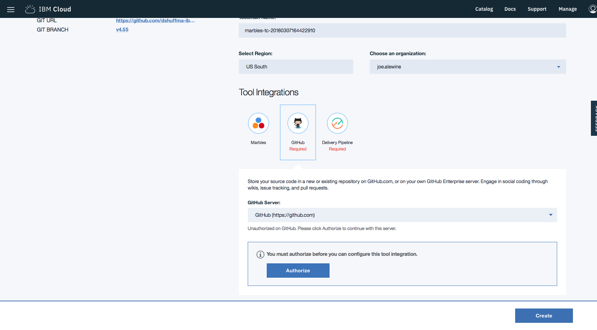

---

copyright:
  years: 2018
lastupdated: "2018-08-31"

---

{:new_window: target="_blank"}
{:shortdesc: .shortdesc}
{:screen: .screen}
{:codeblock: .codeblock}
{:pre: .pre}

# 部署範例應用程式
{: #overview}

***[此頁面有幫助嗎？請告訴我們。](https://www.surveygizmo.com/s3/4501493/IBM-Blockchain-Documentation)***

「{{site.data.keyword.blockchainfull}} 平台」提供可部署及測試的範例應用程式，讓您能夠進一步瞭解區塊鏈網路和應用程式開發。
{: shortdesc}

|  範例        | 使用案例       | 樣本類型     | 建立者及支援         |
| --------------|---------------------|----|-------|
| [Marbles ](https://github.com/IBM-Blockchain/marbles "Marbles")| 多個使用者可以建立具有不同內容的彈珠，並將彈珠轉移給其他使用者。    遵循指示，在 {{site.data.keyword.cloud_notm}} 的「{{site.data.keyword.blockchainfull_notm}} 服務」上部署「彈珠」。請注意，畫面擷取會顯示「企業方案使用者介面」，而不是「入門範本方案」。此功能類似。| 具有 Javascript 應用程式的 GO 鏈碼| IBM  [取得協助 ](https://github.com/IBM-Blockchain/marbles/issues "取得協助") |
|[Vehicle Manufacture ](https://github.com/IBM-Blockchain/vehicle-manufacture "Vehicle Manufacture") | 使用者可以體驗虛擬汽車的整個生命週期。    遵循指示，**手動將此展示部署至 {{site.data.keyword.cloud_notm}}**，以取得將範例部署至網路的逐步指引。|具有 Javascript 應用程式的「[Hyperledger Composer](../references/hyperledger_composer.html) 商業網路定義」 | IBM  [取得協助 ](https://github.com/IBM-Blockchain/vehicle-manufacture/issues "取得協助") |
|[Perishable Goods ](https://github.com/clauseHQ/demo-clause-ibm-perishable-goods "Perishable Goods")| 使用者可以根據交貨和溫度讀數，部署可在供應鏈中採購貨品的法律合約。     <!-- This sample leverages the [Toolchain tool service](../images/external_link.svg "External link icon")](https://console.bluemix.net/docs/services/ContinuousDelivery/index.html) to deploy the sample on your network automatically.--> |具有 Javascript 應用程式的「[Hyperledger Composer](../references/hyperledger_composer.html) 商業網路定義」 | [Clause ](http://clause.io/ "Clause")  [取得協助 ](https://github.com/clauseHQ/demo-clause-ibm-perishable-goods/issues "取得協助") |

範例應用程式由 IBM 及社群夥伴建立。透過對應的 Github 儲存庫提供對範例的支援。如果您遇到問題，請按一下發佈者名稱旁邊的**取得協助**鏈結，然後在 Github 儲存庫中開立問題，以通知相關團隊。

若要部署範例，您在 {{site.data.keyword.cloud_notm}} 上需要有使用「入門範本方案」或「企業方案」的區塊鏈網路，並配置頻道及對等節點。如需相關資訊，請參閱[控管入門範本方案網路](../get_start_starter_plan.html)和[控管企業方案網路](../get_start.html)。

<!--

After you provision a Starter Plan network, you can deploy the sample applications in the Network Monitor, which automates the steps to enable sample applications to run on your network. You can also enable the samples step-by-step to learn the entire process of application deployment, which you need to follow when you deploy your own applications.

-->

<!--
## Deploying sample applications in Starter Plan

Starter Plan provides a simple approach to deploy sample applications by leveraging the Toolchain service on {{site.data.keyword.cloud_notm}} with just a few clicks. After you deploy and launch a sample application, it will run on your blockchain network automatically.

Starter Plan provides two sample applications for you to start with.

* **Marbles**

  The Marbles sample enables users to create virtual marbles with different properties and to transfer them with other users. For more information about Marbles, see [Marbles Demo ](https://github.com/IBM-Blockchain/marbles).

* **Vehicle Manufacture**

  The Vehicle Manufacture sample enables users to go through the lifecycle of a virtual vehicle. For more information about this sample, see [Vehicle Manufacture ](https://github.com/IBM-Blockchain/vehicle-manufacture).

Complete the following steps to deploy a sample application:

1. Enter the **Network Monitor** of your Starter Plan network. If you don't have one, see [Creating a network](../get_start_starter_plan.html#creating-a-network).

2. Open the "Try samples" screen in your Network Monitor. Choose the sample application that you want to deploy and click the **Deploy via Toolchain** button.

3. A Toolchain service configuration window opens. Ensure that all required tools are correctly integrated. Note that if you have more than one organizations, make sure that you enter the correct organization name. The organization name should be the email address that you use to sign up for the network.
    **Tip**: You must disable pop-up blockers so that the Toolchain service configuration page can open.

  If this is the first application that you deploy via Toolchain, you need to authorize Toolchain to access the GitHub repository.

  

  After you click the "Authorize" button, you are taken to GitHub. If you don't have a GitHub account, you need to create one. Give Toolchain access to your repositories by entering your account information. If you don't want to give Toolchain this access, you can deploy the sample applications manually. For more information, see [Deploying sample applications manually](#deploy_sample_applications_manually).

5. Click the **Create** button at the bottom of the Toolchain page. This should take you back to the Network Monitor, where the deployment of Marbles should be in process. This process should take five to 10 minutes.

After the deployment completes, you can start to use the Marbles sample on your Starter Plan network.

Because this process creates a forked GitHub repository that you have access to and control over, you can make changes to Marbles in the forked repository and commit them. These commits will trigger an automatic build of your Marbles application and allow you to demo it in {{site.data.keyword.cloud_notm}}.
-->

<!--
## Deploying sample applications manually
{: #deploy_sample_applications_manually}

If you want to deploy sample applications without using the Network Monitor, ensure that you install all software prerequisites on your local file system. For more information, see [Setting up application development environment](../v10_application.html#setting-up-application-development-environment).

You also need a blockchain network on {{site.data.keyword.cloud_notm}} with either Starter Plan or Enterprise Plan, and configure a channel and its peers. For more information, see [Govern Starter Plan network](../get_start_starter_plan.html) and [Govern Enterprise Plan network](../get_start.html). After you provision a network and can deploy applications on it, retrieve the API endpoints of your network resources that your application will access. For more information, see [Adding network API endpoints to your application](../v10_application.html#adding-network-api-endpoints-to-your-application).

You can deploy one of the following sample applications to your network:

- **Marbles**

  In the Marbles application, multiple users can create marbles with different properties and transfer them to others. The Marbles application is written in JavaScript and the chaincode is written in Go.

  You can find the sample code and instructions in [Marbles in GitHub ](https://github.com/IBM-Blockchain/marbles).

  Use the Bluemix instructions rather than the instructions for hosting Marbles locally and input the relevant information from your network. Note that the screen captures in the Marbles GitHub show the Enterprise Plan UI (since the Enterprise Plan supports only the manual path for deploying Marbles), which is a little different from the Starter Plan UI. Nevertheless both UIs have the same basic parts, and you can find the names of your peers, channels, and other service credential information in the appropriate screens.

- **Fabcar**

  In Fabcar, you can perform **queries** and **ledger updates** on car records in the ledger. Fabcar is written in JavaScript and the chaincode is written in Go.

  You can find sample code in [Fabric car in GitHub ](https://github.com/hyperledger/fabric-samples/tree/release/fabcar), and instruction in [Writing Your First Application ](http://hyperledger-fabric.readthedocs.io/en/latest/write_first_app.html).

- **Other applications**

  For more information about how to host your own applications inside {{site.data.keyword.cloud_notm}}, see [Hosting applications](../v10_application.html#hosting-applications).

-->

<!--
## Deleting a sample application

To delete a sample application that was acquired through the Toolchain process, navigate to where the sample lives in the UI. Because sample applications are instantiated on a channel, you can find the sample in channels. Click **Channels** on the left navigation to open the "Channels" screen. Click the relevant channel on which the sample is instantiated, and then click **Chaincode**. This displays chaincode that are instantiated on this channel.

If you click the chaincode of your application, you can see a **Delete** tab. However, clicking **Delete** alone does not delete the sample application, but delete only the chaincode container.  You also need to navigate to the {{site.data.keyword.cloud_notm}} dashboard and the Toolchain dashboard to delete the sample there.

-->
