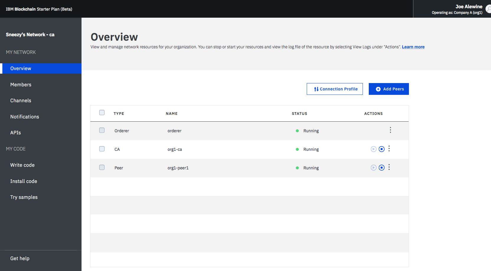

---

copyright:
  years: 2017, 2018
lastupdated: "2018-09-05"

---

{:new_window: target="_blank"}
{:shortdesc: .shortdesc}
{:screen: .screen}
{:codeblock: .codeblock}
{:pre: .pre}

# 在 {{site.data.keyword.cloud_notm}} Private 中部署遠端對等節點
{: #remote-peer-icp}


***[此頁面有幫助嗎？請告訴我們。](https://www.surveygizmo.com/s3/4501493/IBM-Blockchain-Documentation)***


下列指示說明如何在上 {{site.data.keyword.cloud_notm}} Private (ICP) 安裝「{{site.data.keyword.blockchainfull}} 平台」遠端對等節點，並將它連接至「{{site.data.keyword.blockchainfull_notm}} 平台」上的網路。
{:shortdesc}

{{site.data.keyword.cloud_notm}} Private 是用於開發及管理內部部署容器化應用程式的應用程式平台。{{site.data.keyword.cloud_notm}} Private 上的「{{site.data.keyword.blockchainfull_notm}} 平台遠端對等節點」是隨附於 ICP 的 {{site.data.keyword.blockchainfull_notm}} 產品，可供客戶用來在其本端環境中部署對等節點。在安裝遠端對等節點的「Helm 圖表」之後，您可以在 ICP 型錄中找到它作為應用程式。ICP 的遠端對等節點會運用 ICP 的儲存空間、安全、記載及支援服務，進行對等節點管理。如需 ICP 的相關資訊，請參閱 [{{site.data.keyword.cloud_notm}} Private 文件 ](https://www.ibm.com/support/knowledgecenter/SSBS6K_2.1.0.3/kc_welcome_containers.html "{{site.data.keyword.cloud_notm}} Private 文件")。

在 ICP 上安裝遠端對等節點之前，請先檢閱[遠端對等節點考量](remote_peer.html#remote-peer-limitations)。

## 必要條件
{: #prerequisites-icp}

在 ICP 上安裝遠端對等節點之前，您必須在 {{site.data.keyword.cloud_notm}} Private、您的本端系統及「{{site.data.keyword.blockchainfull_notm}} 平台」上完成下列步驟。

1. 您的本端系統

  您需要安裝 {{site.data.keyword.cloud_notm}} Private CLI [2.1.0.3 ](https://www.ibm.com/support/knowledgecenter/en/SSBS6K_2.1.0.3/manage_cluster/install_cli.html "安裝 {{site.data.keyword.cloud_notm}} Private CLI")。  
<!---
    - Fabric-ca binaries.
      1. Download the [fabric-ca binaries](https://nexus.hyperledger.org/content/repositories/releases/org/hyperledger/fabric-ca/hyperledger-fabric-ca/) to your local machine and extract them.
      2. Move the executable `fabric-ca` client from the directory where it was downloaded into a new `fabric-ca-remote` directory.
         ```
         mkdir $HOME/fabric-ca-remote
         cp {downloads}/bin/fabric-ca-client $HOME/fabic-ca-remote/
         ```
         {:codeblock}
--->
2. {{site.data.keyword.cloud_notm}} Private

  您需要 [{{site.data.keyword.cloud_notm}} Private ]( https://www.ibm.com/support/knowledgecenter/en/SSBS6K_2.1.0.3/kc_welcome_containers.html "{{site.data.keyword.cloud_notm}} Private 2.1.0.3 版文件") 叢集 2.1.0.3 版。如果您是使用遠端對等節點進行開發、測試或試驗，則可以免費安裝 [{{site.data.keyword.cloud_notm}} Private Community Edition ](https://www.ibm.com/support/knowledgecenter/SSBS6K_2.1.0.3/installing/install_containers_CE.html "安裝{{site.data.keyword.cloud_notm}}e Private-CE")。

  **附註**：
    - 您需要判斷對等節點將使用的儲存空間。如果您使用預設值，則「Helm 圖表」會為您的對等節點資料建立新的 8 Gi「持續性磁區」要求，名稱為 `my-data-pvc`。如果您選取 CouchDB 作為分類帳資料庫，則「Helm 圖表」會為您的分類帳資料庫建立另一個 8 Gi「持續性磁區」要求，名稱為 `statedb-pvc`。
    - 如果您不想使用預設儲存空間設定，請確定在 ICP 安裝期間設定*新的* storageClass，否則 Kubernetes 系統管理者需要在您部署之前建立 storageClass。
    - [動態磁區佈建 ]( https://kubernetes.io/docs/concepts/storage/dynamic-provisioning/ "動態磁區佈建") 只適用於 ICP 中的 amd64 節點。因此，如果您的叢集混合了 s390x 及 amd64 工作者節點，則無法使用動態佈建。
    - 如果您不是使用動態佈建，則必須使用可以用來修正「Kubernetes 持續性磁區要求 (PVC)」連結處理程序的標籤，建立及設定[持續性磁區 ](https://kubernetes.io/docs/concepts/storage/persistent-volumes/ "持續性磁區")。

  除了您的 ICP 硬體需求之外，遠端對等節點至少還需要下列項目：
    - 2x vCPU
    - 2 GB RAM
    - 4 GB 空間，供鏈碼使用
    - 10 GB 空間，讓分類帳在擴充時具有成長的能力

3. {{site.data.keyword.blockchainfull_notm}} 平台  

  若要使用遠端對等節點，您具有的組織必須是「{{site.data.keyword.blockchainfull_notm}} 平台」上管理之區塊鏈網路的成員。您需要使用 {{site.data.keyword.cloud_notm}} 上的「網路監視器」，才能存取網路的網路認證及 API 端點。如果您不是任何區塊鏈網路的成員，則需要建立或加入網路。如需相關資訊，請參閱[建立網路](../get_start.html#creating-a-network)或[加入網路](../get_start.html#joining-a-network)。

## 將 Helm 圖表匯入至 ICP

「{{site.data.keyword.blockchainfull_notm}} 平台遠端對等節點」套件可在 [Github ]( https://github.com/IBM/charts/tree/master/stable/ibm-blockchain-platform-remote-peer "IBM Blockchain 遠端對等節點") 取得。「Helm 圖表」會使用指令行匯入至 ICP 主控台。從本端機器中，完成下列步驟以匯入「Helm 圖表」：

1. 從 [Github ](https://github.com/IBM/charts/tree/master/repo/stable/ibm-blockchain-platform-remote-peer-0.9.0.tgz "IBM Blockchain 遠端對等節點 Helm 圖表") 下載 `.tgz`「Helm 圖表」檔案。<!--[Passport Advantage Online ](https://www-01.ibm.com/software/passportadvantage "Passport Advantage Online")-->

2. 如果您尚未登入，請從 ICP CLI 登入您的 ICP 叢集，然後登入 Docker 專用映像檔登錄。  
  ```
  bx pr login -a https://<cluster_CA_domain>:8443 --skip-ssl-validation
  docker login <cluster_CA_domain>:8500
  ```
  {:codeblock}

  在程式碼中，`<cluster_CA_domain>` 是憑證管理中心 (CA) 網域。如果您未指定 CA 網域，則預設值為 `mycluster.icp`。

3. 從您儲存下載的「Helm 圖表」的目錄中，執行 ICP CLI 中的下列指令，將「Helm 圖表」匯入至您的 ICP 叢集。將 `<helm_chart_from_github>` 取代為您已從 GitHub 下載之 `.tgz` 檔案的名稱。

  ```
  bx pr load-helm-chart --archive <helm_chart_from_github> --clustername <cluster_CA_domain>
  ```
  {:codeblock}

  當此指令順利完成時，您可以看到與下列資訊類似的內容：

  ```  
  Loading helm chart
  Loaded helm chart

  Synch charts
  Synch started
  OK
  ```  

  在「ICP 型錄」頁面上，現在應該可以看到「{{site.data.keyword.blockchainfull_notm}} 平台遠端對等節點」的「Helm 圖表」磚。按一下 ICP 主控台中的**型錄**按鈕，以驗證匯入是否成功。

### 部署遠端對等節點

下列步驟說明在 ICP 中部署遠端對等節點所需的處理程序。在 ICP 中配置遠端對等節點之前，請擷取一些有關「{{site.data.keyword.blockchainfull_notm}} 平台」的端點資訊，然後為遠端對等節點建立使用者身分。您需要在稍後步驟中使用此資訊。

## 步驟 1：擷取遠端對等節點配置資訊
{: #network-endpoints}

在配置期間，您需要將網路的 API 端點資訊提供給遠端對等節點。這些端點可讓遠端對等節點在「{{site.data.keyword.blockchainfull_notm}} 平台」上尋找並連接至網路。在「網路監視器」的**概觀**畫面上，按一下**遠端對等節點配置**按鈕。


*圖 1. 遠端對等節點配置*

即會開啟蹦現視窗，並顯示下列欄位的值。請儲存這些值，以供您配置遠端對等節點時使用。

  - **網路 ID**
  - **組織 MSP**
  - **憑證管理中心 (CA) 名稱**
  - **憑證管理中心 (CA) URL**
  - **憑證管理中心 (CA) TLS 憑證**

您可以按一下**下載**鏈結來個別複製和貼上欄位，或將它們儲存為 JSON 檔案。**請注意**，如果您下載 JSON 中的資訊，需要先將 TLS 憑證轉換成 PEM 格式，然後再將它提供給遠端對等節點。您可以使用 CLI，藉由發出 `echo -e "<CERT>" > catls.pem` 指令，將憑證轉換成 PEM 格式。

## 步驟二：登錄遠端對等節點
{: #register-peer}

在遠端對等節點可以加入網路之前，您需要將新的對等節點身分新增至「{{site.data.keyword.blockchainfull_notm}} 平台」上的組織。請完成下列步驟來登記並登錄遠端對等節點。

1. 登入「{{site.data.keyword.blockchainfull_notm}} 平台」，並存取「網路監視器」。在「憑證管理中心」畫面上，您可以檢視已向組織登錄的所有身分，例如管理者或用戶端應用程式。
  
  *圖 2. CA 畫面*

2. 按一下畫面頂端的**新增使用者**按鈕。蹦現畫面即會開啟，並可讓您在填寫下列欄位之後，登錄您的遠端對等節點。儲存 ID 及「密碼」的值，您在配置對等節點時需要使用它們。
  - **ID：**配置對等節點時對等節點的名稱，稱為 `enroll ID`。請**儲存此值**，以供日後部署遠端對等節點時使用。
  - **密碼：**配置對等節點時對等節點的密碼，稱為 `enroll Secret`。請**儲存此值**，以供日後部署遠端對等節點時使用。
  - **類型：**為此欄位選取 `peer`。
  - **連結：**這是組織下遠端對等節點將屬於的連結，例如 `org1`。請從下拉清單中選取現有的連結，或輸入新的連結。
  - **登記數上限：**您可以使用此欄位，限制您可以使用此身分來登記或產生憑證的次數。如果未指定，則此值預設為不限次數的登記。

  完成欄位之後，請按一下**提交**來登錄遠端對等節點。登錄的對等節點即會列示在表格中，作為組織中的一個身分。

## 步驟三：配置和安裝遠端對等節點

在「網路監視器」中登錄對等節點身分之後，您可以使用下面的 ICP 主控台指示，在 ICP 中配置及安裝遠端對等節點。

<!-- Issue #228 or the [helm CLI](#icp-helm-cli). -->

1. 登入 ICP 主控台，然後按一下右上角的**型錄**鏈結。
2. 找出「{{site.data.keyword.blockchainfull_notm}} 平台遠端對等節點」的「Helm 圖表」，然後按一下它以開啟。您可以看到 Readme 檔，其中包含安裝及配置「Helm 圖表」的相關資訊。
3. 按一下**配置**。在「配置」頁面上，完成「Helm 圖表」的配置設定，並確認您已閱讀並同意授權合約。
4. 按一下**安裝**。

### 配置參數
{: #icp-configuration-parms}

您需要提供遠端對等節點在「{{site.data.keyword.blockchainfull_notm}} 平台」上連接至網路所需的資訊。
下表列出「{{site.data.keyword.blockchainfull_notm}} 平台遠端對等節點」圖表的可配置參數，以及其預設值。


|  參數     | 說明    | 預設值  | 必要 |
| --------------|-----------------|-------|------- |
|**配置** | **配置遠端對等節點的版本名稱及目標名稱空間** |  ||
| `版本名稱`| Helm 版本的名稱。| 無 | 是 |
| `目標名稱空間`| Kubernetes 名稱空間。| 預設值 | 是 |
| | | | |
|**叢集配置** |**叢集配置資訊** | ||
| `工作者節點架構`| 選取您的雲端平台架構（amd64 或 S390x）。| 以主節點為基礎的自動偵測架構 | 是 |
| `影像`|「Helm 圖表」的路徑。| 自動填入至已安裝的路徑，請不要變更此值 | 是 |
| | | | |
|**區塊鏈網路** | **遠端對等節點所需的網路配置資訊**| | |
| `網路 ID`| 在「{{site.data.keyword.blockchainfull_notm}} 平台網路監視器」上找到之網路 ID 的值。按一下「概觀」畫面上的`遠端對等節點配置`按鈕，然後在這裡複製並貼上該資訊。| 無 | 是 |
| `組織 MSP`| 在「{{site.data.keyword.blockchainfull_notm}} 平台網路監視器」上找到之組織 MSP 的值。按一下「概觀」畫面上的`遠端對等節點配置`按鈕，然後在這裡複製並貼上該資訊。| 無 | 是 |
| `憑證管理中心 (CA) 名稱`| 在「{{site.data.keyword.blockchainfull_notm}} 平台網路監視器」上找到之「CA 名稱」的值。按一下「概觀」畫面上的`遠端對等節點配置`按鈕，然後在這裡複製並貼上該資訊。| 無 | 是 |
| `憑證管理中心 (CA) URL`| 在「{{site.data.keyword.blockchainfull_notm}} 平台網路監視器」上找到之 CA URL 的值。按一下「概觀」畫面上的`遠端對等節點配置`按鈕，然後在這裡複製並貼上該資訊。| 無 | 是 |
| `憑證管理中心 (CA) TLS 憑證` |「{{site.data.keyword.blockchainfull_notm}} 平台網路監視器」中的 CA TLS 憑證字串。按一下「概觀」畫面上的`遠端對等節點配置`按鈕，然後在這裡複製並貼上該資訊。| 無 | 是 |
| | | | |
|**遠端對等節點身分** | **用來登錄遠端對等節點的登記 ID 及密碼**| | |
| `對等節點登記 ID`| 這是您在「{{site.data.keyword.blockchainfull_notm}} 平台網路監視器」的「憑證管理中心」畫面上輸入的「登記 ID」。| 無 | 是 |
| `對等節點登記密碼`| 這是您在「{{site.data.keyword.blockchainfull_notm}} 平台網路監視器」的「憑證管理中心」畫面上輸入的「登記密碼」。| 無 | 是 |
| | | | |
|**遠端對等節點資料庫** | **分類帳資料庫類型**| | |
| `分類帳資料庫`| 用來儲存頻道分類帳的[狀態資料庫](../glossary.html#state-database)。遠端對等節點需要與[區塊鏈網路](../v10_dashboard.html#network-preferences)使用相同的資料庫。| 無 | 是 |
| `CouchDB 映像檔`| 只在已選取 CouchDB 作為分類帳資料庫時才適用。| 自動填入至已安裝的路徑，請不要變更此值。| 是 |
|**資料持續性** | 啟用在叢集重新啟動或失敗之後持續保存資料的能力。如需相關資訊，請參閱 [Kubernetes 中的儲存空間](https://kubernetes.io/docs/concepts/storage/ "磁區")。| | |
| `資料持續性已啟用`| 當容器重新啟動時，狀態資料將可供使用。*如果不勾選，則會在發生失效接手或 Pod 重新啟動時遺失所有資料。*| 已勾選 | 否 |
| `使用動態佈建`| 使用 Kubernetes 動態儲存空間。| 已勾選 | 否 |
| | | | |
|**持續性磁區配置** | **對等節點將使用的持續性磁區要求** |  |  |
| `持續性磁區要求`| 為將建立的新「持續性磁區要求 (PVC)」輸入名稱。| my-data-pvc | 否 |
| `儲存類別名稱`| 選擇儲存類別名稱。| 如果建立新的 PVC，則為空白；否則，請指定與現有 PVC 相關聯的儲存類別。| 否 |
| `現有磁區要求`| 指定現有「磁區要求」的名稱，並將所有其他欄位保留為空白。| 新的要求名稱 | 否 |
| `儲存空間存取模式`| 指定 PVC 的儲存空間[存取模式 ](https://kubernetes.io/docs/concepts/storage/persistent-volumes/#access-modes "存取模式")。| ReadOnlyMany| 否 |
| `選取器標籤`| [PVC 的選取器標籤  ](https://kubernetes.io/docs/concepts/overview/working-with-objects/labels/ "標籤與選取器")。| 預設值 | 否 |
| `選取器值`| [PVC 的選取器值 ](https://kubernetes.io/docs/concepts/overview/working-with-objects/labels/ "標籤與選取器")。| 預設值 | 否 |
| `磁區要求大小`|「磁區要求」的大小，必須大於 2Gi。| 8Gi  | 是 |
| | | | |
|**狀態資料庫資料持續性** | **在容器重新啟動或失敗之後持續保存資料。如需相關資訊，請參閱 [Kubernetes 中的儲存空間](https://kubernetes.io/docs/concepts/storage/ "磁區")** | | |
| `資料持續性已啟用`| 當容器重新啟動時，分類帳資料將可供使用。*如果不勾選，則會在發生失效接手或 Pod 重新啟動時遺失所有資料。*| 已勾選 | 否 |
| `使用動態佈建`| 使用 Kubernetes 動態儲存空間。| 已勾選 | 否 |
| | | | |
|**狀態資料庫持續性磁區配置** |**要用於狀態資料庫的「持續性磁區要求」。如需相關資訊，請參閱 [Kubernetes 中的儲存空間](https://kubernetes.io/docs/concepts/storage/ "磁區")。** |||
| `持續性磁區要求`| 請為將建立的新「CouchDB 持續性磁區要求」輸入名稱或使用預設值。| statedb-pvc | 否 |
| `狀態資料庫儲存類別名稱`|選擇儲存類別名稱。| 無 | 否 |
| `狀態資料庫現有磁區要求`| 若要使用現有的磁區要求，請輸入 pvc 名稱，並將所有其他欄位保留為空白。| 無 | 否 |
| `狀態資料庫儲存空間存取模式`| 指定 PVC 的儲存空間[存取模式 ](https://kubernetes.io/docs/concepts/storage/persistent-volumes/#access-modes "存取模式")。| ReadOnlyMany| 否 |
| `選取器標籤`| [PVC 的選取器標籤 ](https://kubernetes.io/docs/concepts/overview/working-with-objects/labels/ "標籤與選取器")。| 預設值 | 否 |
| `選取器值`| [PVC 的選取器值 ](https://kubernetes.io/docs/concepts/overview/working-with-objects/labels/ "標籤與選取器")。| 預設值 | 否 |
| `狀態資料庫磁區要求大小`| 持續性磁區要求的大小。| 8Gi | 否 |
| | | | |
| **對等節點資源** | **對等節點的 CPU 及記憶體的下限及上限** | | |
| `對等節點 CPU 要求` | 要配置給對等節點的 CPU 數目下限。| 2 | 是 |
| `對等節點 CPU 限制` | 要配置給對等節點的 CPU 數目上限。| 2 | 是 |
| `對等節點記憶體要求` | 要配置給對等節點的記憶體數量下限。| 4Gi | 是 |
| `對等節點記憶體限制` | 要配置給對等節點的記憶體數量上限。| 4Gi | 是 |
| | | | |
|**CouchDB 資源** | **要配置給 CouchDB 容器的 CPU 及記憶體的下限及上限。只在已選取 CouchDB 作為狀態資料庫時，此區段才適用**| | | |
| `CouchDB CPU 要求` | 要配置給 CouchDB 的 CPU 數目下限。| 2 | 是 |
| `CouchDB CPU 限制` | 要配置給 CouchDB 的 CPU 數目上限。| 2 | 是 |
| `CouchDB 記憶體要求` | 要配置給 CouchDB 的記憶體數量下限。| 4Gi | 是 |
| `CouchDB 記憶體限制` | 要配置給 CouchDB 的記憶體數量上限。| 4Gi | 是 |

選取 CouchDB 作為遠端對等節點資料庫時，會在 Pod 中建立兩個容器，一個用於對等節點，一個用於 CouchDB。
「對等節點」容器包含「對等節點 PVC」的單一磁區裝載，其會將區塊及交易儲存在檔案系統上。CouchDB 容器會裝載對等節點狀態資料庫，其中包含分類帳資料。

選取 LevelDB 作為遠端對等節點資料庫時，會在 Pod 中建立單一容器，以同時執行對等節點及 LevelDB 處理程序。此容器有兩個磁區裝載，一個用於「對等節點 PVC 」，而第二個磁區裝載用於包含分類帳資料的對等節點狀態資料庫 PVC。

| 遠端對等節點資料庫選項  | 容器 #1 的內容  | 容器 #2 的內容  |
| --------------|-----------------|---------------|
|CouchDB| 裝載對等節點 PVC 的遠端對等節點| 裝載狀態資料庫 PVC 的 CouchDB |
|LevelDB| 裝載對等節點 PVC 及狀態資料庫 PVC 的遠端對等節點及 LevelDB | n/a |

<!-- Issue #228

### Using the helm command line to install the helm release
{: #icp-helm-cli}

Alternatively, you can use the helm CLI to install the helm release. Before running the helm install command, complete these
[steps ](https://www.ibm.com/support/knowledgecenter/SSBS6K_2.1.0.3/app_center/add_int_helm_repo_to_cli.html "Adding the internal Helm repository to Helm CLI") to add your cluster's helm repository to the helm CLI environment.

To install a release with the default configuration use the `helm install` CLI command, replacing the following values in `< >` based on parameter information in the table below.

```
helm install --name <release_name>  <helm_chart> \
--version <helm_chart_version> \
--set env.networkid=<network_id> \
--set env.key=<API_key> \
--set env.secret=<API_secret> \
--set peeridentity.peerUser=<peer_user> \
--set peeridentity.peerPassword=<peer_password> \
--set dataPVC.size=<data_volume_claim_size> \
--set couchdbPVC.size=<couchDB_volume_claim_size> \
--tls
```

where:
- `<release name>` represents the name you want to give your helm release.
- `<helm_chart>`  represents the name of the Helm Chart imported into the catalog.
- `<helm_chart_version>` represents the version of the Helm Chart imported into the catalog.


For example:
```
helm install --name jnchart2 mycluster/ibm-blockchain-platform-remote-peer-prod-1.0.0 \
--version 1.0.2 \
--set env.networkid=6f037b0186064edd9f0032ksl2dcd3c6ee \
--set env.key=PeerOrg1 \
--set env.secret=8s1MOzVd9YxmdmRvm_owlYXX0Gr5XGx30ol2o0vNo18Zvba5jM3xCIOuQ-yEGBn \
--set peeridentity.peerUser=peer621 \
--set peeridentity.peerPassword=peer621 \
--set dataPVC.size=8Gi \
--set couchdbPVC.size=8Gi \
--tls
```

Optionally, a `.yaml` file containing the parameters can be passed to the `helm install` command
using the following format:

```
helm install --name <release_name>  <helm_chart> \
--version <helm_chart_version> \
--values <customvalues.yaml> \
--tls
```

where `--values <customvalues.yaml>` could also be expressed as `-f <customvalues.yaml>`.

The `values.yaml` file includes all of the parameter names and is included in the archive downloaded from
Docker Hub.

-->

<!-- Commenting out information per issue #228

**Note:** The following error can occur when running the `helm install` command if the
helm CLI version on your local machine is ahead of helm cli version on your server.

```
Error: incompatible versions client[v2.9.1] server[v2.7.3+icp]
```

See the [troubleshooting topic](remote_peer_operate_icp.html#icp-troubleshooting) for instructions on resolving this error.

-->


<!--
### Generating your own peer TLS certificates
{: #generate-peer-tls-certs}

You can leave the `Peer TLS CA certificate`, `Peer TLS certificate`, and `Peer TLS key` fields empty or provide your own certificates.

- If you leave all these three fields empty, your remote peer will generate a set of default values for these fields when the remote peer starts.

  **Note:** If you specify values for one or two fields of these three fields, the remote peer will generate and use the default values for all three fields.

- If you don't want to use the default values, you can generate your own certificates and key and specify them in the three fields.

  **Note:** When you specify your own certificates in the three fields, ensure that the value is in one line. You can connect the content from each line with `\r\n`. For example, your certificate value might look like the following example.

  ```
  -----BEGIN CERTIFICATE-----
  MIIEkDCCAnigAwIBAgIBCDANBgkqhkiG9w0BAQsFADAiMQswCQYDVQQGEwJVUzET
  MBEGA1UEAwwKdGVzdGNhLmNvbTAeFw0xODA4MDMwMzM2MDFaFw0yMTA0MjkwMzM2
  MDFaMCMxCzAJBgNVBAYTAlVTMRQwEgYDVQQDDAt0ZXN0b3JnLmNvbTCCASIwDQYJ
  4kyRt4UAWNvEswnLcaYCtS4ZYa8=
  -----END CERTIFICATE-----
  ```

  You need to use `\r\n` to connect all lines as shown below.

  ```
  ----BEGIN CERTIFICATE-----\r\nMIIEkDCCAnigAwIBAgIBCDANBgkqhkiG9w0BAQsFADAiMQswCQYDVQQGEwJVUzET\r\nMBEGA1UEAwwKdGVzdGNhLmNvbTAeFw0xODA4MDMwMzM2MDFaFw0yMTA0MjkwMzM2\r\nMDFaMCMxCzAJBgNVBAYTAlVTMRQwEgYDVQQDDAt0ZXN0b3JnLmNvbTCCASIwDQYJ\r\n4kyRt4UAWNvEswnLcaYCtS4ZYa8=\r\n-----END CERTIFICATE-----
  ```

Before you generate certificates, you need to create a folder that contains the `openssl-ca.cnf` and `openssl-server.cnf` files, and an empty `index.txt` file.

If you haven't, install [openssl](https://github.com/openssl/openssl) on your system.

1. Run the following command to generate **Peer TLS CA certificates**.
  ```
  openssl req -x509 -newkey rsa:4096 -sha256 -nodes -out ./cacert.pem -keyout ./cakey.pem -outform PEM  -config openssl-ca.cnf -subj "/C=US/CN=testca.com"
  ```

  This command generates the `cacert.pem` and `cakey.pem` files. The `cacert.pem` file is your Peer TLS CA certificate.

2. Run the following command to generate **Peer TLS key**.
  ```
  openssl req -newkey rsa:2048 -sha256 -nodes -out ./servercert.csr -outform PEM -keyout ./peer-key.pem -config openssl-server.cnf  -subj "/C=US/CN=testorg.com"
  ```

  This command generates `peer-key.pem` and `servercert.csr` files. The `peer-key.pem` file is your Peer TLS key.

3. Run the following command to generate **Peer TLS certificate**.
  ```
  openssl ca -batch  -config ./openssl-ca.cnf -policy signing_policy -extensions signing_req -keyfile ./cakey.pem -cert ./cacert.pem -out ./peer-cert.pem -infiles ./servercert.csr
  ```

  此指令會產生 `peer-cert.pem` 檔，它是您的「對等節點 TLS」憑證。

--->

## 步驟四：驗證遠端對等節點安裝
{: #verify-installation-icp}

在安裝遠端對等節點之後，您可以檢視對等節點日誌，以檢查您的對等節點安裝是否成功。

1. 按一下**安裝**之後，請按一下蹦現視窗中的**檢視 Helm 版本**按鈕。向下捲動至 **Pod** 區段。當 Pod 狀態顯示**執行中**時，您可以在**部署**區段下找到遠端對等節點實例。
2. 在 ICP 主控台中，按一下左上角的**功能表**圖示。從功能表清單中，按一下**工作負載** > **部署**。在部署表格中，按一下您建立的遠端對等節點實例，部署概觀畫面即會開啟。按一下**日誌**標籤，以檢視您的遠端對等節點日誌。您可以在搜尋欄位中輸入 `Started` 字串。

  - 如果遠端對等節點已順利啟動，您可以看到類似下列範例的日誌：
    ```
    [36m2018-06-25 14:22:36.929 UTC [inproccontroller] func2 -> DEBU 196[0m chaincode-support started for qscc-1.1.0
    [36m2018-06-25 14:22:36.929 UTC [inproccontroller] func1 -> DEBU 197[0m chaincode started for qscc-1.1.0
    2018-06-25 14:22:36.942 UTC [nodeCmd] serve -> INFO 1cc[0m Started peer with ID=[name:"fabric-peer" ], network ID=[fa74d88bbd9f46a48a6e4c9986e84228], address=[10.1.156.81:7051]
    ```

  - 如果您在畫面中看不到任何日誌，表示您的遠端對等節點未順利啟動。若要檢視其他日誌以瞭解問題，請按一下左上角的**功能表**圖示，然後按一下**工作負載** > **Helm 版本**。按一下 Helm 版本以開啟它。按一下相關聯 **Pod** 旁邊的**檢視日誌**鏈結，以檢視 Kibana 介面中的其他圖表日誌。

3. 若要驗證遠端對等節點是否可以連接至您的「{{site.data.keyword.blockchainfull}} 平台」網路，您可以從遠端對等節點容器內執行對等節點 CLI 指令。執行 `peer channel fetch` CLI 指令，從頻道提取初始區塊：
   1. 如果尚未連接至您的 ICP 叢集，請遵循下列[指示](remote_peer_operate_icp.html#remote-peer-kubectl-configure)來連接至其中，並從對等節點容器內使用 cli。

   2. 您的組織必須先新增至網路中的頻道，才能提取初始區塊。

     - 您可以為遠端對等節點啟動新的頻道。作為頻道起始者，您可以在[建立頻道](create_channel.html#creating-a-channel)期間自動包含您的組織。請注意，您必須在「{{site.data.keyword.blockchainfull_notm}} 平台」至少具有一個對等節點，然後才能在「網路監視器」中建立頻道。  

     - 區塊鏈網路的另一個成員也可以使用[頻道更新](create_channel.html#updating-a-channel)，將您的組織新增至現有的頻道。在「{{site.data.keyword.blockchainfull_notm}} 平台」上具有對等節點的頻道成員，可以使用「網路監視器」將您的組織新增至頻道，即使您沒有在平台上管理任何對等節點也一樣。

      在安裝期間，遠端對等節點會上傳其簽署憑證，以便您只需要將憑證同步化至頻道。在「網路監視器」的「頻道」畫面上，找出您組織加入的頻道，然後從**動作**標頭下的下拉清單中選取**同步憑證**。此動作會同步處理頻道上所有對等節點中的憑證。

   3. 從「網路監視器」的「概觀」畫面上提供的 `creds.json` 檔擷取配置資訊。按一下**連線設定檔**，然後按一下**下載**。

     - 搜尋**排序節點**來找出排序節點 URL，其位於 `orderers > url` 之下。請記下以網路名稱開頭的 URL。URL 類似下列範例：

       ```
       ash-zbc07b.4.secure.blockchain.ibm.com:21239
       ```

     - 搜尋**組織**來找出您組織的名稱。這應該是您用來登錄遠端對等節點的同一個組織。您可以同時找到組織的名稱及其相關聯的 `mspid`。請記下 `mspid` 的值。

    4. 執行下列指令，以在對等節點容器中設定環境變數。

       ```
       export ORDERER_1=<ORDERER_URL>
       export CHANNEL=<CHANNEL_NAME>
       export CC_NAME=<CC_NAME>
       export ORGID=<ORGANIZATION_MSP_ID>
       export PEERADDR=<PEER_ADDR>
       ```
       {:codeblock}

       將欄位取代為您自己的資訊。
         - 將 `<ORDERER_URL>` 取代為來自 `creds.json` 檔的排序的主機名稱及埠。
         - 將 `<CHANNEL_NAME>` 取代為對等節點加入的頻道名稱。
         - 將 `<CC_NAME>` 取代為參照鏈碼的任何名稱。
         - 將 `<ORGANIZATION_MSP_ID>` 取代為來自 `creds.json` 檔的組織名稱。
         - 將 `<PEER_ADDR>` 取代為 `localhost:7051`

       例如：

       ```
       export ORDERER_1=ash-zbc07b.4.secure.blockchain.ibm.com:21239
       export CHANNEL=defaultchannel
       export CC_NAME=mycc
       export ORGID=PeerOrg1
       export PEERADDR=localhost:7051
       ```
       {:codeblock}

   5. 執行下列對等節點 CLI 指令，以提取頻道的初始區塊。

     ```
     CORE_PEER_TLS_ROOTCERT_FILE=/mnt/certs/tls/cacert.pem CORE_PEER_TLS_ENABLED=true CORE_PEER_ADDRESS=${PEERADDR} CORE_PEER_LOCALMSPID=${ORGID} CORE_PEER_MSPCONFIGPATH=/mnt/crypto/peer/peer/msp/ GOPATH=/ peer channel fetch 0 -o ${ORDERER_1} -c ${CHANNEL} --cafile /mnt/certs/tls/cacert.pem --tls
     ```
     {:codeblock}

     **附註：**您可能會在執行任何這些 CLI 指令時，遭遇可以放心忽略的下列警告。

     ```
     [msp] getPemMaterialFromDir -> WARN 001 Failed reading file
     /mnt/crypto/peer/peer/msp/intermediatecerts/<intermediate cert name>.pem: no pem content for file  /mnt/crypto/peer/peer/msp/intermediatecerts/<intermediate cert name>.pem
     ```

     執行下列指令，來驗證指令是否順利運作，以及初始區塊是否已新增至對等節點容器：

     ```
     ls *.block
     ```
     {:codeblock}

     當看到類似下列範例的內容時，您知道已順利新增初始區塊：

     ```
     defaultchannel_0.block
     ```

## 下一步為何？
{: #whats-next-icp}

在 ICP 設定遠端對等節點之後，您可以先完成數個作業步驟，然後再將交易提交至區塊鏈網路，以及從區塊鏈網路讀取分散式分類帳。如需相關資訊，請參閱[操作遠端對等節點](remote_peer_operate_icp.html)。
## 高可用性
{: #high-availability}

作為高可用性最佳作法，強烈建議每個組織最少部署兩個對等節點。

請完成下列步驟，在 ICP 上部署高度可用的遠端對等節點：

1. 檢閱如何[配置「ICP 叢集」，以取得「高可用性」](https://www.ibm.com/support/knowledgecenter/en/SSBS6K_2.1.0.3/installing/high_availability.html "高可用性 {{site.data.keyword.cloud_notm}} Private 叢集")。
2. 在叢集中多次安裝對等節點，以將對等節點部署至不同的工作者節點。「Helm 圖表」包含以網路 ID 及 OrgID 為基礎的反親緣性原則。ICP 叢集會偵測您的對等節點是否從相同的組織連接至相同的網路，並嘗試在不同的工作者節點上安排這些對等節點。  **附註：**雖然原則「喜好」將對等節點放置在不同的工作者節點上，但它不會強制要求這樣做。比方說，如果您只有一個工作者節點，則所有對等節點都會部署在這個相同的節點上。

如果至少部署兩個對等節點，則您也需要配置[應用程式，以取得高可用性](../v10_application.html#ha-app)。
## 安全考量
{: #icp-security}

遠端對等節點是在「{{site.data.keyword.blockchainfull}} 平台」之外部署；因此，您必須負責遠端對等節點的安全。這包括「企業方案」網路提供的重要安全區域，例如金鑰管理和資料加密。當您考量遠端對等節點的安全時，請檢閱下列主題。

### 身分與存取控制
{: #icp-security-node}

在 {{site.data.keyword.cloud_notm}} 之外，您需要針對與遠端對等節點互動的使用者設定身分管理、鑑別及存取控制。您可以使用 [ICP 使用者管理 ](https://www.ibm.com/support/knowledgecenter/en/SSBS6K_2.1.0.3/user_management/access_overview.html "安全")，來配置這些功能。
### 資料安全
{: #icp-security-data}

「{{site.data.keyword.blockchainfull}} 平台」的「企業方案」會使用以[對稱金鑰加密法 ](https://www.ibm.com/support/knowledgecenter/en/SSB23S_1.1.0.14/gtps7/s7symm.html "對稱加密法") 為基礎的整個磁碟加密，來保護網路所使用的所有資料。您必須在自己的環境中採取類似步驟，才能保護您的遠端對等節點資料。

### 資料常駐
{: #icp-data-residency}

資料常駐會強制要求仍在單一國家/地區的邊界內處理及儲存所有區塊鏈分類帳資料。
如需如何實現資料常駐的相關資訊，請參閱[資料常駐](remote_peer.html#data-residency)。

### 金鑰管理
{: #icp-security-key-management}

金鑰管理是遠端對等節點安全的重要層面。如果私密金鑰已受損或遺失，則惡意動作者或許能夠存取您的遠端對等節點的資料及功能。「{{site.data.keyword.blockchainfull_notm}} 平台」的「企業方案」會使用[硬體安全模組](../glossary.html#hsm) (HSM)，來儲存網路的私密金鑰。HSM 是一種可阻止其他人存取您的私密金鑰的實體應用裝置。

當您在 ICP 上部署遠端對等節點時，表示您負責管理私密金鑰。雖然「{{site.data.keyword.blockchainfull_notm}} 平台」會產生您的私密金鑰，但這些金鑰不會儲存在「平台」上。務必確保將您的金鑰儲存在安全的位置，以免它們受損。您可以在對等節點 MSP 的金鑰儲存庫資料夾中，於對等節點容器內的 `/mnt/crypto/pee/pe/msp/keystore/` 目錄中找到遠端對等節點的私密金鑰。如需遠端對等節點內憑證的相關資訊，請參閱[在 {{site.data.keyword.blockchainfull_notm}} 平台上管理憑證](../certificates.html)指導教學的[成員資格服務提供者](../certificates.html#msp)一節。
您可以使用「金鑰委託」來回復遺失的私密金鑰。這需要在遺失任何金鑰之前先執行。如果無法回復私密金鑰，則您需要向「憑證管理中心」登錄新身分，才能取得新的私密金鑰。您也應該從任何加入的頻道中，移除和取代您的 signCert。

<!---
In IBP when a private key is created, two sets of independent key material is generated, in custody of two different entities. Those two sets of key materials are then combined to create the private key.
--->

### TLS
{: #icp-security-tls}

[傳輸層安全 ](https://www.ibm.com/support/knowledgecenter/en/SSFKSJ_7.1.0/com.ibm.mq.doc/sy10660_.htm "SSL 或 TLS 信號交換的概觀") (TLS) 內嵌在 Hyperledger Fabric 的信任模型中。「{{site.data.keyword.blockchainfull_notm}} 平台」上的所有元件都會使用 TLS 來彼此鑑別及通訊。因此，「{{site.data.keyword.blockchainfull_notm}} 平台」上的網路元件需要能夠完成與遠端對等節點的 TLS 信號交換。連帶作用就是，您需要在用戶端應用程式到對等節點的 Web 防火牆中啟用透通，例如使用白名單。

您可以使用「相互 TLS」，其需要雙向（伺服器-用戶端）而非單向（僅限伺服器）鑑別，以保護應用程式與「企業方案」網路之間的通訊。您可以使用「網路監視器」，針對「{{site.data.keyword.blockchainfull_notm}} 平台」上的對等節點[啟用相互 TLS](../v10_dashboard.html#mutual-tls)。若要在遠端對等節點上啟用「相互 TLS」，請遵循 Hyperledger Fabric 文件中[為對等節點啟用相互 TLS ](https://hyperledger-fabric.readthedocs.io/en/release-1.1/enable_tls.html "保護與傳輸層安全的通訊") 的指示。強烈建議您針對應用程式啟用相互 TLS。

### 成員資格服務提供者配置
{: #icp-security-MSP}

「{{site.data.keyword.blockchainfull_notm}} 平台」的元件透過「成員資格服務提供者 (MSP)」來耗用身分。MSP 會使 CA 發出的憑證與網路及頻道角色產生關聯。如需 MSP 如何使用遠端對等節點的相關資訊，請參閱[成員資格服務提供者 (MSP)](../certificates.html#msp)。

### 應用程式安全
{: #icp-security-appl}

因為所有鏈碼都已簽署，所以 Fabric 會管理應用程式安全。此外，Fabric 也會包含 ACL 型應用程式層次檢查。

## 授權與定價
{: #license-pricing-icp}

{{site.data.keyword.cloud_notm}} Private 上的「{{site.data.keyword.blockchainfull_notm}} 平台遠端對等節點」是免費的測試版，適用於評估及實驗，並部署為 ICP 應用程式。您可以存取 [Github 套件 ](https://github.com/IBM/charts/tree/master/stable/ibm-blockchain-platform-remote-peer "{{site.data.keyword.blockchainfull_notm}} 平台遠端對等節點")<!--[IBM Passport Advantage Online ](https://www-01.ibm.com/software/passportadvantage) to purchase the license and-->，並下載 [Helm 圖表 ](https://github.com/IBM/charts/tree/master/repo/stable/ibm-blockchain-platform-remote-peer-0.9.0.tgz "{{site.data.keyword.blockchainfull_notm}} 平台遠端對等節點 Helm 圖表")。

<!--Purchasing the remote peer on IBM Passport Advantage includes the license, a Helm Chart installation package, a Quick Start Guide, and a default level support for {{site.data.keyword.blockchainfull_notm}} Platform Remote Peer.-->
