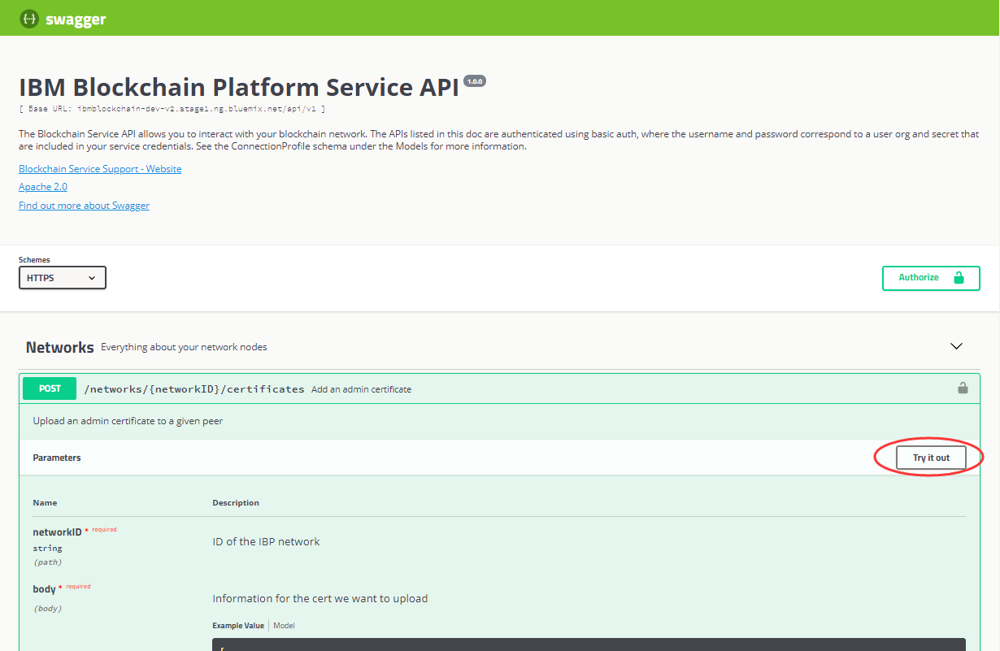

---

copyright:
  years: 2017, 2018
lastupdated: "2018-03-16"

---

{:new_window: target="_blank"}
{:shortdesc: .shortdesc}
{:screen: .screen}
{:codeblock: .codeblock}
{:pre: .pre}

# 以 Swagger 來試用 API

「{{site.data.keyword.blockchainfull}} 平台」公開多種 REST API，可協助您開發應用程式。您可以使用 Swagger 使用者介面來測試您的區塊鏈網路。
{:shortdesc}

開始之前，您需要在 {{site.data.keyword.Bluemix_notm}} 上建立 [{{site.data.keyword.blockchain}} 平台服務實例 ](https://console.bluemix.net/catalog/services/blockchain)，以及建立或加入「入門範本方案」<!--or Enterprise Plan -->區塊鏈網路。


## 擷取網路認證

進入您的區塊鏈網路的「網路監視器」，並從左導覽器開啟「API」畫面。您可以看到您的 REST API 網路認證。稍後您將會使用這裡顯示的 "key" 和 "secret" 值來授權 API，並使用 "network_id" 作為參數來執行 API。按一下**顯示密碼**，以顯示 secret 欄位的值。複製 key、secret 及 network_id 欄位的值，稍後可以在 Swagger 使用者介面中使用這些值。

<!-- Removing this code snippet so people don't try to use these values
```
},
   "x-api": {
       "url": "https://ibmblockchain.bluemix.net",
       "key": "PeerOrg1",
       "network_id": "e1f5b3341b1d483bbaf829f601144023",
       "secret": "71a329aabde9ff20de0aa4bfafd72a4466d78c87f637e7ff92c2534b5ce81cc0"
   }
```
-->

**圖 1** 顯示 "API" 畫面：

*圖 1. API*

如果您是使用「入門範本方案」，則可以在「網路監視器」中的組織之間切換。「入門範本方案」預設配置兩個組織。在組織之間切換有助於從各組織的角度來試用 REST API。若要取得網路中另一個組織的認證，請按一下「網路監視器」主控台右上角的使用者名稱。在開啟的功能表中，按一下「組織」旁邊的下拉箭頭，以檢視所有組織。選取您要切換到哪個組織，並檢視相關聯的網路認證。

**圖 2** 顯示如何在組織之間切換：

*圖 2. 在組織之間切換*


## 授權 Swagger API

按一下「API」畫面上的 **Swagger 使用者介面**鏈結，以開啟 Swagger 使用者介面。  
<!-- remove this line because the link is different depending on if you are starter or enterprise plan
You can also open the Swagger UI with the URL in the connection profiles. For example, `http://blockchain-swagger-dev.stage1.mybluemix.net`.
-->

在 Swagger 使用者介面中，按一下**授權**按鈕，授權視窗隨即蹦現。在您的網路認證中輸入 "key" 和 "secret" 的值作為使用者名稱和密碼，並按一下**授權**，然後按一下**完成**。現在您已準備好執行 API。請注意，如果您重新整理瀏覽器，則需要使用認證來重新授權。

使用「基本鑑別」時，您在「授權」視窗中指定的任何認證，都會在您依序按一下**授權**和**完成**按鈕之後儲存，並且在每個 REST API 呼叫上傳遞。

**圖 3** 顯示「授權」蹦現視窗：

*圖 3.「授權」蹦現視窗*


## 試用 API

按一下您要執行的 REST API，然後按一下**試用**按鈕。輸入必要的參數，然後按一下**執行**。REST API 呼叫即會針對您的網路執行。

**圖 4** 顯示「Swagger 使用者介面」：

*圖 4. Swagger 使用者介面*


## 疑難排解提示

### 401 未獲授權  
  確定您已提供網路認證來授權 REST API。如需相關資訊，請參閱[授權 Swagger API](#authorizing-swagger-apis)。

### 400 錯誤：要求不當
  有些 API 可能會在要求的 Body（主體）中使用引數充當過濾器，以只顯示特定對等節點的結果。Body（主體）中有提供 Snippet 範例，如果使用該範例，則需要加以編輯，以指定您要過濾的對等節點或對等節點清單。若要避免此錯誤，請編輯 Snippet 來指定您網路中的對等節點，或將整個 Snippet 移除。
