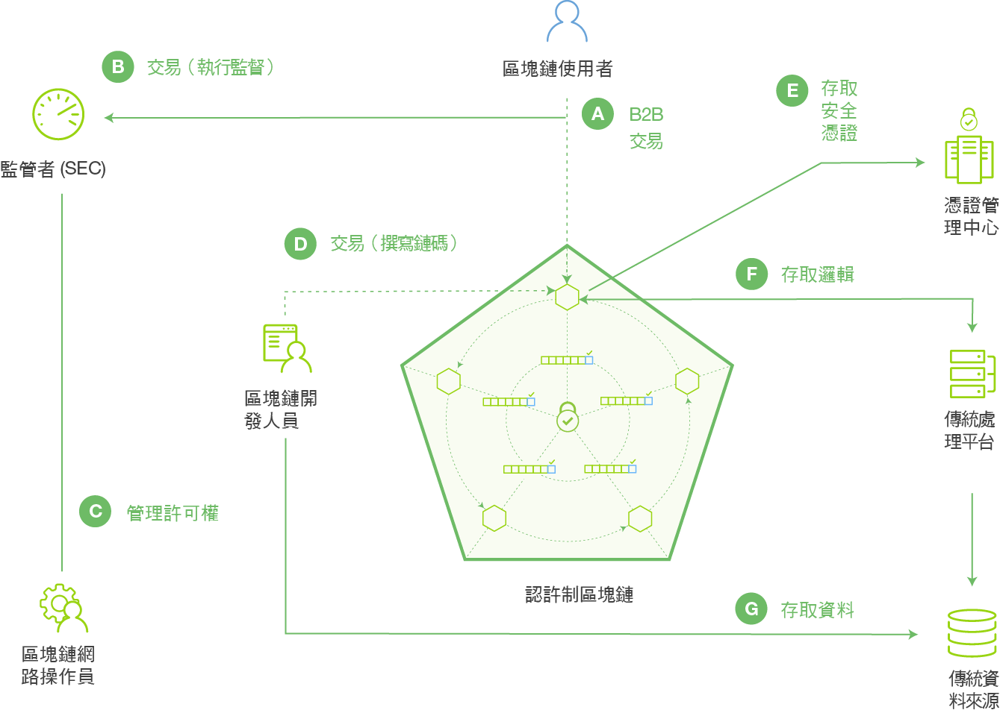

---

copyright:
  years: 2016, 2017
lastupdated: "2017-07-28"
---

{:new_window: target="_blank"}
{:shortdesc: .shortdesc}
{:codeblock: .codeblock}
{:screen: .screen}
{:pre: .pre}

# 區塊鏈基本概念
{: #ibmblockchain_overview}

區塊鏈是一種分散式分類帳技術 (DLT)，為新一代的交易應用程式建立新層次的信任、責任和透明度，以簡化商業程序。區塊鏈網路一開始是為了比特幣交換而引進市場，但其實際用途遠超出加密貨幣交易。{{site.data.keyword.blockchainfull}} 在與 Linux Foundation 的 Hyperledger Project 合作之下，重新塑造最根本的商業交流，對數位互動的新世界敞開大門。

{{site.data.keyword.blockchain}} 藉由建立有效率、高度安全的網路，能夠在其中追蹤及交易幾乎任何有價值的物件，而不需倚賴產中央控制點，因而降低跨企業交易的成本和複雜性。在金融世界裡，區塊鏈網路能讓證券交易在幾分鐘內即完成結算，而不需等上好幾天。在貿易世界裡，這些網路可協助供應鏈管理，並可即時追蹤及記載貨品和付款流程。 

## 區塊鏈網路概觀

在 {{site.data.keyword.blockchain}} 網路中，網路交易記錄會保留在從所有或部分網路成員抄寫的共用分類帳中（分類帳存在於通道範圍內，因此，如果未向通道訂閱成員的對等節點，他們就不會有該通道的交易）。所有交易的記錄（包括有效和無效）都會記錄在區塊中，並附加至每個通道的雜湊鏈（亦即，區塊鏈）。有效的交易將會更新廣域狀態資料庫，無效的交易則不會。鏈碼（也稱為「智慧型合約」）是構成軟體的組件，其中包含一組函數，可針對分類帳進行讀取和寫入。用戶端應用程式利用 SDK 來與對等節點連接，最後會在特定鏈碼上呼叫函數。有兩個主要 Fabric API 可讓鏈碼讀取或寫入 - `getState` 和 `putState`。

**圖 1** 描述具有許可權的區塊鏈網路範例，其具有分散式分布的對等式架構，以及「憑證管理中心」管理使用者角色和許可權：

*圖 1. 具有許可權的區塊鏈網路：由成員角色控管的資料流程和網路存取*

下列說明對應於圖 1 顯示的架構和流程（附註：這些不代表循序處理程序）：

**A：**「區塊鏈使用者」將交易提交至區塊鏈網路。此交易可以是部署、呼叫或查詢，並且是透過運用 SDK 的用戶端應用程式，或是直接透過 REST API 發出。  

**B：**授信商務網路提供對監管者和審核員（例如美國股票市場中的 SEC）的存取權。  

**C：**「區塊鏈網路操作員」管理成員許可權，例如將「監管者」(B) 登記為「審核員」，將「區塊鏈使用者」(A) 登記為「用戶端」。可限制審核員只能查詢分類帳，而授權用戶端可部署、呼叫及查詢特定類型的鏈碼。 

**D：**「區塊鏈開發人員」撰寫鏈碼和用戶端應用程式。「區塊鏈開發人員」可以透過 REST 介面，將鏈碼直接部署至網路。若要在鏈碼中併入傳統資料來源的認證，開發人員可以使用頻外連線來存取資料 (G)。 

**E：**「區塊鏈使用者」透過對等節點 (A) 連接至網路。在繼續進行任何交易之前，節點都會先從「憑證管理中心」擷取使用者的登記和交易憑證。使用者必須擁有這些數位憑證，才能在具有許可權的網路上交易。

**F：**嘗試驅動鏈碼的使用者可能需要驗證其於傳統資料來源 (G) 的認證。若要確認使用者的授權，鏈碼可以透過傳統處理平台，使用頻外連線來連接此資料。
