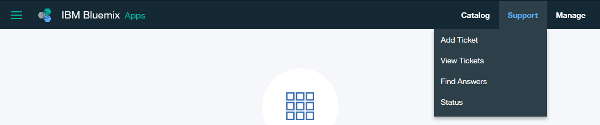

---

copyright:
  years: 2017
lastupdated: "2017-11-17"
---

{:new_window: target="_blank"}
{:shortdesc: .shortdesc}
{:codeblock: .codeblock}
{:screen: .screen}
{:pre: .pre}

# 取得支援
{: #ibmblockchain_support}

有數種機制可用來取得支援，以及疑難排解與 {{site.data.keyword.Bluemix}} 上區塊鏈實例相關聯的問題。
{:shortdesc}

## 非瑕疵問題

導覽至**網路監視器**中的「支援」畫面，如**圖 1** 所示。您可以找到提供技術和支援資訊的資源鏈結。如需「支援」畫面上的詳細說明，請參閱[網路監視器](v10_dashboard.html)中的*支援*一節。

*圖 1. 支援畫面*

## 軟體瑕疵問題

若為軟體瑕疵問題，或是上述任何作法都無法解決您的問題，您可以利用 {{site.data.keyword.Bluemix_notm}} 支援來尋找解答。按一下 {{site.data.keyword.Bluemix_notm}} 主控台右上角的**支援**鏈結，如**圖 2** 所示。如需相關資訊，請參閱[疑難排解](../../troubleshoot/troubleshoot.html){:new_window}。

*圖 2. 支援鏈結*

如果您的問題還是無法解決，請遵循下列步驟來提交協助問題單：

1. 按一下 {{site.data.keyword.Bluemix_notm}} 主控台右上角的**支援**鏈結，如圖 2 所示。
2. 從下拉清單中按一下**新增問題單**鏈結，如圖 3 所示。  
    
  *圖 3. 新增問題單*  
3. 從「支援」畫面中選擇您的支援種類。
4. 輸入問題的主旨和簡要說明。您可以選擇性地上傳附件，以及新增要收到通知的其他電子郵件位址。請務必要將 **blockchain** 關鍵字併入問題中。
5. 按一下**提交**按鈕。您會在幾分鐘的時間內收到已針對您的要求開啟服務問題單的電子郵件通知。如需針對問題進行額外交流，請遵循電子郵件中的指示。
