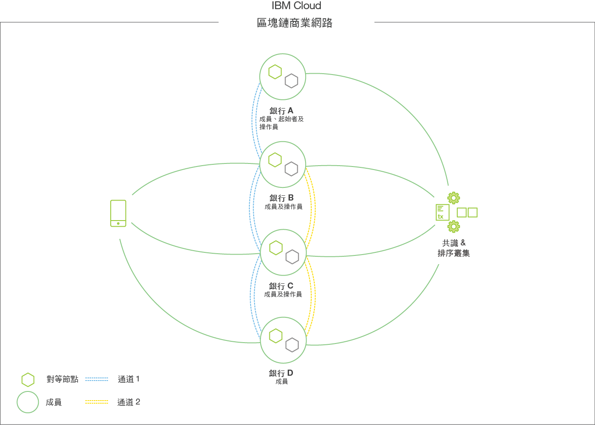

---

copyright:
  years: 2017, 2018
lastupdated: "2018-06-14"

---

{:new_window: target="_blank"}
{:shortdesc: .shortdesc}
{:screen: .screen}
{:codeblock: .codeblock}
{:pre: .pre}

# {{site.data.keyword.blockchainfull_notm}} 平台

**注意：**在使用「{{site.data.keyword.blockchainfull}} 平台」供應項目之前，請先閱讀[免責聲明](needtoknow.html)一節中的技術和支援資訊。  
{:shortdesc}

「{{site.data.keyword.blockchainfull_notm}} 平台」是唯一整合式商業即用平台，可處理多組織區塊鏈網路的整個生命週期（**開發**、**控管**及**操作**）。其設計是要透過每個階段的協同作業，加速建立「專為商務建置」的廣域區塊鏈網路，即使是要求最嚴苛的使用案例和受監管行業，都能提供其所需的效能和安全性。

|功能         |活動             |[角色](#participating-in-a-blockchain-network)  |
| ------------------------- |--------------------------|-----|
|[開發](develop.html) |開發商業網路、開發應用程式、開發鏈碼 |網路開發人員、應用程式開發人員 |
|[控管](get_start.html)|邀請成員、產生認證、提出控管模型、散佈憑證和端點資訊 |網路操作員、網路成員 |
|[操作](v10_dashboard.html)|監視性能和活動、管理新部署、新增或移除成員、管理鏈碼生命週期、管理頻道、支援 |網路操作員、網路參與者 |

**附註**：此表格不是要呈現線性進度。在應用程式和成員資格演進的過程中，像開發和網路管理之類的作業都會反覆發生。

## {{site.data.keyword.IBM_notm}} 成員資格供應項目

「{{site.data.keyword.blockchainfull_notm}} 平台」提供不同的成員資格方案，協助所有類型的使用者開始使用其區塊鏈行程，並將其應用程式移至正式作業。

|       |[入門範本方案](starter_plan.html)      |[企業方案](enterprise_plan.html)  |企業加值方案 |自我管理方案
| ------------------------- |--------------------------|-----|-----|------|
|**包含的內容** | **基本服務水準、開發和測試環境** |**進階服務水準、企業正式作業備妥** | **效能和隔離的專用運算、企業正式作業備妥** |要安裝在您自己的基礎架構上的軟體堆疊、連接至此雲端服務上管理的網路 |
|**計費原則** | **[試用額度](howto/pricing.html#starter-plan-pricing)，後面接著每月費用** |**每月訂閱** |**每月訂閱** |每月訂閱 |
|**可用性** |**現在推出** |**現在推出** | **購買時** |即將推出 |

**警告：**不要將**入門範本方案**用於正式作業。它是開發和測試環境，不適用於正式作業工作負載。

{{site.data.keyword.blockchainfull_notm}} 供應項目以 [Hyperledger Fabric](reference/v10_fabric.html) 1.1 版程式碼庫為建置基礎，運用模組架構來達到企業層級的安全性、資料完整性、可調整性及效能，以符合您的商業需求。
- **IBM Blockchain 入門範本方案**是一個學習或開始開發區塊鏈網路的環境。
- **企業方案**是一種提供高階安全及支援的正式作業環境。
- **企業加值方案**提供一種專用的正式作業環境，以取得其他效能及隔離的運算和儲存空間資源來保護重要資料。

立即註冊您的 [{{site.data.keyword.blockchainfull_notm}} 成員資格 ](https://console.bluemix.net/catalog/services/blockchain?env_id=ibm:yp:us-south&taxonomyNavigation=apps)！

## **開發**網路
運用由超過 400 個參與用戶端精鍊出來的最佳作法，探索並加速區塊鏈開發，以：
* 透過可大幅減少區塊鏈應用程式開發時間的技術，確保企業間的密切結盟（本來需要六週時間來開發的應用程式，現在不到兩天就能創造出來）。
* 運用 {{site.data.keyword.blockchainfull_notm}} 開發人員工具，在您現有的程式設計師名冊中，快速培養區塊鏈技術人才。
* 提供彈性給開發人員，讓他們運用開放且現代的工具集，在其偏好的環境中學習及發展。  

身為企業擁有者，您可以開發您的使用案例，IBM 有眾多聚集在「{{site.data.keyword.blockchainfull_notm}} 車庫」中的產業和區塊鏈專家，可協助您充分利用「{{site.data.keyword.blockchainfull_notm}} 平台」的完整功能。

身為開發人員，您可以利用互動式遊樂場來開發、反覆運算及測試商業網路，以在「{{site.data.keyword.blockchainfull_notm}} 平台」網路環境中，快速且輕鬆地達到商業需求，並加速區塊鏈應用程式開發。這些工具的設計，是要將商業規則轉變成您偏好環境中的商業網路程式碼：
* **線上探索**  
運用 [{{site.data.keyword.blockchainfull_notm}} 平台：開發](./develop.html)<!--, which is powered by an open source development tool-->來學習重要的區塊鏈概念、建立網路定義，以及運用可重複使用的產業模型和智慧型合約檔案庫。  
開發商業網路之後，您可以將其部署至在「IBM Blockchain 平台」上執行的即時網路。如需相關資訊，請參閱[使用入門範本方案來部署商業網路](./develop_starter.html)和[使用企業方案來部署商業網路](./develop_enterprise.html)。
* **在本端安裝**  
運用 Hyperledger Fabric 和 Composer（用來建置商業網路的開放程式碼架構和工具）的 IBM 認證映像檔，直接在您的筆記型電腦上開發及測試。如需相關資訊，請參閱[建置您的第一個網路](http://hyperledger-fabric.readthedocs.io/en/latest/build_network.html)。
* **在雲端環境中協同作業**  
使用立即可用的即時網路搭配「入門範本方案」和「企業方案」選項，與其他人一起開發及共用您的程式碼。如需相關資訊，請參閱[關於入門範本方案](starter_plan.html)和[關於企業方案](enterprise_plan.html)。

## **控管**網路
有兩個選項可用來建立網路的後端環境。首先，您可以使用已發佈的 Hyperledger Docker 映像檔，讓您可以選擇實作 Composer 程式庫來建置應用程式，並與您的網路互動。或者，您可以撰寫原生鏈碼，並開發伺服器端程式碼來操控交易。在本端執行是修改網路配置、探索潛在使用案例，以及開始建立概念證明的絕佳機會。當您的 PoC 開始成形時，您就可以在雲端中管理您的網路，以擴展實作。
<!--
With a cloud deployment, you're provided with a collection of easy-to-use recipes and scripts to facilitate the deployment of a Hyperledger Fabric network that runs on Kubernetes. Use this phase to examine the behavior and stability of your PoC in a hosted environment. The [{{site.data.keyword.blockchainfull_notm}} Container Service ](https://ibm-blockchain.github.io/) can be best thought of as a testing mechanism for the functionality and resiliency of your application and as a natural precursor to the Enterprise Plan.
-->

在您有了網路之後，就已設計 {{site.data.keyword.blockchainfull_notm}} 來建立網路管理經驗，讓成員可以進行部分控制，但沒有單一成員可以獲得完全控制。「{{site.data.keyword.blockchainfull_notm}} 平台」具有第一套整合工具，讓團隊能透過可自訂的原則，強制施行網路的變更管理。

下列清單顯示此控管模型的主要特性：

* 民主制度的管理工具，可供進行群體管理。
* 「原則編輯器」可定義彈性、民主的原則來控管網路的變更。
* 預先建置的工具和原則，可加速上線、自訂及啟動。
* 多方工作流程工具，附有整合通知、成員活動畫面，以及安全簽章集合。

## **操作**網路
利用可用於正式作業的安全服務，部署及操作非集中式網路。從小型網路開始，隨著成員和交易量增加，再利用下列特性，彈性擴充您的網路：

* 超高安全環境，具有許多硬體、韌體和軟體安全特性。
* 針對可調整性、備援和可用性而強化的架構。
* 為獲得最佳效能以及在世界最快的 Linux 上運算而最佳化。

在「{{site.data.keyword.blockchainfull_notm}} 平台」上操作您的網路，包括可簡化管理作業的工具和功能：

* 儀表板，可監視及管理網路上的資源。
* 可無縫升級完整的程式碼堆疊。
* 將全年無休的技術支援整合到入口網站中。
* 無特許存取權的強化安全堆疊、惡意軟體與竄改防制、100% 加密，以及許多其他特性，適用於受監管行業中含有機密資料的網路。

## 基礎網路服務

為了使區塊鏈能夠運作，成員會執行一個以上基礎網路服務，以構成信任基礎：

- **排序服務** - 排序及同步化交易  
在本質上，排序服務是網路的定義。其包含每個成員的識別資訊、頻道的相關資訊，以及一組原則，指定哪些成員可以執行特定作業（例如，邀請其他成員、建立頻道等等）。每一項交易和配置作業都會經歷排序服務，因此，在整個事物架構中，它是超級重要的一環。在瞭解排序服務的基礎重要性之後，就很容易看出專制編排（可能只能有一個成員在幕後主導）的潛在危險。為了抗衡這個問題，排序服務是由網路成員共同管理，而控管實作則是要聯合採取行動。換句話說，決策是由群體，而不是由單方面制定的。所有成員在網路中都有利害關係，延伸來說，針對在網路中配置及自訂其立場的任何作業，他們都有投票權。這些「民主」和共同決策的概念，是受信任且非集中式網路的固有建置區塊。針對部署在「IBM Blockchain 平台」上的任何網路，IBM 都是擔任排序服務的「操作員」。

- **憑證管理中心** – 發出憑證給參與者  
簡單說，就是「憑證管理中心 (CA)」提供成員資格。網路中的所有實體（對等節點、排序節點、用戶端等等）都必須要有身分，才能進行通訊、鑑別，最後進行交易。這些「身分」以 x509 憑證（亦即，登記憑證）的形式存在，只要是直接參與區塊鏈網路，都需要此憑證。另外也有間接參與的方法，但我們稍後才會討論。對 CA 的最佳想像，就是把它當成橡皮印章，為身分提供驗證和可靠性。每個成員都擁有自己的 CA，而透過此 CA，不僅是他們獨有的資源（對等節點），還有協力廠商用戶端和應用程式，他們都可以為其簽署憑證。您可以將成員的 CA 比作特殊的筆或公證人印章。必須要有此 CA 簽署的憑證，才能存取網路。

- **對等節點** – 驗證/背書交易  
對等節點的存在是為了執行兩個主要功能：執行/驗證交易，以及維護分類帳。對等節點會執行智慧型合約，且其為交易歷程以及網路頻道中資產現行狀態的持有者。在一天結束時，一切都是圍繞在存取對等節點（直接或間接），以及對照分類帳執行讀取和寫入。當成員提供對網路的使用者存取權時，他們其實是提供對等節點功能的存取權。

當成員透過「{{site.data.keyword.blockchainfull_notm}} 平台」加入網路時，發出的標準權限為「對等節點」和 CA。若為正式作業網路，成員會想要執行這些服務的多個實例，以確保可用性。依預設，IBM 會為「{{site.data.keyword.blockchainfull_notm}} 平台」建立的網路執行「排序服務」。  

## 參與區塊鏈網路

**參與者**這個詞彙是最廣泛的分類，適用於與區塊鏈網路互動的任何組織、個人、應用程式或裝置。在「參與者」的大傘之下，有兩個不同的分組，分別為**成員**和**使用者**。   

簡單說，成員擁有可允許成員在區塊鏈網路內發出及/或驗證交易的有效數位憑證。使用者沒有憑證，但他們還是可以透過其中一個現有的網路成員來與區塊鏈網路互動。您可以將成員的憑證視為其健身俱樂部的「會員卡」。使用者可能沒有這樣的會員卡，但他們可以用現有會員的「賓客」身分進入健身俱樂部。讓我們再仔細一點看看這些角色。

### 成員

「{{site.data.keyword.blockchainfull_notm}} 平台」受 Hyperledger Fabric（其為「具有許可權的區塊鏈」技術）支援。因此，所有成員都要利用憑證來登入網路，該憑證授權他們以服務**提供者**（亦即，發出憑證、驗證/排序交易）或**消費者**（亦即，發出交易）的身分來使用網路。   

- **提供者 - 我們信任的成員** - 區塊鏈網路的動力來自其成員。為了使區塊鏈網路能夠運作，需要有一組最基本的成員*提供*基礎區塊鏈服務，包括交易驗證、交易排序，以及憑證管理服務。藉由執行這類服務，這些成員變成區塊鏈網路中心之共用分類帳的完整性維護者。因此您會問，需要多少成員才能讓區塊鏈運作？答案是，其取決於網路的信任需求。有些網路容許較集中的信任模型，其需要較少的成員作為提供者。其他網路則需要較多樣化的成員組合（亦即，法律上為個別的實體），並維護較不集中的信任模型。較集中的信任模型範例像是供應鏈可見性網路，其提供者成員為全球零售商、全球貨運公司及 IBM。在此案例中，這三個成員會作為網路的「信任基礎」，提供區塊鏈網路的基礎服務。這些成員可以對進口商、出口商、海關代理商、零售商發出憑證，讓他們可以參與網路（發出交易）。此網路可以讓較多成員參與提供基礎服務，以分散信任，因而確保所有成員都有控制權，但沒有單一成員獨攬控制權。一般網路大約有 10 個成員提供基礎區塊鏈服務。

- **消費者 - 已建立信任，現在可以不斷呼叫** – 在建立信任的基礎後，網路即準備好要開始成長。通常網路中的大多數成員只會使用網路來對分散式分類帳呼叫交易。這些成員只是*消費者*，並沒有參與提供網路的基礎服務。一般網路大約有 10 到 100 個成員具有在給定區塊鏈網路內發出交易的許可權。

#### 成員角色

透過概述商業網路中成員角色的人物表來考慮成員，有時候會很有幫助。以下是我們經常看到的一些使用角色。

- **起始者** – 由其他成員選擇來引導「區塊鏈網路」的成員。「IBM Blockchain 平台」需要單一成員登入「IBM Blockchain 平台」，並執行起始網路的作業，其中包括為網路命名、邀請一組起始成員，以及設定一組預設的網路作業原則。這是暫時性的角色。在引導網路之後，起始者就不再保有特殊專用權，只會繼續成員的角色。  

- **維護者** – 執行一個以上網路對等節點和 CA 的成員。這些成員負責維護分散式分類帳的完整性，他們要參與共識程序，這是在區塊鏈網路上驗證交易的方式。維護者透過 CA 的所有權，也可以發出憑證給參與者，並授與他們網路存取權。

- **操作員** – 代表其他網路成員執行服務的成員，包括交易排序服務、憑證管理中心、交易閘道，以及其他基礎網路服務。依預設，IBM 是部署在「IBM Blockchain 平台」上之網路的網路操作員。

- **審核員** – 由網路授權其在網路上執行審核功能的成員。審核功能的範例包括計費、相符性追蹤或分析。審核員角色通常會轉變成可在分類帳上檢視較多交易，及/或可在交易頻道中存取較多登記的成員。

### 使用者

區塊鏈網路中可能會有數百個成員，但可能會有數千個使用者。使用者是區塊鏈網路中的參與者，可透過與現有成員的「信任關係」，間接存取分類帳。例如，通常某些行動應用程式會採用自己的使用者鑑別和授權機制（OAuth、OpenID），並將那些認證對映至區塊鏈網路中一個以上經過認證的成員。通常會建立 Proxy 或閘道服務來執行此對映功能，以將外面的世界對映至區塊鏈世界。

## {{site.data.keyword.blockchainfull_notm}} 平台

「{{site.data.keyword.blockchainfull_notm}} 平台」提供高度安全且具有許可權的區塊鏈網路，而已鑑別成員可以在其上輕鬆地定義資產，並且建立商業解決方案來修改及交換資產。引導正式作業等級區塊鏈網路不再是冗長而複雜的程序。透過「{{site.data.keyword.blockchainfull_notm}} 平台」，您可以利用編排架構，讓您能夠**在記錄時間內，將您的聯盟組織成作用中的區塊鏈網路**。「{{site.data.keyword.blockchainfull_notm}} 平台」提供聯盟容易使用的工具，其設計目的是要能夠輕易地讓多個機構一起加入，並建立以民主方式控管的網路。透過內建的儀表板監視器和所佈建的公用程式，網路的建立、控管及操作作業變得直觀且清楚易懂。放棄原本缺乏效率的建立網路及實作控管程序，聯盟成員反而能夠**專注在智慧型合約的部署，以及資產和資訊的傳送**。      
{:shortdesc}

網路必要資源（對等節點、排序服務、憑證管理中心、鏈碼）的**高可用性**可排除因單一失敗點而引發的嚴重後果。內建儀表板監視器可讓您輕鬆地管理這些資源，並提供功能強大的機制來視覺化資產和智慧型合約。

Hyperledger Fabric 架構的**模組性**，以及網路角色的明確區分（背書節點、確認節點、排序節點），所提供的基礎架構讓各種使用案例都能有可調整性和應變能力。

整個交易生命週期發生的檢查及平衡可確保一致且完整審查過的結果，而且分類帳會透過實作已知的聊天通訊協定來持續保持同步。身分及存取控制是透過網路上不斷發生的**簽署/驗證**作業輕鬆地施行。  

提供的**控管工具**可讓成員管理其網路的重要商業規則。例如，您可能想要實作原則，而此原則定義必須要有多少位網路成員同意，新成員才能加入。或者，可能有需要每個參與者都背書才能進行修改的資產。控管規則是任何類型之商業網路的基礎，而且通常極為精密。控管工具（例如，原則編輯器）可大幅簡化此程序。

此服務會在不含網路資源的外部存取權（包括 root 存取權）的**高安全及隔離**環境中執行。資料會在進行中和靜止時加密，而且硬體安全模組可讓數位金鑰依據行業法規受到保護。硬體虛擬化會用來執行隔離環境中的每一個節點，藉此保護網路中的其他節點，避開可能發生故障或含有惡意鏈碼的對等節點。由於進階加密法的實作，讓雜湊、簽署/驗證作業，以及節點對節點的通訊都得以加速。

在繼續之前，讓我們來看一下「{{site.data.keyword.blockchainfull_notm}} 平台」內的簡單配置。**圖 1** 說明已部署區塊鏈網路的範例，而此網路包含四個成員（各自擁有兩個對等節點）、一個負責配送加密身分資料的「憑證管理中心」，以及一個定義原則和網路參與者的排序服務。藍色頻道包含所有四個網路成員，而黃色頻道僅限於三個成員：銀行 B、C 和 D。您也會看到銀行 A 扮演網路起始者的角色，而銀行 D 在黃色頻道的環境定義中，只是以成員的角色存在。最後，擁有正確簽署 x509 憑證的使用者或應用程式，可以傳送呼叫至網路上的對等節點。如前述，完全可以理解使用者甚至不知道區塊鏈網路的存在。

*圖 1. 包含運用頻道來隔離資料的四個成員的區塊鏈網路範例*

## {{site.data.keyword.IBM_notm}} 支援 

{{site.data.keyword.IBM_notm}} 支援 {{site.data.keyword.IBM_notm}} 實作的 {{site.data.keyword.blockchain}} 解決方案。如需「{{site.data.keyword.blockchainfull_notm}} 支援」的相關資訊，請參閱[取得支援](ibmblockchain_support.html)。

如需所有 Hyperledger Fabric 特性及功能的詳細資料，請參閱 [Hyperledger Fabric 文件 ](http://hyperledger-fabric.readthedocs.io/en/latest/)。
