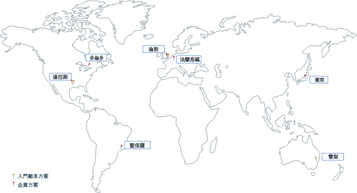

---

copyright:
  years: 2017, 2018
lastupdated: "2018-06-14"

---

{:new_window: target="_blank"}
{:shortdesc: .shortdesc}
{:screen: .screen}
{:pre: .pre}
{:table: .aria-labeledby="caption"}
{:codeblock: .codeblock}
{:tip: .tip}
{:download: .download}

# {{site.data.keyword.blockchainfull_notm}} 平台地區及位置
{: #ibp-regions-locations}

{{site.data.keyword.cloud}} 是在全球進行管理。地區是端點所存取的地理區域，而位置是地區內的資料中心。「{{site.data.keyword.blockchainfull_notm}} 平台」提供全球不同地區之 {{site.data.keyword.cloud_notm}} 內的成員資格方案。當您在 {{site.data.keyword.cloud_notm}} 中建立「{{site.data.keyword.blockchainfull_notm}} 平台」服務實例時，會在您建立服務實例所在的 {{site.data.keyword.cloud_notm}} 地區中建立及儲存您的區塊鏈網路及網路資源。
{:shortdesc}

不同的 {{site.data.keyword.cloud_notm}} 地區提供不同的「{{site.data.keyword.blockchainfull_notm}} 平台」供應項目。您只能在「{{site.data.keyword.blockchainfull_notm}} 平台」方案可用的 {{site.data.keyword.cloud_notm}} 地區中建立區塊鏈網路。

「{{site.data.keyword.blockchainfull_notm}} 平台」支援下列 {{site.data.keyword.cloud_notm}} 地區：

| 地區/位置       | 入門範本方案 | 企業方案        | 地區 API 端點       |
|--------|----------|----------|-------------|
| 美國南部 | Y | Y | api.ng.bluemix.net |
| 英國     | Y | Y | api.eu-gb.bluemix.net |
| 雪梨     | Y | Y | api.au-syd.bluemix.net |
| 亞太地區北部 |  | Y | api.au-syd.bluemix.net |
| 德國     |  | Y | api.eu-de.bluemix.net |

圖 1 顯示「{{site.data.keyword.blockchainfull_notm}} 平台」支援的 {{site.data.keyword.cloud_notm}} 地區及位置。

  
_圖 1. {{site.data.keyword.blockchainfull_notm}} 平台地區及位置_
