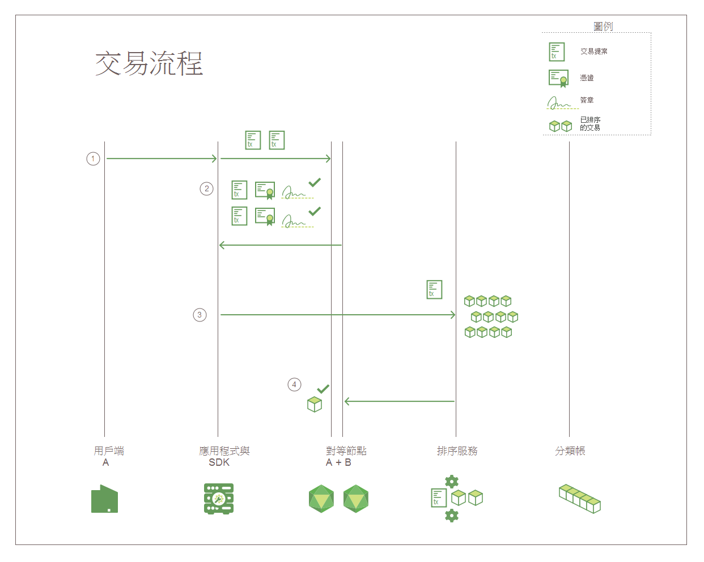

---

copyright:
  years: 2017, 2018
lastupdated: "2018-08-31"
---

{:new_window: target="_blank"}
{:shortdesc: .shortdesc}
{:codeblock: .codeblock}
{:screen: .screen}
{:pre: .pre}

# Hyperledger Fabric

***[此頁面有幫助嗎？請告訴我們。](https://www.surveygizmo.com/s3/4501493/IBM-Blockchain-Documentation)***

{{site.data.keyword.blockchainfull}} 網路以 Hyperledger Fabric 堆疊為建置基礎，為 Linux Foundation 的 Hyperledger Project 中的區塊鏈專案之一。它是一種「具有許可權」的網路，其中所有使用者和元件都有已知的身分。每個通訊接觸點都已實作簽署/驗證邏輯，而交易會透過一系列的背書和驗證檢查來取得共識。在這個意義上，它與傳統的區塊鏈實作大不相同，後者提倡匿名，且被迫依賴加密貨幣和大量運算義務來驗證交易。  
{:shortdesc}

Hyperledger Fabric 提供模組架構，以延伸可調整性和效能。本主題介紹 Hyperledger Fabric 中的部分重要元件。如需 Hyperledger Fabric 的完整介紹，請參閱 [Hyperledger Fabric 文件 ](http://hyperledger-fabric.readthedocs.io/en/release-1.1/){:new_window}。  

## 憑證管理中心  
Hyperledger Fabric 是**具有許可權**的區塊鏈網路，其包含模組化的**憑證管理中心 (CA)** 元件，可用來管理所有成員組織及其使用者的網路身分。由於每個使用者都需要具有許可權的身分，因此可以對網路活動進行 ACL 型控制，並保證每一筆交易最後都能夠追蹤至已登錄的使用者。  
* CA（預設為 Fabric CA）會發出主要憑證 (**rootCert**) 給獲授權加入網路的每個**成員**（組織或個人）。
* CA 也會發出登記憑證 (**eCert**) 給每個成員元件、伺服器端應用程式，並偶爾發出給使用者。
* 每個登記的使用者也會獲得交易憑證 (**tCert**) 的配置。每個 **tCert** 各授權一筆網路交易。

這種對網路成員資格和動作進行的憑證型控制，讓成員能夠依特定使用者身分，限制存取專用和機密頻道、應用程式和資料。

如需「Hyperledger Fabric 憑證管理中心」元件的相關資訊，請參閱 [Fabric CA 使用手冊 ](https://hyperledger-fabric-ca.readthedocs.io/en/release-1.1/){:new_window}。

## 成員資格服務提供者  
Hyperledger Fabric 包含**成員資格服務提供者 (MSP)** 元件，可提供發出及驗證憑證背後的所有加密機制和通訊協定摘要，以及使用者鑑別。MSP 安裝在每一個頻道對等節點上，以確保發出給對等節點的交易要求是來自經鑑別及授權的使用者身分。

如需「Hyperledger Fabric 成員資格服務提供者」元件的相關資訊，請參閱 [Hyperledger Fabric 文件 ](http://hyperledger-fabric.readthedocs.io/en/release-1.1/){:new_window} 中的*[成員資格服務提供者 (MSP) ](http://hyperledger-fabric.readthedocs.io/en/release-1.1/msp.html){:new_window}*。

## 交易流程  
為確保資料一致性和完整性，Hyperledger Fabric 在整個交易流程中實作多個檢查點，包括用戶端鑑別、背書、排序，以及向分類帳確定。

**圖 1** 描述 Hyperledger Fabric 區塊鏈網路上的交易流程：

*圖 1. Hyperledger Fabric 網路上的交易流程*

在 Hyperledger Fabric 網路上，查詢和交易的資料流程是藉由用戶端應用程式將交易要求提交至頻道上的對等節點來起始。對查詢和交易而言，在網路上傳輸資料的起始流程都很常見：

1. 用戶端應用程式會使用 SDK 中可用的 `channel.SendTransactionProposal` API 來簽署交易提案，並將其提交至指定頻道上的適當背書對等節點。這個起始交易提案是對背書的**要求**。  
2. 頻道上的每個對等節點都會驗證進行提交之用戶端的身分和權限，如果有效，就會針對所提供的輸入（金鑰/值）來執行指定的鏈碼。根據交易結果以及所呼叫鏈碼的「背書原則」，每個對等節點都會傳回已簽署 YES 或 NO 的回應給應用程式。每個簽署 YES 的回應都是交易的**背書**。

	在交易流程的這個點上，處理程序會針對查詢和交易進行分流。如果提案在鏈碼中呼叫查詢函數，應用程式就會將資料傳回至用戶端。如果提案在鏈碼中呼叫用來更新分類帳的函數，應用程式就會繼續進行下列步驟：  
3. 應用程式將交易（讀寫集和背書）轉遞至網路**排序服務**。  
4. 交易會接著轉遞至頻道在 Kafka 叢集中的分割區主題，以進行排序。所有頻道對等節點都會藉由套用鏈碼特定的「驗證原則」，並執行「並行控制版本檢查」，以驗證區塊中的每筆交易。  
	* 無法通過驗證處理程序的任何交易，都會在區塊中標示為無效，而且該區塊會附加至頻道的雜湊鏈。  
	* 所有有效的交易都會依據已修改的鍵值組來更新狀態資料庫。  

**聊天資料散佈通訊協定**會持續在整個頻道中播送分類帳資料，以確保對等節點之間的分類帳已同步。如需相關資訊，請參閱 [Hyperledger Fabric 文件 ](http://hyperledger-fabric.readthedocs.io/en/release-1.1/){:new_window} 中的*[聊天資料散佈通訊協定 ](http://hyperledger-fabric.readthedocs.io/en/release-1.1/gossip.html){:new_window}*。

如需交易流程的逐步簡介，請參閱 [Hyperledger Fabric 文件 ](http://hyperledger-fabric.readthedocs.io/en/release-1.1/){:new_window} 中的*[交易流程 ](http://hyperledger-fabric.readthedocs.io/en/release-1.1/txflow.html){:new_window}*。  

## 排序服務
Hyperledger Fabric 包含 Kafka 型服務，可用來排序及播送網路交易。Kafka 也為您的網路提供損毀容錯；意即，如果已接受數目的排序服務節點無法使用，該服務就會繼續將交易區塊排序，並將其配送至頻道對等節點。

用戶端應用程式會呼叫 'channel.sendTransaction' API，將已背書的交易轉遞至排序服務。接著，排序服務節點會使用 Kafka 服務及其相關聯的 ZooKeeper 伺服器，將區塊中的交易排序。已排序的交易區塊最後會「遞送」至頻道對等節點，以向分類帳進行驗證及確定。

排序服務節點也會提供下列服務：
1. 用戶端鑑別
2. 維護系統鏈，為已鑑別的組織以及包含網路內各種聯盟的設定檔群組，定義排序服務配置、主要憑證及 MSP ID。
3. 過濾及驗證重新配置或建立頻道的配置交易。  

如需 Hyperledger Fabric 排序服務的相關資訊，請參閱 [Hyperledger Fabric 文件 ](http://hyperledger-fabric.readthedocs.io/en/release-1.1/){:new_window} 中的*[啟動 Kafka 型排序服務 ](http://hyperledger-fabric.readthedocs.io/en/release-1.1/kafka.html){:new_window}*。

## HFC SDK
Hyperledger Fabric Client (HFC) SDK 可讓應用程式開發人員建置與區塊鏈網路互動的應用程式。HFC SDK 可協助應用程式管理頻道和鏈碼的生命週期。

Hyperledger Fabric 提供 Node.js SDK 和 Java SDK，並提供下列功能來與區塊鏈網路互動：
* 註冊及登記使用者
* 建立頻道
* 將對等節點加入頻道
* 更新系統頻道或應用程式頻道配置
* 在對等節點上安裝鏈碼
* 將頻道上的鏈碼實例化
* 將頻道上的鏈碼升級
* 呼叫鏈碼函數以更新分類帳
* 在分類帳中查詢特定交易、區塊或金鑰
* 監視頻道上的事件（例如，成功確定交易）

如需 HFC SDK 的相關資訊，請參閱 [Hyperledger Fabric 文件 ](http://hyperledger-fabric.readthedocs.io/en/release-1.1/){:new_window} 中的 *[Hyperledger Fabric SDK ](http://hyperledger-fabric.readthedocs.io/en/release-1.1/fabric-sdks.html){:new_window}*。
