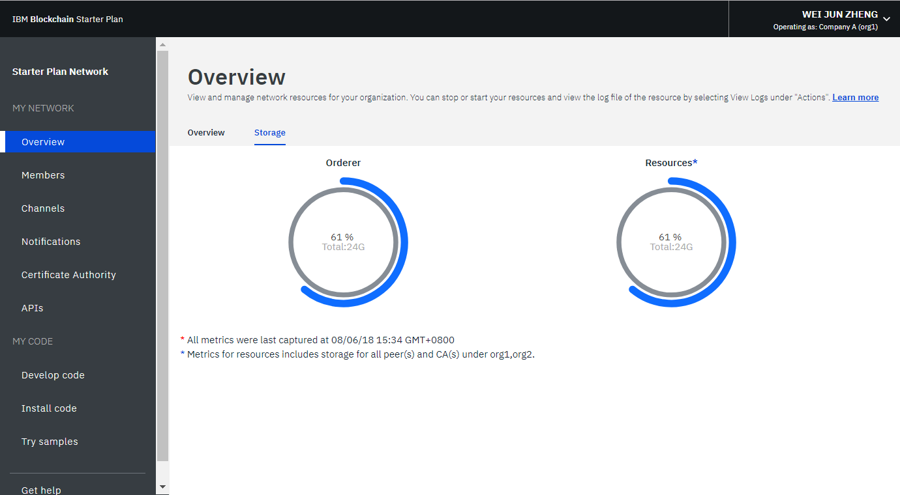
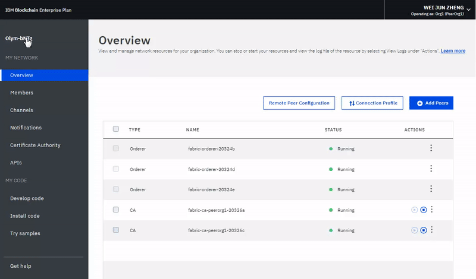

---

copyright:
  years: 2017, 2018
lastupdated: "2018-12-07"

---

{:new_window: target="_blank"}
{:shortdesc: .shortdesc}
{:codeblock: .codeblock}
{:screen: .screen}
{:pre: .pre}

# 使用網路監視器
{: #v10_dashboard}

***[此頁面有幫助嗎？請告訴我們。](https://www.surveygizmo.com/s3/4501493/IBM-Blockchain-Documentation)***

{{site.data.keyword.blockchainfull}} Platform 附有「網路監視器」，可提供區塊鏈環境的概觀，包括網路資源、成員、加入的頻道、交易效能資料及已部署的鏈碼。「網路監視器」亦提供一個進入點，可讓您執行 Swagger API、使用 {{site.data.keyword.blockchainfull_notm}} Platform: Develop 來開發網路，以及試用範例應用程式。
{:shortdesc}

使用本指導教學，瞭解如何使用「網路監視器」來操作「企業方案」或「入門範本方案」網路。雖然本指導教學中的大部分擷取畫面都是針對「企業方案」，但這些指示也適用於「入門範本方案」。只有某個方案才能存取特定特性時，相關小節會標示**適用於「入門範本方案」網路**或**適用於「企業方案」網路**。

## 左導覽窗格

「網路監視器」分為三個區段來顯示下列畫面。您可以從「網路監視器」中的左導覽器來導覽至每個畫面。
- **我的網路**區段包含「[概觀](#overview)」、「[成員](#members)」、「[頻道](#channels)」、「[通知](#notifications)」、「[憑證管理中心](#ca)」，以及「[API](#apis)」畫面。
- **我的程式碼**區段包含「[開發程式碼](#write_code)」、「[安裝程式碼](#chaincode)」及「[嘗試範例](#samples)」畫面。
- 「[取得協助](#support)」畫面會顯示支援資訊，以及 Helios 和 Hyperledger Fabric（ {{site.data.keyword.blockchainfull_notm}} Platform 所根據的程式碼庫）的版本注意事項。

您的區塊鏈網路名稱位於左導覽窗格的頂端。您可以在「網路監視器」中[變更網路的名稱](#network-name)。

您可以從「網路監視器」右上角的下拉功能表，[檢查及配置網路喜好設定](#network-preferences)。

此指導教學會說明上述每個畫面和功能。

## 概觀
{: #overview}

「概觀」畫面會顯示區塊鏈資源（包括排序節點、CA 和對等節點）的即時狀態資訊。每項資源都會顯示在四個不同的標頭之下：**類型**、**名稱**、**狀態**及**動作**。在建立區塊鏈網路期間，會自動建立三個排序節點和兩個 CA 節點。CA 是成員專用的節點，而排序節點是整個網路共用的一般端點。

**圖 1** 顯示「概觀」畫面：

*圖 1. 網路概觀*

### 節點動作
表格的**動作**標頭提供用來啟動或停止資源的按鈕。您也可以選取多個節點，然後按一下**啟動選取項目**或**停止選取項目**按鈕，以啟動或停止節點群組。當您選取一個以上的節點時，**啟動選取項目**或**停止選取項目**按鈕就會出現在表格頂端。

「停止」及「啟動」動作不適用於「排序節點」。一般而言，並不需要停止和啟動網路上的「對等節點」或 CA 節點。提供「停止」和「啟動」動作是以防萬一您需要重新啟動對等節點，例如將其啟動至乾淨狀態。

您也可以從**動作**標頭下的下拉清單中，按一下**檢視日誌**，以查看元件日誌。這些日誌會顯示各種網路資源之間的呼叫，有助於進行除錯及疑難排解。如需使用網路日誌的相關資訊，請參閱[監視區塊鏈網路](howto/monitor_network.html)

若要瞭解啟動及停止對等節點的影響，您可以實驗停止對等節點，並嘗試將其設為交易的目標，您將會在日誌中看到連線錯誤。當您重新啟動對等節點，並嘗試再次進行交易時，就會看到連線成功。您也可以將對等節點關閉一段延伸時間，因為頻道會繼續交易。對等節點再度恢復時，您會注意到，隨著它接收在關閉時確定的區塊，分類帳會進行同步化。分類帳完全同步化之後，您就可以對其執行一般呼叫及查詢。

### 遠端對等節點配置  

如果您在 {{site.data.keyword.cloud_notm}} 之外部署對等節點，則需要在配置期間提供網路的 API 端點資訊。請按一下**遠端對等節點配置**按鈕來擷取網路的 API 端點資訊，以配置您的對等節點。蹦現視窗會提供網路 ID、組織 MSP、CA 名稱、CA URL 及 CA TLS 憑證的 API 端點資訊。您可以按一下每一個欄位尾端的複製圖示，來複製該欄位的值，或按一下**下載**按鈕，將所有欄位的值儲存在 JSON 檔中。如需相關資訊，請參閱[關於 {{site.data.keyword.blockchainfull_notm}} Platform for Amazon Web Services](howto/remote_peer.html) 及[關於 {{site.data.keyword.blockchainfull_notm}} Platform for {{site.data.keyword.cloud_notm}} Private](ibp-for-icp-about.html)。

### 連線設定檔
{: #connection-profile}

按一下**連線設定檔**按鈕，即可檢視 JSON 檔案，以查看每項資源的低層次網路資訊。連線設定檔包含您需要用於應用程式的所有配置資訊。然而，因為此檔案只包含您的特定元件和排序節點的位址，所以如果您需要將目標設為其他對等節點，則需要取得其端點。包含 "url" 的標頭會顯示每個元件的 API 端點。必須要有這些端點，才能將目標設為用戶端應用程式中的特定網路元件，且其定義通常會存放在隨附於此應用程式的 JSON 模型化配置檔中。如果您要自訂的應用程式需要組織外的對等節點背書，則您需要從頻外作業中的相關操作員擷取這些對等節點的 IP 位址。用戶端必須可以連接至任何需要其回應的對等節點。

### 新增對等節點
{: #peers}

網路成員會部署[對等節點](blockchain_component_overview.html#peer)來儲存其網路分類帳的副本，以及執行鏈碼來查詢或更新分類帳。如果背書原則將對等節點定義為背書對等節點，該對等節點也會將背書結果傳回至應用程式。

按一下右上角的**新增對等節點**按鈕，以將對等節點新增至您的網路。在「新增對等節點」蹦現畫面中，選取您要新增的對等節點數目和大小。您可以根據自己的需求，為您的組織新增更多對等節點。您可能會在不同情境下，需要更多對等節點。例如，您可能會想要將多個對等節點加入相同的頻道，以供備援。每個對等節點都會處理頻道的交易，並寫入其各自的分類帳副本。如果其中一個對等節點故障，另一個對等節點（或多個其他對等節點）可以繼續處理交易和應用程式要求。您也可以將所有應用程式要求在對等節點之間進行對稱負載平衡，或者您可以將不同對等節點設為不同功能的目標。例如，您可以使用一個對等節點來查詢分類帳，並使用另一個對等節點來處理分類帳更新項目的背書。

依預設，**入門範本方案**會為啟動網路時所構成的這兩個組織各建立一個對等節點。

### 儲存空間（適用於「入門範本方案」網路）
{: #storage}

**圖 2** 顯示「儲存空間」標籤，其會顯示網路的儲存空間耗用量。

*圖 2. 儲存空間*

「資源」圖會顯示對等節點及憑證管理中心所使用的儲存空間。您建立或邀請加入網路的所有組織都會包含在此儲存區中。耗用資源的組織會列在畫面的第二個項目符號中。

排序服務會耗用個別資源儲存區中的儲存空間。當網路成員建立新的頻道並產生新的交易區塊時，您的排序服務可能會耗用更多資源。

## 成員
{: #members}
「成員」畫面包含兩個標籤，其中「成員」標籤會顯示網路成員資訊，而「憑證」標籤會顯示憑證資訊。

### 將成員新增至企業方案網路
{: #members_tab}

**圖 3** 顯示起始「成員」畫面，其中的「成員」標籤顯示您的網路成員：

*圖 3. 網路成員*

您可以在「成員」標籤中邀請其他成員，將其新增至建立網路時一開始受邀請的成員。若要邀請成員加入您的網路，請輸入機構名稱和操作員的電子郵件位址，然後按一下 **新增成員**。一個網路總計可以有 15 個成員（包括網路起始者）。若要從您的網路中移除成員，請按一下該成員列尾的「移除」符號。

### 將成員新增至入門範本方案網路

**圖 4** 顯示「新增成員」視窗。

*圖 4. 新增成員*

當您按一下**新增成員**時，將會看到兩個選項：
- **邀請成員**。您可以邀請其他組織成為您的網路成員。然後受邀的組織可以加入網路，並在網路中與您分工合作。
- **建立成員**。您也可以使用自己的電子郵件位址來建立成員。您對該成員的控制權，就如同對「入門範本方案」預設提供的那兩個組織一樣。

### 憑證
{: #certificates_tab}

**圖 5** 顯示起始「成員」畫面，其中的「憑證」標籤顯示成員憑證：

*圖 5. 憑證*

操作員可以在「憑證」標籤中為同一機構的成員管理憑證。按一下**新增憑證**，以開啟「新增憑證」畫面。為憑證命名，將 PEM 格式的用戶端憑證貼在「金鑰」欄位中，然後按一下**提交**。您需要重新啟動對等節點，用戶端憑證才會生效。

如需產生憑證金鑰的相關資訊，請參閱[登記應用程式](v10_application.html#enroll-app)。

## 頻道
{: #channels}

頻道是由想要進行私密交易的網路成員子集組成，提供資料隔離和機密性，可讓頻道成員建立特定規則和個別的分類帳，僅供頻道成員存取。每個網路都必須至少要有一個頻道，才能進行交易。每個頻道都有唯一的分類帳，使用者必須經過適當鑑別，才能對此分類帳執行讀寫作業。如果您不在頻道上，就看不到任何資料。

**圖 6** 顯示起始儀表板畫面，其中顯示網路中所有頻道的概觀：

*圖 6. 頻道*

建立頻道會導致產生頻道特定的分類帳。如需相關資訊，請參閱[建立頻道](howto/create_channel.html)。

您也可以選取現有頻道，以檢視更精確的頻道、成員資格和作用中鏈碼的詳細資料。如需相關資訊，請參閱[監視網路](howto/monitor_network.html)。

如果您已使用「成員」畫面的[「憑證」標籤](#certificates_tab)將新的憑證上傳至平台，則可以使用此畫面，將憑證新增至頻道。在相關頻道旁的**動作**標頭下方，按一下下拉清單中的**同步化憑證**。這可讓您從遠端用戶端操作頻道，包括能夠在頻道上實例化鏈碼。如需相關資訊，請參閱[管理憑證](certificates.html)指導教學中的[將簽署憑證上傳至 {{site.data.keyword.blockchainfull_notm}} Platform](certificates.html#upload-certs)。

## 通知
{: #notifications}

當您建立頻道或受邀加入新的頻道時，「網路監視器」中會出現通知。您可以在「通知」畫面中檢視及回應這些要求。

**圖 7** 顯示「通知」畫面：

*圖 7. 通知*

這些要求會分組成「全部」、「擱置中」和「已完成」子標籤。子標籤標頭後面的數字代表各個子標籤中的要求數。
   * 您可以在「全部」子標籤中找到您的所有要求。
   * 您尚未接受或拒絕或是尚未檢視的要求都是在「擱置中」子標籤中。按一下**檢閱要求**按鈕，以檢視要求（其中包括頻道原則及成員）及投票狀態。如果您是頻道操作員，則可以**接受**或**拒絕**要求，或按一下**稍後**，以在另一個時間處理它。如果有足夠的頻道操作員接受該要求，您可以按一下**提交要求**，以啟動頻道更新。
   * 已提交的要求會出現在「已完成」子標籤中。您可以按一下**檢閱要求**來檢視其詳細資料。

要求清單太長時，您可以在頂端的搜尋欄位中搜尋要求。

若要刪除擱置中要求，請選取要求前面的方框，然後按一下**刪除要求**。請注意，無法刪除已完成的要求。

## 憑證管理中心
{: #ca}

「憑證管理中心 (CA)」畫面上的表格顯示已向您組織登錄的所有身分，其中包括您的管理者、對等節點及用戶端應用程式。您也可以使用此畫面來登錄新的身分。

**圖 8** 顯示「憑證管理中心」畫面：

*圖 8. 憑證管理中心*

按一下管理者身分旁的**產生憑證**按鈕，以從 CA 取得新的公用憑證及私密金鑰。**憑證**欄位包含公用憑證，也稱為 signCert 或登記憑證（就在**私密金鑰**上方）。您可以按一下每一個欄位尾端的複製圖示，來複製值。對於使用 Fabric SDK 的用戶端應用程式，可以使用此畫面作為產生公開及私密金鑰組的替代方式。若要進一步瞭解，請造訪[開發應用程式指導教學](v10_application.html#enroll-panel)。**請注意**，{{site.data.keyword.blockchainfull_notm}} Platform 不會儲存這些憑證。您需要安全地儲存它們。

按一下**新增使用者**按鈕，以向您的組織登錄新的身分。在**新增使用者**蹦現視窗中，完成下列欄位，然後按一下**提交**。
  - **登記 ID：**這將是您新身分的名稱，有時稱為 `enroll ID`。請**儲存此值**，您需要在配置遠端對等節點或登記新的應用程式時使用此值。
  - **登記密碼：**這將是您身分的密碼，有時稱為 `enroll Secret`。請**儲存此值**，您需要在配置遠端對等節點或登記新的應用程式時使用此值。  
  - **類型：**選取要登錄的身分類型：對等節點或用戶端應用程式。
  - **連結：**這將是組織（例如 `org1`）內身分所屬的連結。
  - **登記數上限：**您可以使用此欄位，限制您可以使用此身分來登記或產生憑證的次數。如果將此欄位留白，則該值預設為數目無限制的登記。

您可以造訪[在 {{site.data.keyword.blockchainfull_notm}} Platform 上管理憑證](certificates.html)指導教學，來進一步瞭解 CA。

## API
{: #apis}

{{site.data.keyword.blockchainfull_notm}} Platform 會公開 Swagger 中的多種 REST API，可讓您用來管理網路的節點、頻道、對等節點及成員。您的應用程式可以使用這些 API 來控制重要網路資源，而不需要使用網路監視器。

**圖 9** 顯示「API」畫面：

*圖 9. API*

按一下 **Swagger 使用者介面**鏈結，以開啟 Swagger 使用者介面。請注意，您必須先將網路認證（可以在此 API 頁面中找到）授權給 Swagger 使用者介面，才能執行 API。如需相關資訊，請參閱[使用 Swagger API 與網路互動](howto/swagger_apis.html)。

## 開發程式碼
{: #write-code}

「入門範本方案」及「企業方案」已與「{{site.data.keyword.blockchainfull_notm}} Platform：開發」整合，並提供具備業界標準工具和技術的開發環境。您可以在線上環境或在本端環境中開發您的網路。開發網路之後，可以將其部署回您的「企業方案」網路。

**圖 10** 顯示「開發程式碼」畫面：

*圖 10. 開發程式碼*

如需使用「企業方案」來開發及部署程式碼的相關資訊，請參閱[在企業方案上開發商業網路](develop_enterprise.html)。

## 安裝程式碼
{: #chaincode}

鏈碼又稱為「智慧型合約」，是構成軟體的組件，其中包含用來查詢及更新分類帳的一組函數。鏈碼安裝在對等節點上，並在頻道上實例化。

**圖 11** 顯示「安裝程式碼」畫面：

*圖 11. 安裝程式碼*

鏈碼是先安裝在對等節點的檔案系統上，然後在頻道上實例化。如需相關資訊，請參閱[安裝、實例化及更新鏈碼](howto/install_instantiate_chaincode.html)。

## 嘗試範例
{: #samples}

範例應用程式可協助您進一步瞭解區塊鏈網路和應用程式開發。請遵循**在 GitHub 上檢視**鏈結來瞭解如何使用範例，並且將它們部署至 {{site.data.keyword.blockchainfull_notm}} Platform。如需如何開發及部署範例的相關資訊，請參閱[部署範例應用程式](howto/prebuilt_samples.html)。

**圖 12** 顯示「嘗試範例」畫面：

*圖 12. 範例*

## 取得協助
{: #support}

「取得協助」畫面包含可提供資源清單供開發人員使用的「支援」標籤，以及說明 {{site.data.keyword.blockchainfull}} Platform 新功能的「版本注意事項」標籤。

**圖 13** 顯示起始「支援」標籤中的資訊：

*圖 13. 區塊鏈支援*

### 區塊鏈資源與支援討論區
{: #support-forums}

請使用「支援」標籤中的資源進行問題疑難排解，並從 {{site.data.keyword.IBM_notm}} 及 Fabric 社群取得協助。如需「支援」標籤上鏈結的相關資訊，請參閱[取得支援](ibmblockchain_support.html)中的[資源及支援討論區](ibmblockchain_support.html#resources)。

[IBM dWAnswers ](https://developer.ibm.com/answers/smartspace/blockchain/) 是 {{site.data.keyword.blockchainfull_notm}} Platform 及 Hyperledger Fabric 使用者的社群討論區，並由 IBM 專家監視。您可以搜尋先前所張貼問題的回答，或提交新的問題。如果您無法將問題除錯或查明問題的解答，請在「{{site.data.keyword.cloud_notm}} 服務入口網站」中提交支援案例。如需相關資訊，請參閱[提交支援案例](ibmblockchain_support.html#support-cases)。

### Fabric 版本注意事項
{: #release-notes}

「版本注意事項」標籤顯示您網路的最新特性。「網路監視器」使用者介面按鈕會列出 {{site.data.keyword.blockchainfull}} Platform 使用者體驗的新功能及錯誤修正程式。Hyperledger Fabric 按鈕則會將您導向至 Hyperledger Fabric 及「Fabric 憑證管理中心」網路版本的版本注意事項。

**圖 14** 顯示「網路監視器」使用者介面的版本注意事項。

*圖 14. 網路監視器使用者介面的版本注意事項*

**圖 15** 顯示 Hyperledger Fabric 及「Fabric 憑證管理中心」網路版本的版本注意事項。

*圖 15. Fabric 的版本注意事項*

## 網路喜好設定
{: #network-preferences}

按一下右上角，並開啟下拉功能表，然後開啟**網路喜好設定**。即會開啟「網路喜好設定」視窗。「網路喜好設定」視窗會顯示網路的基本資訊，例如網路名稱、Fabric 版本、{{site.data.keyword.cloud_notm}} 中的網路位置，以及狀態資料庫類型。

在 2018 年 5 月 15 日之後建立的**企業方案網路**將會在 Hyperledger Fabric 1.1.1 版上執行。如果您在升級之後建立網路，則也可以在「網路喜好設定」視窗中管理網路的 Web 閒置逾時及相互 TLS。只有網路起始者才能變更這些設定。

### Web 閒置逾時
{: #web-inactivity-timeout}

**附註**：只有**網路起始者**才能變更 Web 閒置逾時設定。這是網路層次設定，將會影響所有網路成員。

依預設，Web 閒置逾時會設為**關閉**。如果您將 Web 閒置逾時轉換為**開啟**，則網路的任何成員都會在閒置 10 分鐘之後自動登出。當 Web 閒置計時器到達 10 分鐘時，Web 閒置逾時功能即會結束非作用中 Web 階段作業，以確保網路成員帳戶的安全。按一下鏈結或重新整理「網路監視器」，即會重設 Web 閒置計時器。到達 10 分鐘之前，關閉瀏覽器視窗或標籤也會結束 Web 階段作業。

**圖 16** 顯示「網路喜好設定」視窗：

*圖 16. 網路喜好設定*

### 相互 TLS（適用於「企業方案」網路）
{: #mutual-tls}

**企業方案網路**可讓您啟用「相互 TLS」來保護應用程式與區塊鏈元件之間的通訊安全。

**附註**：只有**網路起始者**才能啟用或停用相互 TLS。這是網路層次設定，將會影響所有網路成員。

依預設，相互 TLS 按鈕會設為**關閉**。如果您啟用相互 TLS，則需要更新應用程式，才能支援此功能。否則，您的應用程式將無法與網路進行通訊。

對於 Fabric 1.1「企業方案」網路，每一個組織都會有其專屬的相互 TLS 憑證管理中心 (CA)。在[連線設定檔](#connection-profile)中，可以取得連接至相互 TLS CA 所需的資訊，而其可透過按一下**連線設定檔**按鈕從「網路監視器」的**概觀**畫面進行存取。連線設定檔包含連接至 CA 以及取得您連接至網路所需憑證的必要資訊。

在「連線設定檔」中，找出 `certificateAuthorities` 區段，您可以在其中找到登記及取得憑證以使用「相互 TLS」與網路通訊所需的下列屬性。

- `url`：用於連接至可用盡相互 TLS 憑證之 CA 的 URL
- `enrollId`：用於取得憑證的登記 ID
- `enrollSecret`：用於取得憑證的登記密碼
- `x-tlsCAName`：用於取得憑證的 CA 名稱，而憑證將容許應用程式使用「相互 TLS」進行通訊。

如需更新應用程式以支援相互 TLS 的相關資訊，請參閱[如何配置相互 TLS ](https://fabric-sdk-node.github.io/tutorial-mutual-tls.html)

<!--

### CouchDB state database
{: #couchdb}

**Note**: Only the **network initiator** can switch the state database from LevelDB to CouchDB. This is a network level setting and will affect all network members. Switching to CouchDB is permanent. You cannot revert back to LevelDB.

Before Enterprise Plan upgrades to Fabric v1.1, all network peers store data in the pure key-value LevelDB. With Fabric v1.1, you can choose to use CouchDB as your state database. CouchDB is a document datastore that permits indexing the contents of your data and allows you to issue rich queries against the data on your peer. Note that Hyperledger Fabric does not support peers running different databases. If CouchDB is used, it must be used by all of the peers.

To use CouchDB, your data must be stored in a data format that can be modeled in chaincode, such as JSON. If the decision is made to migrate from LevelDB to CouchDB, the {{site.data.keyword.blockchainfull_notm}} Platform will migrate your data from key-value format to the CouchDB format automatically.

If you switch to CouchDB, you need to update your chaincode to take advantage of indexes and rich queries. For more information about CouchDB and how to set up indexes, see [Best practices when using CouchDB](../v10_application.html#couchdb-indices) in the Developing applications tutorial. For more information about updating chaincode in {{site.data.keyword.blockchainfull_notm}} Platform, see [Updating a chaincode](howto/install_instantiate_chaincode.html#updating-a-chaincode).

-->

**圖 17** 顯示「網路喜好設定」視窗：

*圖 17. 網路喜好設定*

## 更新網路名稱
{: #network-name}

當您建立「入門範本方案」或「企業方案」的實例時，{{site.data.keyword.blockchainfull_notm}} Platform 會為您的網路指派一個名稱。不過，您隨時都可在「網路監視器」中更新此網路名稱。

在「網路監視器」的左導覽器頂端，按一下網路名稱，欄位就會變成可編輯。鍵入您要使用的新網路名稱，然後按 **Enter** 鍵。您的網路名稱將在幾秒後更新。

**圖 18** 顯示將「入門範本方案」網路名稱從指派的名稱更新為「入門範本方案網路」的步驟。

*圖 18. 更新網路名稱*

## 切換網路（適用於「入門範本方案」網路）
{: #switch-network}

如果您使用「入門範本方案」建立多個網路，則可以在「網路監視器」中切換網路。

在「網路監視器」的左導覽器頂端，按一下網路名稱旁邊的箭頭圖示。從下拉清單中選取並按一下您要切換至的網路名稱。您的 Web 瀏覽器將會重新整理，並開啟您切換至之網路的「網路監視器」。

**圖 19** 顯示切換至另一個「入門範本方案」網路的步驟。

*圖 19. 切換網路*

## 重設網路（適用於「入門範本方案」網路）
{: #reset-network}

「入門範本方案」網路可讓您編輯網路配置，而不需要刪除及重建網路。您的網路會重設回起始網路配置，其中包含兩個組織（每個組織各一個對等節點）和一個預設頻道。此功能很有用，例如，當您在區塊鏈網路上執行好幾輪測試時，這可讓您從乾淨的網路重新開始。

**警告**：重設網路之後，對等節點、排序節點及 CA 的 API 端點會變更。您需要在應用程式中調整 API 端點資訊。

按一下右上角，並開啟下拉功能表。按一下功能表中的**重設網路**按鈕。如果您已準備好重設網路，請按一下**確定**以繼續。「網路監視器」將會重新整理，以反映新的設定。

**圖 20** 顯示「重設網路」功能：

*圖 20. 重設網路*
