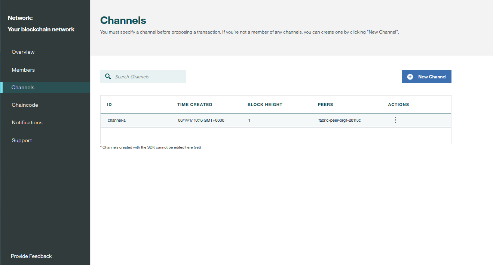

---

copyright:
  years: 2017
lastupdated: "2017-12-05"
---

{:new_window: target="_blank"}
{:shortdesc: .shortdesc}
{:codeblock: .codeblock}
{:screen: .screen}
{:pre: .pre}

# 操作網路
{: #v10_dashboard}

「網路監視器」提供區塊鏈環境的概觀，包括網路元件、成員、加入的通道、效能資料和已部署的鏈碼。
{:shortdesc}

「網路監視器」會顯示下列畫面：
* 在「概觀」畫面中，您可以檢視網路服務認證、元件狀態資訊，並可新增對等節點。
* 在「成員」畫面中，您可以管理網路成員和憑證。
* 在「通道」畫面中，您可以建立新通道，並可檢視現有通道的相關資訊。
* 在「鏈碼」畫面中，您可以在對等節點上安裝及實例化鏈碼。
* 在「通知」畫面中，您可以處理擱置中的核准，並可檢視已完成的核准。
* 在「支援」畫面中，您可以找到參照資源的鏈結，並可查看每個版本中的新功能和已變更的功能。

## 概觀

「概觀」畫面會顯示區塊鏈元件（包括排序節點、CA 和對等節點）的即時狀態資訊。每個元件都會顯示在四個不同的標頭之下：**類型**、**名稱**、**狀態**和**動作**。在建立區塊鏈網路期間，會自動建立三個排序節點和兩個 CA 節點。CA 是成員特定的節點，而排序節點是整個網路共用的一般端點。

**圖 1** 顯示「概觀」畫面：

*圖 1. 網路概觀*

- 節點動作

  表格的**動作**標頭提供用來啟動或停止元件的按鈕。您也可以選取多個節點，然後按一下**啟動選取項目**或**停止選取項目**按鈕，以啟動或停止節點群組。當您選取一個以上的節點時，**啟動選取項目**或**停止選取項目**按鈕就會出現在表格頂端。

  您也可以從**動作**標頭下的下拉清單中，按一下**檢視日誌**，以查看元件日誌。這些日誌會顯示在各種網路元件之間發生的遠端程序呼叫，有助於進行除錯及疑難排解。例如，實驗停止對等節點，並嘗試將其設為交易的目標；您將會看到 gRPC 連線錯誤。當您重新啟動對等節點，並嘗試再次進行交易時，就會看到連線成功。您也可以將對等節點關閉一段延伸時間，因為通道會繼續交易。備份對等節點時，您將會注意到透過聊天通訊協定來同步化分類帳。只要對等節點完全同步化分類帳之後，您就可以執行一般呼叫及查詢。  
- 服務認證  
按一下「資源」標籤右上方的**服務認證**按鈕，即可檢視 JSON 檔案，以查看每個元件的低層次網路資訊。這是應用程式需要的所有配置資訊。但是請注意，此檔案只包含特定元件和共用排序節點的位址。如果您需要將目標設為其他對等節點，則需要取得其端點。包含 "url" 的標頭會顯示每個元件的 API 端點。必須要有這些端點，才能將目標設為用戶端應用程式中的特定網路元件，且其定義通常會存放在隨附於此應用程式的 JSON 模型化配置檔中。如果您要自訂的應用程式需要組織外的對等節點背書，則您需要從頻外作業中的相關操作員擷取這些對等節點的 IP 位址。用戶端必須可以連接至任何需要其回應的對等節點。  
- 新增對等節點  
按一下右上方的**新增對等節點**按鈕，以將對等節點新增至您的網路。每一個成員最多可以在一個網路中新增 3 個對等節點。您可以在第一次建立或加入網路時新增對等節點，也可以之後於「網路監視器」中新增。   
在「新增對等節點」蹦現畫面中，選取您要新增的對等節點數目和大小。目前只有「小型」對等節點可供購買，但最終會有「中型」和「大型」對等節點來幫助容納較大的工作負載和較高的交易傳輸量。對等節點大小和效能度量值的詳細資料將於近期發佈...
  
## 成員

「成員」畫面包含兩個標籤，其中「成員」標籤會顯示網路成員資訊，而「憑證」標籤會顯示憑證資訊。

**圖 2** 顯示起始「成員」畫面，其中的「成員」標籤顯示您的網路成員：

*圖 2. 網路成員*

除了您在建立網路時邀請的成員之外，您還可以在「成員」標籤中邀請其他成員。若要邀請成員加入您的網路，請輸入機構名稱和操作員的電子郵件位址，然後按一下 **新增成員**。一個網路總計可以有 15 個成員（包括網路起始者）。若要從您的網路中移除成員，請按一下該成員列尾的「移除」符號。

**圖 3** 顯示起始「成員」畫面，其中的「憑證」標籤顯示成員憑證：

*圖 3. 憑證*

操作員可以在「憑證」標籤中為同一機構的成員管理憑證。按一下**新增憑證**，以開啟「新增憑證」畫面。為憑證命名，將 PEM 格式的用戶端憑證貼在「金鑰」欄位中，然後按一下**提交**。您需要重新啟動對等節點，用戶端憑證才會生效。

如需產生憑證金鑰的相關資訊，請參閱[產生用戶端憑證](v10_application.html#generating-the-client-side-certificates)。

## 通道

您可以將網路隔離成數個通道，每個通道各代表獲授權查看該通道上實例化鏈碼資料的一小組成員。每個網路都必須至少要有一個通道，才能進行交易。每個通道都有唯一的分類帳，使用者必須經過適當鑑別，才能對此分類帳執行讀寫作業。如果您不在通道上，就看不到任何資料。

**圖 4** 顯示起始儀表板畫面，其中顯示網路中所有通道的概觀：

*圖 4. 通道*

建立通道將會導致產生通道特定的分類帳。如需相關資訊，請參閱[建立通道](howto/create_channel.html)。

您也可以選取現有的通道，以檢視更精確的通道、成員資格和作用中鏈碼詳細資料。如需相關資訊，請參閱[監視網路](howto/monitor_network.html)。  

## 鏈碼

鏈碼定義用來建立及修改資產的商業邏輯和交易指示。

**圖 5** 顯示鏈碼的起始儀表板畫面：

*圖 5. 鏈碼*

鏈碼會先安裝在對等節點的檔案系統上，然後在通道上進行實例化。如需相關資訊，請參閱[安裝及實例化鏈碼](howto/install_instantiate_chaincode.html)。

## 通知

您可以在「通知」畫面中處理擱置中的要求，以及檢視已完成的要求。 

**圖 6** 顯示「通知」畫面：

*圖 6. 通知*

當您建立通道或受邀加入新的通道時，「網路監視器」中會出現通知。 

這些要求會分組成「全部」、「擱置中」和「已完成」子標籤。子標籤標頭後面的數字代表各個子標籤中的要求數。
   * 您可以在「全部」子標籤中找到您的所有要求。
   * 您尚未接受或拒絕或是尚未檢視的要求都是在「擱置中」子標籤中。按一下**檢閱要求**按鈕，以檢視要求（其中包括通道原則及成員）及投票狀態。如果您是通道操作員，則可以**接受**或**拒絕**要求，或按一下**稍後**，以在另一個時間處理它。如果有足夠的通道操作員接受該要求，您可以按一下**提交要求**，以啟動通道更新。
   * 已提交的要求會出現在「已完成」子標籤中。您可以按一下**檢閱要求**來檢視其詳細資料。
  
要求清單太長時，您可以在頂端的搜尋欄位中搜尋要求。 

若要刪除擱置中要求，請選取要求前面的方框，然後按一下**刪除要求**。請注意，無法刪除已完成的要求。

## 支援

「支援」畫面包含兩個標籤，其中「支援」標籤會提供支援資訊，而「版本注意事項」標籤會說明各版本的新功能和已變更的功能。

使用此頁面上的鏈結及資源，以存取疑難排解及支援討論區。如果您無法對問題進行除錯或查明問題的解答，請按一下**開立 {{site.data.keyword.Bluemix_notm}} 支援問題單**鏈結，並遵循指引來提交問題單。

**圖 7** 顯示起始「支援」畫面，其中的「支援」標籤顯示支援資訊：

*圖 7. 區塊鏈支援*

* [{{site.data.keyword.blockchainfull_notm}} 服務文件](index.html)（就是這個文件網站）提供如何開始使用 {{site.data.keyword.Bluemix_notm}} 上的「{{site.data.keyword.blockchainfull}} 平台」的指引。您可以從導覽器中尋找對應的主題，或是使用頂端的搜尋功能來搜尋任何術語。  
* **社群協助**之下的 [IBM DeveloperWorks ](https://developer.ibm.com/blockchain/) 包含開發人員適用的資源和資訊。  
* **支援問題單**之下的 [IBM dWAnswers ](https://developer.ibm.com/answers/smartspace/blockchain/) 提供問題和回應的平台。您可以從先前張貼的問題搜尋回應，或是提交新的問題。請務必要將 **blockchain** 關鍵字併入問題中。   
您也可以使用[開立 {{site.data.keyword.Bluemix_notm}} 支援問題單 ]() 選項，提交問題單給 {{site.data.keyword.blockchainfull_notm}} 支援團隊。請從特定的 {{site.data.keyword.Bluemix_notm}} 實例中共用詳細資料及程式碼 Snippet。  
* **{{site.data.keyword.blockchain}} 範例應用程式**之下的[範例應用程式 ]() 提供指引和範例程式碼 Snippet，以協助開發應用程式。  
* **Hyperledger Fabric** 之下的 [Hyperledger Fabric ](http://hyperledger-fabric.readthedocs.io/) 和 [Hyperledger Fabric 社群 ]() 提供更多有關 Hyperledger Fabric 堆疊的詳細資料。  
您可以就 Hyperledger Fabric 程式碼的相關問題，與 [Hyperledger 專家 ](https://chat.hyperledger.org/channel/general) 討論。   
  
  
**圖 8** 顯示起始「成員」畫面，其中的「版本注意事項」標籤顯示各版本的新功能和已變更的功能：

*圖 8. 版本注意事項*

