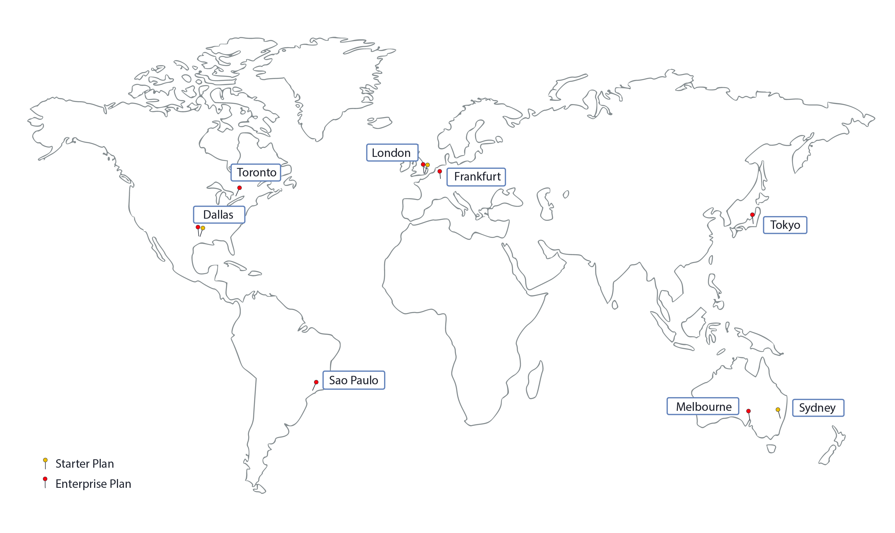

---

copyright:
  years: 2017, 2018
lastupdated: "2019-02-08"

---

{:new_window: target="_blank"}
{:shortdesc: .shortdesc}
{:screen: .screen}
{:pre: .pre}
{:table: .aria-labeledby="caption"}
{:codeblock: .codeblock}
{:tip: .tip}
{:download: .download}

# {{site.data.keyword.blockchainfull_notm}} Platform locations
{: #ibp-regions-locations}

***[Is this page helpful? Tell us.](https://www.surveygizmo.com/s3/4501493/IBM-Blockchain-Documentation)***

{{site.data.keyword.cloud}} is hosted worldwide in various locations. Locations are data centers within a geographic area that is accessed by an endpoint. {{site.data.keyword.blockchainfull_notm}} Platform offers membership plans within {{site.data.keyword.cloud_notm}} globally in different locations. When you create {{site.data.keyword.blockchainfull_notm}} Platform service instance in {{site.data.keyword.cloud_notm}}, your blockchain network and network resources are created and stored in the {{site.data.keyword.cloud_notm}} location where you create the service instance in.
{:shortdesc}

Different {{site.data.keyword.blockchainfull_notm}} Platform offerings are available in different {{site.data.keyword.cloud_notm}} locations. You can create blockchain networks in only {{site.data.keyword.cloud_notm}} locations that {{site.data.keyword.blockchainfull_notm}} Platform plans are available.

Table 1 and Figure 1 show the {{site.data.keyword.cloud_notm}} regions and locations that {{site.data.keyword.blockchainfull_notm}} Platform supports.

| Location | Starter Plan | Enterprise Plan |
|--------|----------|----------|
| Dallas | Y | Y |
| London | Y | Y |
| Tokyo |  | Y |
| Frankfurt |  | Y |
| Sydney | Y |  |
| São Paulo |  | Y |
| Toronto |  | Y |

_Table 1. {{site.data.keyword.blockchainfull_notm}} Platform locations_

  
_Figure 1. {{site.data.keyword.blockchainfull_notm}} Platform locations_
