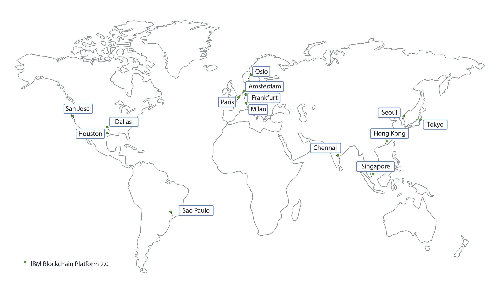

---

copyright:
  years: 2017, 2019
lastupdated: "2019-05-16"

keywords: data centers, IBM Cloud regions, available locations

subcollection: blockchain

---

{:external: target="_blank" .external}
{:shortdesc: .shortdesc}
{:screen: .screen}
{:pre: .pre}
{:table: .aria-labeledby="caption"}
{:codeblock: .codeblock}
{:tip: .tip}
{:download: .download}

# {{site.data.keyword.blockchainfull_notm}} Platform locations
{: #ibp-regions-locations}

{{site.data.keyword.cloud}} is hosted worldwide in various locations. Locations are data centers within a geographic area that is accessed by an endpoint. {{site.data.keyword.blockchainfull_notm}} Platform deploys blockchain networks within {{site.data.keyword.cloud_notm}} globally in different locations. When you create {{site.data.keyword.blockchainfull_notm}} Platform service instance in {{site.data.keyword.cloud_notm}}, your blockchain network and network resources are created and stored in the {{site.data.keyword.cloud_notm}} location where you create the service instance in.
{:shortdesc}

Different {{site.data.keyword.blockchainfull_notm}} Platform offerings are available in different {{site.data.keyword.cloud_notm}} locations. You can create blockchain networks in only {{site.data.keyword.cloud_notm}} locations that {{site.data.keyword.blockchainfull_notm}} Platform plans are available.

Table 1 and Figure 1 show the {{site.data.keyword.cloud_notm}} regions and locations that {{site.data.keyword.blockchainfull_notm}} Platform v2.0 supports.

If you want to use a free {{site.data.keyword.cloud_notm}} Kubernetes cluster, do not choose a free cluster in Asia Pacific. Otherwise, your free cluster will be created in Melbourne in AP South instead of AP North. AP South clusters cannot be used to deploy {{site.data.keyword.blockchainfull_notm}} Platform v2.0 now. Choose **US South** or **EU Central** locations if you plan to use a free cluster.
{: note}

| Region | {{site.data.keyword.cloud_notm}} locations |
|--------|--------------------|
| US South | San Jose, Sao Paulo, Dallas, Houston |
| AP North | Tokyo, Chennai, Hong Kong, Seoul, Singapore |
| EU Central | Frankfurt, Amsterdam, Milan, Oslo, Paris |

_Table 1. {{site.data.keyword.blockchainfull_notm}} Platform v2.0 locations_

  
_Figure 1. {{site.data.keyword.blockchainfull_notm}} Platform v2.0 locations_

Table 2 and Figure 2 show the {{site.data.keyword.cloud_notm}} regions and locations that {{site.data.keyword.blockchainfull_notm}} Platform Starter Plan and Enterprise Plan support.

| Location | Starter Plan | Enterprise Plan |
|--------|----------|----------|
| Dallas | Y | Y |
| London | Y | Y |
| Tokyo |  | Y |
| Frankfurt |  | Y |
| Sydney | Y |  |
| Melbourne |  | Y |
| São Paulo |  | Y |
| Toronto |  | Y |

_Table 2. Starter Plan and Enterprise Plan locations_

  
_Figure 2. Starter Plan and Enterprise Plan locations_
