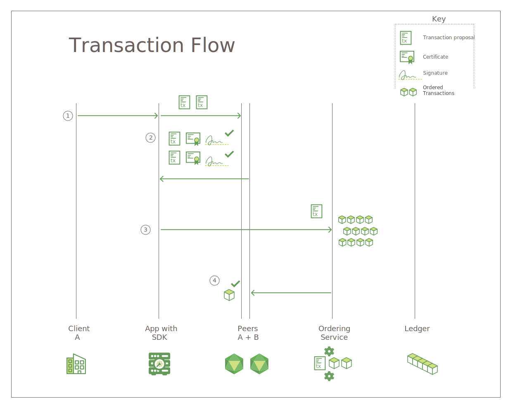

---

copyright:
  years: 2017, 2019
lastupdated: "2019-06-18"

keywords: Hyperledger Fabric, confidential channels, Membership Service Provider, Linux Foundation, SDKs, modular architecture, permissioned network

subcollection: blockchain

---

{:external: target="_blank" .external}
{:shortdesc: .shortdesc}
{:codeblock: .codeblock}
{:screen: .screen}
{:pre: .pre}

# Hyperledger Fabric
{: #hyperledger-fabric}

{{site.data.keyword.blockchainfull}} network is built on the Hyperledger Fabric stack, one of the blockchain projects within the Linux Foundation's Hyperledger Project. It is a "permissioned" network where all users and components have known identities. Sign/verify logic is implemented at every communication touchpoint, and transactions are consented upon through a series of endorsement and validation checks. In this sense, it differs greatly from traditional blockchain implementations that promote anonymity and are forced to rely on cryptocurrencies and heavy compute obligations to validate transactions.
{:shortdesc}

Hyperledger Fabric offers a modular architecture to extend the scalability and performance. This topic introduces some key components in Hyperledger Fabric. For a complete introduction on Hyperledger Fabric, see [Hyperledger Fabric documentation](https://hyperledger-fabric.readthedocs.io/en/release-1.4/){: external}.

## Peers
{: #hyperledger-fabric-peer}

At a physical level, a blockchain network is comprised primarily of peer nodes (or, simply, peers). Peers are the fundamental elements of the network because they host ledgers and smart contracts (which are contained in ["chaincode"](https://hyperledger-fabric.readthedocs.io/en/release-1.4/developapps/chaincodenamespace.html){: external}. More accurately, the peer hosts **instances** of the ledger, and **instances** of smart contracts. Because smart contracts and ledgers are used to encapsulate the shared processes and shared information in a network, respectively, these aspects of a peer make them a good starting point to understand what a Fabric network actually does.

To learn more about peers specifically, check out [this document focusing just on peers](https://hyperledger-fabric.readthedocs.io/en/release-1.4/peers/peers.html){: external} from the Fabric community documentation.

## Certificate Authority
{: #hyperledger-fabric-certificate-authority}

As a platform for **permissioned** blockchain networks, Hyperledger Fabric includes a modular **Certificate Authority (CA)** component for managing the network identities of all member organizations and their users. The requirement for a permissioned identity for every user enables ACL-based control over network activity, and guarantees that every transaction is ultimately traceable to a registered user.
* The CA issues a root certificate (**rootCert**) to each **member** (organization or individual) that is authorized to join the network.
* The CA also issues an enrollment certificate (**eCert**) to each member component, server-side applications and occasionally users.
* Each enrolled user is also granted an allocation of transaction certificates (**tCerts**). Each **tCert** authorizes one network transaction.

This certificate-based control over network membership and actions enables members to restrict access to private and confidential channels, applications, and data, by specific user identities.

For more information about the Hyperledger Fabric Certificate Authority component, see [Fabric CA User’s Guide](https://hyperledger-fabric-ca.readthedocs.io/en/release-1.4/){: external}.

## Membership Service Provider
{: #hyperledger-fabric-membership-service-provider}

Hyperledger Fabric includes a **Membership Service Provider (MSP)** component to offer an abstraction of all cryptographic mechanisms and protocols behind issuing and validating certificates, and user authentication. The MSP is installed on each channel peer to ensure that transaction requests that are issued to the peer originate from an authenticated and authorized user identity.

For more information about the Hyperledger Fabric Membership Services Provider component, see [Membership](https://hyperledger-fabric.readthedocs.io/en/release-1.4/membership/membership.html){: external} in the [Hyperledger Fabric documentation](https://hyperledger-fabric.readthedocs.io/en/release-1.4/){: external}.

## Ordering service
{: #hyperledger-fabric-ordering-service}

In other distributed blockchains, such as Ethereum and Bitcoin, there is no central authority that orders transactions and sends them out to peers. Hyperledger Fabric, the blockchain that the {{site.data.keyword.blockchainfull_notm}} Platform is based on, work differently. It features a node called an **orderer**.

Orderers are key components in a network because they perform a few essential functions:

- They literally **order** the blocks of transactions that are sent to the peers to be written to their ledgers, and this process is called "ordering". If these transactions were instead bundled and ordered at the peers themselves, it would increase the possibility of one peer writing a transaction to its ledger where another peer did not, creating a state fork.
- They maintain the **orderer system channel**, the place where the **consortium**, the list of peer organizations permitted to create channels, resides.
- They perform important identity validation checks. For example, if an organization tries to create a channel when it is not a member of the orderer's consortium, the request will be denied. Orderers also validate against behaviors in transaction channels, such as the permissions for changing a channel configuration.

Hyperledger Fabric currently supports both a SOLO (one ordering node) and Kafka-based ordering service implementations. For more information about Hyperledger Fabric ordering service, see [Bringing up a Kafka-based Ordering Service](https://hyperledger-fabric.readthedocs.io/en/release-1.4/kafka.html){: external} in [Hyperledger Fabric documentation](https://hyperledger-fabric.readthedocs.io/en/release-1.4/){: external}.

## The Fabric SDKs
{: #hyperledger-fabric-fabric-sdks}

The Hyperledger Fabric SDKs enable application developers to build applications that interact with a blockchain network. These SDKs help facilitate applications to manage the lifecycle of channels and chaincode.

Hyperledger Fabric delivers both a Node.js SDK and Java SDK, and provides the following functions to interact with the blockchain network:

* Register and enroll users
* Create channels
* Join peers to a channel
* Update system channel or application channel configuration
* Install chaincode on peers
* Instantiate chaincode on a channel
* Upgrade chaincode on a channel
* Call chaincode functions to update the ledger
* Query the ledger for specific transactions, blocks or keys
* Monitor events on a channel (for example, successful commitment of a transaction)

For more information about Fabric SDKs, see [Hyperledger Fabric SDKs](https://hyperledger-fabric.readthedocs.io/en/release-1.4/fabric-sdks.html){: external} in [Hyperledger Fabric documentation](https://hyperledger-fabric.readthedocs.io/en/release-1.4/){: external}.

## Transaction flow
{: #hyperledger-fabric-transaction-flow}

To ensure data consistency and integrity, Hyperledger Fabric implements multiple checkpoints throughout the transaction flow, including client authentication, endorsement, ordering, and commitment to the ledger.

**Figure 1** depicts the transaction flow on a Hyperledger Fabric blockchain network:
{: caption="Figure 1. Transaction flow on a Hyperledger Fabric network" caption-side="bottom"}

On a Hyperledger Fabric network, the flow of data for queries and transactions is initiated by a client-side application by submitting a transaction request to a peer on a channel. The initial flow of data across the network is common to both queries and transactions:

1. Using APIs available in the SDK, a client application signs and submits a transaction proposal to the appropriate endorsing peers on the specified channel. This initial transaction proposal is a **request** for endorsement.
2. Each peer on the channel verifies the identity and authority of the submitting client, and (if valid) runs the specified chaincode against the supplied inputs. Based on the transaction results and the endorsement policy for the invoked chaincode, each peer returns a signed YES or NO response to the application. Each signed YES response is an **endorsement** of the transaction.

	At this point in the transaction flow, the process diverges for queries and transactions. If the proposal called a query function in the chaincode, the application returns the data to the client. If the proposal called a function in the chaincode to update the ledger, the application continues with the following steps:
3. The application forwards the transaction, which includes the read/write set and endorsements, to the **ordering service**.
4. The transaction is then relayed to the ordering service. All channel peers validate each transaction in the block by applying the chaincode-specific Validation Policy and running a Concurrency Control Version Check.
	* Any transaction that fail the validation process is marked as invalid in the block, and the block is appended to the channel's ledger.
	* All valid transactions update the state database accordingly with the modified key/value pairs.

The **gossip data dissemination protocol** continually broadcasts ledger data across the channel to ensure synchronized ledgers among peers. For more information, see [Gossip data dissemination protocol](https://hyperledger-fabric.readthedocs.io/en/release-1.4/gossip.html){: external} in
[Hyperledger Fabric documentation](https://hyperledger-fabric.readthedocs.io/en/release-1.4/){: external}.

For a step-by-step introduction on transaction flow, see [Transaction Flow](https://hyperledger-fabric.readthedocs.io/en/release-1.4/txflow.html){: external} in [Hyperledger Fabric documentation](https://hyperledger-fabric.readthedocs.io/en/release-1.4/){: external}.
