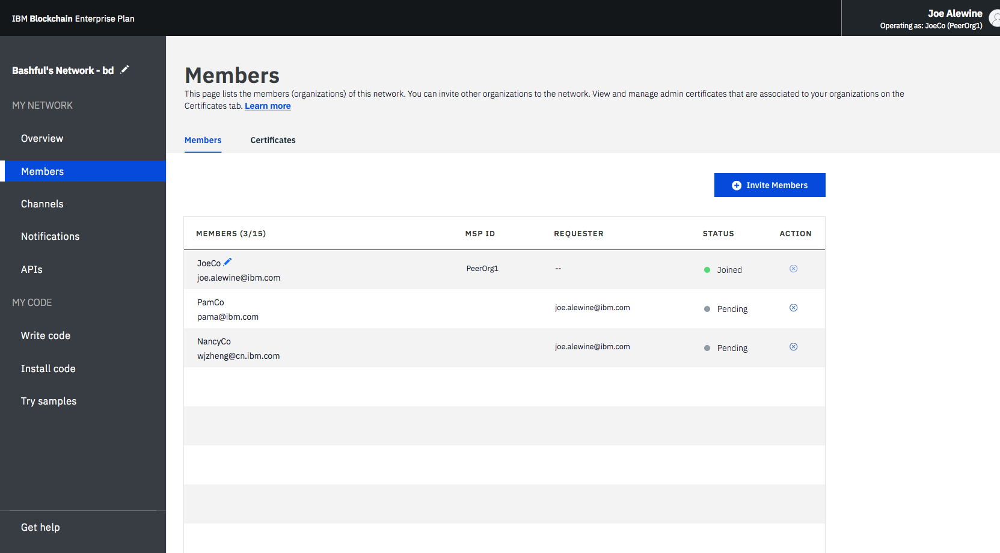
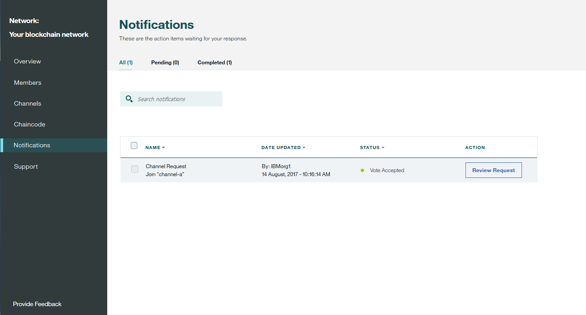
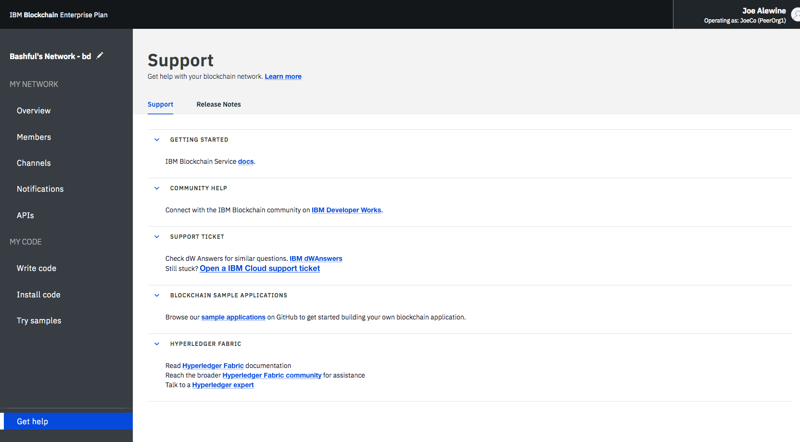

---

copyright:
  years: 2017, 2018
lastupdated: "2018-05-15"

---

{:new_window: target="_blank"}
{:shortdesc: .shortdesc}
{:codeblock: .codeblock}
{:screen: .screen}
{:pre: .pre}

# Operate Enterprise Plan network
{: #v10_dashboard}

{{site.data.keyword.blockchainfull}} Platform brings a Network Monitor to provide an overview of your blockchain environment, including network resources, members, joined channels, transaction performance data, and deployed chaincode. The Network Monitor also offers you the entry point to run Swagger APIs, develop a network with {{site.data.keyword.blockchainfull_notm}} Platform: Develop, and try sample applications.
{:shortdesc}

You can [change the name of your Enterprise Plan network](#ep-network-name) in the Network Monitor.

The Network Monitor exposes the following screens in three sections. You can navigate to each screen from the left navigator in the Network Monitor.
- The **My network** section contains the "[Overview](#overview)", "[Members](#members)", "[Channels](#channels)", "[Notifications](#notifications)", and "[APIs](#apis)" screens.
- The **My code** section contains the "[Develop code](#write_code)", "[Install code](#chaincode)", and "[Try samples](#samples)" screens.
- The "[Get help](#support)" screen shows support information as well as release notes for helios and Hyperledger Fabric (the code base the {{site.data.keyword.blockchainfull_notm}} Platform is based on).

You can [check and configure network preferences](#network-preferences) from the drop-down menu on the upper right of the Network Monitor.

This tutorial describes each of the above screens and functions.

## Update network name
{: #ep-network-name}

When you create an Enterprise Plan network, {{site.data.keyword.blockchainfull_notm}} Platform assigns a name to your network. However, you can update this network name at anytime in your Network Monitor.

On the top of the left navigator in the Network Monitor, click on the network name and the field becomes editable. Type the new network name that you want to use and press the **Enter** key. Your network name will be updated in a few seconds.

**Figure 1** shows the steps to update the Starter Plan network name from the assigned name to "Starter Plan Network".

*Figure 1. Update network name*

## Overview
{: #overview}

The "Overview" screen displays real-time status information on your blockchain resources, including the orderer, CA, and peer nodes. Each resource is displayed under four distinct headers: **Type**, **Name**, **Status**, and **Actions**. During the creation of your blockchain network, three orderer nodes and two CA nodes are automatically created. The CA's are member-specific, whereas the ordering nodes are common endpoints that are shared across the network.

**Figure 2** shows the "Overview" screen:

*Figure 2. Network overview*

### Node actions
The **Actions** header of the table provides buttons to start or stop your resources. You can also start or stop a group of nodes by selecting multiple nodes and then clicking the **Start Selected** or **Stop Selected** button. The **Start Selected** or **Stop Selected** button appears on top of the table when you select one or more nodes.

Note that the Stop and Start actions are not available for an Orderer node. In general, there is no need to stop and start Peer or CA nodes on a network. The Stop and Start actions are provided in case you needed to restart a peer, for example to bring it up in a clean state.

You can also check component logs by clicking **View Logs** from the drop-down list under the **Actions** header. The logs expose the calls between the various network resources and are useful for debugging and troubleshooting. For example, experiment by stopping a peer and attempting to target it with a transaction, and you will see connectivity errors. When you restart the peer and attempt the transaction again, you will see a successful connection. You can also leave a peer down for an extended period of time as your channels continue to transact. When the peer is brought back up, you will notice a synchronization of the ledger as it receives the blocks that were committed when it was down. After the ledger is fully synchronized, you can perform normal invokes and queries against it.

### Connection Profile
{: #enterprise-connection-profile}
You can view the JSON file about low-level network information of each resource by clicking the **Connection Profile** button. The connection profile contains all the configuration information that you need for an application. However, because this file contains only the addresses for your specific components and the orderer, if you need to target additional peers, you need to obtain their endpoints. The header that contains "url" displays the API endpoint of each component. These endpoints are required in order to target specific network components from a client-side application and their definitions will typically live in a JSON-modeled configuration file that accompanies the app. If you are customizing an application that requires endorsement from peers that are not part of your organization, you need to retrieve the IP addresses of those peers from the relevant operators in an out-of-band operation. Clients must be able to connect to any peers from which they need a response.

### Add peers
{: #peers}
Click the **Add Peers** button to add peer nodes to your network. In Starter Plan, two peers will be added automatically for you at network creation time. In the Enterprise Plan, you can add peer nodes for the first time when you create or join a network or later in the Network Monitor. You might be in different scenarios when you need more peers.  For example, you might want multiple peers to join the same channel for redundancy. Each peer processes the channel's transactions and write to their respective copies of the ledger. In case one of the peers fails, other peers can continue processing transactions and application requests.  You could symmetrically load balance all application requests across the peers, or you could target different peers for different functions. For example, you can use one peer to query the ledger and use another peer to process endorsements for ledger updates.

  In the pop-up "Add Peers" panel, select the number of peer nodes you want to add. <!--Currently only "small" peers are available for purchase, however there will eventually be "medium" and "large" to help accommodate larger workloads and higher transaction throughput.-->

## Members
{: #members}
The "Members" screen contains two tabs to display network member information in the "Members" tab and certificate information in the "Certificates" tab.

### Members
{: #members_tab}
**Figure 3** shows the initial "Members" screen that displays your network members in the "Members" tab:

*Figure 3. Network members*

Besides the members that you invite when you create the network, you can invite other members in the "Members" tab. To invite a member to your network, enter the institution name and operator's email address and click **Add Member**. A network can have a total of 15 members (including the network initiator). To remove a member from your network, click the "remove" symbol at the end of the member row.

### Certificates
**Figure 4** shows the initial "Members" screen that displays member certificates in the "Certificates" tab:

*Figure 4. Certificates*

Operators can manage the certificates for the members in the same institution in the "Certificates" tab. Click **Add Certificate** to open the "Add Certificate" panel. Give a name to your certificate, paste your client-side certificates in PEM format to the "Key" field, and click **Submit**. You need to restart your peers before the client-side certificates can take effect.

For more information about generating your certificate key, see [Generating the client-side certificates](v10_application.html#generating-the-client-side-certificates).

## Channels
{: #channels}

You can segregate your network into channels where each channel represents a subset of members that are authorized to see the data for the chaincode instantiated on that channel. Every network must have at least one channel for transactions to take place. Each channel has a unique ledger and users must be properly authenticated to perform read/write operations against this ledger. If you're not on a channel, you can't see any data.

**Figure 5** shows the initial dashboard screen displaying an overview of all channels in your network:

*Figure 5. Channels*

Creating a channel results in the generation of a channel-specific ledger. For more information, see [Creating a channel](howto/create_channel.html).

You can also select an existing channel to view more precise details about the channel, membership, and active chaincode. For more information, see [Monitoring a network](howto/monitor_network.html).

## Notifications
{: #notifications}

You can handle pending requests and view completed requests in the "Notifications" screen.

**Figure 6** shows the "Notifications" screen:

*Figure 6. Notifications*

When you create a channel or are invited to a new channel, a notification will appear in the Network Monitor.

The requests are grouped into "All", "Pending", and "Completed" subtabs. Numbers after the subtab header indicate the number of requests in each subtab.
   * You can find all your requests in the "All" subtab.
   * Requests that you have not accepted or declined, or you have not viewed, are in the "Pending" subtab. Click the **Review Request** button to view the request, which includes the channel policy and members, and voting status. If you are a channel operator, you can either **Accept** or **Decline** the request, or handle it at another time by clicking **Later**. If the request is accepted by enough channel operators, you can click **Submit Request** to activate the channel update.
   * A submitted request will appear in the "Completed" subtab.  You can click **Review Request** to view its details.

When you have a long list of requests, you can search for a request in the search field on the top.

Pending requests can be deleted by selecting the boxes in the front of them and clicking **Delete Request**. Note that a completed request cannot be deleted.

## APIs
{: #apis}

To facilitate application development, {{site.data.keyword.blockchainfull_notm}} Platform exposes APIs that you can test against your network in a Swagger UI.

**Figure 7** shows the "APIs" screen:

*Figure 7. APIs*

Click the **Swagger UI** link to open the Swagger UI. Note that you need to authorize the Swagger UI with your network credentials (which can be found on this APIs page) before you can run the APIs. For more information, see [Interacting with the network using Swagger APIs](howto/swagger_apis.html).

## Develop Code
{: #write-code}

The Enterprise Plan integrates {{site.data.keyword.blockchainfull_notm}} Platform: Develop and provides a development environment with industry standard tools and technologies. You can develop your network in the environment online or locally. After you develop a network, you can deploy it back to your Enterprise Plan network.

**Figure 8** shows the "Develop code" screen:

*Figure 8. Develop code*

For more information about developing and deploying your code with the Enterprise Plan, see [Developing business networks on Enterprise Plan](develop_enterprise.html).

## Install code
{: #chaincode}

Chaincode, which is also known as "smart contract", is pieces of software that contains a set of functions to query and update the ledger. They are installed on peers and instantiated on a channel.

**Figure 9** shows the "Install code" screen:

*Figure 9. Install code*

A chaincode is first installed on a peer's file system and then instantiated on a channel. For more information, see [Installing, instantiating, and updating a chaincode](howto/install_instantiate_chaincode.html).

## Try samples
{: #samples}

Sample applications help you to get a better understanding of a blockchain network and application development. Follow the link to the Marbles repo in the Network Monitor for information on how to install the Marbles sample application. For more information on how to develop and deploy your own samples, check out [Developing applications](v10_application.html).

**Figure 10** shows the "Try samples" screen:

*Figure 10. Samples*

## Get help
{: #support}

The "Get help" screen contains two tabs to provide support information in the "Support" tab and to describe new and changed functions of each release in the "Release Notes" tab.

**Figure 11** shows the initial "Support" screen that displays support information in the "Support" tab:

*Figure 11. Blockchain support*

Use the links and resources on this page to access troubleshooting and support forums.

* [{{site.data.keyword.blockchainfull_notm}} Service docs](index.html) under **Getting started**, which is this doc site, provides guidance on how to start with {{site.data.keyword.blockchainfull}} Platform on {{site.data.keyword.Bluemix_notm}}. You can find corresponding topics from the left navigator or search any term with the search function on the top.
* [IBM Developer Works ](https://developer.ibm.com/blockchain/) under **Community help** contains resources and information for developers.
* [IBM dWAnswers ](https://developer.ibm.com/answers/smartspace/blockchain/) under **Support ticket** serves as a platform for questions and responses. You can search for responses from previously posed questions or submit a new question. Be sure to include the keyword **blockchain** in your question.
  You can also submit a ticket to {{site.data.keyword.blockchainfull_notm}} support team with the **Open an {{site.data.keyword.Bluemix_notm}} support ticket** option.  Share details and code snippets from your specific {{site.data.keyword.Bluemix_notm}} instance.
* [Sample applications ](https://github.com/ibm-blockchain) under **Blockchain sample applications** provides guidance and sample code snippets to assist in the development of applications.
* [Hyperledger Fabric ](http://hyperledger-fabric.readthedocs.io/) and [Hyperledger Fabric community ](http://jira.hyperledger.org/secure/Dashboard.jspa) under **Hyperledger Fabric** provide more details about the Hyperledger Fabric stack.
  Talk to a [Hyperledger Expert ](https://chat.hyperledger.org/channel/general) with questions about the Hyperledger Fabric code.

If you cannot debug your issue or ascertain an answer to your question, submit a support case in the IBM Cloud Service Portal. For more information, see [Getting support](ibmblockchain_support.html).

Figure 12 and Figure 13 show the initial "Get Help" screen that displays new and changed functions of each release in the "Release Notes" tab:

*Figures 12. Release notes for Helios*

*Figures 13. Release notes for Fabric*

## Network preferences
{: #network-preferences}

Click the upper right corner and open the drop-down menu and then the **Network preferences**. The Network preferences window opens. The Network preferences window shows the basic information of your network, such as network name, Fabric version, network location in {{site.data.keyword.cloud_notm}}, and ledger database type.

Enterprise Plan networks that are created after May 15th, 2018 will run on Hyperledger Fabric v1.1. If you create networks after the upgrade, you can also manage web inactivity timeout, mutual TLS, and switch your ledger to CouchDB for your network in the Network preferences window. These settings can be changed by the network initiator only.

### Web inactivity timeout
{: #web-inactivity-timeout}

**Note**: Only **network initiator** can change the web inactivity timeout setting. This is a network level setting and will affect all network members.

The web inactivity timeout is set to **Off** by default. If you turn the web inactivity timeout to **On**, any member of the network will be logged out automatically after 10 minutes of inactivity. When the web inactivity timer reaches 10 minutes, the web inactivity timeout function ends the inactive web sessions to ensure security of the network member's account. Clicking a link or refreshing the Network Monitor resets the web inactivity timer. Before reaching 10 minutes, closing the browser window or tab also ends the web session.

### Mutual TLS
{: #mutual-tls}

Mutual TLS secures the communication between your application and your network, and ensures only you can communicate with your network.

**Note**: Only a **network initiator** can enable or disable the mutual TLS. This is a network level setting and will affect all network members.

The mutual TLS button is set to **Off** by default. If you enable mutual TLS, you need to update your applications to support this function. Otherwise, your applications will not be able to communicate with your network.

For a Fabric 1.1 Enterprise plan network, each organization has its own mutual TLS certificate authority (CA). The information required to connect to the mutual TLS CA is available in the [Connection profile ](##enterprise-connection-profile) accessible from your **Overview** screen in the Network Monitor by clicking the  **Connection Profile**  button.  The connection profile contains the necessary information to connect to the CA and get the certificates you need to connect to your network.

In the Connection Profile, locate the `certificateAuthorities` section where you will find the following attributes that are necessary to enroll and get the certificates to communicate with your network using Mutual TLS.

- `url`: URL for connecting to the CA that can give out mutual TLS certificates
- `enrollId`: Enroll ID to use for getting a certificate
- `enrollSecret`: Enroll secret to use for getting a certificate
- `x-tlsCAName`: CA name to use for getting certificate that will allow the application to communicate with Mutual TLS.

For more information about updating your applications to support mutual TLS, see [How to configure mutual TLS ](https://fabric-sdk-node.github.io/tutorial-mutual-tls.html)

### CouchDB ledger type
{: #couchdb}

**Note**: Only the **network initiator** can switch the ledger database from LevelDB to CouchDB. This is a network level setting and will affect all network members. Switching to CouchDB is permanent. You cannot revert back to LevelDB.

Before Enterprise Plan upgrades to Fabric v1.1, all network peers store data in the pure key-value LevelDB. With Fabric v1.1, you can choose to use CouchDB as your ledger database. CouchDB is a document datastore that permits indexing the contents of your data and allows you to issue rich queries against the data on your peer. Note that Hyperledger Fabric does not support peers running different databases. If CouchDB is used, it must be used by all of the peers.

To use CouchDB, your data must be stored in a data format that can be modeled in chaincode, such as JSON. If the decision is made to migrate from LevelDB to CouchDB, the {{site.data.keyword.blockchainfull_notm}} Platform will migrate your data from key-value format to the CouchDB format automatically.

If you switch to CouchDB, you need to update your chaincode to take advantage of indexes and rich queries. For more information about CouchDB and how to set up index, see [CouchDB as the State Database ](https://hyperledger-fabric.readthedocs.io/en/latest/couchdb_as_state_database.html). For more information about updating chaincode in {{site.data.keyword.blockchainfull_notm}} Platform, see [Updating a chaincode](howto/install_instantiate_chaincode.html#updating-a-chaincode).

**Figure 14** shows the "Network preferences" window:

*Figure 14. Network preferences*
