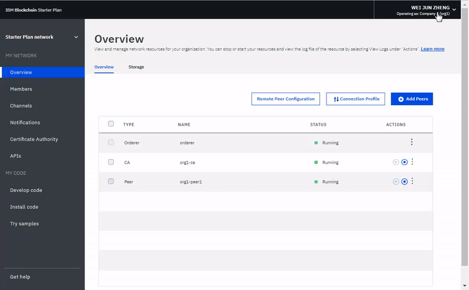

---

copyright:
  years: 2017, 2019
lastupdated: "2019-05-31"

keywords: Network Monitor, peer nodes, resources, channels, smart contract

subcollection: blockchain

---

{:shortdesc: .shortdesc}
{:codeblock: .codeblock}
{:screen: .screen}
{:pre: .pre}
{:note: .note}
{:important: .important}
{:tip: .tip}
{:external: target="_blank" .external}

# Using the Network Monitor
{: #ibp-dashboard}

{{site.data.keyword.blockchainfull}} Platform brings a Network Monitor to provide an overview of your blockchain environment, including network resources, members, joined channels, transaction performance data, and deployed chaincode. The Network Monitor also offers you the entry point to run Swagger APIs, develop a network with {{site.data.keyword.blockchainfull_notm}} Platform, and try sample applications.
{:shortdesc}

Use this tutorial to learn how to use your Network Monitor to operate an Enterprise Plan or Starter Plan network. Although most screen shots in the tutorial are for Enterprise Plan, the instructions are also valid for Starter Plan. When certain features are only accessible for one plan, the relevant section is labeled with **for Starter Plan networks** or **for Enterprise Plan networks**.

## Left navigation pane
{: #ibp-dashboard-left-navigation}

The Network Monitor exposes the following screens in three sections. You can navigate to each screen from the left navigator in the Network Monitor.
- The **My network** section contains the "[Overview](/docs/services/blockchain/v10_dashboard.html#ibp-dashboard-overview)", "[Members](/docs/services/blockchain/v10_dashboard.html#ibp-dashboard-members)", "[Channels](/docs/services/blockchain/v10_dashboard.html#ibp-dashboard-channels)", "[Notifications](/docs/services/blockchain/v10_dashboard.html#ibp-dashboard-notifications)", "[Certificate Authority](/docs/services/blockchain/v10_dashboard.html#ibp-dashboard-ca)", and "[APIs](/docs/services/blockchain/v10_dashboard.html#ibp-dashboard-apis)" screens.
- The **My code** section contains the "[Develop code](/docs/services/blockchain/v10_dashboard.html#ibp-dashboard-write_code)", "[Install code](/docs/services/blockchain/v10_dashboard.html#ibp-dashboard-chaincode)", and "[Try samples](/docs/services/blockchain/v10_dashboard.html#ibp-dashboard-samples)" screens.
- The "[Get help](/docs/services/blockchain/v10_dashboard.html#ibp-dashboard-support)" screen shows support information as well as release notes for helios and Hyperledger Fabric (the code base the {{site.data.keyword.blockchainfull_notm}} Platform is based on).

The name of your blockchain network is at the top of the left navigation pane. You can [change the name of your network](/docs/services/blockchain/v10_dashboard.html#ibp-dashboard-network-name) in the Network Monitor.

You can [check and configure network preferences](/docs/services/blockchain/v10_dashboard.html#ibp-dashboard-network-preferences) from the drop-down menu on the upper right of the Network Monitor.

This tutorial describes each of the above screens and functions.

## Overview
{: #ibp-dashboard-overview}

The "Overview" screen displays real-time status information on your blockchain resources, including the orderer, CA, and peer nodes. Each resource is displayed under four distinct headers: **Type**, **Name**, **Status**, and **Actions**. During the creation of your blockchain network, three orderer nodes and two CA nodes are automatically created. The CAs are member-specific, whereas the orderers are common endpoints that are shared across the network.

**Figure 1** shows the "Overview" screen:

*Figure 1. Network overview*

### Node actions
{: #ibp-dashboard-node-actions}

The **Actions** header of the table provides buttons to start or stop your resources. You can also start or stop a group of nodes by selecting multiple nodes and then clicking the **Start Selected** or **Stop Selected** button. The **Start Selected** or **Stop Selected** button appears on top of the table when you select one or more nodes.

The Stop and Start actions are not available for an Orderer node. In general, there is no need to stop and start Peer or CA nodes on a network. The Stop and Start actions are provided in case you needed to restart a peer, for example to bring it up in a clean state.

You can also check component logs by clicking **View Logs** from the drop-down list under the **Actions** header. The logs expose the calls between the various network resources and are useful for debugging and troubleshooting. For more information on using your network logs, see [Monitoring a blockchain network](/docs/services/blockchain/howto/monitor_network.html#monitor-blockchain-network)

To understand the effects of starting and stopping a peer, you can experiment by stopping a peer and attempting to target it with a transaction, and you will see connectivity errors in the logs. When you restart the peer and attempt the transaction again, you will see a successful connection. You can also leave a peer down for an extended period of time as your channels continue to transact. When the peer is brought back up, you will notice a synchronization of the ledger as it receives the blocks that were committed when it was down. After the ledger is fully synchronized, you can perform normal invokes and queries against it.

### Remote Peer Configuration
{: #ibp-dashboard-peer-connection-information}

If you deploy a peer outside {{site.data.keyword.cloud_notm}}, you need to provide the API endpoint information of your network during configuration. Click the **Remote Peer Configuration** button to retrieve the API endpoint information of the network to configure your peer. The pop-up window provides the API endpoint information of network ID, organization MSP, CA name, CA URL, and CA TLS certificate. You can either click the copy icon at the end of each field to copy the value of that field, or click the **Download** button to save values of all fields in a JSON file. For more information, see [About {{site.data.keyword.blockchainfull_notm}} Platform for Amazon Web Services](/docs/services/blockchain/howto/remote_peer.html#remote-peer-aws-about) and [About {{site.data.keyword.blockchainfull_notm}} Platform for {{site.data.keyword.cloud_notm}} Private](/docs/services/blockchain/ibp-for-icp-about.html#ibp-icp-about).

### Connection Profile
{: #ibp-dashboard-connection-profile}

You can view the JSON file about low-level network information of each resource by clicking the **Connection Profile** button. The connection profile contains all the configuration information that you need for an application. However, because this file contains only the addresses for your specific components and the orderer, if you need to target additional peers, you need to obtain their endpoints. The header that contains "url" displays the API endpoint of each component. These endpoints are required in order to target specific network components from a client-side application and their definitions will typically live in a JSON-modeled configuration file that accompanies the app. If you are customizing an application that requires endorsement from peers that are not part of your organization, you need to retrieve the IP addresses of those peers from the relevant operators in an out-of-band operation. Clients must be able to connect to any peers from which they need a response.

### Add peers
{: #ibp-dashboard-peers}

Network members deploy [peers](/docs/services/blockchain/blockchain_component_overview.html#blockchain-component-overview-peer) to store their copies of network ledger and to run chaincode to query or update the ledger. If the endorsement policy defines a peer as an endorsing peer, the peer also returns endorsement results to applications.

Click the **Add Peers** button at the upper right to add peer nodes to your network. In the pop-up "Add Peers" panel, select the number and size of peer nodes you want to add. You can add more peers for your organizations based on your own requirements. You might be in different scenarios when you need more peers. For example, you might want multiple peers to join the same channel for redundancy. Each peer processes the channel's transactions and writes to their respective copies of the ledger. If one of the peers fails, the other peer (or multiple other peers) can continue processing transactions and application requests. You can also symmetrically load balance all application requests across the peers, or you could target different peers for different functions. For example, you can use one peer to query the ledger and use another peer to process endorsements for ledger updates.

**Starter Plan** creates one peer for each of the two organizations formed when the network is started by default.

### Storage (for Starter Plan networks)
{: #ibp-dashboard-storage}

**Figure 2** shows the "Storage" tab that displays your network's storage consumption.

*Figure 2. Storage*

The "Resources" diagram displays the storage space that peers and certificate authorities use. All the organizations that you create or invite to your network are included in this pool. The organizations that consume resources are listed on the screen in the second bullet.

The ordering service consumes storage from a separate resource pool. Your ordering service might consume more resources when members of the network create new channels and generate new blocks of transactions.

## Members
{: #ibp-dashboard-members}

The "Members" screen contains two tabs to display network member information in the "Members" tab and certificate information in the "Certificates" tab.

### Add members to Enterprise Plan networks
{: #ibp-dashboard-members-tab}

**Figure 3** shows the initial "Members" screen that displays your network members in the "Members" tab:

*Figure 3. Network members*

You can invite other members in the "Members" tab to add to those that are initially invited when you create the network. To invite a member to your network, enter the institution name and operator's email address and click **Add Member**. A network can have a total of 15 members (including the network initiator). To remove a member from your network, click the "remove" symbol at the end of the member row.

### Add members to Starter Plan networks

**Figure 4** shows the "Add member" window.

*Figure 4. Add member*

When you click **Add Member** you will be presented with two options:
- **Invite a member**. You can invite other organizations to become members of your network. The invited organizations can then join and collaborate with you in the network.
- **Create member**. You can also create a member by using your own email address. You would have control of it just as you have of the two organizations that you receive with Starter Plan by default.

### Certificates
{: #ibp-dashboard-certificates}

**Figure 5** shows the initial "Members" screen that displays member certificates in the "Certificates" tab:

*Figure 5. Certificates*

Operators can manage the certificates for the members in the same institution in the "Certificates" tab. Click **Add Certificate** to open the "Add Certificate" panel. Give a name to your certificate, paste your client-side certificates in PEM format to the "Key" field, and click **Submit**. You need to restart your peers before the client-side certificates can take effect.

For more information about generating your certificate key, see [Enrolling your application](/docs/services/blockchain/v10_application.html#dev-app-enroll).

## Channels
{: #ibp-dashboard-channels}

Consisting of a subset of network members who want to transact privately, channels provide data isolation and confidentiality by allowing the members of a channel to establish specific rules and a separate ledger, which only channel members can access. Every network must have at least one channel for transactions to take place. Each channel has a unique ledger and users must be properly authenticated to perform read/write operations against this ledger. If you're not on a channel, you can't see any data.

**Figure 6** shows the initial dashboard screen displaying an overview of all channels in your network:

*Figure 6. Channels*

Creating a channel results in the generation of a channel-specific ledger. For more information, see [Creating a channel](/docs/services/blockchain/howto/create_channel.html#ibp-create-channel).

You can also select an existing channel to view more precise details about the channel, membership, and active chaincode. For more information, see [Monitoring a network](/docs/services/blockchain/howto/monitor_network.html#monitor-blockchain-network).

If you have uploaded a new certificate to the platform by using the ["Certificates" tab](/docs/services/blockchain/v10_dashboard.html#ibp-dashboard-certificates) of the "Members" screen, you can use this panel to add the certificate to a channel. Click **Sync Certificate** from the drop-down list under the **Actions** header next to the relevant channel. This allows you to operate the channel from a remote client, including being able to instantiate a chaincode on the channel. For more information, see [Uploading signing certificates to {{site.data.keyword.blockchainfull_notm}} Platform](/docs/services/blockchain/certificates.html#managing-certificates-upload-certs) in the [Managing certificates](/docs/services/blockchain/certificates.html#managing-certificates) tutorial.

## Notifications
{: #ibp-dashboard-notifications}

When you create a channel or are invited to a new channel, a notification appears in the Network Monitor. You can view and respond to these requests in the "Notifications" screen.

**Figure 7** shows the "Notifications" screen:

*Figure 7. Notifications*

The requests are grouped into "All", "Pending", and "Completed" subtabs. Numbers after the subtab header indicate the number of requests in each subtab.
   * You can find all your requests in the "All" subtab.
   * Requests that you have not accepted or declined, or you have not viewed, are in the "Pending" subtab. Click the **Review Request** button to view the request, which includes the channel policy and members, and voting status. If you are a channel operator, you can either **Accept** or **Decline** the request, or handle it at another time by clicking **Later**. If the request is accepted by enough channel operators, you can click **Submit Request** to activate the channel update.
   * A submitted request will appear in the "Completed" subtab. You can click **Review Request** to view its details.

When you have a long list of requests, you can search for a request in the search field on the top.

Pending requests can be deleted by selecting the boxes in the front of them and clicking **Delete Request**. Note that a completed request cannot be deleted.

## Certificate Authority
{: #ibp-dashboard-ca}

The table on "Certificate Authority" (CA) screen displays all of the identities that have been registered with your organization, including your admin, peers, and client applications. You can also use this screen to register a new identity.

**Figure 8** shows the "Certificate Authority" screen:

*Figure 8. Certificate Authority*

Click the **Generate Certificate** button next to your admin identity to get a new public certificate and private key from your CA. The **Certificate** field contains the public certificate, also referred to as the signCert or enrollment cert, just above the **Private Key**. You can click the copy icon at the end of each field to copy the value. This panel can be used an alternative way to generate a public and private key pair for a client application which uses the Fabric SDK. To learn more, visit the [developing applications tutorial](/docs/services/blockchain/v10_application.html#dev-app). **Note** that {{site.data.keyword.blockchainfull_notm}} Platform doesn't store these certificates. You need to safely save and store them.

Click the **Add User** button to register a new identity to your organization. In the **Add User** pop-up window, complete the following fields and then click **Submit**.
  - **Enroll ID:** This will be the name of your new identity that is sometimes referred to as your `enroll ID`. **Save this Value** and you need to use it when you configure a remote peer or enroll a new application.
  - **Enroll Secret:** This will be the password to your identity that is sometimes referred to as your `enroll Secret`. **Save this Value** and you need to use it when you configure a remote peer or enroll a new application.
  - **Type:** Select the type of identity that you want to register, either peer or client application.
  - **Affiliation:** This will be the affiliation within your organization, such as `org1` for example, that the identity will belong to.
  - **Maximum Enrollments:** You can use this field to limit the number of times that your can enroll or generate certificates with this identity. If you leave the field blank, the value defaults to an unlimited number of enrollments.

You can learn more about your CA by visiting the [Managing certificates on {{site.data.keyword.blockchainfull_notm}} Platform](/docs/services/blockchain/certificates.html#managing-certificates) tutorial.

## APIs
{: #ibp-dashboard-apis}

{{site.data.keyword.blockchainfull_notm}} Platform exposes a number of REST APIs in Swagger that you can use to manage the nodes, channels, peers, and members of your network. Your applications can use these APIs to control important network resources without using the Network Monitor.

**Figure 9** shows the "APIs" screen:

*Figure 9. APIs*

Click the **Swagger UI** link to open the Swagger UI. Note that you need to authorize the Swagger UI with your network credentials (which can be found on this APIs page) before you can run the APIs. For more information, see [Interacting with the network using Swagger APIs](/docs/services/blockchain/howto/swagger_apis.html#ibp-swagger).

## Develop Code
{: #ibp-dashboard-write-code}

{{site.data.keyword.IBM_notm}} does not provide support for networks that use Hyperledger Composer in production, including the Composer CLI, JavaScript APIs, REST server, and Web Playground.{:note}

Starter Plan and Enterprise Plan provide a development environment with industry standard tools and technologies. After you develop a network, you can deploy it to your network.

**Figure 10** shows the "Develop code" screen:

*Figure 10. Develop code*

For more information about developing and deploying your business networks, see [Deploying business networks on Starter and Enterprise Plan](/docs/services/blockchain/develop_starter_enterprise.html#deploying-a-business-network).

## Install code
{: #ibp-dashboard-chaincode}

Chaincode, which is also known as "smart contract", is pieces of software that contains a set of functions to query and update the ledger. They are installed on peers and instantiated on a channel.

**Figure 11** shows the "Install code" screen:

*Figure 11. Install code*

A chaincode is first installed on a peer's file system and then instantiated on a channel. For more information, see [Installing, instantiating, and updating a chaincode](/docs/services/blockchain/howto/install_instantiate_chaincode.html#install-instantiate-chaincode).

## Try samples
{: #ibp-dashboard-samples}

Sample applications help you to get a better understanding of a blockchain network and application development. Follow the **View on GitHub** links to learn how to use the samples and deploy them to {{site.data.keyword.blockchainfull_notm}} Platform. For more information on how to develop and deploy your samples, see [Deploying Sample Applications](/docs/services/blockchain/howto/prebuilt_samples.html#deploying-sample-applications).

**Figure 12** shows the "Try samples" screen:

*Figure 12. Samples*

## Get help
{: #ibp-dashboard-support}

The "Get help" screen contains a "Support" tab that provides a list of resources for developers and a "Release Notes" tab that describes new functions on {{site.data.keyword.blockchainfull_notm}} Platform.

**Figure 13** displays the information in the initial "Support" tab:

*Figure 13. Blockchain support*

### Blockchain resources and support forums
{: #ibp-dashboard-support-forums}

Use the resources in the "Support" tab to troubleshoot problems and get help from {{site.data.keyword.IBM_notm}} and the Fabric community. For more information about the links on the "Support" tab, see [Resources and support forums](/docs/services/blockchain/ibmblockchain_support.html#blockchain-support-resources) in [Getting support](/docs/services/blockchain/ibmblockchain_support.html#blockchain-support).

[{{site.data.keyword.IBM_notm}} dWAnswers](https://developer.ibm.com/answers/smartspace/blockchain/index.html){: external} is a community forum for users of {{site.data.keyword.blockchainfull_notm}} Platform and Hyperledger Fabric and is monitored by {{site.data.keyword.IBM_notm}} experts. You can search for answers to previously posed questions or submit a new question. If you cannot debug your issue or ascertain an answer to your question, submit a support case in the {{site.data.keyword.cloud_notm}} Service Portal. For more information, see [Submitting support cases](/docs/services/blockchain/ibmblockchain_support.html#blockchain-support-cases).

### Fabric release notes
{: #ibp-dashboard-release-notes}

The "Release Notes" tab displays the latest features of your network. The "Network Monitor UI" button lists new functions and bug fixes for the {{site.data.keyword.blockchainfull_notm}} Platform user experience. The "Hyperledger Fabric" button will direct you to the release notes for your network's version of Hyperledger Fabric and the Fabric Certificate Authority.

**Figure 14** displays the release notes for the Network Monitor UI.

*Figures 14. Release notes for Network Monitor UI*

**Figure 15** displays the release notes for your networks version of Hyperledger Fabric and the Fabric Certificate Authority.

*Figures 15. Release notes for Fabric*

## Network preferences
{: #ibp-dashboard-network-preferences}

Click the upper right corner and open the drop-down menu and then the **Network preferences**. The Network preferences window opens. The Network preferences window shows the basic information of your network, such as network name, Fabric version, network location in {{site.data.keyword.cloud_notm}}, and state database type.

**Enterprise Plan networks** that are created after May 15th, 2018 will run on Hyperledger Fabric v1.1.1. If you create networks after the upgrade, you can also manage web inactivity timeout and mutual TLS for your network in the Network preferences window. These settings can be changed by the network initiator only.

### Web inactivity timeout
{: #ibp-dashboard-web-inactivity-timeout}

**Note**: Only **network initiator** can change the web inactivity timeout setting. This is a network level setting and will affect all network members.

The web inactivity timeout is set to **Off** by default. If you turn the web inactivity timeout to **On**, any member of the network will be logged out automatically after 10 minutes of inactivity. When the web inactivity timer reaches 10 minutes, the web inactivity timeout function ends the inactive web sessions to ensure security of the network member's account. Clicking a link or refreshing the Network Monitor resets the web inactivity timer. Before reaching 10 minutes, closing the browser window or tab also ends the web session.

**Figure 16** shows the "Network preferences" window:

*Figure 16. Network preferences*

### Mutual TLS (for Enterprise Plan networks)
{: #ibp-dashboard-mutual-tls}

**Enterprise Plan networks** offer you the ability to enable Mutual TLS to secure the communication between your application and your blockchain components.

**Note**: Only a **network initiator** can enable or disable the mutual TLS. This is a network level setting and will affect all network members.

The mutual TLS button is set to **Off** by default. If you enable mutual TLS, you need to update your applications to support this function. Otherwise, your applications will not be able to communicate with your network.

For a Fabric 1.1 Enterprise plan network, each organization has its own mutual TLS certificate authority (CA). The information required to connect to the mutual TLS CA is available in the [Connection profile](/docs/services/blockchain/v10_dashboard.html#ibp-dashboard-connection-profile) accessible from your **Overview** screen in the Network Monitor by clicking the **Connection Profile** button. The connection profile contains the necessary information to connect to the CA and get the certificates you need to connect to your network.

In the Connection Profile, locate the `certificateAuthorities` section where you will find the following attributes that are necessary to enroll and get the certificates to communicate with your network using Mutual TLS.

- `url`: URL for connecting to the CA that can give out mutual TLS certificates
- `enrollId`: Enroll ID to use for getting a certificate
- `enrollSecret`: Enroll secret to use for getting a certificate
- `x-tlsCAName`: CA name to use for getting certificate that will allow the application to communicate with Mutual TLS.

For more information about updating your applications to support mutual TLS, see [How to configure mutual TLS](https://fabric-sdk-node.github.io/tutorial-mutual-tls.html){: external}.

<!--

### CouchDB state database
{: #couchdb}

**Note**: Only the **network initiator** can switch the state database from LevelDB to CouchDB. This is a network level setting and will affect all network members. Switching to CouchDB is permanent. You cannot revert back to LevelDB.

Before Enterprise Plan upgrades to Fabric v1.1, all network peers store data in the pure key-value LevelDB. With Fabric v1.1, you can choose to use CouchDB as your state database. CouchDB is a document datastore that permits indexing the contents of your data and allows you to issue rich queries against the data on your peer. Note that Hyperledger Fabric does not support peers running different databases. If CouchDB is used, it must be used by all of the peers.

To use CouchDB, your data must be stored in a data format that can be modeled in chaincode, such as JSON. If the decision is made to migrate from LevelDB to CouchDB, the {{site.data.keyword.blockchainfull_notm}} Platform will migrate your data from key-value format to the CouchDB format automatically.

If you switch to CouchDB, you need to update your chaincode to take advantage of indexes and rich queries. For more information about CouchDB and how to set up indexes, see [Best practices when using CouchDB](/docs/services/blockchain/best_practices.html#best-practices-app-couchdb-indices) in the Developing applications tutorial. For more information about updating chaincode in {{site.data.keyword.blockchainfull_notm}} Platform, see [Updating a chaincode](/docs/services/blockchain/howto/install_instantiate_chaincode.html#install-instantiate-chaincode-update-cc).

-->

**Figure 17** shows the "Network preferences" window:

*Figure 17. Network preferences*

## Update network name
{: #ibp-dashboard-network-name}

When you create an instance of Starter Plan or Enterprise Plan, {{site.data.keyword.blockchainfull_notm}} Platform assigns a name to your network. However, you can update this network name at anytime in your Network Monitor.

On the top of the left navigator in the Network Monitor, click the network name and the field becomes editable. Type the new network name that you want to use and press the **Enter** key. Your network name will be updated in a few seconds.

**Figure 18** shows the steps to update the Starter Plan network name from the assigned name to "Starter Plan Network".

*Figure 18. Update network name*

## Switch between networks (for Starter Plan networks)
{: #ibp-dashboard-switch-network}

If you create more than one network with Starter Plan, you can switch between your networks in the Network Monitor.

On the top of the left navigator in the Network Monitor, click the arrow icon beside your network name. Select and click the network name of which you want to switch to from the drop-down list. Your web browser will refresh and open the Network Monitor of the network that you switch to.

**Figure 19** shows the steps to switch to another Starter Plan network.

*Figure 19. Switch network*

## Reset network (for Starter Plan networks)
{: #ibp-dashboard-reset-network}

Starter Plan networks offer the capability to edit your network configuration without deleting and re-creating a network. Your network is reset back to the initial network configuration, which includes two organizations, one peer per each organization, and a default channel. This is useful, for example, when you are running rounds of tests on the blockchain network and need to start over from a clean network.

**Caution**: After you reset the network, the API endpoints of your peers, orderer, and CA are changed. You need to adjust API endpoint information in your applications.

Click the upper right corner and opens the drop-down menu. Click the **Reset Network** button in the menu. If you are ready to reset your network, click **OK** to continue. Your Network Monitor will be refreshed to reflect your new settings.

**Figure 20** shows the "Reset network" function:

*Figure 20. Reset network*
