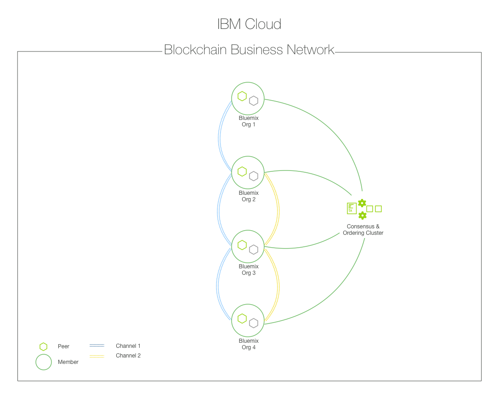

---

copyright:
  years: 2017
lastupdated: "2017-07-26"

---

{:new_window: target="_blank"}
{:shortdesc: .shortdesc}
{:codeblock: .codeblock}
{:screen: .screen}
{:pre: .pre}

# Enterprise Plan

The {{site.data.keyword.blockchainfull}} Platform on {{site.data.keyword.Bluemix}} supports the **Enterprise Plan** at GA level.
{:shortdesc}
  
* The **Enterprise plan** is built on the Hyperledger Fabric V1.0 code base and leverages a modular architecture to deliver scalable and high performance functionalities. For more information about Hyperledger Fabric V1.0, see the [Hyperledger Fabric documentation ](http://hyperledger-fabric.readthedocs.io/en/latest/){:new_window}.
* The **Enterprise plan** provides a highly secure and single-tenant LinuxONE on z Systems environment to achieve next generation security, integrity, scalability, and performance. The **Enterprise plan** runs in IBM Secure Service Container that provides encapsulated operating system, encrypted appliance disks, tamper protection, protected memory, and strong LPAR isolation.
* The **Enterprise plan** utilizes the IBM Bluemix platform for core networking services. You can quickly provision a fully-functional {{site.data.keyword.blockchain}} network that enables you to immediately run chaincode and applications without having to design and configure a private blockchain network. The plan also offers a network monitor for easy management and maintenance of your resources.  For more information, see [Network monitor](v10_dashboard.html).  

For more information about {{site.data.keyword.blockchainfull_notm}} offerings, see [Blockchain offerings](index.html). 

## Network resources
New {{site.data.keyword.blockchainfull_notm}} on Bluemix subscribers can set up an enterprise business network with production-level security, performance, and availability. See [Getting Started with Enterprise Plan](get_start.html) to create your blockchain network with the {{site.data.keyword.blockchain}} Enterprise plan on {{site.data.keyword.Bluemix_notm}}. A subscription to the **Enterprise Plan** includes support for the following network resources:  
* A member-specific certificate authority (CA)
* Default governance policies
* Up to six network members  
* Three orderers and two intermediate CA servers 
* Up to six peers for each member  
* A crash fault tolerant ordering service
* Up to 150 channels  

## Key features
* The **Enterprise Plan** provides a secure and permissioned blockchain network upon which authenticated members can easily define assets and create the business solutions for modifying and exchanging them.  The **Enterprise Plan** moves beyond a single sandbox environment to deliver a distributed blockchain network with resource groups spanning across various Bluemix organizations.  **Figure 1** depicts an example of a deployed blockchain network consisting of four Bluemix organizations with each owning two peers, a Certificate Authority responsible for distributing cryptographic identity material, and an Ordering Service that defines policies and network participants.  The blue channel contains all four network organizations, whereas the yellow channel is restricted to organizations 2, 3 and 4:
    
  *Figure 1. An example blockchain network consisting of four organizations leveraging channels to isolate data*
  
* Peers are split into two distinct runtimes, that is, **endorsing** and **committing**, and responsibility for transaction ordering is handled by a separate component. Concerns about privacy and confidentiality are addressed through channels that provide data segregation. Ledgers exist on a per-channel basis so networks can be customized to support different combinations of bilateral, multilateral or even public transactions.  
  A channel is a private subnet of communication between two or more specific network members that conducts private and confidential transactions. Imagine you are on a network with six members. You might have a consortium-type channel where all six members transact and maintain a ledger for a common asset. These transactions and the state of the involved assets would be available to all members. However, for certain bilateral or multilateral transactions that require privacy from the network at large, channels can be created to conceal this data.  
  There are also methods for channel-to-channel interaction in the case of more complex business scenarios. An application can be coded to query for the values of a key or composite key on Channel A and then use the returned values to factor into a transaction on Channel B. For more information on channels, policies, and cross-channel transactions, see [Hyperledger Fabric documentation ](http://hyperledger-fabric.readthedocs.io/en/latest/arch-deep-dive.html){:new_window}.
  
* The **high availability** for the integral components of the network, which include peers, ordering service, Certificate Authority, and chaincode, eliminates the crippling effects that can arise from single points of failure.  A built-in dashboard monitor allows for easy management of these components and provides a powerful mechanism to visualize assets and smart contracts.  

* The **checks** and **balances** that occur throughout the lifecycle of a transaction ensure consistent and integrite results; and ledgers constantly stay synchronized through an implementation of the well-known **gossip data dissemination protocol**.  Identity and access control are easily enforced through sign/verify operations that occur perpetually throughout the network.  For more information, see [Transaction flow](reference/v10_fabric.html#transaction-flow).

* **Governance tooling** enables members to administer and manage the critical business rules for their network.  For example, you can implement a policy defining how many members of a network must agree in order for a new member to join.  Or you can define that an asset  requires endorsement from every participant before a modification to ledger takes place.  Rules of governance are a fundamental necessity for any type of business network and they can oftentimes be extremely elaborate.  Governance tooling, for example, policy editors, greatly simplifies this process.

* The service runs in a **highly-secure and isolated** environment with no external access, including root access, to network components.  Data is encrypted in flight and at rest, and support available for hardware security modules allows for digital keys to be protected in accordance with industry regulations.  **Dedicated compute** is provided for network interactions, thereby ensuring high performance and data protection.  With the implementation of advanced cryptography, hashing, sign/verify operations, and component-to-component communications are accelerated.

If you are ready to use the **Enterprise Plan** on {{site.data.keyword.Bluemix_notm}}, see [Getting started with Enterprise Plan](get_start.html).  
